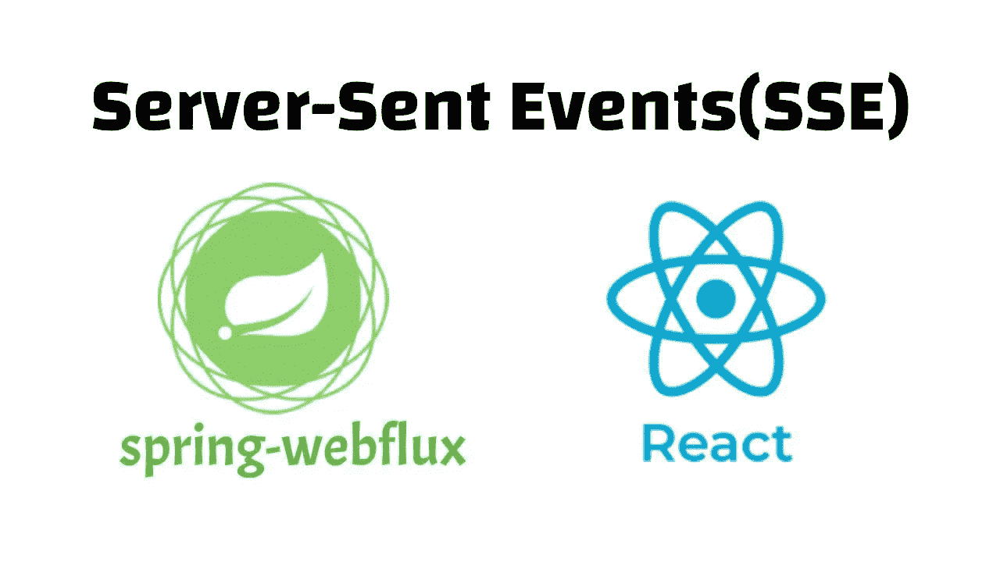
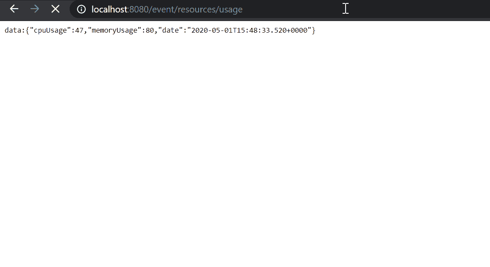
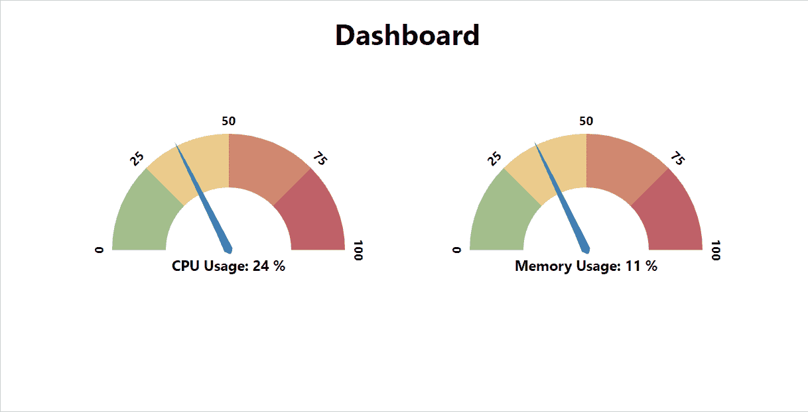

# React 和 Spring WebFlux 上服务器发送的事件

> 原文：<https://betterprogramming.pub/server-sent-events-on-react-and-spring-webflux-5f532b04633>

## 使用 React 客户端应用程序监听服务器发送的实时事件



作者照片。

# 什么是服务器发送的事件？

服务器发送的事件是一种标准，它允许客户端(浏览器)在长期标准 HTTP 连接上侦听事件流，而不是轮询服务器或建立 WebSocket。

SSE 允许浏览器在连接建立后接收实时更新。这是一种服务器推送技术，客户端启动连接以接收更新，并保持连接活动，直到事件源关闭。

服务器发送的事件对事件的推送方式有一个特定的标准。SSE 流的内容类型应该是文本/事件流，事件本身由两个表示事件结束的换行符(`\n\n`)分隔。

```
data:{"cpuUsage":57,"memoryUsage":73,"date":"05-01-2020"}data:{"cpuUsage":9,"memoryUsage":81,"date":"05-01-2020"}
```

# SSE 与 WebSocket

您可能想知道 WebSocket 和 SSE 之间的区别，因为它们听起来非常相似。嗯，WebSocket 和 SSE 有很多不同的特征。

WS 和 SSE 的主要区别在于服务器发送的事件是单向的，这意味着它是从服务器到浏览器的单向连接(例如监控系统)。但是 WebSockets 是双向的，这意味着客户端和服务器都可以推送更新。(例如聊天应用程序)。

SSE 可以通过简单的 HTTP 传输，不像 WebSocket 在 TCP 握手之后使用 WebSocket 协议。使用 SSE 时，您不必担心连接会被一些防火墙阻止，并且受现有基础设施的支持，而一些防火墙可能会在数据包检查期间阻止 WebSocket 连接。

# 弹簧网流量

Spring Framework 5 引入了一个新的模块， [spring-webflux](https://docs.spring.io/spring-framework/docs/5.0.0.BUILD-SNAPSHOT/spring-framework-reference/html/web-reactive.html) ，它支持反应式编程来编写类似 Node.js 的异步、非阻塞、事件驱动的应用程序

该模块支持两种编程模型:

*   传统的基于注释的控制器类似于 spring-webmvc。
*   用 Java 8 lambda 函数进行函数式编程。

在 spring-webflux 中，与 spring-webmvc 相比，你不用简单的 POJO 来响应。相反，我们使用单声道和通量:

*   `Mono<T>`:可以返回零个或一个结果。
*   `Flux<T>`:可以返回零个或多个结果。

关于 spring-webflux 模块，我就不赘述了。相反，本指南侧重于在 React 中编写实时事件监听器。你可以在他们的官方文档上阅读更多[。](https://docs.spring.io/spring-framework/docs/5.0.0.BUILD-SNAPSHOT/spring-framework-reference/html/web-reactive.html)

## 计算机网络服务器

让我们首先使用 [Spring Initializ](https://start.spring.io/) r 创建一个 spring-boot 应用程序，并添加下面的依赖项:

```
<dependency>
   <groupId>org.springframework.boot</groupId>
   <artifactId>spring-boot-starter-webflux</artifactId>
</dependency>
```

现在我们将创建一个控制器，它将每秒发出包含资源使用数据的事件:

上面的控制器方法(`getResourceUsage()`)将每秒发出事件，包含一个新的`Usage`类对象，分别填充了`cpuUsage`和`memoryUsage` **、**的随机值，以模拟连续的事件流。

由于服务器发送的事件应该有一个文本/事件流的内容类型，我们必须在`GetMapping`注释内的路径值后添加`produces = MediaType.TEXT_EVENT_STREAM_VALUE` 。

记下注释`@CrossOrigin(allowedHeaders = “*”)`。我已经允许来自所有主机的所有跨源头，因为我们将从 React 应用程序调用这个端点。如果我们不允许，浏览器会阻止这个请求。

这就是在 spring-webflux 中生成事件流所要做的全部工作。

现在让我们启动应用程序，并在浏览器中转到[http://localhost:8080/event/resources/usage](http://localhost:8080/event/resources/usage)。您应该能够看到发出的一系列事件:



## 客户应用程序

我们将创建一个带有两个计量器的简单仪表板来演示服务器发送的实时事件。因此，让我们使用 [create-react-app](https://reactjs.org/docs/create-a-new-react-app.html) 创建一个 React 应用程序:

```
npm create-react-app react-sse-demo
```

为了显示流数据，我们将使用[react-D3-速度计。](https://www.npmjs.com/package/react-d3-speedometer) 让我们使用下面的命令安装软件包:

```
npm i react-d3-speedometer
```

我们可以使用 JavaScript event source API**来订阅事件流。现在在名为`/src/components`的新目录中创建一个名为`Dashboard.js`的文件，并添加下面的代码。不要忘记在`App.js`中渲染这个组件:**

**这里，我们创建了一个功能组件，并使用 React 钩子`[useState](https://reactjs.org/docs/hooks-reference.html#usestate)` [](https://reactjs.org/docs/hooks-reference.html#usestate)和`[useEffect](https://reactjs.org/docs/hooks-reference.html#useeffect)` [](https://reactjs.org/docs/hooks-reference.html#useeffect)来管理状态和生命周期方法。**

**在`useEffect` **、**中，我们通过传递端点的 URL 创建了一个新的`EventSource` 对象。这将启动到我们端点的连接并开始监听。注意空数组`[]` 作为`useEffect` 的最后一个参数，它只会在组件被挂载和卸载时调用该函数。**

**客户端每次接收到事件时，都会调用`EventSource.onmessage` 。在函数内部，我们将`event.data` 解析为一个 JSON 对象，并分别改变`cpuUsage`和`memoryUsage` **、**的状态，使其重新渲染组件。注意，状态变量`cpuUsage`和`memoryUsage`被设置为 ReactSpeedometer 的`value`属性。**

**最后，我们必须关闭事件监听器。否则，它将保持连接并一直监听，直到我们停止。在`useEffect` 中返回函数的行为类似于基于类的组件中的`componentWillUnmount()`生命周期方法。所以当组件被卸载时，`EventSource.close()` 被调用，强制它停止并关闭连接。**

**好了，现在让我们通过执行`npm start`来启动应用程序。**

**当服务器推送事件时，您应该能够看到仪表板实时更新。**

****

**太好了！SSE 的使用取决于应用程序的类型(例如，点击流、物联网数据、综合服务器监控工具、汇率等)。).本指南中的事件源只是发出随机事件，实际的实现可能会有所不同，但仍然使用相同的概念。**

**你可以在 GitHub 上获得完整的代码[,以防你的系统无法正常运行。](https://github.com/oshanfernando/sse-react-spring-webflux)**

**感谢您的阅读和快乐编码！**