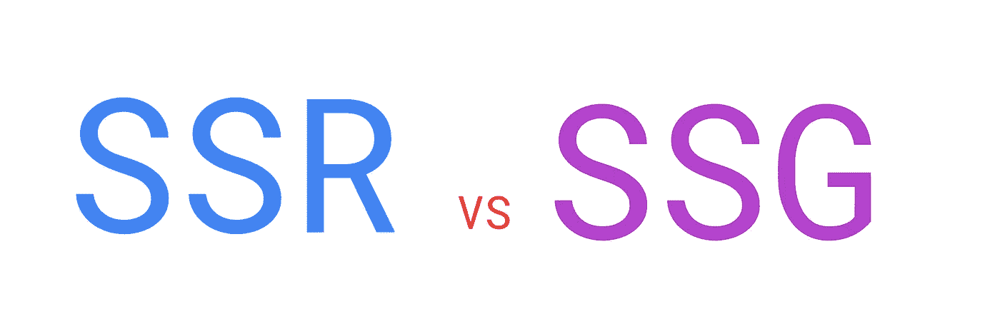

# 服务器端呈现与静态站点生成

> 原文：<https://betterprogramming.pub/server-side-rendering-vs-static-site-generation-53a34872728c>

## 炒作什么？

丹尼尔·西兰特夫在 [Unsplash](https://unsplash.com/s/photos/nature?utm_source=unsplash&utm_medium=referral&utm_content=creditCopyText) 上拍摄的照片

许多流行词汇在科技领域被抛来抛去。其中两个是静态站点生成(SSG)和服务器端呈现(SSR)。

图片来源:作者

在这篇文章中，我们将试图揭开 SSR 和 SSG 的神秘面纱，并了解它们能在哪些方面真正帮助我们。我们将从一点历史开始，然后进入一些真实世界的例子和技术，如 Next.js 和 Gatsby。

这将是一个有趣的故事，因为我们将通过这些技术和方法进行一次完整的往返旅行。我们将回到未来，然后回到我们的起源。我们开始吧！

# 开始的时候…

一开始，只有静态网页。没有动态。纯静态的 HTML 文档被发送到客户端。

当我们访问一个网站时，一个简单的 HTTP 请求被发送到服务器，服务器用浏览器在屏幕上显示的实际 HTML 来响应。简单。

然后，动态渲染和模板引擎出现了。PHP 和朋友们好！

这些服务器端技术让我们能够动态构建发送给客户端的 HTML。来自客户端的每个 HTTP 请求都要经过应用服务器。这将添加一些小的动态内容，比如我们的用户名、当前日期、数据库中的数据等等。

这是传统的*服务器端渲染*。客户端(我们的浏览器)将获取实际的 HTML 来显示。

# AJAX 和前端混乱的开始

有了 AJAX，我们突然能够异步获取数据，而不需要刷新整个页面。

这是一个很大的用户体验改进——不再有烦人的屏幕闪烁。但是让我们考虑一下这个问题…

异步数据，新数据，新页面，新前端组件。前端现在负责生成它需要渲染的 HTML。您好，*客户端渲染！*

由于需要呈现可视标记客户端，各种库和框架开始涌现。其中最臭名昭著的当然是 jQuery。如今，我们主要使用更现代的技术，如 React、Vue 和 Angular。

所谓的*前端疲劳*开始变得真实，到处都是新的库和框架。幸运的是，很明显有几个赢家，即 React 和 Vue，它们非常受欢迎。

# 单页应用程序及一些问题

有了轻松生成可视化标记客户端的可能性，我们不知何故完全放弃了我们心爱的服务器来进行渲染。

所有的 HTML 现在都是在客户端生成的。服务器将通过 AJAX 向浏览器发送一个空的 HTML 和一些 JSON 或 XML 格式的数据，我们将使用我们首选的库/框架用有意义的标签和样式填充页面。当然，通过客户端 JavaScript，这是可能的。

**单页面应用** (SPAs)开始弹出——完全客户端渲染的页面，不需要任何到服务器的往返，只需要通过 AJAX 获取数据。

不幸的是，在客户端呈现整个网页也带来了一系列潜在的问题。首先，人们开始关注 SEO——搜索引擎优化。

随着谷歌的网络爬虫读取和索引网站(这样你的网页就可以在谷歌上列出)，我们担心这些“机器人”不会拾取尚未呈现的 HTML。我们担心，谷歌或其他 *<在这里插入搜索引擎名称>* ，将只看到我们的根 HTML 标签，其中我们*将* *最终*通过 JavaScript 呈现所有内容。基本上，爬虫会看到一个空的网页。

我们现在稍微放松了一些，因为大多数网络爬虫和索引器都在执行客户端渲染所需的 JavaScript。

第二个潜在的问题是性能。由于在浏览器中需要执行大量的 JavaScript 来呈现页面，因此速度可能会变慢，因为很大一部分网络冲浪发生在 CPU 能力较弱的移动设备上。

所以，我们想:让我们使用服务器。又来了。

[泰勒·维克](https://unsplash.com/@tvick?utm_source=medium&utm_medium=referral)在 [Unsplash](https://unsplash.com?utm_source=medium&utm_medium=referral) 上的照片

# 回到我们的起源

服务器端渲染又开始流行了。

然而，我们不会使用模板引擎或服务器端编程语言来生成标记，我们会使用*现代 JavaScript 库和框架*，比如 React。这种方法与客户端呈现(如在 SPAs 中)的区别在于，标记生成不会在客户端设备上运行，而是在我们的服务器上运行。

这应该是更快，但它也旨在解决潜在的搜索引擎优化问题。每当一个网络爬虫请求我们的页面时，它会得到完整的呈现——不再需要客户端 JavaScript 执行来呈现。服务器为每个页面请求做这一切。

当我们谈论**服务器端渲染**时，我们指的就是这个场景。使用现代 JavaScript 库和框架，在服务器端为每个网络请求生成一个网页。

# 服务器端渲染(SSR)

理解这一点至关重要，为了在服务器端呈现 UI，*我们必须有一台服务器*。

你看，这是客户端渲染(即 spa)不需要的*。这些项目可以在 cdn(内容交付网络)上进行缓存和廉价存储。你不应该运行虚拟机或 Kubernetes pods 来托管你的*完全客户端渲染的*前端项目。不过，你*在 SSR 中确实需要这个。**

*这是服务器端渲染的一个潜在的负面影响，因为服务器会变得非常昂贵。*

*让我们回顾一下。SSR 是这样工作的:*

1.  *用户代理(浏览器)请求一个页面*
2.  *服务器生成页面的 HTML 输出并将其发送回去*
3.  *浏览器呈现 HTML*

*必须问一个极其重要的问题。如果服务器对一个页面的输出总是相同的，为什么每次请求都要生成输出呢？*

*很棒的问题！这实际上是服务器端呈现和静态站点生成之间的区别。*

## *SSR 中的动态内容*

*如果生成的页面包含动态部分，比如用户特定的内容，那么使用服务器端呈现并为每个用户(每个请求)重新生成 web 页面是有意义的。*

*但是，如果输出总是相同的(例如，想象一个“ *About us* ”页面)，那么总是重新生成输出是没有意义的。这可以存储(读取:*缓存*)在 CDN 上的某个地方，作为一个*静态*(不变)资源，在世界上的任何地方快速提供服务。*

# *静态网站*

*我们回到了我们旅程开始的地方！*

*提供静态网页是 web 世界中的第一种方法。以“*原样”*的方式存储在服务器上，并在请求时返回给客户端。*

*这与静态站点生成背后的想法完全相同。然而，我们没有使用普通的 HTML 和 CSS，而是使用 React、Vue 和 Angular 等现代工具，这些工具在 HTML、JSX、CSS、JavaScript、transpilers、bundlers 等工具的帮助下生成一个静态输出。*

*每当您缺少需要对每个用户都是唯一的高度动态的数据时，您应该选择静态站点生成。*

*下面是建立静态网页的流程:*

1.  *从您最喜欢的前端库中获取静态构建输出，比如 React 与 Next.js 或 Gatsby 配对。这将包含所有静态资产。*
2.  *将其托管在 CDN 上(不需要昂贵的服务器)*
3.  *你有一个快速灵活的前端。你可以走了！*

*举个例子，想象一个你很少更新的文件夹，比如一个餐馆的网页或者一个博客。*

*好吧，假设它是一个博客。你当然需要添加博客文章。所以，是*动态*吧？服务器端渲染拯救世界！*

*不，别这么快。*

*随着现代技术的发展，静态网页可以很容易地被重建和重新部署。这是现代*静态站点生成的核心原理。**

## *现代静态网站*

*随着尖端技术的使用，我们的静态网站现在不再是*那样静态了。他们可以有充满活力的一面。**

*这一领域的先驱是像 Vercel(前 Zeit)和 Next.js、NuxtJS(面向 Vue 粉丝)、Netlify、Gatsby、Jekyll 和 Hugo 这样的公司。*

*通过使用像 Next.js 或 Gatsby 这样的框架，你可以在 React 中编写一个 web 应用程序，在构建时为网站*获取所有需要的数据。**

*强调这一点很重要:你*可以*从多个来源获取任何数据(比如电子商务网站的产品、博客帖子等。)但这些仅在构建时被获取*(即当你在 CDN 上部署或托管应用时)。**

*直接的结果是，静态站点向用户显示的数据就是您在部署/构建应用程序时获取的数据。每当要显示的信息发生变化时(比如你在你的酷博客上添加了一篇新的博客文章)，那么你*必须重建*这个项目。*

*这看起来很复杂，但实际上并不复杂。现代工具让我们非常容易做到这一点。*

## *Jamstack*

*又一个流行词，指的是技术和网络开发的运动。然而，它其实真的很酷！*

*Jamstack 中的 jam 代表 JavaScript，API，Markup。*

*基本上，这一运动鼓励人们使用根本不使用服务器的静态网站，使主机更便宜，应用程序更有弹性，没有停机时间。在构建时获取数据以呈现页面是 Jamstack 站点的基本特征。*

*有一些伟大的技术使 Jamstack 变得可行。*

*无头 CMS 开始大受欢迎。基本上，这些内容管理系统帮助您在构建时存储和获取数据。Netlify CMS 和 Contentful 就是两个无头 CMS 的例子。*

*例如，每当您通过 headless CMS 提交一篇新的博客文章时，就会触发一个新的前端静态项目构建。整洁！你仍然不需要为任何服务器付费，你的应用程序显示的数据是准动态的。*

*你可以托管你的静态网站，并且是 Jamstack 先驱的平台，像 Netlify 和 Vercel，使得无头 CMS 和你的实际静态网站之间的集成无缝。*

*只需按下一个按钮添加一篇博客文章，瞧，你的静态网站已经重新生成，并准备好以全新的内容访问。通过 CDN，它仍然快得惊人。*

# *服务器端呈现与静态站点生成*

*那是许多信息！*

*那么，我们什么时候应该使用 SSR，什么时候应该使用 SSG 呢？我们来看看几个利弊。*

## *服务器端渲染*

*优点:*

*   *所有显示的数据总是最新的。*
*   *您可以显示经常变化的用户特定的动态数据。*

*缺点:*

*   *您需要一台服务器来运行渲染，这可能会非常昂贵。*
*   *你不能使用 cdn 来帮助你的应用加载得更快(你*可以*在你的 SSR 应用前面放一个缓存层，但那样你就有显示陈旧数据的风险)。*

## *静态站点生成*

*优点:*

*   *你会得到一个非常快速的网站(因为它可以部署到 CDN)。*
*   *不需要等待服务器端逻辑。*
*   *如果服务器停机也没关系(因为我们不需要它！)*

*缺点:*

*   *如果内容是高度动态的或特定于用户的，则不理想。*
*   *当我们想要显示不同的或新的数据时，需要重建。*

## *苹果之间的比较？*

*理解 SSR 和 SSG 不是直接竞争对手是至关重要的。当一个或另一个更合适时，您将有特定的用例。*

*一个个人网站还是一个品牌的网站，有一个博客和一些很少改变的数据？使用静态站点生成可能会更好。*

*一个拥有个人数据的用户独有的网站，dashboard？也许服务器端渲染是更好的选择。*

# *混合方法*

*通常，对于较大的产品，您会发现某些页面确实可以静态呈现，而其他页面最好使用服务器端呈现。*

*这很好——next . js 和类似的技术自动静态地呈现需要构建时数据(或者根本不需要数据)的页面和需要每个请求的*数据的服务器端呈现页面。**

*当然，使用这两种方法，客户端数据获取仍然是一件事。*

*您可以选择只做一个简单的 AJAX 请求来重新提取可能过时的数据，但除此之外还有一个静态网站。让你的创造力和背景来驱动你的决定。*

# *最后*

*感谢您花时间从头到尾阅读这篇文章——您真棒！*

*我希望你学到了一些有价值的信息。*

*保持创意！*