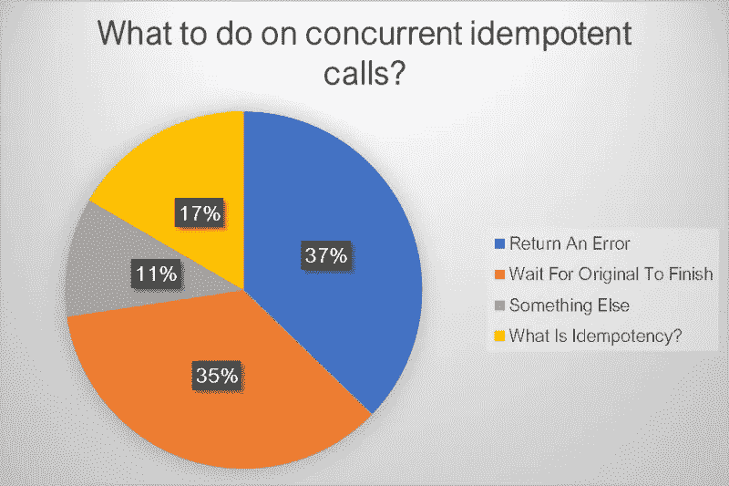
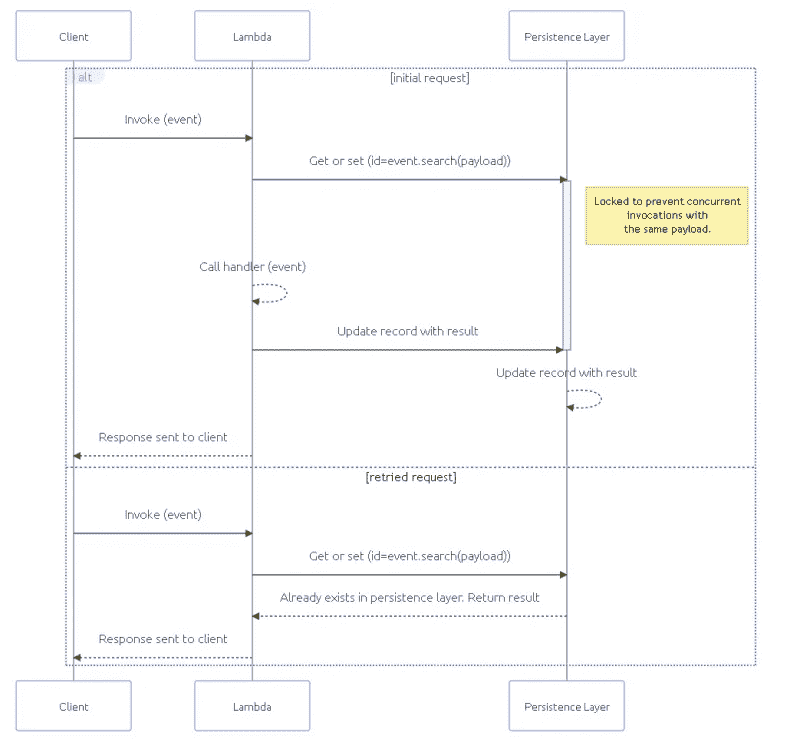

# 无服务器 API 基础——等幂

> 原文：<https://betterprogramming.pub/serverless-api-essentials-idempotency-e753b7b49680>

## 无服务器 API 设计的很大一部分是处理重试或意外的重新提交。没有它，数据完整性就会荡然无存。

图片来自 Freepik 上的[故事集](https://www.freepik.com/free-vector/wall-post-concept-illustration_7769804.htm#query=duplicate&position=2&from_view=search)

当我第一次涉足云开发时，我和我的团队一头扎进了现代软件设计的各个方面[。我们进行的最有趣的讨论之一是关于幂等性的。](/starting-over-with-purpose-my-serverless-adventure-99f0c051d73a)

不是因为我们会围绕它进行学术讨论，而是因为我们没有人知道如何发音。我们会在房间里走来走去，用不同的方式说它，当有人用听起来正确的方式发音时，我们会点头。我们都不知道这是什么意思，但至少说起来很有趣。

当我们开始试图理解[的含义](/7-aws-serverless-design-principles-for-solutions-architects-2be22717713b#a4fe)以及如何在我们的无服务器应用上实现它时，我们开始产生分歧。

幂等性(读作 eye-dem-POE-ten-see)的核心听起来像是软件工程的一个简单方面。它指的是多次调用都会产生相同结果的操作。

但事情没那么简单。幂等性有很多方面，我最近发现*没有多少人同意*。

上周，我带着一个棘手的等幂问题在 LinkedIn 和 Twitter 上进行了民意调查，看看社区是怎么想的。我提出的问题是:

> *当原始请求仍在处理时，如果出现重复请求，您会对幂等端点做什么？*

这本身就是一个很有针对性的问题。我没有问什么是幂等性，也没有问它的任何主要方面。但我对一切都有自己的看法。我觉得自己像是设了一个捕捉兔子的陷阱，却捕捉到了熊、鹿、兔子、浣熊和秃鹰。

在我们深入讨论幂等性的细节以及什么是错的或者不是错的之前，让我们看一下结果。我收到了 325 份回复，分布非常有趣。

正如你所看到的，我们对在这种情况下该做什么有不同的看法。*这似乎是因为在行业中幂等性的含义不明确*。因此，让我们来探究一下它的各个组成部分。

# 幂等原理

如果幂等简单到每次用相同的有效载荷运行操作时*都做相同的事情，就没有必要写这篇文章了。每个人都会同意，这将是一个非常明确的概念。但是，在实现过程中，幂等性有几个问题需要考虑，这也是它如此困难的原因。*

## 对系统的影响

当我们谈到幂等性的时候，大家可以一致同意，幂等性的调用对系统的影响是一样的，不管对同一个有效载荷调用了多少次操作。但这实际上意味着什么呢？在这个问题上你可以有几种不同的方式。

**运算本质上是幂等的** —这意味着完整的运算可以在设计或代码中无需额外考虑的情况下运行。一个很好的例子就是 PUT 操作。PUT 将用请求中的内容替换数据实体的所有现有值。这是一种严格的一对一替换，只是简单地进行覆盖。这可以被调用一次或 100 次，并且它将导致数据实体保持相同的状态。

有些人认为删除操作也是幂等的。多次调用端点来删除对象不会多次删除该对象。它将删除它一次，然后对后续调用执行空操作。

然而，这仅仅触及了删除的表面。如果将删除数据实体时触发的事件或写入的审计日志考虑在内，它真的与第一次调用它时的效果相同吗？也许是在数据实体上，但不是在整个系统上。

**操作必须编码为等幂**——我倾向于认为这类操作是为了确保您不会让调用者意外地创建重复项。调用者可能是使用 API 的最终用户，也可能是对失败的事件处理程序执行重试的自动机制[。](/3-ways-to-retry-failures-in-your-serverless-application-84b5102f620)

处理支付就是一个很好的例子。如果呼叫者意外地多次呼叫您的端点试图付款，您最不想做的事情就是对他们进行多次收费。通过以幂等的方式构建 API，可以保证付款只被处理一次。

从编码的角度来看，实现幂等的最常见方式是在请求中接受一个`idempotency-key`头。如果您的操作是异步的并且没有头，那么您可以在有效负载中包含一个`idempotency-key`属性，或者使用类似请求 id 的东西(只要它在重试时不会改变)。

使用`idempotency-key`作为锁和查找键来保存响应并在后续调用中返回结果。

## 对来电者的回应

这就是很多争论的地方。有些人认为，为了使操作幂等，每次调用的响应必须相同。其他人认为严格的幂等性止于服务器端。

你可以在民意测验结果中看到不同的意见。那些认为响应应该与呼叫者相同的人回答“*等待原始的*”。其他人认为幂等性可以通过根据系统正在做的事情返回不同的结果来实现。

一个很好的例子就是关于删除的争论。当成功执行删除时，删除资源通常会返回一个 *204 No Content* 状态代码。但是，当您再次尝试删除该资源时，无论是意外还是故意的，该怎么办呢？你还会返回一个 *204* 来为调用者提供幂等响应吗？还是因为不存在而返回 *404 未找到*或 *410 消失*状态代码？

返回一个 *404* 或 *410* 状态代码会对系统产生相同的影响(不包括下游事件)，所以有些人仍然认为它是幂等的。

对于使用幂等键的调用，我们有不同的方法。

当使用幂等键时，它保存一个记录，锁定所提供的键。一旦处理完成，它将结果保存到幂等记录并解锁密钥。如果另一个请求带有相同的键，它将返回保存在记录中的结果。

*使用等幂键时的工作流程图。来源:*[*AWS Lambda power tools 文档*](https://awslabs.github.io/aws-lambda-powertools-python/latest/utilities/idempotency/#choosing-a-payload-subset-for-idempotency)

这种类型的流动是我的调查问题的来源。它是在询问当一个重复的请求进来的时候，你应该做什么。由于记录是基于键锁定的，所以在系统上也会出现同样的效果，但是您向调用者发回什么呢？

在阅读了许多关于民意调查的评论，并与[安德烈斯·莫雷诺](https://twitter.com/andmoredev)、[凯文·斯韦博](https://twitter.com/kevinswiber)和[马修·博尼格](https://twitter.com/mattbonig)进行了几次精彩的交谈后，我得出结论**立即回报成功**。

当我最初发布民意调查时，这听起来似乎是最不正确的选择。这甚至不是投票的一个选项！但是有道理。如果您返回一个 *202 Accepted* 状态代码，这向调用者表明服务器上正在运行一个进程。您可以选择在响应中返回一个指向“get status”端点的 url，以便调用者可以自己检查状态。

等待响应是对资源的浪费。你会毫无必要地告诉你的应用程序等待回应，只是为了让来电者对*有同样的*感受。使用无服务器，你只是在浪费金钱，强迫一个 Lambda 函数等待。既然可持续性是[良好架构框架](https://docs.aws.amazon.com/wellarchitected/latest/sustainability-pillar/sustainability-pillar.html)的支柱，强迫等待将违背 AWS 最佳实践。

4XX 错误表示呼叫者做错了什么。在这种情况下，他们没有等待足够长的时间来完成处理，这不是调用者的错。这也不是服务器端错误(5XX 状态代码)。这意味着抛出一个错误实际上并不适用。您最不希望的事情是调用者采取纠正措施，通过更改请求或发送更多次请求，因为他们收到了一个错误。

对幂等运算的响应因原始请求的状态而异:

*   **Completed successfully** —从缓存中取出原始状态代码和响应体，如 [Momento](https://gomomento.com) ，并返回给调用者。
*   **已完成，但出现故障** —操作再次尝试，就像是原始操作一样。
*   **进行中** —返回成功，不做任何操作。

## 活下去的时间

如前所述，幂等键将保存一个记录以防止重复。但是这个记录能存在多久呢？

如果您永远保留它，这意味着没有其他调用方能够再次使用该密钥，这可能是也可能不是一件坏事。这带来了另一个好的观点。

> *您应该总是根据幂等键来验证请求有效负载。*

我们举个例子。在这个[参考架构项目](https://github.com/allenheltondev/serverless-idempotency-momento)中，用户可以将他们的山羊添加到系统中，这样他们就可以将山羊产品(肥皂、牛奶、奶酪等)联系起来..)来卖。

如果两个山羊养殖户同时在系统中添加他们的山羊，但使用相同的幂等键，会发生什么情况？这些不是重复的请求——这就是幂等性要解决的问题。相反，这些是使用相同密钥的竞争请求。

在这种情况下，系统应该验证带有密钥的请求体，并验证它是否与原始请求体匹配。这是(大多数情况下)保证防止重复的唯一方法。

在参考项目中，我们获取请求体的[散列，并将其保存在键旁边。如果另一个请求带有相同的关键字，但没有相同的散列，则返回一个 *400 错误请求*，指出有效负载与原始请求的有效负载不匹配。](https://github.com/allenheltondev/serverless-idempotency-momento/blob/main/layers/index.js#L41)

如果我们没有使幂等键过期，我们可能会不必要地遇到这样的冲突。当然，您可以强制幂等键的格式为某种 UUID 或时间戳/哈希组合，但这增加了一些操作开销，从长远来看可能不值得。

因此，通过终止或设置幂等键的生存时间，您正在将该值释放回可用的键池中。

请记住，您的目标是防止重复条目进入系统，因此请将您的生存时间设置为比最大重试持续时间稍长一点。如果您有一个退避和重试策略，在 24 小时内自动重试失败的异步进程 50 次，那么将您的生存时间设置为 25 小时。

对于同步或请求/响应调用，您的生存时间可能会显著缩短。API 端点发送副本的可能用例是意外双击提交按钮。在这种情况下，副本会立即出现。为了子孙后代的利益，我们可以将这些调用的生存时间设置为大约一个小时，以捕获任何进入的流氓请求。

## 记录存储器

我们已经详细讨论了跟踪和存储幂等记录的需要。该记录具有简单的键/值访问模式，需要在一段时间后过期。同样至关重要的是，查找要非常快，以防止在“意外双击”场景中或对于多次交付的事件出现重复。

*听起来是一个很好的缓存用例。*

根据定义，缓存是一个[高速数据层](https://aws.amazon.com/caching/)，它存储一小组瞬态数据。这正是我们存储幂等记录所需要的。

听起来不像一个纯粹主义者，但是当我构建无服务器应用程序时，我更希望所有的都是无服务器的。使用亚马逊 Elasticache 打破了这种模式。这种服务是按小时付费的，没有我在使用无服务器服务时所习惯的灵活性。

相反，我选择了 [Momento](https://www.gomomento.com/) ，这是一个完全无服务器的缓存解决方案。它与 AWS 无服务器服务采用相同的*付费使用*模式，包括[50GB/月免费层](https://www.gomomento.com/pricing)。由于它是无服务器的，它会自动扩展以匹配流量并增加缓存的大小，而不用担心数据节点。

将记录保存到缓存而不是数据库有助于遵循最低特权原则。由于我们没有建立到 DynamoDB 的连接，我们可以从任何需要幂等的 Lambda 函数中省略 *GetItem* 、 *PutItem* 和 *DeleteItem* 权限，因为我们没有管理幂等记录。这将我们的功能锁定为操作所需的权限。

由于缓存的数据是短期的，所有记录都会自动过期。这种行为可以在 DynamoDB 中通过在记录中包含一个 TTL 来模仿，但是删除一个带有 TTL 的记录是不准确的。它可能在到期日之后 48 小时内到期[。通过将记录放入缓存，您可以保证不会有任何幂等记录停留的时间超过它们应该停留的时间。](https://docs.aws.amazon.com/amazondynamodb/latest/developerguide/howitworks-ttl.html#:~:text=TTL%20typically%20deletes%20expired%20items%20within%2048%20hours%20of%20expiration.)

# 摘要

幂等性是一个很大的话题，在开发界引起了很大的争议。根据您对幂等的定义，您实现它的方式可能会有很大的不同。

也就是说，似乎确实有一个普遍共识。无论您如何实现幂等性，*重复调用应该对系统产生相同的影响*。

从那里我们开始分歧。但是我很乐意分享我的观点，努力让他们为人所知，并希望开始在一些想法上保持一致。

*   幂等性并不能保证给调用者相同的响应，但是这是一个不错的奖励。
*   具有相同幂等键的并发调用应该导致成功的响应和空操作。
*   幂等键的生存时间应该比回退/重试机制的总时间稍长。
*   我们认为自然幂等的操作，如删除和放置，实际上可能不是。它依赖于由于变化而发生的下游动作。
*   如果可能的话，使用缓存机制来代替幂等记录的数据库，以获得更快的响应和及时的记录过期。

当然我们需要记住这是软件，大多数软件问题的答案是什么？视情况而定。在实施解决方案之前，考虑您的使用案例。基于不同的 API，您甚至可能有不同的策略！

有一些软件包可以非常好地处理幂等性。无服务器 Python 开发者应该强烈考虑 [AWS Lambda Powertools](https://awslabs.github.io/aws-lambda-powertools-python/latest/utilities/idempotency/) 库。它处理我们今天讨论的一切，加上一些扩展的用例，比如当你的 Lambda 函数超时时。注意，在撰写本文时，它只在 Python 中可用。[类型脚本 Lambda Powertools](https://awslabs.github.io/aws-lambda-powertools-typescript/latest/) 不支持它。

这篇文章一点也不全面，我敢肯定，它惹恼了一些人。不管你是否同意我的观点，知道别人相信什么是好的。

当你开始和一个人谈论等幂时，记住首先要平级。你可能说的不是同一件事。

编码快乐！