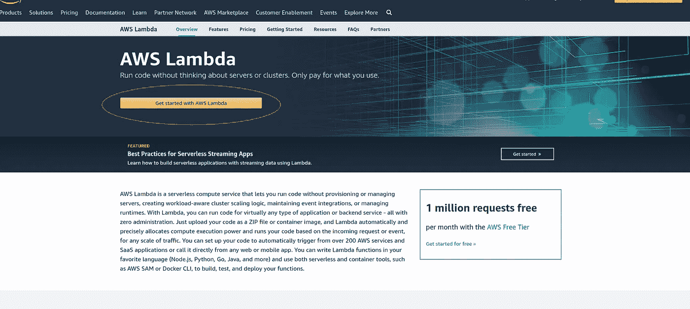
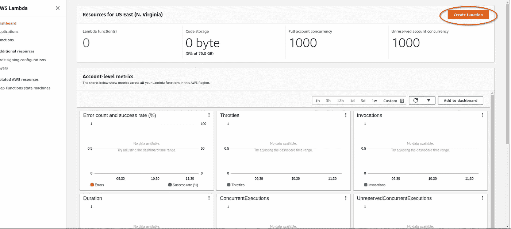
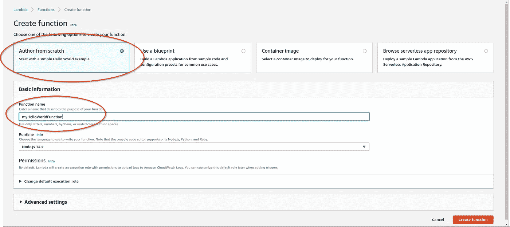
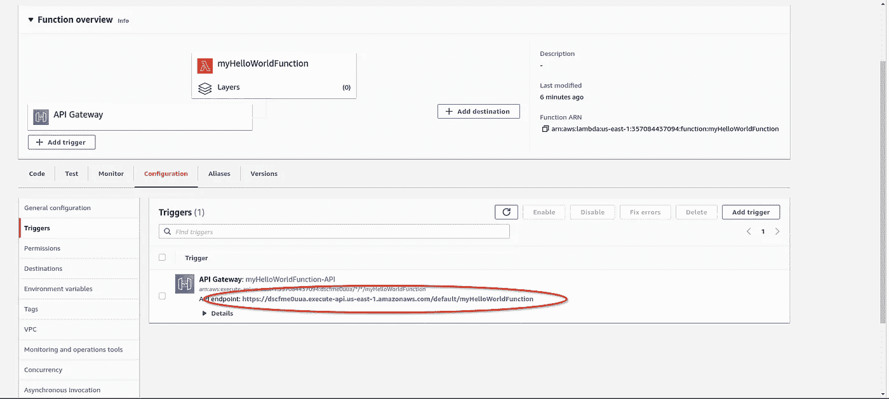
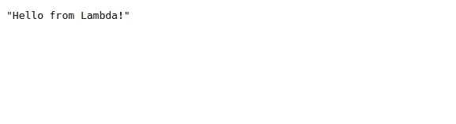

# 无服务器架构初探:原因、内容和方式

> 原文：<https://betterprogramming.pub/serverless-architecture-why-what-and-how-23c2c4f3e18c>

## 实施您的首个无服务器应用


照片由 [Santosh 313](https://unsplash.com/@santosh313?utm_source=medium&utm_medium=referral) 在 [Unsplash](https://unsplash.com?utm_source=medium&utm_medium=referral) 上拍摄

我最近遇到了无服务器架构，乍一看，它似乎是我所有基础架构问题的一站式解决方案。但是随着更多的时间花在阅读它存在的理由上，我发现无服务器架构旨在解决一个特定的用例，因此我决定写一篇文章详细介绍我对它的看法。

# 为什么没有服务器？

假设您想创建一个微服务，简单地检查某个特定的`property`是否在用户的预算之内。该服务将最终执行以下步骤:

*   从请求中提取`propertyId`和预算
*   使用`propertyId`从外部微服务或数据库获取房产价格
*   返回`property`是否可承受

现在，为了实现这个简单的功能，你必须启动整个基础设施，假设你决定使用 AWS 提供的一个简单的`Ec2`实例。

*   首先，您必须决定选择哪个操作系统映像进行实例化。
*   然后设置其他实例配置，如入站规则、CPU 和磁盘大小等
*   然后安装环境和环境依赖项，如`npm`、`pm2`等(假设您使用 Node.js 作为您的环境)
*   然后设置一个类似 Nginx 的反向代理服务器来处理正确的 DNS 解析。

即使做了所有这些，如果明天服务器上的负载增加，您的服务可能会中断，您将被迫寻找一些自动扩展解决方案，这本身就是一个选择的世界，最终会让您花费更多。

对于这样一个简单的服务来说，所有这些工作似乎太多了。这就是无服务器架构的用武之地。

# 什么是无服务器？

无服务器架构是一种软件设计模式，其中应用程序由第三方服务托管，无需开发人员管理服务器软件和硬件。

也称为功能即服务，无服务器功能运行在与用户和开发人员隔离的环境中，完全由云提供商管理。

无服务器应用运行在短暂的无状态计算容器中(可能持续一次调用),并且可以由各种不同的事件触发，如 HTTP 调用(通过 API 网关)或数据库触发器等。

但这并不意味着无服务器体系结构是所有应用程序的首选，无服务器有几个优点和缺点

## 赞成的意见

*   成本:无服务器架构有助于节省基础设施成本，因为只根据运行代码所分配的时间和内存来收费。
*   可伸缩性:作为一名开发人员，当负载增加时，您不需要担心扩展服务，所有这些都由云提供商自己管理。
*   效率:无服务器架构最终提高了团队的效率，因为开发人员现在不必关注与部署服务器、编写自动缩放逻辑、处理多线程和各种其他性能优化相关的本质细节，因此只需关注服务业务。

## **缺点**

*   性能:只要长时间不使用无服务器逻辑，云提供商就会关闭运行代码的容器(尽管所有这些功能都是从开发人员那里抽象出来的)。因此，不经常使用的无服务器功能通常需要很长时间来提供响应，因为它们需要大量的时间来启动。
*   资源限制:无服务器功能可以占用的计算能力和内存量通常有硬性限制，这就是无服务器计算不适合一些计算密集型工作负载的原因。还有其他硬限制，比如 AWS Lambda 中的 300 秒默认超时限制。
*   监控和调试:监控和调试无服务器功能不像传统服务器那样容易，传统应用程序中可用的工具数量在无服务器架构中是不可用的(尽管随着无服务器框架等工具的出现，这种情况正在发生变化)
*   供应商锁定:使用特定的云提供商创建无服务器架构会产生对提供商的依赖性。云提供商可以在内部进行更改，如更改默认阈值、超时、定价，开发人员必须遵守这些更改(同样，无服务器框架通过提供与云提供商无关的接口解决了这个问题)
*   重复工作:在传统的应用程序中，我们可以为应用程序中的每个触发器配置一个公共管道，现在在无服务器函数的情况下，由于每个函数都是无状态的，因此需要单独为每个函数重写所有公共逻辑。

考虑上述参数可以帮助我们决定是否应该为我们的项目采用无服务器架构。

# **如何实现无服务器架构？**

在这一节中，我将简要介绍如何创建一个可以被 HTTP 端点调用的无服务器函数。在这里，我们将使用 AWS Lambda 来实现这一点，因为这是该领域最古老、最成熟的服务之一。

前往 [AWS Lambda](https://aws.amazon.com/lambda/) 的主页，点击`Get started with Amazon Lambda`按钮:



如果还没有，你将被要求登录亚马逊控制台。之后，你会被重定向到亚马逊的 lambda 仪表盘。

单击“创建函数”按钮创建一个 lambda 函数:



然后确保选择了`Author from Scratch`按钮，并提供如下图所示的功能名称:



最后，单击 create function 按钮，您将能够看到您的 lambda 函数，代码如下:

```
exports.handler = async (event) => {
    // TODO implement
    const response = {
        statusCode: 200,
        body: JSON.stringify('Hello from Lambda!'),
    };
    return response;
};
```

但是您将无法触发该函数，除非您为该函数实现一个触发器。对于这个例子，让我们实现一个简单的 HTTP 触发器。

点击添加触发器按钮，如下所示:


从下拉列表中选择 API 网关，然后单击添加按钮:


您的触发器现已成功实现，您可以使用生成的 URL 来触发 lambda 函数，如下图所示:



在浏览器中粘贴以下 URL 会显示以下结果:



这样，你就成功地实现了你的第一个 lambda 函数，遵循一个无服务器架构。

# 结论

无服务器架构服务于一个非常具体的用例，并在其中大放异彩，但这并不意味着它可以用来完全取代市场上的其他基础架构解决方案。

就像剑不应该用来削苹果皮，菜刀不应该用来打仗一样，重要的是根据问题的背景和要求来选择解决方案。

# 参考

*   [无服务器架构](https://www.twilio.com/docs/glossary/what-is-serverless-architecture)
*   [无服务器计算](https://en.wikipedia.org/wiki/Serverless_computing#Advantages)