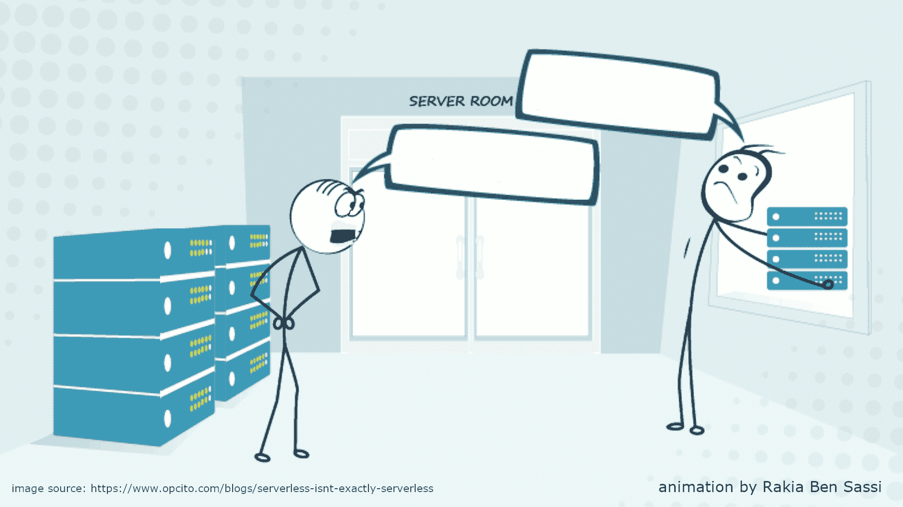
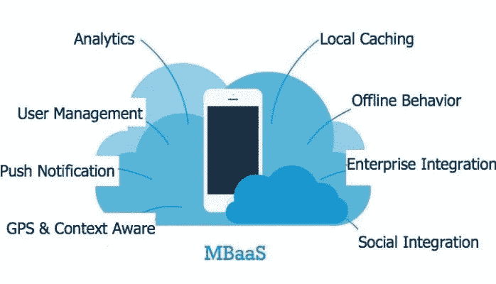
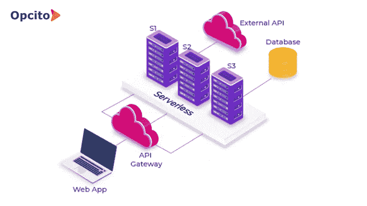
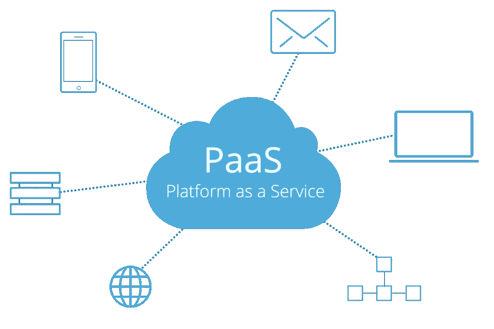
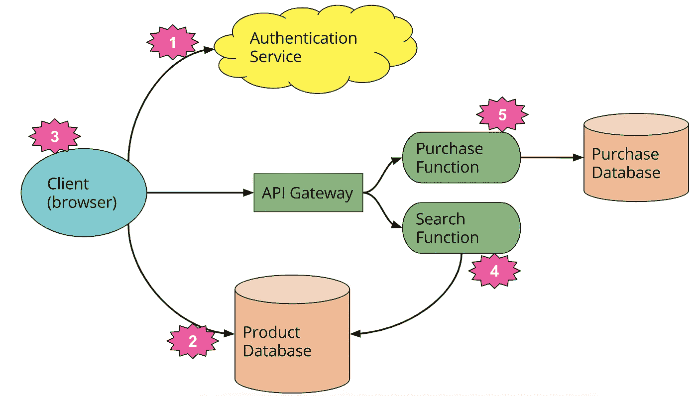

# 关于无服务器，维基百科不能告诉你什么

> 原文：<https://betterprogramming.pub/serverless-bcc0d2b65b41>

## [软件工程](https://rakiabensassi.medium.com/list/software-engineering-7a179a23ebfd)

## 后虚拟机和后容器范式的非常规指南



无服务器并不完全是无服务器(没有动画的原始图像，由[柴坦尼亚·贾瓦尔](https://www.opcito.com/blogs/serverless-isnt-exactly-serverless)制作)

什么是无服务器？

这个问题困扰了我很久。当我开始了解它时，我发现的第一个谎言是，与它的名字所揭示的不同，无服务器不是在没有服务器的情况下运行应用程序。它更像是把服务器从你作为应用程序所有者的考虑中解放出来。

在过去的几年里，软件行业已经推出了许多创新来优化我们代码运行的底层物理机器的管理:虚拟机、云计算、容器，以及…无服务器。

这一最新模式是市场上发展最快的云服务。CB Insights 指出，预计到 2021 年，T4 的无服务器销售额将达到 77 亿美元，高于 2016 年的 19 亿美元。

围绕这个计算模型进行一些精确的解释是值得的，这样我们至少可以澄清我们对我们所得到的东西的理解。在这篇文章中，我将分享一些关于这个话题的启示。

首先，我将钻研一些术语，然后探讨这项技术的优点和缺点。我还将通过回答围绕这个主题的一些关键问题来解决它与其他云计算方法的区别。

```
**Table of Contents**[**Lingo**](#fe8a)
  ∘ [Autoscaling](#3a60)
  ∘ [Load balancing](#898a)
  ∘ [Backend as a Service (BaaS)](#d5b8)
  ∘ [Function as a Service (FaaS)](#d12b)
  ∘ [Per-request pricing model](#2417)
  ∘ [Serverless architecture](#6349)
  ∘ [Startup latency](#eb09)
  ∘ [Cold start](#1980)
  ∘ [Warm start](#8a38)
  ∘ [Vendor lock-in](#d07e)
**1\.** [**History of Software Deployment**](#d1fc)
**2\.** [**Does Serverless Replace Previous Deployment Models?**](#5505) **3\.** [**Do Serverless Providers Take Only Care of Servers?**](#a9b7) **4\.** [**Serverless vs. Containers**](#8b0b) **5\.** [**Serverless vs. PaaS**](#3e80) **6\.** [**Does Serverless Take DevOps Out of Our Concerns?**](#99e6) **7\.** [**How to Build a Serverless Application?**](#4961) **8\.** [**Is a Microservices Architecture Required for Serverless?**](#89ff) **9\.** [**Can I Run a Monolith Application as Serverless?**](#c8d5) **10\.** [**What Are the Limitations of Serverless?**](#61e6)
[**Takeaway**](#a9a8)
```

# 术语

## 自动缩放

*Autoscaling* 是一种云计算方法，它根据服务器场中的负载动态调整服务器场中的计算资源量。例如，我们可以根据站点上活跃用户的数量，自动增加或减少 web 应用程序背后运行的服务器数量。

由于此类指标可能会在一天中发生巨大变化，并且服务器是一种有限的资源，即使在空闲时也需要花钱来运行，因此通常会有一种动机来运行刚好足以支持当前负载的服务器，同时仍然能够支持突发的大型活动高峰。

**主要优势:**

*   自动扩展有助于在活动较低时减少活动服务器的数量，并在活动较高时启动新的服务器。这种做法与负载平衡的思想密切相关。
*   如果您有自己的物理基础设施，自动扩展允许一些服务器在低负载时进入睡眠状态，从而节省电费(如果用水冷却机器，还可以节省水费)。
*   如果您使用托管在云中的基础设施，自动扩展可能意味着更低的费用。这是因为大多数云提供商根据总使用量而不是最大容量收费。
*   自动缩放可以更好地处理意外的流量高峰。静态扩展解决方案可能会安排一些服务器在流量通常较低的晚上休眠。但是，如果有一个病毒性新闻事件，人们可能会在晚上更多地使用互联网，这可能会导致静态扩展解决方案停机。

AWS、Microsoft Azure、Oracle Cloud、Google Cloud Platform 和 Kubernetes Horizontal Pod auto scaler 都是使用自动缩放的实例。


图片来源:亚马逊 AWS [文档](https://docs.aws.amazon.com/autoscaling/ec2/userguide/what-is-amazon-ec2-auto-scaling.html)

## 负载平衡

为了提高整体处理效率，我们将一组任务分布在一组资源(计算单元)上。我们称这个过程为*负载均衡*。它旨在优化响应时间，并避免在其他计算节点处于空闲状态时，一些计算节点不均衡地过载。

## 后端即服务(BaaS)

*后端即服务* (BaaS 或移动 BaaS)是一个供应商托管的、高度可扩展的数据和逻辑组件，可满足开发人员对数据库、消息平台、用户管理、推送通知等的需求。

BaaS 应用程序使用庞大的云可访问数据库生态系统(如 [Parse](https://parseplatform.org/) 和 [Firebase](https://firebase.google.com/) )、认证服务(如 [Auth0](https://auth0.com/) 和 [AWS Cognito](https://aws.amazon.com/cognito/) )等等。

BaaSs 通常是[“富客户端”应用](/angular-library-dynamic-stepper-2ba05ab40228)，它为[开发人员](https://levelup.gitconnected.com/learning-velocity-and-coding-standards-10952f6c9640)提供了一种将其应用链接到后端云存储和后端应用所公开的 API 的方式。



移动后端即服务(MBaaS)(图片来源:[自定义窗口](https://thecustomizewindows.com/2020/03/what-is-mobile-backend-as-a-service-mbaas/))

## 功能即服务(FaaS)

*Function as a service* (FaaS)指的是在小型的、事件触发的功能中编写定制服务器端软件的能力，部署在 Amazon Lambda、Azure Functions 或 Google Cloud Functions 等平台上。这些平台负责生命周期管理、资源分配、扩展、操作系统维护和流程监控。

当这些函数连接起来时，它们就创建了一个处理管道，或者作为一个更大的应用程序的组件，与运行在容器或传统服务器上的其他代码进行交互。

在无服务器应用程序中，你可以配置你的功能，只在需要的时候运行。这导致它们的生命周期更短，更接近单个 HTTP 请求/响应周期的时间线:

1.  当请求到达时，代码被激活。
2.  请求被处理。
3.  活动一停止，代码就进入休眠状态。

## 按请求定价模型

短的每次请求生命周期提供了一个*的每次请求定价模型*，为一些[团队](https://medium.com/swlh/characteristics-of-successful-team-60272e59a2c6)节省了大量成本。由于代码只有在被请求触发时才会被调用，因此提供商只对该执行所使用的计算时间收费，而不是对维护物理或虚拟服务器收取固定的月费。

## 无服务器架构

无服务器架构是一种在云中构建系统的应用程序设计。它包括 BaaS 和/或 FaaS。

今天*无服务器计算*或*无服务器架构*指的是功能即服务产品，其中客户编写处理业务逻辑的代码并将其上传给供应商。该供应商负责所有硬件供应、虚拟机和容器管理，甚至多线程等任务。



无服务器架构(图片来源:[无服务器不完全是无服务器](https://www.opcito.com/blogs/serverless-isnt-exactly-serverless))

## 启动延迟

在无服务器环境中，函数按需运行，作为对触发事件的响应，如用户请求。由于函数实例的初始化需要一些时间，这种方法会导致我们所说的*启动延迟* 和**冷启动**

**启动延迟可能会有很大的差异，可能从几毫秒到几秒不等，并且取决于不同的因素(其中许多因素在开发人员的控制之下):**

*   **[编程语言](/compiler-vs-interpreter-d0a12ca1c1b6)**
*   **你有多少代码**
*   **图书馆的数量**
*   **环境的配置**
*   **更多**

## **冷启动**

***冷启动*是指创建一个新的 FaaS 容器实例，并启动其宿主进程。冷启动是否代表无服务器架构中的一个问题取决于应用程序的流量和风格。**

> **“如果你正在编写一个低延迟的交易应用程序，你可能不会想在这个时候使用云托管的 FaaS 系统，无论你使用什么语言来实现。”— [迈克·罗伯特](https://martinfowler.com/articles/serverless.html)**

## **热启动**

***热启动*指的是重用前一事件中的一个函数实例及其宿主容器。**

## **供应商锁定**

**由于无服务器市场是分散的，您使用的来自一个供应商的特性很可能被另一个供应商以不同的方式实现。**

**这意味着，如果你想换供应商，你可能需要更新你的操作工具，改变你的代码，甚至可能需要改变你的设计或架构。**

**将您的[代码](/typescript-new-release-19f1238c6a68)从一个解决方案转移到另一个解决方案会导致您转移基础设施的其他部分，这种风险让很多人感到害怕。**

# **1.软件部署的历史**

**为了更清楚地理解无服务器的概念，让我们稍微后退一步，看看软件部署方法的演变:**

****

**软件部署的历史(图片来源:[无服务器的起源](https://dashbird.io/blog/origin-of-serverless/)**

**在前三个范例中，都有一个应用程序在“哪里”运行的概念:在现场的物理服务器上，在 VM 上，或者在云主机或容器上。**

**无服务器计算的现代时代已经使我们不再关注软件部署的“位置”。这个年龄的进步如下:**

*   **它始于 2014 年推出的基于亚马逊云服务的平台 [AWS Lambda](https://aws.amazon.com/lambda/) 。**
*   **2016 年，微软跟风推出 [Azure 功能](https://azure.microsoft.com/en-us/services/functions/)。**
*   **随后在 2017 年，谷歌带着其[谷歌云功能](https://cloud.google.com/functions/)解决方案的测试版加入了这个派对，该解决方案于 2018 年 7 月达到生产状态。**

**这三个无服务器提供者有稍微不同的限制、优点、支持的语言和做事的方式。**

# **2.无服务器会取代以前的部署模式吗？**

**无服务器并不是解决所有问题的正确方法。最好把它看作是对以前技术的补充，而不是取代它们。**

**了解您的项目需求将指导您选择最有效的方式来启动和维护您的软件平台。例如，大型部署可能需要结合使用不同的部署方法。**

**GPU 计算通常部署在裸机上，而不是在容器或虚拟机中。**

# **3.无服务器提供商只负责服务器吗？**

**无服务器提供者有一套功能(比如[解析](https://parse.com/)或者 [Firebase](https://www.firebase.com/) )。他们提供:**

*   ****基础设施服务**，比如消息队列、数据库和边缘缓存。**
*   **更高级的服务:比如联合身份、角色和能力管理，以及搜索。**

# **4.无服务器与容器**

**无服务器 FaaS 和托管容器之间的选择可以归结为应用程序的风格和类型:**

*   **对于每个应用程序组件的事件类型很少的事件驱动风格，FaaS 可能是更好的选择。**
*   **对于具有许多入口点的同步请求驱动的组件，容器可能是更好的选择。**

****

**照片由 [CHUTTERSNAP](https://unsplash.com/@chuttersnap?utm_source=medium&utm_medium=referral) 在 [Unsplash](https://unsplash.com?utm_source=medium&utm_medium=referral) 上拍摄**

# **5.无服务器与平台即服务**

**FaaS 和平台即服务(PaaS)之间的关键运营差异在于扩展。例如，对于像 [Heroku](https://www.heroku.com/) 这样的 PaaS，您可能需要考虑要运行多少个 dynos 才能进行扩展。**

**对于 FaaS 应用程序，缩放是完全透明的。即使您将 PaaS 应用程序设置为自动伸缩，也不会达到单个请求的级别，除非您有一个特定的流量配置文件。**

**鉴于这一优势，为什么人们还会使用 PaaS？**

**原因有几个，但明面上的可能是最大的一个。对更好的监控和远程调试解决方案的需求是无服务器市场中仍然需要显著改进的领域。**

****

**平台即服务(图片来源:[什么是 PaaS](https://blog.iron.io/what-is-platform-as-a-service/) ？)**

# **6.无服务器解决了 DevOps 的问题吗？**

**无服务器并不意味着“没有运营”，尽管它可能意味着没有“系统管理员”。**

**“运营”不仅仅指服务器管理。它包括监控、部署、安全、联网、支持，通常还包括一些生产调试和系统扩展。**

**所有这些问题都存在于无服务器应用程序中，我们需要解决它们。我们只是将无服务器的“系统管理员”外包出去。**

# **7.如何构建无服务器应用程序**

**尽管不同的无服务器平台在工作方式上存在差异，但它们通常遵循类似于以下的工作流程:**

*   **您实现您的软件，并按照您所选择的平台的指导原则对其进行打包。根据供应商的不同，您可能需要将您的软件编写为一个 [JavaScript](/javascript-history-and-future-71b0ceb737aa) 函数，或者甚至将它打包到一个容器中。**
*   **一旦你创建了包，它将被上传到无服务器平台。**
*   **然后部署将被激活。**
*   **无服务器平台将管理何时创建或销毁应用程序的副本，并通过创建容器或函数的更多副本来响应增加的负载。**

**这种[精益工作流程](/agile-software-development-manifesto-be453882314)很受[开发人员](https://levelup.gitconnected.com/a-day-in-the-life-of-a-software-engineer-cb817cf13d0)的欢迎。他们只需要关心软件的创建，而无服务器供应商负责细节。**

# **8.无服务器应用需要微服务架构吗？**

**微服务与整体服务相反，在整体服务中，应用程序的所有功能都作为单个实体运行。*微服务*的概念是一种架构模式，它将软件分解成一系列小服务，如:**

*   **基于用户[搜索查询](/angular-custom-autocomplete-7ffb479477e7)在数据库中查找产品的搜索服务。**
*   **购物车服务，用于管理用户添加到购物车中的商品。**
*   **处理支付过程的结帐服务。**

****

**无服务器架构(图片来源:[无服务器架构](https://martinfowler.com/articles/serverless.html))**

**微服务和无服务器这两种技术都为云原生计算提供了重要优势，但它们解决的问题不同，部署环境也不同。**

**为了在无服务器平台上部署您的应用程序，您不必使用微服务架构。无服务器是托管微服务的一种方式，但不是唯一的方式。此外，并不是每个微服务都可以作为无服务器功能运行。根据您的情况，将您的微服务部署在容器中可能会更好。**

# **9.我可以无服务器运行 Monolith 应用程序吗？**

**没有什么能阻止你在一个无服务器平台上部署一个单一的应用程序，尽管很难想象在许多用例中这能带来真正的好处。**

**在传统环境中，您可能有一个长时间的任务既要执行协调又要执行。为了利用无服务器提供的效率，最好重新架构你的 monolith 应用程序，并创建几个协调的[小单元](/angular-custom-autocomplete-7ffb479477e7) (FaaS 函数)。**

# **10.无服务器的局限性是什么？**

**有了无服务器架构，开发人员能够创建软件，而不必担心硬件、操作系统维护、可伸缩性或位置等问题。**

**也就是说，无服务器模式有很多问题。其中一些是:**

*   ****性能:**不经常使用的无服务器代码可能比持续运行在专用服务器、虚拟机或容器上的代码遭受更大的响应延迟。这是因为，与自动扩展不同，云提供商通常会在不使用时完全“关闭”无服务器代码。这意味着如果你的代码需要大量的时间来启动，它将产生[额外的延迟](/build-me-an-angular-app-with-memory-leaks-please-36302184e658)。**
*   ****供应商锁定:**正如我已经描述过的，没有两个无服务器平台是完全相同的。它们都支持不同的语言和工具。这意味着你不能在不重新配置的情况下将 AWS Lambda 中的无服务器功能拖放到 Azure 功能中。因此，在无服务器环境中运行的应用程序和软件默认锁定在特定的云供应商。**
*   ****安全性:**有时云供应商无法满足您特定的安全需求。**

# **外卖食品**

**我们交付软件的方式一直在发展，尤其是自从价格合理、可靠的云托管兴起以来。无服务器是一项热门技术，应用程序代码根据应用程序开发人员提前配置的触发器按需执行。以这种方式运行的代码被称为功能即服务(FaaS)，它可以代表整个应用程序。**

**当将无服务器与其他现代架构趋势(如容器和平台即服务(PaaS))进行比较时，长寿命的服务器应用程序是一个关键的区别。**

**尽管它有更好的关注点划分和一些迷人的成本优势，但无服务器设计有其局限性。仍然需要一个不那么分散的市场，更好的工具和性能，以及[安全](https://levelup.gitconnected.com/sso-with-spnego-and-kerberos-8794f8ad5162)能力。**

**无服务器架构的优势是否值得增加复杂性是非常依赖于上下文的。**

**🧠💡我为一群聪明、好奇的人写关于工程、技术和领导力的文章。 [**加入我的免费电子邮件简讯，独家获取**](https://rakiabensassi.substack.com/) 或在此注册 Medium [。](https://rakiabensassi.medium.com/membership)**