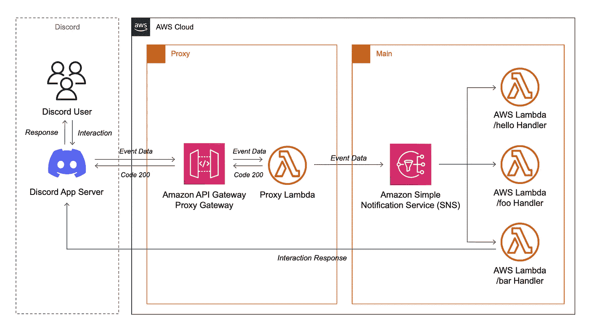
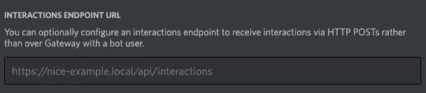
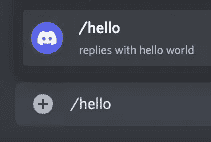

# AWS 上的无服务器不和谐机器人，5 个步骤

> 原文：<https://betterprogramming.pub/serverless-discord-bot-on-aws-in-5-steps-956dca04d899>

## AWS API 网关中使用代理 Lambda 的基于主体的路由—与 AWS SAM 一起部署


由[亚历山大·沙托夫](https://unsplash.com/@alexbemore?utm_source=medium&utm_medium=referral)在 [Unsplash](https://unsplash.com?utm_source=medium&utm_medium=referral) 上拍摄的照片

# 介绍

在我的[上一篇文章](/build-a-discord-bot-with-aws-lambda-api-gateway-cc1cff750292)中，我们使用 AWS Lambda 构建了一个 Discord bot。我们点击了 AWS 门户中的所有内容，一切都很好。我们建立了一个 API 网关和“hello world”Lambda。

但是我隐藏了一个小细节。

制作一个无服务器的应用程序应该意味着为每个职责创建一个 lambda 函数——这叫做单一责任原则。在文章中，我们只有一个责任。看一看:

现在，想象我们向这个文件添加第二个函数。还有第三个。酷毙了。而这些函数，很可能，并不是简单的回复一个字符串，而是执行一些渲染/计算/什么的。它们变得更大。太好了。

现在我们已经为无服务器实现了一个主要的反模式—[Lambda Monolith](https://docs.aws.amazon.com/lambda/latest/operatorguide/monolith.html)。

# 那现在怎么办？

我们希望通过将每个交互委托给不同的 Lambda 来处理不同的不和谐用户交互。问题是……Discord 将所有事件发送到一个端点。API Gateway 可以基于请求头和路径将请求路由到 Lambda，但是通过请求体路由需要使用模板映射，这并不容易，而且受到限制。

我们需要一些东西来代理请求。

# 体系结构

我们将使用代理 API 网关和代理 Lambda 来处理去往`/`路径(代理部分)的请求。然后，我们将使用一个特殊的参数将它路由到 SNS 主题，该参数将进一步将事件分成主 Lambdas。



我们解决方案的架构

## 这种架构:

1.  使代理 Lambda 仅在路由期间运行。
    当主 Lambda 处理请求时，代理 Lambda 没有运行(就像使用[嵌套 Lambda](https://docs.aws.amazon.com/lambda/latest/operatorguide/functions-calling-functions.html)时会发生的情况)。
2.  解耦代理和主要部分。
    它有助于其他无服务器应用程序的开发、测试和迁移(即，不冲突)。
3.  使代理 Lambda 成为放置不一致请求验证的理想位置。

## 数据流:

*   用户在不一致信道上发送`/hello`
*   Discord App Server 向您的代理 API 网关 URL(在设置中设置)发送一个事件
*   代理 API 网关向代理 Lambda 发送事件
*   代理 Lambda 验证请求，并在主函数运行时显示一个临时响应“Loading…”来响应 Discord 应用服务器。设置 MessageParameter 以调用命令名进行进一步处理。
*   简单通知服务(SNS)接收事件。基于 MessageParameter，用适当的 Lambda 处理事件。
*   (单一责任)Lambda 处理一个事件并发送一个 POST 请求，内容为“Hello from Lambda！”回到 Discord App Server 的 webhook。
*   Discord 应用服务器将 Discord 频道上对`/hello`的响应从“正在加载…”编辑为“你好，来自 Lambda！”。

# 准备

我们将使用基础设施作为代码工具，使用 AWS SAM 和 git 存储库中的模板来构建这个应用程序。一旦你克隆了这个样板文件，你就很容易用你自己的 Lambda 走得更远。

没听说过 AWS SAM？在我的另一篇文章中找到一个快速回顾。

## 要求

*   [AWS SAM CLI](https://docs.aws.amazon.com/serverless-application-model/latest/developerguide/serverless-getting-started.html)
*   [AWS 帐户](https://aws.amazon.com/)，带有 AWS CLI 使用的访问密钥

# 5 个步骤

## 1.创建不和谐应用程序

转到 [Discord 开发者门户](https://discord.com/developers/applications) →新应用。

Bot →添加 Bot。

用`Bot`、`applications.commands`、`Use Application Commands`和`Send Messages`权限邀请机器人加入你的公会(OAuth2 菜单)。

(附加[帮助](https://discord.com/developers/docs/getting-started#creating-an-app))

## 2.克隆样板文件并安装所需的包

```
mkdir my-serverless-discord-bot && \
cd my-serverless-discord-bot && \
sam init --location gh:jakjus/serverless-discord-bot && \
npm install
```

## 3.注册命令

通过在设置中启用开发者模式并右击你的公会来获得你的开发公会(不和谐服务器)Id。

从 Discord 开发者门户获取应用 Id 和 Bot 令牌。

将`.env.example`复制到`.env`并用真实值填充`.env`。

在一个公会上注册开发命令(即时):

```
node register_commands/register.js
```

## 4.在 AWS 上构建和部署应用程序

```
node generate_template/generate.js && \
sam build && \
sam deploy --guided
```

每个答案都可以是默认答案(只需按 enter 键)，除了:

1.  当提示`[Some function] may not have authorization defined, Is this okay?` **时，**用`y`回答

## 5.设置不和谐网页挂钩 URL

前面的命令向您展示了:

```
------------------------------------------Outputs------------------------------------------Key                 ProxyGWEndpointDescription         API Gateway endpoint URL to pass 
                    to Discord Application PortalValue               https://s0meur1.execute-api.zone
                    -name-1.amazonaws.com/Prod/------------------------------------------
```

输出的描述说明了一切。

复制 URL，并将其粘贴回 [Discord 开发者门户](https://discord.com/developers/applications)的“交互端点 URL”字段。



交互端点 URL 字段。

单击保存更改。

# 搞定了。

对你的全新机器人说`/hello`。



不和公会聊天。正在与斜杠命令交互。

机器人将回复以下内容:


# 现在，你可以做一些小事情

基础设施作为代码的力量，对吗？

## 让函数做些别的事情

1.  更改`src/modules/example/hello-from-lambda.js`中的代码
2.  运行`sam build && sam deploy`
    如果您在`--guided`运行期间保存了输入值，那么您可以在没有该标志的情况下运行它以重用值。

## 添加您自己的函数

1.  在`src/modules/example/another-one.js`中创建一个类似于`hello-from-lambda.js`的新命令。它必须在`exports.data`中有另一个名称。
2.  使用以下工具生成模板、注册命令、构建和部署:

```
node generate_template/generate.js && \
node register_commands/register.js && \
sam build && sam deploy
```

## 打扫

所有这些资源都在空闲层。不要忘记清理您的资源，这很好:

```
sam destroy
```

你做完之后。

# 摘要

在这篇文章中，您有:

*   了解如何在 AWS SAM 中使用模板
*   理解特定的无服务器体系结构及其推理
*   在 AWS 上部署了一个全栈无服务器应用程序，可以永远监听事件
*   永远
*   或者直到你的信用卡到期

我们执行的设置在开始时很难弄清楚。这就是为什么 AWS SAM 和 IaC 的做法使得只有一个穷人必须经历这一切。那个人就是我。

这是样本库。欢迎投稿。

[](https://github.com/jakjus/serverless-discord-bot) [## GitHub-JAK jus/server less-Discord-Bot:server less Discord Bot 样板文件。准备好部署到 AWS…

### 带有 Lambda 代理的 Discord 无服务器 Bot 是一个示例 SAM 应用程序，它使用…

github.com](https://github.com/jakjus/serverless-discord-bot) 

我为这篇文章做了很多研究，但最重要的问题仍然存在。

> 你会用它来建造什么？