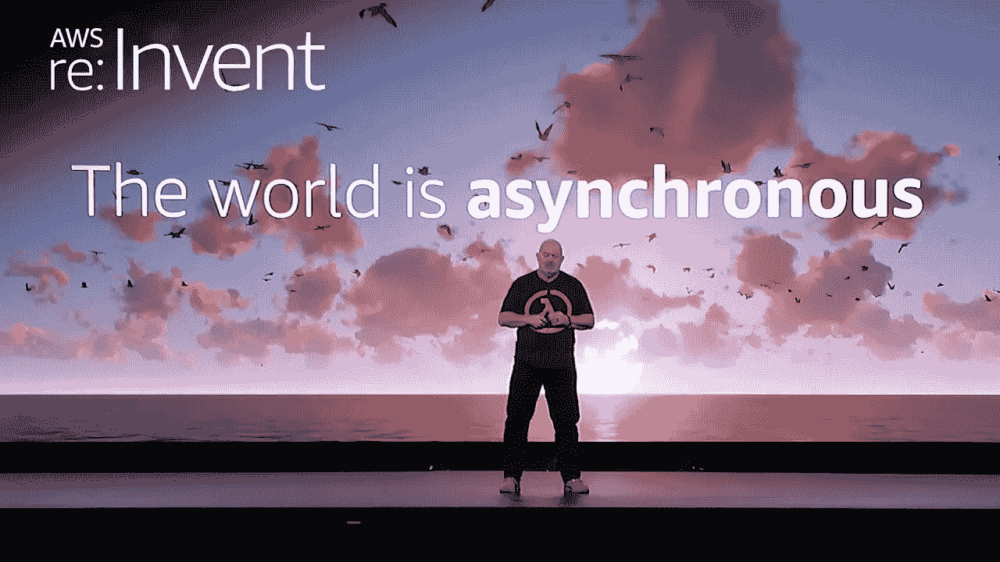
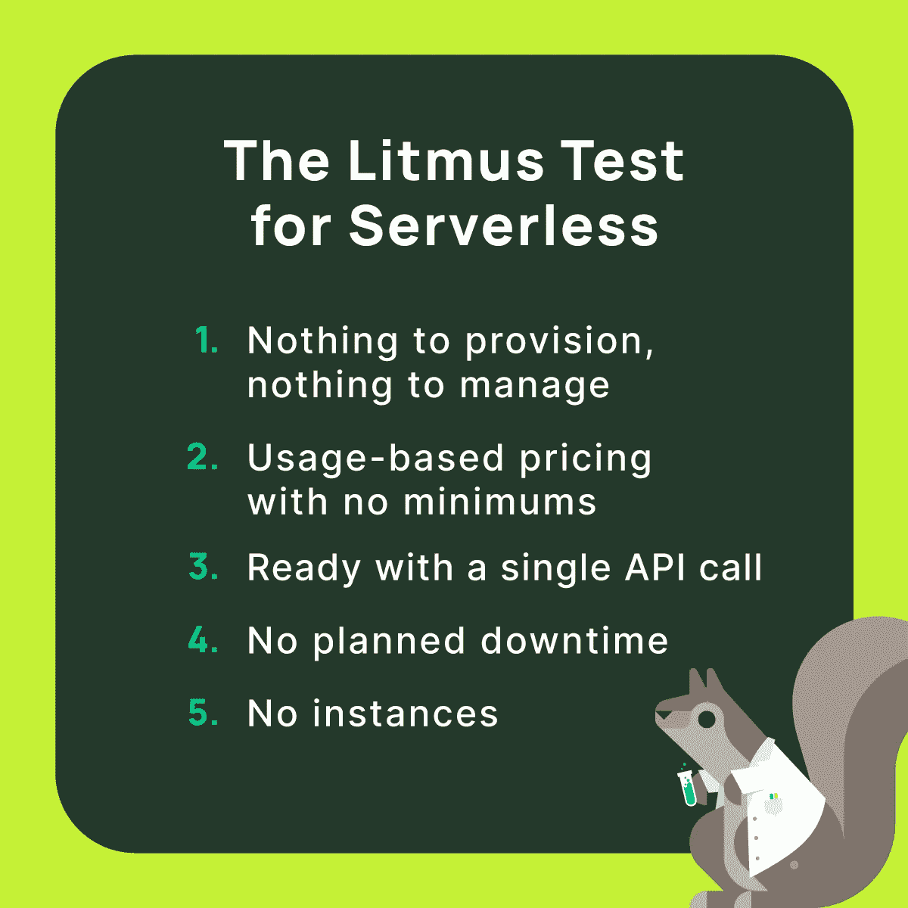

# 2022 年无服务器

> 原文：<https://betterprogramming.pub/serverless-in-2022-283e5472ee66>

## 对于无服务器而言，这是不可思议的一年。让我们来回顾一下发生的一些令人惊奇的事情。

1 月 4 日，我宣布今年的科技词汇是异步科技。

就我个人而言，我准备了一年的事件驱动架构教育。我决心全力投入到 [202 状态码](https://developer.mozilla.org/en-US/docs/Web/HTTP/Status/202)和后台进程的工作中。

我设计的[架构](/introducing-a-new-cross-cutting-architecture-diagram-the-critical-path-62d75980bd1f)是松散耦合的，依赖于 EventBridge 进行服务到服务的通信。我甚至在 WebSockets 上写了一个完整的系列，演示如何在等待后台任务运行时保持 UI 更新。

不用说，我完全投入到了今年的主题中。我不是唯一一个。

无服务器社区也致力于促进异步开发。在这一年中，我们举办了无数的活动、服务公告、博客帖子、视频和播客来宣传异步的好处。然后，当然，我们在沃纳·沃格尔博士的主题演讲中为 re:Invent 锦上添花。

很明显，我很会猜。异步似乎是 2022 年行业的主题。

让我们来谈谈今年的一些无服务器亮点，它们支持异步行为和其他非常酷的更新。

# 服务更新

还有什么比回顾今年发布的一些令人惊叹的功能更好的方式来开始我们的无服务器回顾呢！无服务器生态系统发布了无数更新，不可能一一列出。因此，我将向您简要介绍 AWS 中一些较大的无服务器服务。

# 事件桥

[EventBridge](https://aws.amazon.com/eventbridge/) 是将众多 AWS 服务结合在一起的粘合剂。对于这项服务来说，2022 年是伟大的一年，因为它打开了数千个新用例的大门，并进行了一些重大更新。

*   [S3 事件通知](https://aws.amazon.com/blogs/aws/new-use-amazon-s3-event-notifications-with-amazon-eventbridge/) —当文件上传到网站时，许多后台进程被启动。EventBridge 通过在上传时触发一个事件，使得启动 Step 函数工作流和 Lambda 函数变得非常简单。
*   [增强过滤](https://aws.amazon.com/about-aws/whats-new/2022/11/amazon-eventbridge-enhanced-filtering-capabilities/) —说到从文件上传中触发工作流，我们现在能够创建基于后缀的基于内容过滤的 EventBridge 规则。这意味着我们可以在系统中上传某些文件类型时触发工作流。我们还得到了不区分大小写的匹配和“或”条件。
*   [云形成事件通知](https://aws.amazon.com/about-aws/whats-new/2022/07/aws-cloudformation-event-notifications-amazon-eventbridge-event-driven-applications/) —为了在尽可能多的事件上触发工作流，增加了对云形成的支持。当堆栈资源发生变化、堆栈状态本身发生变化或漂移检测状态发生变化时，您可以触发规则。这对于平台工程师密切监控基础设施的变化并做出反应非常有用。
*   [event bridge Pipes](https://aws.amazon.com/about-aws/whats-new/2022/12/amazon-eventbridge-pipes-generally-available/)——现在我们可以无缝连接服务，无需“Lambda glue”。管道实现了无数服务的点对点集成，甚至提供了一种在到达目的地之前转换和丰富内容的方法。
*   调度器(Scheduler)——AWS 长期以来缺失的一个重要的原生特性是调度任务在特定时间运行的能力。许多自主开发的解决方案被用来安排活动，但它们通常不精确或浪费计算。但是当调度程序出来后，一切都变了。EventBridge 现在能够添加一次性或重复计划来启动任务。您可以在 200 多个不同的服务中启动一个任务，因此我们再次避免了使用“Lambda glue”来启动异步工作流。
*   [无服务器之地的模式](https://serverlessland.com/patterns?services=eventbridge-pipes) —如果你还没有把它加入书签，现在是时候把无服务器之地保存到你的收藏夹了。该网站由 AWS 无服务器 DA 团队维护，是最佳实践和示例代码的绝佳资源。他们甚至为社区共享代码添加了一个全新的部分，叫做*片段*。这个站点非常有价值，可以看到一些实际的例子，这些例子与我们最喜欢的服务(包括 EventBridge)的许多版本保持同步。

您可以看到 EventBridge 团队的重点是“连接性”。从从 S3 和 CloudFormation 等服务添加新的本机事件，到让消费者能够通过管道将几乎所有服务捆绑在一起，再到一次性或按计划触发异步事件，异步开发已经被完全接受。

# 阶跃函数

步骤功能是[我最喜欢的 AWS 服务之一](/success-with-step-functions-finding-a-way-to-build-that-doesnt-suck-6d8ed9b0154e)。它提供了一种在无服务器环境中构建有意义的、协调的工作流的方法。在这一年中，我进行了一项实验[将其与λ](/lambda-vs-step-functions-the-battle-of-cost-and-performance-5f008045e2ab)进行对比，以比较成本和性能。

这项服务与今年 1 月时完全不同。以下是一些改变游戏规则的功能，它们的发布是为了将我们的工作流程提升到一个新的水平。

*   本地嘲笑——我经常看到的一个抱怨是无法在本地测试 Step 函数。您需要部署到云中进行测试。这种能力给了我们一些对本地测试的支持，*，尽管没有什么能胜过云中测试*。[崔琰](https://twitter.com/theburningmonk)甚至向我们展示了如何[使用它进行端到端测试](https://theburningmonk.com/2022/12/a-practical-guide-to-testing-aws-step-functions/)来全面测试你的工作流程。
*   [新的内在函数](https://aws.amazon.com/about-aws/whats-new/2022/08/aws-step-functions-14-new-intrinsic-features-process-data-workflows/) —如果我可以避免使用 Lambda 函数来代替阶跃函数工作流，我会一直使用它。增加了 14 个新的内部函数，支持大量以前需要函数的新用例。这些更新包括一些数组操作和备受期待的`States.MathAdd`和`States.UUID`函数！
*   [快速工作流程的可视化视图](https://aws.amazon.com/about-aws/whats-new/2022/10/aws-step-functions-adds-new-execution-observability-features-express-workflows/) —快速工作流程的一大缺点是无法像标准工作流程那样查看执行情况。浏览状态机执行日志从来都不像是一个生产就绪的特性。但在今年 10 月，我们获得了与标准工作流非常相似的体验，极大地提升了快速工作流的可行性。
*   [大规模并行处理](https://aws.amazon.com/about-aws/whats-new/2022/12/aws-step-functions-large-scale-parallel-workflows-data-processing-serverless-applications/) —直到最近，你可以在一个状态机中运行多达 40 个并发并行迭代。当你迭代数千条记录时，这导致了一些[有趣的设计模式](/3-reasons-you-should-stay-away-from-aws-step-functions-43bdd97b75a)。现在，它完全支持分布式映射的大容量用例。

有了这些更新，感觉 Step Functions 团队专注于扩展用例以提高采用率。在我看来，这已经是一个很好的服务，团队已经做了大量的工作来使它变得更好。我希望看到类似于 [AWS App Composer](https://aws.amazon.com/application-composer/) 的体验来到 workflow studio，帮助解决剩余的 DevEx 问题(*提示，提示，开发团队*)。

# 希腊字母的第 11 个

除非你提到 Lambda，否则一篇文章都不是关于无服务器的。这项服务在 2022 年将会有如此多的更新，这将会是一个完整的帖子来涵盖所有的更新。以下是一些重要的例子。

*   [增加的短暂存储](https://aws.amazon.com/blogs/aws/aws-lambda-now-supports-up-to-10-gb-ephemeral-storage/) —今年早些时候，Lambda 获得了一个更新，允许您为给定的功能配置高达 10GB 的短暂存储。这为需要加载大文件的 ETL 作业开辟了一些用例。在此之前，您可以将大文件加载到内存中，并随后为此付费。
*   [分级定价](https://aws.amazon.com/about-aws/whats-new/2022/08/aws-lambda-tiered-pricing/) —我们都知道无服务器服务是按使用量付费的。但是当你[达到一定规模](/when-is-serverless-more-expensive-than-containers-23b318662ce6)时，它可能会变得有点成本过高。AWS 现在向大量 Lambda 用户提供批量折扣。这是 giant scale 定价的一个很好的开始，我希望在 2023 年看到这一点有所扩大。
*   [函数 URL](https://aws.amazon.com/about-aws/whats-new/2022/04/aws-lambda-function-urls-built-in-https-endpoints/)——有时你只希望能直接调用一个函数，而不是经历在它前面设置 API 网关的繁琐过程。使用函数 URL，您可以做到这一点。这些可以向公众开放，也可以通过 IAM 进行认证。对于快速测试或 webhooks 来说，这是一个很好的特性。
*   秘密管理器和 SSM 扩展——希望你没有将秘密作为环境变量存储在函数中。理想情况下，它们应该存储在 Secrets Manager 中。随着加载和缓存秘密和参数的 Lambda 扩展的发布，这种公认的最佳实践减少了延迟。
*   [SnapStart](https://aws.amazon.com/blogs/aws/new-accelerate-your-lambda-functions-with-lambda-snapstart/) —借助 SnapStart 特性，Java 函数获得了对[冷启动](/lets-stop-talking-about-serverless-cold-starts-38e4c1fda963)的巨大推动。Lambda 将初始化您的执行环境，获取它的快照，然后在将来的调用中使用快照来减少初始化时间。这是一个伟大的想法，我期待着看到它如何发展，因为他们发布了对其他运行时的支持。

看着这些特性，我猜想 Lambda 团队的主要目标是降低消费者成本。上面列出的所有内容都会在一定程度上影响成本(SnapStart 除外)。我喜欢该团队提出的让每个人都能更实惠地使用云的计划。

# 认同的转折点

我们已经看到无服务器今年经历了一点身份危机。在 [Neptune serverless](https://aws.amazon.com/neptune/serverless/) 和 [OpenSearch serverless](https://aws.amazon.com/opensearch-service/features/serverless/) 的发布之间，AWS 似乎甚至不知道这意味着什么。

我在一篇半开玩笑的帖子中写了我们正在看到的关于无服务器的一些基本原则的激烈在线辩论。

我倾向于同意 [Momento](https://gomomento.com) 对无服务器的定义。

我们将会看到 2023 年无服务器的定义会有怎样的变化，以及 AWS 课程是否会修正 Neptune 和 OpenSearch 的定义。

# 向前跳跃

无服务器领域的新东西引起了很多关注:*【来自代码的基础设施(IfC)* 。

这个概念已经存在了几年，但意识真正开始起飞是在今年。IfC 背后的要点是你只需写代码。IfC 框架从消费者那里拿走了基础设施决策的负担，使他们能够只关注业务逻辑。

像“这应该是一个带有 GSI 的 DynamoDB 表”和“这更适合作为 Lambda 函数还是在 App Runner 中”这样的决策由这些框架做出，并完全独立地管理。这是一个新颖的概念，我很快形成了一些观点。

我深入研究了这个概念，在基准测试中尝试了几个框架。我用得越多，就越能接受这样一个事实:让别人替我做基础设施决策是没问题的。

我觉得在这种观点成为主流之前，我们还有很长的路要走，但我很高兴看到 IfC 为我们准备了什么。

当我们进入新的一年时，我不禁想知道— *国际金融中心是无服务器的，还是完全是另外一回事？*

## 重要的新来者

随着我们所知道和喜爱的服务的更新，这个领域也出现了一些新成员。

*   [Momento](https://gomomento.com) —这家初创公司提供完全无服务器的缓存——这在无服务器领域是一个巨大的缺口。像 Elasticache 这样的现有服务需要提供资源，而你一直都在为这些资源付费——即使是在不使用的时候。Momento 是来改变这一切的。他们提供*付费使用*模式，并且可以用 5 行代码实现。
*   BaseLime——有很多 observability 和 APM 供应商，但 BaseLime 希望改变游戏规则。他们提供代码形式的*可观察性*，并直接瞄准无服务器应用。BaseLime 寻求促进可观察性最佳实践，这是一种受欢迎的态度，我觉得这是今天行业中[缺少的东西](/going-serverless-build-an-observability-mindset-38d2d74f9756)。它们目前处于公测阶段，绝对值得研究。
*   Ampt 以前被称为无服务器云，今年早些时候从无服务器公司脱离出来，专注于代码基础设施。它目前还不能公开使用，但如果你想先睹为快，有传言说它会有一种与目前无服务器云非常相似的感觉。
*   [AWS Application Composer](https://aws.amazon.com/application-composer/) —这种新的 AWS 服务允许用户在其浏览器中可视化地构建 SAM 模板。该服务直接连接到您机器上的本地模板文件，并实时更新它。它甚至能够编辑现有的模板文件，这意味着如果你已经用 SAM 构建了你的应用程序，你可以立即使用它。AWS 试图减轻 IaC 管理的负担，这是一个很好的尝试。

# 摘要

2022 年是个大年。我们有一些主要的服务更新，使我们的代码更简洁，明显更便宜。这些主要特性中的一些将为我们甚至还没有想象到的重大机遇打开大门([和一些我们已经有的](https://serverlessland.com/patterns/eventbridge-pipes-ddbstream-with-filters-to-eventbridge))。

无服务器正以越来越高的速度被采用，但这可能是导致其身份危机的原因。“无服务器”这个词已经变得如此时髦，以至于它被贴在任何东西上，试图获得采纳。这比*我不管理服务器*意义重大得多。服务需要提供某些功能才能被视为无服务器。我们可能需要等待尘埃落定，然后再拿出一个新的定义。

无服务器开发在不久的将来将会改变，来自代码供应商的基础设施知道这一点。他们投入了大量的精力来寻找正确的抽象，以一种好的方式将基础设施决策权从开发人员手中夺走。如果您还没有尝试过这些框架中的任何一个，那么是时候动手了。

云有无限的可能性。我们已经在无服务器社区中建立了“原生云”专业知识，并且还在逐月提升。如果说 2022 年是该行业的一个风向标，我预计明年将持续处于震惊状态。

我们正以惊人的速度前进。如果你想要一份关于无服务器正在发生的事情的过滤列表，请务必[订阅我的时事通讯](https://readysetcloud.io/newsletter)获取每周更新。

为美好的一年干杯！你们都很棒。

编码快乐！