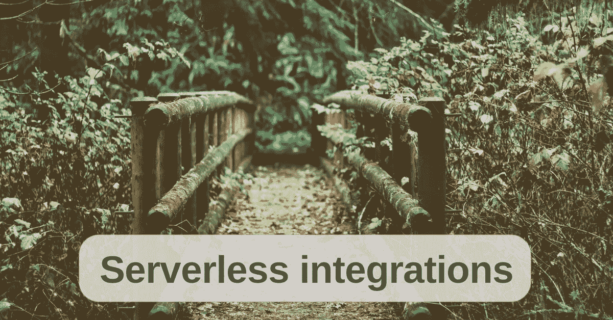
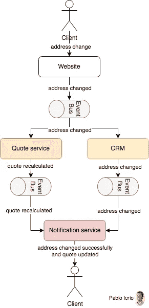
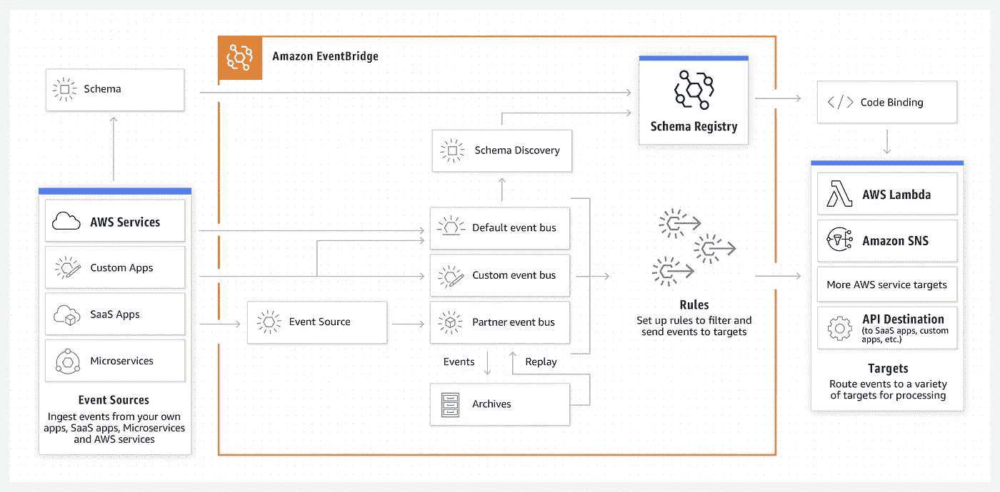
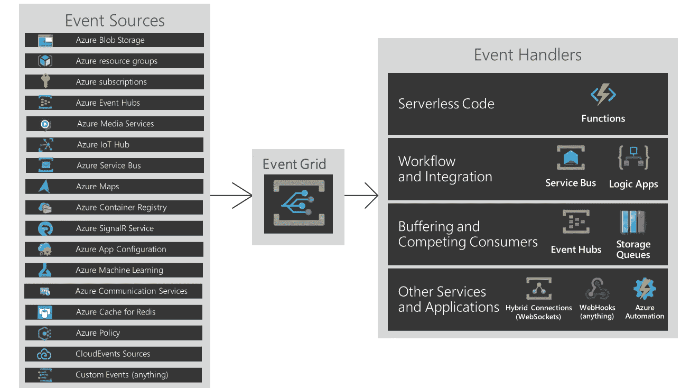
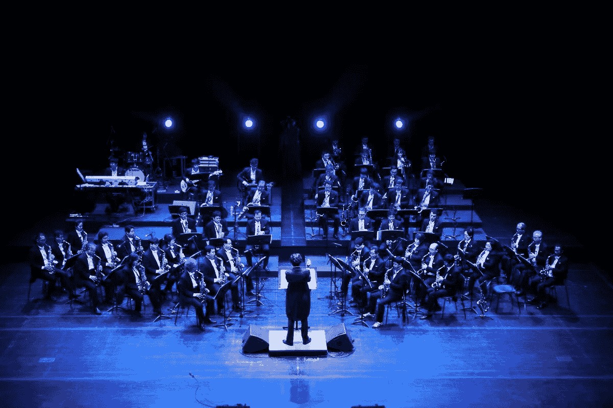
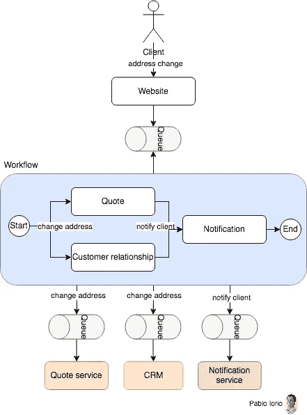
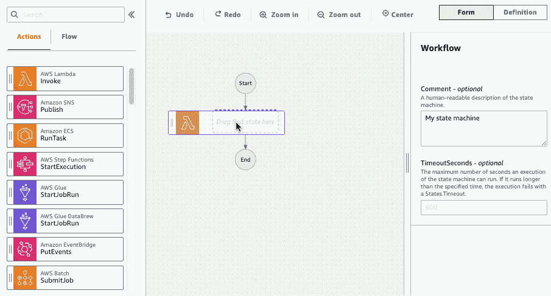
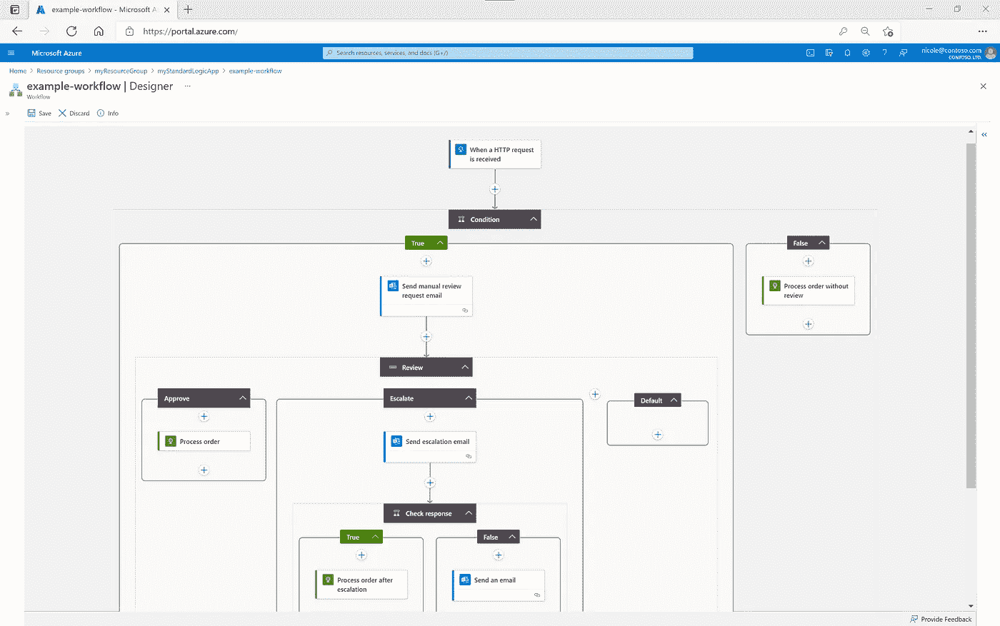

# 无服务器集成模式:编排和编排

> 原文：<https://betterprogramming.pub/serverless-integration-patterns-orchestration-and-choreography-c62e115e4ce5>

## 本文描述了基于编排和编排的无服务器集成模式、利弊以及何时使用它们

在 monolith 中，组件之间的进程内通信要么通过函数调用的方法调用进行。

当您构建云解决方案时，组件之间的通信要困难得多。对于组件，我一般指的是任何类型的无服务器功能；DB 服务(具有隐式行为，如 get、put、update)；K8s 集群中运行的 app 即服务等。

通常有三种方法来解决这个问题:

1.  组件之间有直接调用
2.  让组件独立工作，但使用命令或事件来协调它们
3.  具有集中控制和组织组件间工作的外部实体。

让我们回顾一下这 3 个选项，然后深入了解模式:

*   **直接调用**:所有组件互相调用。每个组件都知道其他组件，这一事实通常会使更改、测试和调试系统的整体行为变得更加困难。一个快速启动的好方法，很难维持。
*   **编排**:组件独立工作，彼此不认识。我们需要一个可以编排实现异步消息模式的组件，通常是像 AWS EventBridge 或 Azure Event Grid 这样的事件总线，使参与者能够发布和接收消息和事件。实际上，它也可以是一个简单的队列或主题。
*   **编排**:负责所有协调逻辑的集中式编排组件，通常是像 AWS Step Functions 或 Azure Logic Apps 这样的工作流。你也有其他基于开源项目的选择，比如 Camunda Cloud。

这些模式不是由技术决定的，也不是由同步还是异步决定的。它们是由职责定义的，即每个组件要做什么。

# 直接调用

我们可以说这是默认模式。你只要做，你就会明白。我不会深入这个问题，因为这不是本文的目的。

## 使用直接调用的优点和缺点是什么？

*   优点:简单，短期内实施和推进速度更快
*   缺点:紧密耦合，很难更改和调试整个系统的行为，比如在组件之间添加中介，并且很难实现跨越 1 个以上组件的业务事务。

## 何时使用直接调用？

更适合 POC，以及关注快速获得客户反馈的初创阶段。

# 编排模式

当你想到编舞的时候，脑海中会浮现出一段精心排练过的舞蹈。每个舞者都知道自己被期待什么，该做什么。没有中心导体。

在软件架构术语中，这意味着我们没有一个明确负责组织整个业务事务的中心组件，而是组件之间的事件驱动通信。

## 编舞的例子

假设一个公司有一个网站可以改变你的地址。在后台，可能存在需要更新/重新计算的待定报价，并且客户关系管理系统需要跟踪地址变更。

网站将创建一个不可变的事件“地址已更改”(过去式)，并将该事件发送到事件总线。报价服务和 CRM 系统将监听这些事件，并知道该做什么。一个重新计算，另一个改变地址。事件将被发送，通知服务将知道如何处理它们。下图描述了它的工作原理。

请注意，我所指的事件是过去发生的重大事件，并且是不可改变的。在这种情况下，诸如地址更改或报价重新计算之类的域事件。

事件驱动架构—编排

每个服务都会生成事件，例如地址更改、报价重新计算。没有服务直接调用对方。但是，在编排中，您仍然有知道如何处理其他系统事件的服务，例如，报价服务知道它需要在地址更改事件后重新计算报价。

实现编排有不同的方法，从简单的队列、请求-应答队列到事件总线。让我们回顾 2 个云提供商的无服务器实现:Amazon EventBridge 和 Azure Event Grid for event buses。

## 亚马逊事件桥

EventBridge 是一种无服务器的事件总线服务，可根据过滤内容的规则，帮助将其他功能、软件即服务应用等源组件连接到目标目的地[4]。此外，它还支持先进的过滤规则，如:数字比较，前缀匹配，IP 地址匹配，存在匹配，任何东西，但匹配。

学分:AWS

## Azure 事件网格

Azure 还提供了 Event Grid 无服务器实现事件总线服务。

学分:Azure

下面这篇文章很好地比较了 AWS EventBridge 和 Azure Event Grid [5]。比较的快速高层次概述:

*   术语上有所不同，例如，EventBridge 是一个规则，Event Grid 是一个事件过滤器。
*   来源和目标各不相同，并与每个提供商的产品相关
*   功能和定价在高层次上是相似的
*   最有可能的是，企业已经决定使用哪个云提供商，事件总线将紧随其后

## 规则、内容过滤、转换和路由

这些服务允许您通过提供一些关键功能(如规则、内容过滤、转换和路由到目标)来进行编排。

*   规则和路由:规则匹配传入的事件，并将它们发送到目标进行处理。它们要么基于模式，要么基于时间表。
*   内容过滤:使用事件模式内容过滤，您可以编写复杂的规则，只在您指定的条件下触发。这有助于通过使用声明性方法在事件总线上处理内容过滤来减少下游服务中所需的自定义代码的数量。
*   转换:在事件总线服务将事件传递给规则目标之前，自定义事件的文本。

## 使用**编排**的利弊？

**优点**:

*   架构中需要维护的组件更少。
*   没有失败或团队依赖的中心点。
*   能够为跨越 1 个以上服务的事务实现 saga 编排

**缺点**:

*   每个组件都需要知道其他服务事件对它们意味着什么。例如，报价服务需要知道地址更改意味着重新计算对地址更改敏感的报价。
*   理解错误发生在哪里更加困难。持续监控变得至关重要。

## 何时使用编排？

如果业务事务经常变化，并且每个 DevOps 团队都拥有自己的服务，那么编排可能更适合。

# 编排模式

如果你想到配器，就会想到管弦乐队。舞台中央的指挥负责组织和协调不同的派对。

在软件架构术语中，这意味着我们需要一个长期运行的组件，等待来自其他组件的响应，做出决策，并路由到下一个动作。这就是为什么编排的最佳实现是工作流。

继续前面关于公司和地址变更的例子。我们用编排来解决这个问题。您会注意到我们仍然可以使用异步通信，不同之处在于工作流引擎现在控制动作。

orchestrator 将监听队列并获取新消息。然后运行定义的长时间运行的工作流，命令每个服务在什么时候做什么。

服务和工作流引擎之间仍然可以有队列。如前所述，这不是编排和编排之间的区别。

注意，我指的是服务正在接收的命令消息，比如更改地址或通知客户端——将这与过去的编排事件进行比较。

让我们回顾 2 个云提供商的实现:AWS Step Functions 和 Azure Logic Apps。

## AWS 阶跃函数

AWS Step Functions 将自己描述为“用于编排 AWS 服务、自动化业务流程和构建无服务器应用程序的低代码可视化工作流服务”。

学分:AWS

## Azure 逻辑应用

Logic Apps 是实现无服务器工作流的 Azure 实现。还提供了一个可视化界面和几个集成选项。

学分:Azure

## 使用**编排**有什么利弊？

**优点**:

*   吸引人的整个过程的可视化和更容易理解商业交易是什么。注意支持工作流和版本差异的大型 JSON 文件。
*   找到运行时错误更容易，因为有一个中心位置可以监控
*   能够为跨越 1 个以上服务的交易实施 saga 编排模式[6]

**缺点**:

*   随着项目的增长，orchestrator 及其团队可能会成为进行变更的瓶颈。因此，对于自治的 DevOps 团队来说，这可能并不理想。
*   工作流是团队需要维护的新资产和新技能。

## 何时使用编排？

当业务在很大程度上由业务流程驱动，并且需要向用户不断更新一些长期运行的流程的流程状态时，编排可能是更好的选择。

# 结论

没有更好的模式了。每一种情况都值得关注和分析利弊，以决定哪一种更合适。结论是:如果业务流程不是长期的，并且 IT 团队自治是可取的，那么评估编排。同时，对于需要业务部门进行大量状态检查的长时间运行的流程，可以尝试编排。

# 参考

*   第 23 课——编舞与配器，马克·理查兹
*   [ [2](https://www.youtube.com/watch?v=zt9DFMkjkEA&list=WL&index=1) ]平衡编舞和编排贝恩德·吕克尔前往 2020
*   [[3](https://www.youtube.com/watch?v=ttJAIQf7cTw)AWS re:Invent 2021—构建现代云应用？思考整合
*   [ [4](https://serverlessland.com/learn/eventbridge) ]使用 Amazon EventBridge 构建解耦的事件驱动架构
*   【[5](https://vunvulear.medium.com/the-value-proposition-of-aws-eventbridge-and-azure-event-grid-8a0d0fab2413)】Radu Vunvulea 的 AWS Eventbridge 和 Azure Event Grid 的价值主张
*   [ [6](https://aws.amazon.com/blogs/compute/building-a-serverless-distributed-application-using-a-saga-orchestration-pattern/) ]使用 saga 编排模式构建无服务器分布式应用

# 放弃

*这是一篇个人文章。此处表达的观点代表我个人的观点，不代表我雇主的观点。*