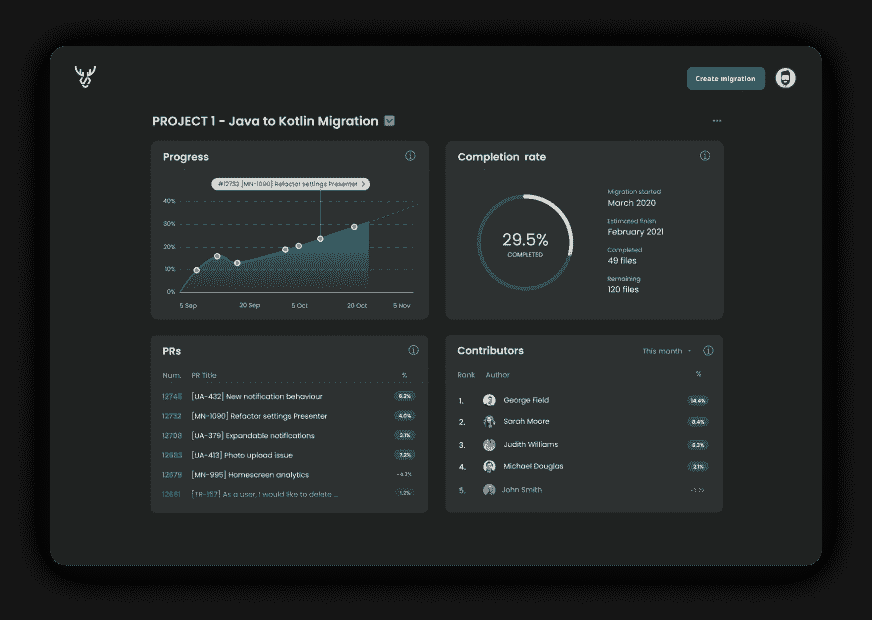
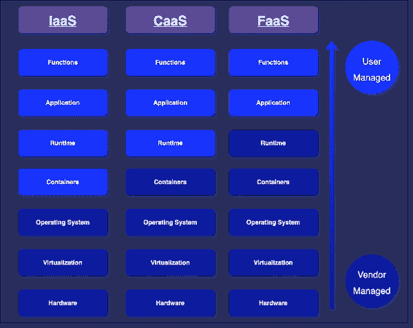
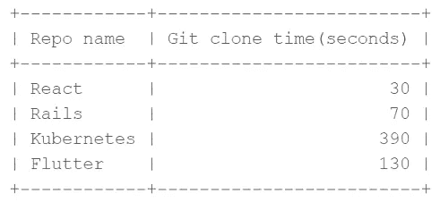

# AWS Lambda 上无服务器，带 Kotlin + Micronaut + Graal 虚拟机

> 原文：<https://betterprogramming.pub/serverless-on-aws-lambda-with-micronaut-kotlin-7aac485f066e>

## 快速浏览 Caribou——SaaS 开发人员工具，有助于技术债务度量


马克·赖歇尔在 [Unsplash](https://unsplash.com?utm_source=medium&utm_medium=referral) 上的照片

在本文中，我们将回顾 [Caribou](http://hellocaribou.com/) 的技术堆栈决策，这是一个开发工具，帮助开发人员使用数据驱动的见解来管理他们的技术债务。我们将探讨无服务器架构的一些优点和缺点，以及在 JVM 语言中使用无服务器有多容易。

大约一年前，我们开始讨论我们将用来构建 [Caribou](https://www.hellocaribou.com/) 的主要组件和软件堆栈。

Caribou 是一个 SaaS 开发者工具，可以作为 GitHub 应用程序安装在你的 GitHub 帐户上，并提供关于你如何从代码库中移除技术债务的见解。

例如，如果你想将你的项目从 Java 迁移到 Kotlin，并且你想跟踪这个迁移，那么你需要做的就是定义一个[规则](https://www.hellocaribou.com/documentation/migrations/#migrating-from-java-to-kotlin)来告诉 Caribou 你想跟踪哪个文件。

Caribou 然后在每个 pull 请求被合并后运行一个分析，为您提供关于迁移进展如何、预计完成日期是什么时候、谁在做贡献等等的实时数据！



驯鹿在行动！

Caribou 需要的主要技术组件有:

*   一个 Web 应用程序，使用户能够定义他们的迁移，并查看他们引入的代码更改的所有迁移指标。
*   一个带有 REST API 的后端，为 web 应用程序提供服务，还有一个数据库，用于存储关于用户定义的迁移及其进展情况的元数据。
*   一种用户认证和提供 Caribou 访问他们的 GitHub 存储库的机制，这样它可以监视传入的 pull 请求，并在需要时进行分析。

当设计我们的解决方案和做出技术决策时，最重要的标准是开发速度；我们希望快速获得一个 MVP，然后根据用户的反馈进行迭代。这意味着选择我们熟悉的技术和工具，优先使用现成的产品而不是我们自己构建的东西，选择学习曲线最小或者周围有良好文档和社区可以帮助我们快速上手的工具。

本文将关注后端的 3 个主要决策选择，即:

*   用什么语言来构建它。
*   我们将使用什么样的框架来完成繁重的工作。
*   我们是否会利用“无服务器”这一新生事物，或者我们是否会采用现有的整体式或微服务方法。

我们最终得到的是一个用 [Kotlin](https://kotlinlang.org/) 编写的后端，在 [AWS Lambda](https://aws.amazon.com/lambda/) 上使用 [Micronaut 框架](https://micronaut.io/)构建的无服务器架构。现在让我们更详细地看一下这 3 个选项:

## 为什么选择 AWS Lambda

我们为自己设定的第一个问题是，我们是将无服务器架构用于我们的后端，还是坚持在容器内部署一个或多个服务的更传统的解决方案。

考虑到我们最初对速度的要求，无服务器引起了我们的兴趣，因为这意味着我们需要处理的事情会更少。对于第一次进入后端开发的人来说，无数的 AWS 容器服务( [ECS](https://aws.amazon.com/ecs/) 、 [EKS](https://aws.amazon.com/eks/) 、 [Fargate](https://aws.amazon.com/fargate/) 、 [Kubernetes](https://kubernetes.io/) 等等)有一个相当陡峭的学习曲线。

另一方面，就基础设施和可伸缩性而言，无服务器有一个非常简单的模型，允许您只担心正在执行的代码，而让平台服务提供商担心所有其他事情。

为了测试我们的假设，即对于我们来说，使用无服务器比使用容器更快更简单，我们构建了一个简单的虚拟后端，其中 AWS Lambda 连接到一个 REST API(使用 [AWS API 网关](https://aws.amazon.com/api-gateway/)),并设法了解哪一个是为我们构建最快的。AWS lambda 轻松获胜。



基础设施 vs 容器 vs 功能即服务，来自[https://tinyurl.com/caas-faas](https://tinyurl.com/caas-faas)

除此之外，值得注意的是:

*   用一个无服务器的架构来构建也意味着我们最终会得到一个模块化的系统，其中每个 lambda 函数只做一件事，有一个非常清晰的接口，并且可以独立部署。
*   许多平台提供商提供了慷慨的免费层(例如 AWS 每月免费提供 1，000，000 次函数调用)，这意味着我们暂时不需要为我们的 lambda 执行支付任何费用🙂。

然而，也有一些缺点:

*   无服务器服务出现的时间没有容器服务长，我们打算将它与 Kotlin 一起使用，这意味着网上不会有太多关于这个主题的内容来指导我们。
*   如果我们将它与任何 JVM 语言(如 Kotlin)一起使用，我们将需要为[冷启动问题](https://aws.amazon.com/blogs/compute/operating-lambda-performance-optimization-part-1/)找到一个解决方案:执行基于 JVM 的语言需要更长的时间，因为在第一次 lambda 调用时，您需要等待运行时环境初始化，而随后的调用不会面临同样的问题。这听起来可能是个小问题，但是让 REST API 在 10-15 秒内返回确实会扼杀用户体验，即使这种情况并不经常发生。
*   另一个我们认为无服务器可能会遇到的问题是，我们的一个函数需要执行一个`git clone`操作(为了执行 [Caribou 提供的](https://www.hellocaribou.com/documentation/#how-the-tool-works)技术债务分析)，这可能会在无服务器架构中超时，因为所有的提供者对他们的函数调用都有特定的[超时限制](https://acloudguru.com/blog/engineering/serverless-showdown-aws-lambda-vs-azure-functions-vs-google-cloud-functions#5b)(例如 AWS Lambda 目前有一个 [900 秒](https://docs.aws.amazon.com/whitepapers/latest/serverless-architectures-lambda/timeout.html)超时)。

在调查了上面提到的这些潜在问题后，我们决定继续使用无服务器，具体如下:

*   我们发现 [GraalVM 本地映像](https://www.graalvm.org/reference-manual/native-image/)有助于减少冷启动时间，我们将在本文后面看到这一点。
*   在测试了甚至更大的 git 仓库的`git clone`操作后，我们认为它们不太可能花费超过 15 分钟的时间，所以我们将其视为一种边缘情况。如果我们曾经遇到过这个问题，那么[稀疏校验](https://git-scm.com/docs/git-sparse-checkout)可能是它的答案。



我们尝试用 Caribou 克隆了一些相当大的 git 库。基于此，我们对 AWS lambda 上 900 秒的超时限制相当满意。

我们特别决定使用 [AWS Lambda](https://aws.amazon.com/lambda/) 而不是 [Azure](https://azure.microsoft.com/en-gb/solutions/serverless/) 或 [GCP](https://cloud.google.com/serverless) ，主要是因为对过去的 AWS 有些熟悉，但也是因为一个亲密的朋友在 AWS 平台方面有丰富的经验，这意味着如果有什么可怕的错误，我们可能会获得一些帮助！

另外，如果你想深入了解无服务器架构，一定要看看这篇文章。

## 为什么是科特林

Kotlin 是一种现代语言，为来自 [JetBrains](https://www.jetbrains.com/) 的 JVM 而构建。它大约在 10 年前问世，但在 2018 年随着其在 Android 开发中的[引入而真正变得更加流行。](https://developer.android.com/kotlin)

我自己也有 Android 开发背景，看到这种语言使用起来有多棒，它如何帮助我们编写更简洁、错误更少的代码，以及围绕它的工具/IDE 有多完善(JetBrains 在这方面做得非常好🙂)，我自然也倾向于用它来饲养驯鹿。使用 Kotlin 还意味着我们能够使用 Gradle 作为我们的构建系统，并利用多年来使用 Gradle 进行移动开发的经验。

经过一段时间的调查，如果我们要走无服务器路线，主要的挑战似乎是上面讨论的 JVM 启动时间。用 Kotlin 进行的快速测试(最初的测试是用 [Spring Cloud Function](https://spring.io/projects/spring-cloud-function) 进行的)显示，一个 AWS Lambda 函数执行起来确实需要大约 15 秒。谢天谢地，发生了三件事:

*   我们发现了一些其他更轻量级的框架，如 [Micronaut](https://micronaut.io/) 和 [Quarkus](https://quarkus.io/) ，它们专注于更快的启动时间和更小的内存占用。稍后会有更多的介绍。
*   我们发现了 [GraalVM 本地图像](https://www.graalvm.org/)的奇迹。
*   有一些迹象表明，AWS 本身已经承认了这个问题，并提出了一个解决方案，[提供并发](https://aws.amazon.com/blogs/aws/new-provisioned-concurrency-for-lambda-functions/)，这基本上保持了一些 lambda 函数随时准备启动，完全消除了冷启动问题。

这些发现让我们最终决定去找科特林，从此我们再也没有回头。我们最终没有使用提供的并发性，因为保持 lambda 函数始终准备好启动本质上模拟了一个始终运行的后端，这有点违背了无服务器的目的(更不用说它实际上更加昂贵)。

## 为什么选择 Micronaut

如上所述，第一次尝试是使用[弹簧](https://spring.io/projects/spring-cloud-function)，但这被证明是困难的，因为:

*   功能的启动时间很长。Spring 是一个相当大的框架，它依赖于反射来启动，减慢它的速度。
*   当时在 Spring 框架中对 AWS lambda 的支持并不多(我相信从那以后事情已经有所改善)。
*   当时没有对 GraalVM 原生映像的支持(最近似乎有一些[实验支持](https://github.com/spring-projects-experimental/spring-native))

因此，鉴于 Spring 不打算削减它，我们开始寻找上面提到的其他框架，这些框架专注于启动时间速度。我们最初决定从 Micronaut 开始评估 Quarkus 和 Microanut，但我们对 Micronaut 非常满意，所以我们决定继续进行！总的来说，它似乎更关注无服务器场景，以及具体的 AWS 教程。事实上，我们很快就有了一个 lambda 函数，Micronaut 在 AWS 上运行，它比 Spring 更快(然而，在使用 GraalVM 之前，它仍然没有达到可接受的水平)。除此之外，Micronaut:

*   在 Gitter 上有一个很棒的[支持社区](https://gitter.im/micronautfw/questions)
*   有一大堆关于如何使用这个框架的例子的文档。
*   允许为单元测试构建整个 Micronaut 框架，使得运行端到端测试变得非常容易，根本不需要模仿任何东西。这允许我们有数百个这样的集成测试，而不会对测试执行时间产生大的影响。我不得不说，没有什么比在真正的框架上运行测试更好的了，没有任何模仿。
*   有一个真正令人敬畏的 [IntelliJ IDEA 插件](https://www.jetbrains.com/help/idea/micronaut.html)(仅用于 [IntelliJ IDEA 终极版](https://www.jetbrains.com/idea/))，它使得定义[数据库查询](https://micronaut-projects.github.io/micronaut-data/latest/guide/#querying)变得非常容易，只需按照特定的命名约定定义接口函数名称，然后让 Micronaut 用执行 SQL 操作的代码为您实现这些接口。
*   内置了对 Swagger 的支持，这使得向前端团队提供关于 API 的必要细节变得非常容易。

> Micronaut 实现其[性能](https://micronaut.io/2020/04/28/practical-performance-comparison-of-spring-boot-micronaut-1-3-micronaut-2-0/)的方法是完全不使用反射，而是使用[注释处理](https://medium.com/@jintin/annotation-processing-in-java-3621cb05343a)来生成框架运行所需的所有代码。

## GraalVM

我认为 GraalVM 值得作为本文的一部分，因为它突然出现并赢得了许多开发人员的青睐，它提供了 JVM 的替代方案，具有更好的性能特征，并使无服务器运行 JVM 语言成为可能。它有很多用途，从在你的项目中使用其他语言编写的库，一直到在同一个文件中组合使用 JavaScript、Java、Ruby 和 R。

将它与 Micronaut 和 AWS lambda 集成的经历无疑让我们度过了几个不眠之夜，因为在某些情况下，使用[反射](https://www.graalvm.org/reference-manual/native-image/Reflection/)或[动态代理](https://www.graalvm.org/reference-manual/native-image/DynamicProxy/)的库需要定制配置，但是一旦您理解了 GraalVM 原生映像是如何工作的，它就变成了一个非常简化的过程，很少需要关注。

那么使用 GraalVM 值得吗？绝对的！使用 Micronaut 执行冷启动的 REST API 调用需要大约 10 秒钟才能返回，而使用 [Graal VM 本机映像](https://www.graalvm.org/reference-manual/native-image/)时只需要大约 2 秒钟！(其中冷启动大约为 800 毫秒)

# 最终结果

以下是我们最终构建的系统的主要组件:

*   整个后端用 [Kotlin](https://kotlinlang.org/) 编写，使用 [Micronaut 框架](https://micronaut.io/)和 [GraalVM](https://www.graalvm.org/) 。
*   我们使用 [Gradle](https://gradle.org/) 来构建我们的后端 Kotlin 项目
*   通过 [TeamCity Cloud](https://www.jetbrains.com/teamcity/cloud/) 的 CI/CD:我们最初参与了 [TeamCity Cloud Beta](https://blog.jetbrains.com/teamcity/2019/12/sign-up-for-the-teamcity-cloud-beta/) ，在那里我们获得了一个相当慷慨的免费信用包，以换取试用 TeamCity 的云产品。一旦测试版在 2021 年 6 月完成，使用该系统的体验，加上他们无与伦比的支持和帮助意愿，最终将我们转化为付费客户。值得注意的是，我们所有的 CI/CD 配置实际上都是使用他们的 [Kotlin DSL](https://www.jetbrains.com/help/teamcity/kotlin-dsl.html) 编写的！
*   后端是一个 Rest API(通过 [AWS API 网关](https://aws.amazon.com/api-gateway/)服务),服务于下一个 [React](https://github.com/facebook/react) [。Js](https://nextjs.org/) Web 应用托管在 [AWS Amplify](https://aws.amazon.com/amplify/) 上。
*   所有 API 端点都被[代理](https://docs.aws.amazon.com/apigateway/latest/developerguide/set-up-lambda-proxy-integrations.html)到 [AWS lambda](https://aws.amazon.com/lambda/) 函数，与 [MySQL RDS 数据库](https://aws.amazon.com/rds/)对话。
*   我们使用一个 [Cognito](https://aws.amazon.com/cognito/) [用户池](https://docs.aws.amazon.com/cognito/latest/developerguide/cognito-user-identity-pools.html)进行认证和用户管理，它通过一个 [Cognito 授权器](https://docs.aws.amazon.com/apigateway/latest/developerguide/apigateway-integrate-with-cognito.html)连接到 AWS API 网关。我们还通过 GitHub 使用 [Open ID Connect](https://openid.net/connect/) (OIDC ),并将[GitHub-cognito-OpenID-wrapper](https://github.com/TimothyJones/github-cognito-openid-wrapper)库作为 lambdas 部署到我们的 AWS 基础设施，使 GitHub OIDC 兼容，以便我们可以将其连接到 cogni to。
*   所有 AWS 基础设施都通过 [AWS CloudFormation](https://aws.amazon.com/cloudformation/) 进行管理。
*   我们使用 [AWS 无服务器应用模型](https://aws.amazon.com/serverless/sam)来帮助管理我们的无服务器基础设施。
*   3 个环境:开发、试运行和生产，由相同的云形成脚本配置。

# 最后的想法

回顾过去，我们对自己做出的技术选择非常满意:AWS Lambda 与 Kotlin 和 Micronaut 一起帮助这个项目快速向前发展，更不用说构建这些系统真的很有趣！

正是这些技术加上 GraalVM 的结合导致了这个结果，所以我们很幸运，当我们开始构建 Caribou 时，这些技术已经足够成熟了。

```
You can help your teams fight the war against technical debt by checking out Caribou [here](https://www.hellocaribou.com/).
```