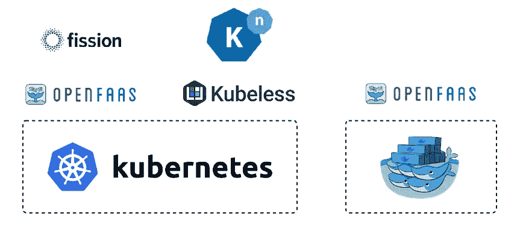
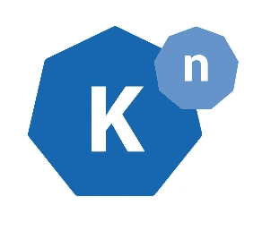

# Kubernetes 上的无服务器

> 原文：<https://betterprogramming.pub/serverless-on-kubernetes-354051a1942e>

## 你可能认为这两件事不相配。让我解释一下



看完这个标题，你一定在思考如何把两个不同的东西放在一起，它们看起来根本不像 serverless 和 Kubernetes 那样适合放在一起。

首先，让我们澄清一下。

# 我们所说的无服务器是什么意思？

在高层次上，无服务器只是一种将服务器完全抽象化的部署方法。

开发人员只想编写他们的应用程序代码，按一个按钮，让他们的应用程序得到服务，而不需要规划部署、设置自动扩展或任何其他复杂的基础架构任务。

对于某些用例来说，普通的老 Kubernetes 可能对开发人员更友好。随着无服务器定义的成熟，出现了两种不同的模式:

## **容器即服务**

在这里，您将应用程序作为容器进行部署，并期望平台为您完成所有其他工作。您可以在 Kubernetes 中运行容器，但是您仍然需要配置、部署、更新和自动伸缩一些活动部件。

容器即服务平台只是从开发人员那里接受一个容器，并为他们做其他的事情。这个领域流行的云供应商有[谷歌云运行](https://cloud.google.com/run)和 [AWS Fargate](https://aws.amazon.com/fargate/) 。

## **作为服务发挥作用**

不是部署整个容器，而是部署一个函数，实际上是只能包含一个方法的代码片段，然后通过将多个函数组合在一起来构建服务。

这个领域流行的云厂商有[谷歌云功能](https://cloud.google.com/functions)和 [AWS Lambda](https://aws.amazon.com/lambda/) 。

所以，无服务器是一种有趣的做事方式，但是…

# 这和 Kubernetes 有什么关系？

作为一个运行工作负载的运营团队，您应该将 Kubernetes 视为一个运行所有基础设施的分布式平台，而不管它是如何构建或需要部署的。

新项目可能会采用无服务器，并希望在无服务器功能上部署整个堆栈。然而，仍然存在这种方法不合适的用例，因为软件限制不允许这样做。

此外，您可能必须为许多不同的团队部署软件，每个团队都有自己的需求。您的大部分工作负载可能都基于 Kubernetes 的本地容器部署。

但是，如果开发人员希望偶尔使用无服务器功能来补充这种工作负载，Kubernetes 能够提供支持无服务器部署的服务，因此您仍然可以运行一个更广泛的分布式系统，而不必在许多不同的系统之间分散精力。

# Kubernetes 是如何做到这一点的？

## 对于无服务器容器，有一个名为**的 T4 项目**

这为容器提供了“点击部署”的无服务器部署。它通过向 Kubernetes 添加新的定制资源来实现无服务器容器部署。

这意味着，从开发人员的角度来看，您只需构建您的容器并将它们部署到 [Knative](https://knative.dev/) 。Knative 负责联网、修订跟踪、自动缩放，这些将随着需求而增加，并在需要时缩放回零。

## 您可以使用云运行来玩 Knative

这是一个托管 GCP 产品，它实施与 Knative 相同的服务，而不需要 GKE 集群。

当然，你可以通过安装 Knative 来扩展你自己的 GKE 集群，或者让 Google 在构建你的集群时为你添加在 GKE 上运行的云，这是为了容器即服务。那么，函数呢？



## **在集群上安装 kna tive(GKE)**

```
gcloud beta container clusters create $CLUSTER_NAME \
  --addons**=**HorizontalPodAutoscaling,HttpLoadBalancing,**Istio** \
  --machine-type**=**n1-standard-4 \
  --cluster-version**=**latest --zone**=**$CLUSTER_ZONE \
  --enable-stackdriver-kubernetes --enable-ip-alias \
  --enable-autoscaling --min-nodes**=1** --max-nodes**=10** \
  --enable-autorepair \
  --scopes cloud-platform
```

对于在其他集群中安装 Knative，请参考[Knative 文档](https://knative.dev/docs/install/any-kubernetes-cluster/)。

# **使用 Knative 部署应用**

您可以简单地使用一个`.yaml`文件来部署您的容器化应用程序，如下所示:

使用以下命令在您的 GKE 集群中运行这个`.yaml`文件:

```
kubectl apply -f filename.yaml
```

我们第一次使用 Knative 部署应用程序时，需要检索在您的集群前端配置的 IP 地址。为此，我们可以:

```
export IP_ADDERSS=$(kubectl get svc istio-ingressgateway --namescpace istio-system --output 'jsonpath={.status.loadbalancer.ingress[0].ip}')
```

最后，要获得输出域，您需要:

```
kubectl get route helloworld --output=custom-coloum=Name:.metadata.name,DOMAIN:.status.domain
```

在这个命令之后，我们在我们的应用程序名称旁边得到一个域列。姑且称之为`[DomainName]`。复制这个域并粘贴到下一个命令中，以查看终端中的输出。

```
curl -H "Host: [DomainName]" http://${IP_ADDERSS}
```

# **使用 OpenFaaS 的 Kubernetes 上的无服务器功能**

如果您曾经使用过云函数或 AWS Lambda，那么您可能非常熟悉无服务器函数；这些是作为服务或 Faas 平台的功能。

通过安装一个名为 [OpenFaaS](https://www.openfaas.com/) 的开源项目，您可以在 Kubernetes 中使用这个功能。也有其他选择，如和[裂变](https://fission.io/)，但我们现在将坚持使用 OpenFaaS。

部署在 OpenFaaS 中的功能仍然是容器，但它们被设计为尽可能最小，并且不像您作为自己的服务部署的容器，它们不需要包含 web 服务组件。

HTTP 请求通过 OpenFaaS 的专用组件进行抽象，以尽可能保持容器本身的流线型。

所以，这样来看，OpenFaaS 仍然没有 Google Cloud Functions 这样的专用平台轻量级，但是可定制性要好得多。它允许您在自己的 GKE 集群中运行无服务器功能的部署方法。

有关 OpenFaaS 安装指南，请参考[他们的网站](https://docs.openfaas.com/deployment/kubernetes/)。

我们可以使用 OpenFaaS 部署一个功能，只需指向 GitHub 中的一个定义文件，使用:

```
faas-cli deploy -f https://raw.githubusercontents.com/openfaas/faas/master/stack.yaml
```

这将安装一个方便的 web 控制台来部署您想要的功能。

如果您将堆栈分解成一个组件服务，并采用无服务器组件方式，OpenFaaS 将为您提供一个全功能的无服务器平台，同时仍然运行在您自己的 Kubernetes 集群中。