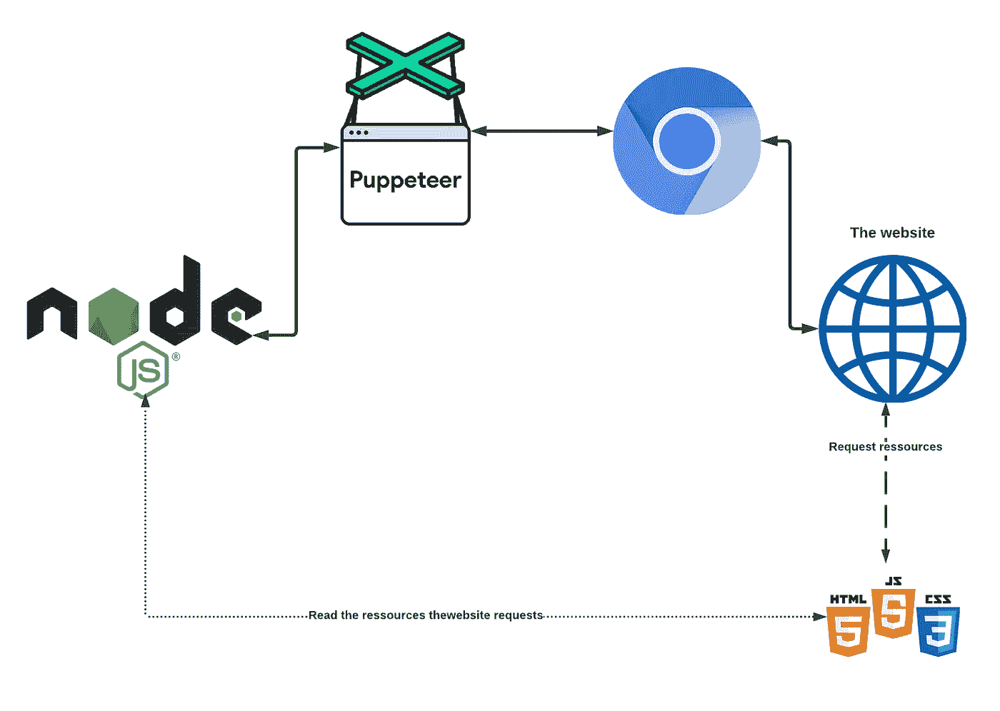
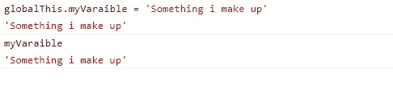
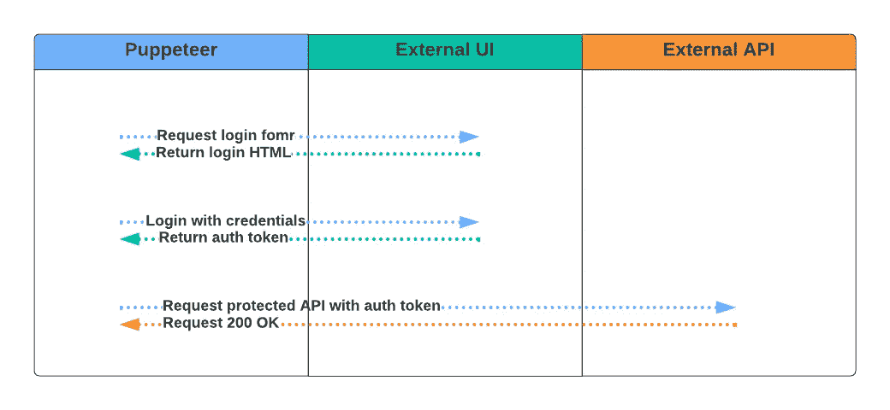

# 无服务器木偶——2022 年的使用案例

> 原文：<https://betterprogramming.pub/serverless-puppeteer-use-cases-in-2022-35191f3ff4cd>

## 让我们来看看您可以使用现代木偶戏表演的一些功能和用例。


照片由 [Sivani B](https://unsplash.com/@agni11?utm_source=medium&utm_medium=referral) 在 [Unsplash](https://unsplash.com?utm_source=medium&utm_medium=referral) 上拍摄

之前我写过如何使用无服务器框架和 AWS Lambda 让[puppeter 在 AWS、](https://medium.com/aws-tip/serverless-puppeteer-on-aws-5162459a4c44)上运行。

下面我将描述一些用例，并举例说明如何实现它们。

# 拦截网络流量



从网站读取网络流量

这是一个用例，当浏览器加载不同的脚本时，我用它来做时间测试。下面是一个简短的片段，它带有一个木偶页面对象和一个导航到的 URL

上面我们检查一个特定的 URL 是否被站点加载。我已经设置了一个超时功能，它将在 20 秒后超时，在我的情况下，这意味着我可以放心地说脚本尚未加载。

# 截图

这也是一个非常基本的用例，可以为您提供一些视觉反馈，否则是不可能得到的。这对于自动化测试或自动化来说非常有用，因此您可以向您的客户发送所需页面的屏幕截图。

用`puppeteer`截图极其简单:

您可以对截图做什么，但在我的例子中，我将它保存在 S3，并将其附加到一个 Slack 通道进行自动化测试。

# 纵观全球背景

首先。这到底是什么意思？

在网站上显示您的图像，然后打开开发工具。在控制台中，你可以写下`document`或`window`，一些大的物体会被打印出来。这是因为这些变量(以及许多其他变量)是特定于您所在站点的全局变量。

如果您拥有一个站点，并且您的代码中有以下内容

```
globalThis.myVaraible = 'Something i make up'
```

您将能够在控制台中编写`myVariable`,并获得以下内容



例子

这意味着全局范围可以并且将包含只有该选项卡才能访问的信息。有了木偶师，我们还可以查看所有其他全局变量。实现可能看起来像这样

# 抓取网站

这个用例很可能是使用最多的一个。

让我们假设你有一个网站，你想获得网站上所有图片的所有`paragraphs`或所有源路径。在这种情况下，木偶师大放异彩。

我们可以在这些相对简单的用例中，指示浏览器为我们返回所有这些值。

为了检索更多的嵌套或非静态数据，不要低估创建这些脚本的工作量。

如果您依赖于特定的选择器，您可能会在每次站点更改或更新 DOM 或选择器 id 时更改您的脚本。

当从外部网站抓取数据时，你也应该意识到这在你的国家可能是非法的，即使从技术上讲这是你自己的数据。

# 获取登录令牌

这个用例有点争议，但我还是要提一下:)

最近，我遇到了一个需要通过 API 进行交互的系统。
这是不可能的，因为系统没有官方的 API。那你是做什么的？

我知道我可以通过导航他们的用户界面(在登录之后)来做我需要做的动作，所以我想我可以让木偶师做同样的事情。

事实证明，我能够做一些捷径，使解决方案更简单一点，也许你可以使用相同的技术。

如果您想复制登录背后的外部 UI 所能做的事情，这个想法相当简单，因为 UI 与某种后端服务器进行通信。

1.使用木偶师导航至登录页面
2。使用表单使用木偶师登录(只有在没有双因素认证的情况下有效)
3。现在，您应该直接获得一个授权令牌，或者将它存储在网站的 cookies 中。您需要检索这个令牌，并将其与以下请求一起发送到外部 API。
4。使用授权令牌，您现在可以模拟您通常在外部 UI 中所做的任何事情。

下面是正在发生的事情的大概情况。



与外部 API 一起使用的身份验证令牌的理论检索

> 注意:这种方法并不适用于所有系统。在某些情况下，你必须有一点创造力来模仿真实用户在登录后能做什么。

# 为胜利而战的木偶师！

还有很多很多其他的用例，但是这是为了让你知道你可以用它做什么。

值得注意的是，当使用木偶师时，你通常会与你很少或根本无法控制的网站互动。这意味着你的脚本应该有效地适应网站。

如果网站经常改变，这可能会变得棘手。因此，考虑让脚本更通用一点可能会节省您的时间，这样当网站将类名从`id1`更改为`id2`时，它们不会中断。

> 让计算机来做这项工作！

## 您可能会喜欢:

[](https://medium.com/@emilhein1/convince-users-to-pay-for-your-content-56ecc689a5cf) [## 说服用户为你的内容付费

### 如果你有独特的内容，我的意思是真正的独特，你应该让人们为之付费。我将提供如何…的例子

medium.com](https://medium.com/@emilhein1/convince-users-to-pay-for-your-content-56ecc689a5cf) [](https://medium.com/ad-tech/how-does-ad-targeting-work-in-practice-2340d99ed3ff) [## 广告目标如何工作——在实践中

### 我在这里给你一个更好的理解技术上的目标是如何实现的，它…

medium.com](https://medium.com/ad-tech/how-does-ad-targeting-work-in-practice-2340d99ed3ff) [](https://medium.com/ad-tech/video-advertising-a-practical-guide-545aa107591f) [## 视频广告——⚡实用指南

### 让我们来看看如何在你的网站/应用上实现不同类型的视频广告！

medium.com](https://medium.com/ad-tech/video-advertising-a-practical-guide-545aa107591f) [](https://medium.com/ad-tech/reduce-cls-impact-of-running-ads-724cfb7e3c31) [## 降低广告对 CLS 的影响

### 我们希望在投放广告的同时减少 CLS 的影响。我们如何做到这一点？

medium.com](https://medium.com/ad-tech/reduce-cls-impact-of-running-ads-724cfb7e3c31) [](https://medium.com/ad-tech/increase-ad-quality-by-using-ad-refresh-and-lazyloading-strategies-for-publishers-and-networks-fb3983ef915a) [## 针对出版商和网络，通过使用广告更新和延迟加载策略提高广告质量

### 我们究竟如何优化我们的广告单元？通过代码示例，我将展示至少一种通用的方法。

medium.com](https://medium.com/ad-tech/increase-ad-quality-by-using-ad-refresh-and-lazyloading-strategies-for-publishers-and-networks-fb3983ef915a)