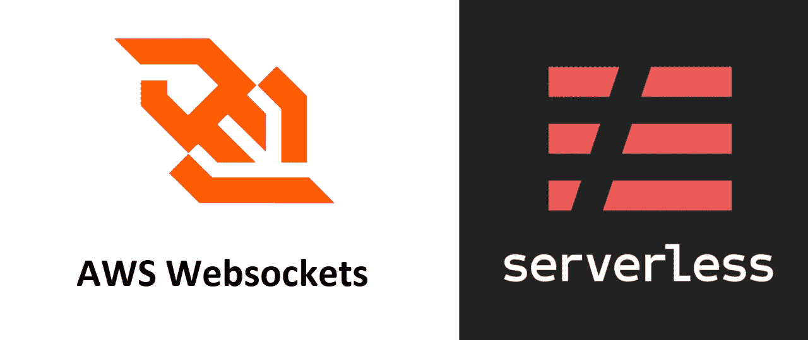
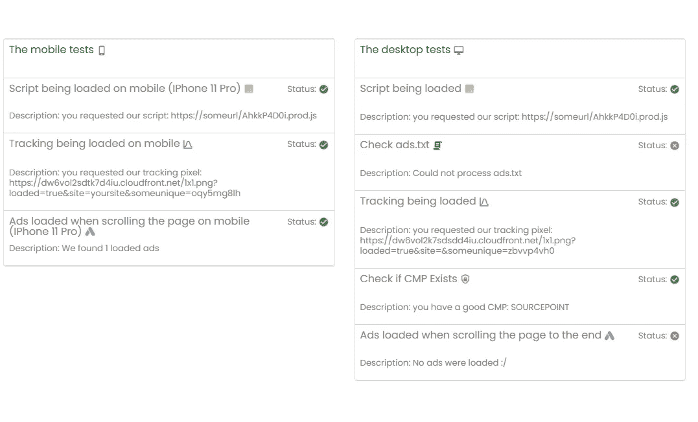

# 无服务器 web socket——如何和为什么以及示例

> 原文：<https://betterprogramming.pub/serverless-websocket-how-and-why-with-examples-e83b05c14040>

## 为什么要使用 WebSocket 连接，我们能让它没有服务器吗？

AWS WebSockets 和无服务器框架

## Websockets

客户机和服务器之间的这种类型的连接并不特别新。从历史上看，使用它有点棘手，可能会吓得一些人不敢使用它。

简而言之，WebSocket 是一种不同于大多数常规网站通常的请求-响应模式的范式。相反，WebSocket 在服务器和客户端之间创建了一个双向连接。这意味着服务器现在可以主动将消息推送到客户端，这在某些用例中会有很大的不同。

正常的示例用例可能是

*   实时聊天
*   “谁在看”功能
*   用户对用户的交互

## 无服务器

我是无服务器框架的忠实粉丝，因为它允许我轻松地设置后端资源，而无需过多考虑底层基础设施。这创造了一个很好的抽象概念，使得原型设计变得非常容易和有趣。

现在，关于 WebSockets，我们受到了云提供商产品的限制。我将使用 AWS，因此 AWS Lambda 函数将充当提供 WebSocket 特性的服务器和 API 网关。

这也带来了一些限制。根据[文档](https://docs.aws.amazon.com/apigateway/latest/developerguide/limits.html#apigateway-execution-service-websocket-limits-table)，在撰写本文时，空闲限制被设置为 10 分钟。这意味着当客户端启动连接时，如果 10 分钟后没有发送任何事件，连接将自动断开。

在极端情况下，有效负载限制和连接速率限制也可能使 API 网关成为非选项。

另一个考虑是定价。因为无服务器模式不适合服务长连接和长时间运行的功能。就此而言，定价太贵了。当使用 API Gateway 时，您需要为传输的每条消息和“连接时间”付费。这意味着客户端与 API 网关(和 lambda)连接的时间越长，您支付的费用就越多。所以如果你需要做很长的工作流，我会说你最好使用一个“真正的”服务器(AWS 中的 EC2)

然而，我最近发现了一个用例，WebSockets 和无服务器范例可以一起创建一个解决方案。

## 用例

我们有一套用户可以启动的测试。用户在开始测试时不知道也不应该知道具体是哪个测试。这些测试是动态的，从 1 秒到 40-50 秒不等，在某些情况下甚至更长。在真实的用例中，这些测试会抓取一个页面，并进行某些断言和检查。

这是一个经过编辑的真实用例截图:

WebSocket 测试

# 实施

## 无服务器

在无服务器安装文件中没有太多疯狂的事情发生。
唯一需要注意的是，我们这里有 3 个处理程序:

*   连接处理程序将处理初始连接设置。
*   如果用户断开连接，可以使用断开连接处理程序来清理资源
*   客户端将从其发送和接收消息的默认处理程序

## 后端

对于后端(lambda 处理程序)，我们将为我们的用例实现一个非常简单的 WebSocket 特性。

此示例将启动 3 个“测试”,几秒钟后解决。这是为了说明每项任务可能会花费更长的时间。如果涉及 HTTP 请求或繁重的计算，可能会出现这种情况:

这个函数看起来像这样

助手的方法如下所示:

有了以上 3 部分，我们现在可以构建一个简单的例子来测试 WebSockets 是否是解决用例的可行方法

上述代码将运行 3 个任务，每个任务将通过 WebSocket 连接向客户端发送一些消息。让我们来看看它的实际应用:

行动中的项目

完整的代码示例可以在[这里](https://github.com/emilhein/serverless-websockets)找到。

你可以在这里看到如何用 [Vue 3 显示输出的例子](https://medium.com/@emilhein1/using-websockets-in-vue-3-fb37d20627c0#d924-3353c120dbef)

# 最后的想法

如上所述，WebSocket 范式并不特别适合无服务器范式。尤其是价格将是需要注意的因素。然而，我确实相信无服务器和 WebSocket 的好处都有一组用例，在这些用例中，两者的结合是非常强大的。

使用无服务器，我们避免了实际管理服务器的开销。在某些情况下,“真正的”服务器仍然是最好的选择。有了 WebSockets，我们可以拥有一些功能，这些功能用普通的请求/响应是很难(有时是不可能)做到的。

稍后我将展示我们如何连接一个 Vue 3 应用程序，这样我们新的 WebSocket 功能将真正实现。

 [## GitHub-emil hein/server less-websockets:无服务器 web sockets 的入门

### 此时您不能执行该操作。您已使用另一个标签页或窗口登录。您已在另一个选项卡中注销，或者…

github.com](https://github.com/emilhein/serverless-websockets) 

保持联系。