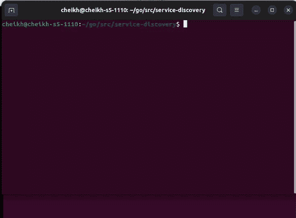

# 使用 Go 进行服务发现

> 原文：<https://betterprogramming.pub/service-discovery-with-go-17b44011bcb2>

## 用`avahi`工具集实现服务发现


图片由 [Thomas Jensen](https://unsplash.com/@thomasjsn) 通过 unsplash 提供

“微服务服务发现是应用程序和微服务在网络上相互定位的一种方式。”这可以通过具有地址和服务名称列表的中央服务器或者连接到中央服务器以检索和更新地址的客户端来实现。当我第一次看到服务发现时，乐观的我认为它是通过“mDNS/DNS-SD 协议套件”运行的`mDNS`是 AirPlay 使用的协议。这是一个 ZeroConfig 接口，用户只需将设备连接到同一个网络就可以与之交互。ZeroConfig，顾名思义，是一个即插即用的解决方案。如果这种技术可以用于微服务服务发现呢？这肯定会消除对中央服务器的需求。" Avahi 是一个通过 mDNS/DNS-SD 协议组在本地网络上促进服务发现的系统."在这篇文章中，我将尝试实现一个可以通过`mDNS`发现的 web 服务器。

# **服务器**

我将从在 Go 中实现一个基本的 web 服务器开始。下面是它的代码:

```
func main() { fmt.Println("listenning")
  log.Fatal(http.ListenAndServe(":8080", nil))
}
```

接下来，我将编写一个通过`mDNS`广播我的服务的函数。这将通过命令`avahi-publish`来执行。这个命令的好处是一旦它退出，服务将停止广播。我将使用 Go 的`exec`包调用该命令。下面是该函数的代码:

```
func BroadCastMe(port, service string) { cmd := exec.Command(
       "avahi-publish", 
       "-s", 
       service, 
       "_http._tcp", // publish as http service
       port,
  ) if err := cmd.Run(); err != nil {
   // close program if broadcast fails
   log.Fatal(err)
  }}
```

函数`BroadCastMe`将作为 Goroutine 调用。下面是 main 函数的最终版本:

```
func main() { fmt.Println("listening") // broadcast will stop
  // on program shutdown
  go BroadCastMe("8080", "service-one") log.Fatal(http.ListenAndServe(":8080", nil))
}
```

这个服务器将在另一个线程上广播自己，而实际的服务器运行在主线程上。现在来发现服务。

# 发现

发现服务将遵循与发布服务相同的方法。将运行 avahi 工具集中的一个命令来列出可用的服务。我将首先声明一个自定义类型来定义服务，它将被称为`Service`。下面是该结构的定义:

```
type Service struct {
 Name        string
 Address     string
 Port        string
 AddressType string
}
```

接下来，我将实现一个函数来运行命令`avahi-browse`，这将寻找`http`服务。该命令将提供标志`p`，以返回可解析的日期。标志`t`将确保程序在搜索完成后关闭。一旦命令返回了服务列表，我将使用一些 hacky 方法来提取填充上面定义的结构类型所需的数据。返回一个`Service`数组。以下是该函数的代码:

```
func GetServices() ([]Service, error) { cmd := exec.Command(
     "avahi-browse", 
     "-t",  // type of protocol to look for
     "_http._tcp", // http protocol
     "-v",
     "-r", 
     "-p", // prints parseable format
 ) stdout, err := cmd.Output()
 if err != nil {
  return nil, err
 } strOutput := string(stdout)
 rows := strings.Split(strOutput, "=") result := []Service{} for i,v := range rows { if i == 0 {
    continue
  } row := strings.Split(v, ";")
  service := Service{
    AddressType : row[2],
    Name : row[3],
    Address : row[7],
    Port : row[8],
  }

  result = append(result, service) } return  result, nil}
```

下面是上面定义的发现代码的基本实现:

```
func main() { services, err := GetServices() if err != nil {
   log.Fatal(err)
 } fmt.Println(services)}
```

以下是这一理论的应用:



# 结论

`mDNS`旨在让消费者“将你的笔记本电脑或计算机接入网络，就能立即看到你可以与之聊天的其他人，找到要打印的打印机或找到正在共享的文件。”在我看来，这项技术应该是云原生栈的一部分。我错误地假设微服务服务发现以这种方式运行，但也许它应该以这种方式运行。我看不出服务发现目前是如何实现的(中央服务器)有什么缺陷。但是我的方法意味着少管理一个微服务，因为这些服务可以在网络上发布它们自己。我只在我的电脑上测试过这个，所以这个理论在其他环境中的行为是未知的。同样重要的是要考虑到这与 avahi 工具链一起工作。部署时，由于 avahi 工具链与应用程序的映像一起出现，可能会导致更大的有效负载。但也许我错了，它没有显著增加。

在我当众听起来像个白痴之前，“avahi”是怎么发音的？是“阿瓦喜”还是“阿瓦喜”？

# 其他来源

什么是服务发现？定义和相关常见问题| Avi 网络

[GitHub 库](https://github.com/cheikhshift/medium_examples/tree/main/service-discovery)

[avahi-browse(1) — Linux 手册页](https://linux.die.net/man/1/avahi-browse)

[阿瓦希— mDNS/DNS-SD](https://avahi.org/)