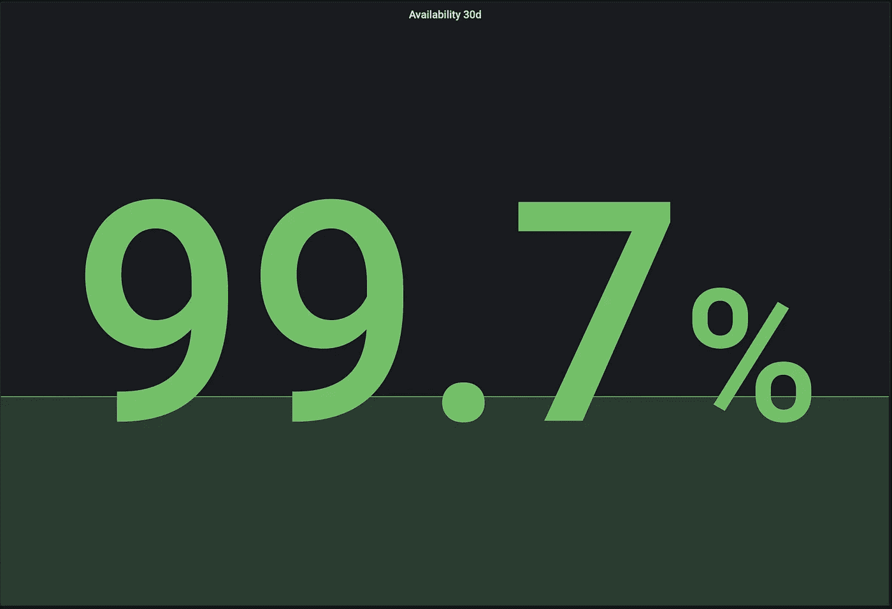
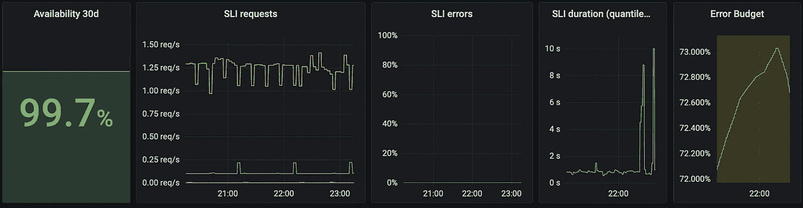

# ingress-nginx 的服务水平指标(SLI)符合您的 SLO

> 原文：<https://betterprogramming.pub/service-level-indicator-sli-metrics-from-ingress-nginx-to-meet-your-slo-45b82ab60438>

## grafana |普罗米修斯| ingress | nginx | SLI | SLO | metrics

## 从入口 nginx 的通用指标开始建立 sli



“可用性 30d”单个统计面板的屏幕截图，显示 99.7% |作者图片

我最近读了一篇文章，引发了我再次调查 SLI/SLO 的兴趣。这是一个漫长的旅程，但它极大地帮助了这些人在更大的组织中就其服务环境的可用性达成一致，并尽早发现问题。在阅读时，我想:“如果这带来了这么多好处，为什么不从 ingress-nginx 创建通用的 SLI 指标？”仔细想想，这应该适用于任何暴露适当指标的入口。

这与提到的文章不在同一水平上，也不会缩短你在整个公司建立 SLIs 和 SLO 的旅程，但这应该是一个很好的开始。老实说，仅仅是设置这个就暴露了我的服务的一些问题，所以我可以肯定地说这是值得的(尽管那些都是有趣的项目)。

# 佐料

*   一些记录规则返回简化的基本指标
*   更大时间范围的一些记录规则(30d)
*   分位数和可用性的一些记录规则
*   将所有这些放在一个简单的仪表板中(不包括在内)

## 可用性定义

> 当应用程序响应无误且足够快时，它就是可用的。

如果你想知道如何从`ingress-nginx`中获取指标，请查看社区中的 [kube-prometheus-stack](https://artifacthub.io/packages/helm/prometheus-community/kube-prometheus-stack) 头盔图，并为你的 ingress-nginx 创建一个`ServiceMonitor`。

# 示例规则

所有例子都基于`ingress_nginx`度量，规则为普罗米修斯规则:[*https://Prometheus . io/docs/Prometheus/latest/configuration/recording _ rules/*](https://prometheus.io/docs/prometheus/latest/configuration/recording_rules/)

简单的请求率规则(不需要):

```
# records the request rate over 5 minutes (removes spikes)
- expr: sum by (exported_namespace, exported_service, host, status) (rate(nginx_ingress_controller_requests[5m]))
  record: namespace_service_status:ingress_request_total:rate5m
```

# 基本指标的记录规则

## 请求总数增加

```
# records the number of requests per hour (increase1h)
- expr: sum by (exported_namespace, exported_service, host, status) (increase(nginx_ingress_controller_requests[1h]))
  record: namespace_service_status:ingress_request_total:increase1h
# records the average requests per hour over 30 days, multiplied by 30 days (increase30d)
- expr: avg_over_time(namespace_service:ingress_request_total:increase1h[30d]) * 24 * 30
  record: namespace_service:ingress_request_total:increase30d
```

## 请求秒计数

这些是记录的持续时间，这意味着它们本质上与请求计数相同，只是另外放在响应时间的桶中(见下文)。

```
- expr: sum by (exported_namespace, exported_service, host) (increase(nginx_ingress_controller_request_duration_seconds_count[1h]))
  record: namespace_service:ingress_request_duration_seconds_count:increase1h
- expr: avg_over_time(namespace_service:ingress_request_duration_seconds_count:increase1h[30d]) * 24 * 30
  record: namespace_service:ingress_request_duration_seconds_count:increase30d
```

## 请求秒时段

在特定时间内有多少请求得到了回应？默认直方图桶(标签`le` ): `0.005s, 0.01s, 0.025s, 0.05s, 0.1s, 0.25s, 0.5s, 1s, 2.5s, 5s, 10s, ∞`。

```
- expr: sum by (exported_namespace, exported_service, host, le) (increase(nginx_ingress_controller_request_duration_seconds_bucket[1h]))
  record: namespace_service_le:ingress_request_duration_seconds_bucket:increase1h
- expr: avg_over_time(namespace_service_le:ingress_request_duration_seconds_bucket:increase1h[30d]) * 24 * 30
  record: namespace_service_le:ingress_request_duration_seconds_bucket:increase30d
```

提示:您可以使用`label_replace`来重命名标签。比如把`exported_namespace`改名为`namespace`。不幸的是，如果您想对一个指标中的多个标签这样做，您必须嵌套它，所以这很快就会变得很难看。

```
label_replace(
  <your_query>, "namespace", "$1", "exported_namespace", "(.+)"
)
```

# 第 99 分位数

您可以重复这个规则来记录多个分位数指标，或者您也可以通过`status`求和…

```
- expr: |-
    histogram_quantile(0.99, 
      sum by (exported_namespace, exported_service, host, le) (rate(nginx_ingress_controller_request_duration_seconds_bucket{}[5m]))
    )
  labels:
    quantile: "0.99"
  record: namespace_service:ingress_request_duration_seconds:histogram_quantile
```

# 将它们整合到可用性规则中

## 缓慢的请求

```
# all requests
sum by (exported_namespace, exported_service, host) (namespace_service:ingress_request_duration_seconds_count:increase30d)
-
# all fast requests (<=1s)
sum by (exported_namespace, exported_service, host) (namespace_service_le:ingress_request_duration_seconds_bucket:increase30d{le="1"})
```

## 错误请求

因为应用程序可能永远不会有 5xx 错误，所以我们用与上面相同的方法来计算，以避免漏洞:所有—不是 5xx)

```
# all requests
sum by (exported_namespace, exported_service, host) (namespace_service:ingress_request_total:increase30d)
-
# all successful requests (not 5xx)
sum by (exported_namespace, exported_service, host) (namespace_service:ingress_request_total:increase30d{status!~"5.."})
```

## 有效性

> 1 —(慢速请求量+错误请求量)/总请求量

```
- expr: |-
    1 - (
      # slow
      (
        # all requests
        sum by (exported_namespace, exported_service, host) (namespace_service:ingress_request_duration_seconds_count:increase30d)
        -
        # all fast requests (<1s)
        sum by (exported_namespace, exported_service, host) (namespace_service_le:ingress_request_duration_seconds_bucket:increase30d{le="1"})
      ) 
      +
      # error
      (
        # all requests
        sum by (exported_namespace, exported_service, host) (namespace_service:ingress_request_total:increase30d)
        -
        # all successful requests (not 5xx)
        sum by (exported_namespace, exported_service, host) (namespace_service:ingress_request_total:increase30d{status!~"5.."})
      )
    ) 
    # total
   / sum by (exported_namespace, exported_service, host) (namespace_service:ingress_request_total:increase30d)
  record: namespace_service:ingress_availability30d
```

## 误差预算

我们认为 99%的可用性是最低要求。以上都是我们的预算。

> 100 *(可用性 30d — 0.99)

如果你有 1%的慢请求或错误，你的预算将是 0%。因为这是一个比率问题，成功的请求确实会影响可用性。您可以通过生成成功的(或错误的)请求来“操纵”您的可用性和预算。

# 你得到了什么

如果您在 k8s 集群中设置了这一点，那么您将获得所有支持入口的服务的这些指标。只需创建一个包含名称空间和服务(以及可选的主机)变量的仪表板，您就可以快速切换您的服务，查看哪些服务不符合您对可用性的预期。



SLI 度量:30d 可用性、每个状态的请求(比率)、错误(百分比)、持续时间(第 99 个分位数)、错误预算(百分比)。出于隐私考虑，图例已禁用。

## 警告

本质上，由于可用性是根据成功和快速的请求来计算的，因此任何响应请求的时间通常超过 1 秒或具有大量 5xx 状态代码的应用程序在这个通用仪表板上都不会好看。然而，正如您可能已经注意到的，您可以调整记录规则，例如，将`<=2.5s`视为快速(`le=”2.5"`)或者改变什么请求被认为是错误的定义。

无论如何，对我来说，这是一个伟大的起点，旅程肯定会继续。希望对你也有帮助。

# 感谢您的阅读！

```
**Want to Connect?** 
If you want to support me, contribute to my open source projects: 
[https://drpsychick.org/drpsychick-on-the-web-a9ccfb0df17e.](https://drpsychick.org/drpsychick-on-the-web-a9ccfb0df17e.)
```

灵感来自:

[](https://engineering.klarna.com/how-we-aligned-200-teams-to-monitor-services-with-slos-1-2-1552fab0faab) [## 我们如何让 200 个团队使用 SLO 来监控服务(1/2)

### 第 1 部分:塑造创新

engineering.klarna.com](https://engineering.klarna.com/how-we-aligned-200-teams-to-monitor-services-with-slos-1-2-1552fab0faab)