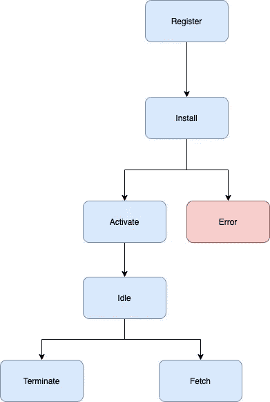
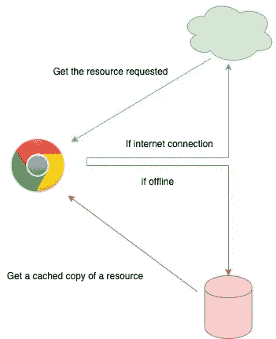
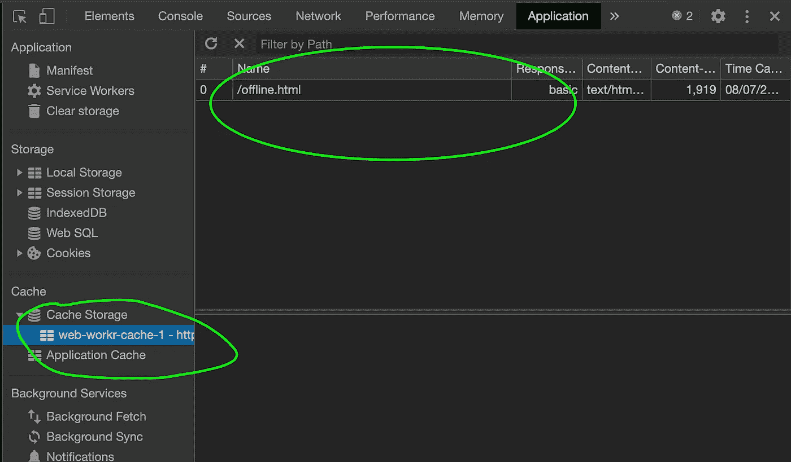
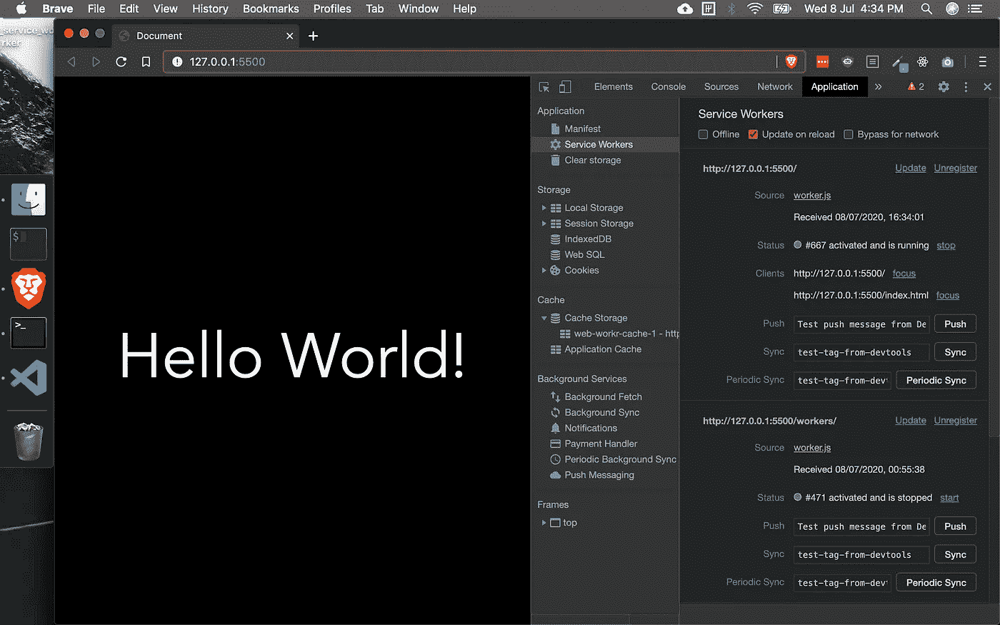
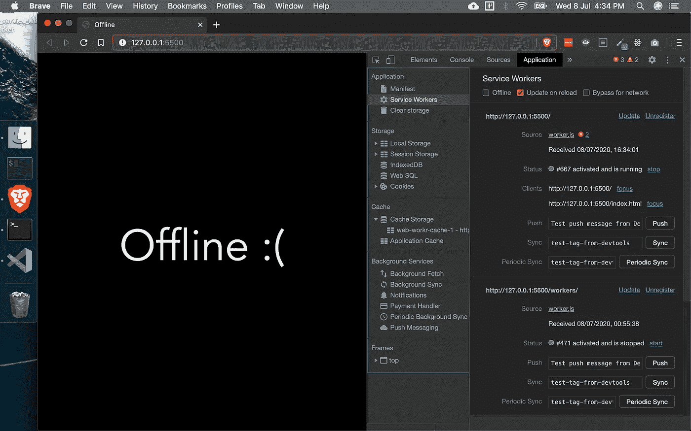

# 使用普通 JavaScript 的服务人员

> 原文：<https://betterprogramming.pub/service-workers-with-vanilla-javascript-49b63224a4fb>

## 为您的前端 web 应用增添动力


图片由[米盖尔·Á](https://www.pexels.com/@padrinan)在[像素](https://www.pexels.com/)上拍摄

# 服务人员:什么和为什么

一个*服务工作器*是一个脚本，它将自己关联到浏览器窗口。web 浏览器运行这个服务工作器，它在后台包含 JavaScript 源代码。

这些服务人员通过向典型的 web 应用程序添加后台同步、离线渲染和推送通知等功能，缩小了本地应用程序和 web 应用程序之间的差距。它的主要任务之一是充当代理。这就是我们在这篇文章中要解决的问题。

# 小心阻挡者

尽管他们才华横溢，但还是有一些你应该知道的潜在障碍。

服务工作者在不同的线程中执行，不能直接访问 DOM。如果您希望使用服务人员，您应该启用 HTTPS。由于服务人员在设计上可以操纵请求，因此在基于 HTTP 的 web 应用程序中使用它们将被证明是对安全性的威胁。但是，您可以在`localhost`上使用维修人员，没有任何问题。

另一个障碍可能是您选择的 web 浏览器。虽然服务人员在大多数浏览器上工作，但在深入研究之前检查兼容性是个好主意。浏览者的详细列表以及他们对服务人员的看法可以在这里找到。

# 服务人员的生命周期

使用服务人员的第一步是注册。一旦服务工作者被注册，它就触发工作者脚本的安装。

第二步是安装工人。在本文的当前设置和范围内，如果能够缓存静态内容，服务工作器的安装将会成功。如果用户没有连接到互联网，这些静态内容就会呈现给用户。如果内容无法存储，服务人员将在后续请求中重试。

因此，在至少一个成功的请求中，服务工作者必须充当网络代理。安装成功后，将进入激活状态。

激活状态表示服务工作者的运行状态，并导致服务工作者休眠的空闲状态。如果它保持休眠一段时间，它就会终止。当发出类似于`sync`或`fetch`的消息事件时，另一个分支被激活。



服务人员的生命周期

有了这些背景信息，让我们试着实现一个基本的 worker，如果用户离线，它会用一个定制页面来响应。我们打算不使用任何闪亮的前端框架来实现这一点。

然而，服务人员并不依赖于框架，从本文中获得的大部分知识应该很容易转移到您选择的前端 JavaScript 框架。

# 使用服务人员离线加载内容

这个想法是使用一个服务工作者作为 web 代理，如果 internet 连接可用，它将返回所请求的资源。万一请求失败，它应该返回一个静态缓存资源。



我们从注册服务人员开始。服务工作者本身是一个 JavaScript 文件，必须由应用程序 JavaScript 文件注册。我们从一个结构开始，其中`app.js`是包含在 HTML 页面中的 JavaScript 文件，而`worker.js`是包含服务人员相关代码的文件。

在`app.js`文件中，我们在加载时添加了一个注册服务工作者的事件监听器。

接下来，我们要安装服务人员。我们在`worker.js`文件中这样做。我们添加一个事件`install`。

`install`是我们缓存所需文件的生命周期状态。我们缓存`offline.html`并将其写入名为`web-workr-cache-1`的缓存中，其中`1`是缓存的版本。

如果我们打开浏览器的开发人员控制台并导航到 application 选项卡，我们应该会看到名为`web-workr-cache-1`的缓存以及缓存的详细信息`offline.html`。



按照生命周期的要求，下一步需要我们激活服务人员。这也进入到`worker.js`文件中。这是我们试图消除以前的缓存的部分。我打算跳过这个方法。然而，它看起来像这样:

```
self.addEventListener('activate', *e* => {console.log('Activation!');});
```

我们要处理的最后一个事件是`fetch`事件。在`fetch`事件中，如果互联网连接失效，我们拦截请求并返回离线页面。

当从浏览器发出 web 请求时，上面的代码就会出现。线`event.request.mode === 'navigate'`表示用户导航的意图。更多关于`event.request.mode`的信息可以在这里找到[。](https://developer.mozilla.org/en-US/docs/Web/API/Request/mode)

如果导航请求失败，我们捕获错误，因为我们不想对错误对象本身做任何事情，所以我们使用一个占位符，`_`。从`catch`街区我们返回`caches.match(pageToSave)`。

回忆`pageToSave`是在我们服务人员的安装阶段保存的一个 HTML 文件。`pageToSave`对应`offline.html`。

这个代码片段的效果可以理解如下:当用户请求 web 上的资源并且该请求可以被成功地服务时，用户能够访问该资源。请求资源就像导航到不同的网页一样简单。

但是，如果用户请求某个资源，而该请求由于互联网连接或服务器不可用或任何其他原因而失败，则会显示之前缓存的离线页面。

为了演示这一点，我们使用了 Live Server，它可以在这里[获得](https://www.npmjs.com/package/live-server)。

当服务器在线时:



下面我们可以看到一个离线服务器。我没有勾选离线复选框，而是关闭了实时服务器。



请注意，对于这两种情况，URL 保持不变。在第一种情况下，获取远程资源，在第二种情况下，呈现缓存的页面。

完整的源代码可以在我的 [GitHub 这里](https://github.com/sumitmukhija/service-worker-demo)找到。

# *参考文献*

*   [《服务人员:介绍》](https://developers.google.com/web/fundamentals/primers/service-workers)
*   [“Service _ Worker _ API](https://developer.mozilla.org/en-US/docs/Web/API/Service_Worker_API)
*   [“服务人员简介&缓存”](https://www.youtube.com/watch?v=ksXwaWHCW6k&t=1341s)
*   [“服务人员简介”](https://www.youtube.com/watch?v=jVfXiv03y5c)