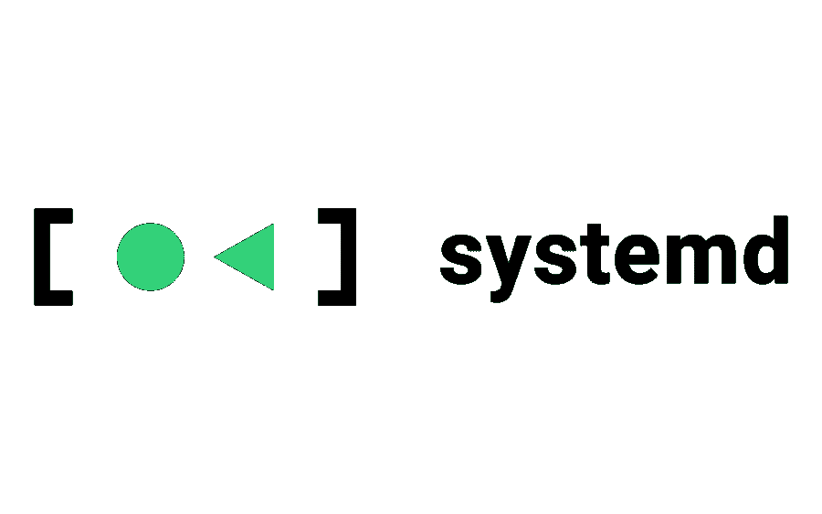
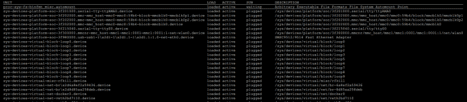
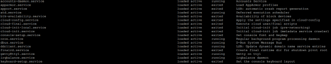
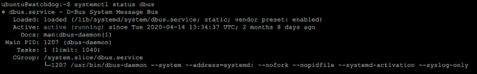
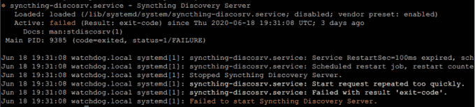

# systemd 中的服务:深入教程

> 原文：<https://betterprogramming.pub/services-in-systemd-in-depth-tutorial-7e47c485edbf>

驾驭你从未知晓的力量



图片来源:[freedesktop.org](https://www.freedesktop.org/wiki/Software/systemd/)

systemd 是将 Linux 系统结合在一起的粘合剂。systemd 是构建块的集合，它处理服务、进程、日志记录、网络连接，甚至认证。在本文中，我将向您展示如何使用 systemd 中的服务。

# `systemd`到底是什么？

systemd 是一套计算机程序，旨在管理和连接系统的不同部分。它被设计为 SystemV 和 LSB 风格的启动脚本的替代品，这两种脚本自 20 世纪 80 年代以来一直很流行。systemd 由以下组件组成:

*   `systemd` —系统和服务经理
*   `systemctl` —与`systemd`交互的命令行工具
*   `journald` —统一的日志框架
*   `logind` —处理用户登录和席位的守护程序
*   `resolved`、`timesyncd`和`networkd` —负责网络连接、域名解析和与互联网资源同步时间

这是对 systemd 体系结构的一个非常高层次的概述，但它目前适合我们。

# 管理现有服务

服务本质上是一个在后台运行并由`systemd`管理/供应的流程。您希望作为服务运行的东西包括各种服务器(HTTP、SSH、FTP)、同步实用程序( [Syncthing](https://syncthing.net/) 、`rsync`)、虚拟化管理程序( [Docker](https://www.docker.com/) 、 [K8s](https://kubernetes.io/) )等等。让我们首先通过运行以下命令列出系统上所有可用的服务:

```
$ systemctl
```

您将看到一个如下所示的表格:



默认情况下，这个命令将列出设备、挂载点、名称空间和服务，这是我们感兴趣的。向下滚动以查看服务部分(您会注意到所有内容都有一个`.service`扩展名):



该表的结构如下:

*   服务的名称(匹配`.service`配置文件的名称)。
*   服务的当前状态。`loaded`表示`systemd`知道了，`active`表示`systemd`运行成功。
*   流程的当前状态。表示流程是`running`还是`exited`。注意，`active`服务可以是`exited`。例如，一个动作必须在启动时发生，然后进程返回。这项服务仍然被认为是`active`。
*   描述

如果您想查看特定服务的更多详细信息，请使用以下命令:

```
$ systemctl status SERVICE_NAME
```

例如，在我的系统上运行`systemctl status dbus`会产生如下结果:



这个命令将告诉您比前一个命令更多的信息:例如，正常运行时间、到`.service`文件的路径、进程名及其`PID`。虽然这很有帮助，但`status`通常用于对服务进行故障诊断。比如我有一个服务`syncthing-discosrv`有问题。在上面运行相同的命令会告诉我:



您可以注意到日志被方便地打印在最后。这精确地告诉我当`systemd`试图启动这个服务时发生了什么错误，现在我可以很容易地修复它。

最后，最有趣的命令…要启动/停止服务，请使用以下命令:

```
$ systemctl start/stop SERVICE_NAME
```

同样，您可以启用或禁用这些服务。启用意味着它将在启动时运行:

```
$ systemctl enable/disable SERVICE_NAME
```

现在，到了有趣的部分。

# 创建自己的服务

如果 systemd 不允许您创建自己的服务，它将不会非常有用。谢天谢地，这很容易做到。让我们从最基本的例子开始:在引导时运行一个`bash`脚本。假设您有一个位于`/usr/bin/runme.sh`的脚本，它执行某种清理。现在，要在引导时运行它，您需要创建一个`unit`文件。

在`/etc/systemd/system/runme.service`中创建:

```
[Unit] 
Description=Cleaning service [Service] 
Type=simple ExecStart=/bin/bash /usr/bin/runme.sh [Install] 
WantedBy=multi-user.target
```

这应该很简单。`Description`设置描述(如本文前面所见)。`Type`设置我们服务的类型，如果服务产生多个流程，也可以是`forking`。`ExecStart`是用于运行服务的实际命令。最后，`WantedBy`指定这个服务应该何时运行。`multi-user`表示系统定期启动，这是你大部分时间想要的。请注意，如果您以单用户模式(恢复)启动，此服务将不会运行(这可能是您想要的，也可能不是)。现在，要启用此服务:

```
$ systemctl enable runme 
$ systemctl status runme // .... ENABLED .....
```

如果您愿意，也可以立即运行一次:

```
$ systemctl start runme
```

现在，让我们考虑一个稍微复杂一点的例子。假设您有一个 Python 脚本(位于`/etc/scripts/server.py`)，它必须在启动时运行，但是在网络建立之后。此外，您希望它在崩溃时重启，但不要太频繁。如果这听起来像是您的情况，请在您的服务文件中使用如下内容:

```
[Unit] 
Description=My awesome service 
After=network.target [Service] 
type=Simple 
User=username 
Restart=on-failure 
RestartSec=1 
StartLimitBurst=5 
StartLimitIntervalSec=10 
StartLimitAction=reboot 
ExecStart=/bin/python /etc/scripts/server.py [Install] 
WantedBy=multi-user.target
```

这里有很多新的选择。`After`指令指定了该服务对`network`目标的依赖性，后者初始化网络连接。稍后，我们将运行脚本的`User`指定为`username`。现在，有五个选项来控制我们服务的弹性。

`Restart`指定何时重新启动服务。`RestartSec`不会让`systemd`每秒重启一次以上。`StartLimitBurst`和`StartLimitIntervalSec`说服务在 10 秒间隔内最多可以重启 5 次。最后，`StartLimitAction`要求重启系统，如果在所有这些重启之后服务仍然失败。显然，如果您的机器上有许多重要的服务，这是不可取的。设置完成后，您可以像其他服务一样启用和启动该服务。

# 结束语

感谢您的阅读，希望您喜欢这篇文章。请告诉我你对 systemd 的看法——我听说那里有很多争议。

# 资源

*   [systemd 手册](https://www.freedesktop.org/software/systemd/man/)
*   [archi wiki 上的系统 d](https://wiki.archlinux.org/index.php/systemd#Service_types)
*   [Linux 中的用户管理](https://levelup.gitconnected.com/user-management-in-linux-explained-825b8a518abc)