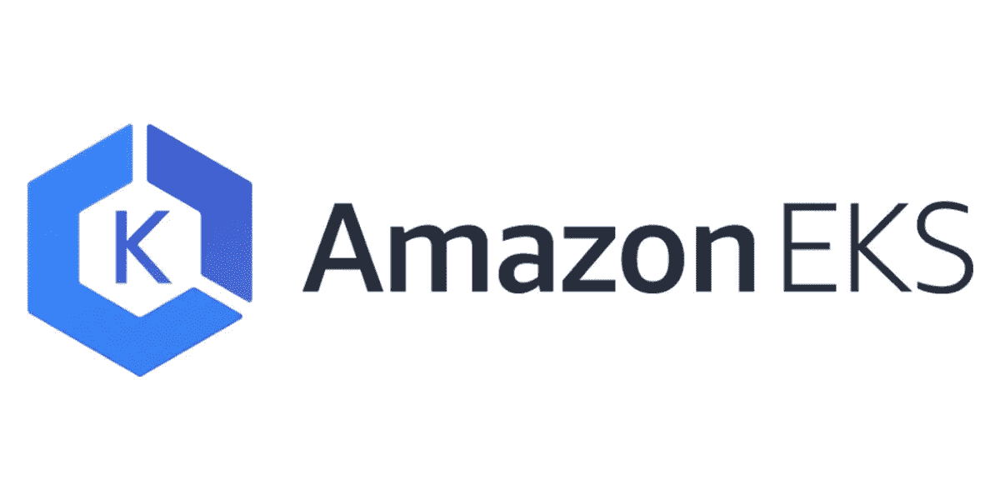
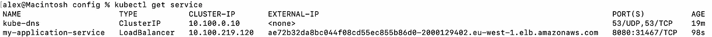

# 在 Amazon Elastic Kubernetes 服务和 CloudFront 上提供 Node.js API

> 原文：<https://betterprogramming.pub/serving-a-node-js-api-on-amazon-elastic-kubernetes-service-eks-cloudfront-114e590e8d9e>

## 在这个演示中，我们在亚马逊 EKS Kubernetes 集群中设置了一个 Node.js Express 服务器，并通过 CloudFront 为其提供服务



Kubernetes 是一个成熟的容器编排框架，支持容器化应用程序的开源部署、伸缩和管理。虽然对于最简单的应用程序来说，Kubernetes 可能过于健壮，但它确实提供了出色的正常运行时间和可靠性标准，例如，通过对应用程序进行平滑的滚动更新。

弹性 Kubernetes 服务(EKS)是一项由 AWS 管理的服务，它消除了管理 Kubernetes 部署中一些臭名昭著的复杂性。反过来，CloudFront 可以用来缓存来自部署的响应，从而控制计算成本。

在这个演示中，我们将在 Kubernetes 集群中设置一个简单的 Express 服务器，并通过 CloudFront 为其提供服务。在我们开始之前，我们的本地机器应该已经安装了以下工具:

*   [码头工人](https://docs.docker.com/get-docker/)
*   [aws](https://docs.aws.amazon.com/cli/latest/userguide/getting-started-install.html)
*   [库贝克特尔](https://docs.aws.amazon.com/eks/latest/userguide/install-kubectl.html)
*   [eksctl](https://docs.aws.amazon.com/eks/latest/userguide/eksctl.html)

我们还假设我们拥有对域名的控制权，应用程序可以从这个域名获得服务。演示应用程序和相关的配置文件可以在这里找到:[https://github.com/alexcolb/eks-nodejs-demo](https://github.com/alexcolb/eks-nodejs-demo)

## 准备 Docker 映像

Kubernetes 是一个容器编排框架，这意味着我们需要为我们的应用程序创建和托管一个 Docker 映像。我们将从[在 Docker Hub](https://hub.docker.com/repository/create) (例如`my-docker-username/my-app`)上创建一个公共存储库开始。

[在我们的项目根](https://github.com/alexcolb/eks-nodejs-demo/blob/main/Dockerfile)中定义了一个 `[Dockerfile](https://github.com/alexcolb/eks-nodejs-demo/blob/main/Dockerfile)` [之后，我们运行:](https://github.com/alexcolb/eks-nodejs-demo/blob/main/Dockerfile)

```
$ docker login
$ docker build -t ***my-docker-username*/*my-app*** .
$ docker push ***my-docker-username*/*my-app***
```

我们创建的 docker 映像现已在 Docker Hub 公开发布:https://hub.docker.com/repository/docker/***我的-Docker-用户名* / *我的-app***

## 创建 Kubernetes 的 ConfigMap YAML 配置

接下来，我们至少创建、熟悉并修改下面三个 YAML 文件中的**TODO**-注释值，这些值告诉 Kubernetes 我们希望我们的集群是什么样子。

**API . deployment . YAML(**[**GitHub**](https://github.com/alexcolb/eks-nodejs-demo/blob/main/config/api.deployment.yaml)**)**

**API . service . YAML(**[**GitHub**](https://github.com/alexcolb/eks-nodejs-demo/blob/main/config/api.service.yaml)**)**

**API . external-DNS . YAML(**[GitHub](https://github.com/alexcolb/eks-nodejs-demo/blob/main/config/api.external-dns.yaml)**)**

这是一个较长的、不太标准的 ConfigMap 类型，所以只需从提供的 git 存储库中复制它。但是，请确保编辑`**--domain-filter**`中的域，以匹配您的应用程序的域。这个文件的重要性将在以后变得更加清楚。

## 创建我们的 EKS 集群

在继续之前，[我们需要配置我们的 AWS 凭证](https://docs.aws.amazon.com/cli/latest/userguide/cli-configure-files.html)。然后，为了创建集群，我们等待以下命令完成:

```
$ eksctl create cluster --name **my-cluster** --region eu-west-1 --nodegroup-name linux-nodes --node-type t2.small --nodes 1
```

然后，我们可以更改我们的名称空间并应用我们的两个 YAML 配置，如下所示。其中，这将把我们的 Docker 映像部署到集群上。

```
$ kubectl config set-context --current --namespace=kube-system
$ kubectl apply -f api.deployment.yaml
$ kubectl apply -f api.service.yaml
$ kubectl get pods --watch
```

最后一个命令让我们观察到我们的两个 pod 正在被创建，并有希望最终处于*运行*状态。如果您需要调试出现故障的 pod，这些命令将被证明是有用的:

```
$ kubectl describe pod/**my-pod-name**
$ kubectl logs pod/**my-pod-name**
```

> 如果您观察到“exec 格式错误”,并且您的机器运行在 Apple Silicon 上，您可能需要在其他地方创建 Docker 映像。

为了检查我们迄今为止的进展，我们可以访问我们集群向世界开放的短暂的 URI。换句话说，在 DNS 信息传播一段时间后，我们可以在浏览器中观察我们部署的 API！为此，让我们使用这个命令来获取我们的*外部 IP* 和*端口:*

```
$ kubectl get service
```



## 配置对群集的 DNS 访问

我们现在面临的问题是，每当我们的服务更新时，这个 URI 都会改变，所以我们不能将其原样用于入站流量。相反，我们将利用 [*外部 dns*](https://github.com/kubernetes-sigs/external-dns) 使我们的服务能够被公共 dns 发现。

首先，我们在 [AWS Route 53](https://console.aws.amazon.com/route53/v2/hostedzones#CreateHostedZone) 中创建一个名为`external-dns.**my-domain.com**`的新托管区域，记下它的 ID。

然后，我们设置一个服务帐户，授权我们的集群将应用程序的短暂 URI 更新到 DNS。首先，我们在 AWS IAM 中创建以下 JSON 策略[，注意它的 ARN:](https://console.aws.amazon.com/iam/home#/policies$new?step=edit)

```
{
  "Version": "2012-10-17",
  "Statement": [
    {
      "Effect": "Allow",
      "Action": [
        "route53:ChangeResourceRecordSets"
      ],
      "Resource": [
        "arn:aws:route53:::hostedzone/**my-hosted-zone-id**"
      ]
    },
    {
      "Effect": "Allow",
      "Action": [
        "route53:ListHostedZones",
        "route53:ListResourceRecordSets"
      ],
      "Resource": [
        "*"
      ]
    }
  ]
}
```

> 我们小心地不让 Kubernetes 访问面向生产的托管区域。即使我们决定使用实际域的子域，[我们也应该将外部 dns 流量路由到独立的托管区域](https://docs.aws.amazon.com/Route53/latest/DeveloperGuide/dns-routing-traffic-for-subdomains.html)。

然后，我们可以创建服务帐户，并验证其与群集的连接:

```
*$* eksctl utils associate-iam-oidc-provider --region=eu-west-1 --cluster=**my-cluster** --approve$ eksctl create iamserviceaccount \
  --name external-dns \
  --namespace kube-system \
  --cluster **my-cluster** \
  --attach-policy-arn **my-iam-policy-arn** \
  --approve*$* kubectl describe sa external-dns
```

最后，我们部署了*外部 dns* Kubernetes pod，它将动态更新 Route 53 记录以指向我们的临时 URL:

```
$ kubectl apply -f api.external-dns.yaml
```

我们可以通过访问我们的新静态地址来验证这一点，例如`http://my-service.external-dns.**my-domain.com**:8080`

## 将云锋指向 EKS

我们现在想把我们的集群放在一个负载均衡器后面，这样 API 响应就不必在每次被请求时都重新计算。[在 AWS CloudFront 中，我们创建了一个新的发行版](https://console.aws.amazon.com/cloudfront/v3/home#/distributions/create)。*源域*应该是 Route 53 中存储的任意记录 *external-dns* ，例如`my-service.external-dns.my-domain.com`，HTTP 端口的值应该是 ConfigMaps 中配置的任意值，例如`8080`。我们还必须创建一个自定义的*缓存策略*，将*查询字符串*设置为`All`，这将告诉 CloudFront 在考虑端点缓存时包含 HTTP 查询字符串。

一旦部署完成，我们就可以通过 CloudFront 发行版中的*发行域名*下面列出的 URI 访问该应用程序！

## 成本估算和删除

当应用以下定价时，每月静态成本约为 145 美元(或每小时 0.20 美元):

*   每*小时使用亚马逊 EKS 集群 0.100 美元*
*   0.025 美元每*按需 Linux t2 .小实例* 小时
*   每个 *ELB 负载平衡器* 小时 0.028 美元
*   每个 *NAT 网关*小时 0.048 美元

我们可以通过运行以下命令随时删除我们的集群:

```
$ eksctl delete cluster --name **my-cluster** --region eu-west-1
```

致谢和进一步阅读:

*   [https://Pei ruwang . medium . com/eks-exposure-service-with-external-DNS-3be 8 facc 73 b 9](https://peiruwang.medium.com/eks-exposing-service-with-external-dns-3be8facc73b9)
*   https://learnk8s.io/deploying-nodejs-kubernetes-eks
*   https://www.youtube.com/watch?v=p6xDCz00TxU&t = 171s