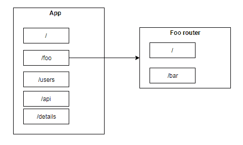
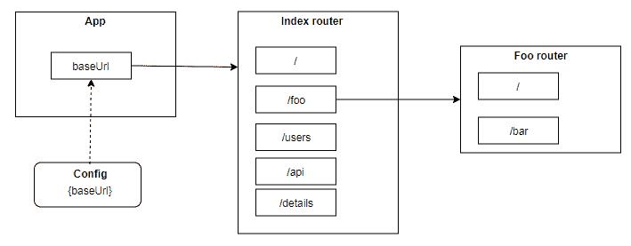

# 从子文件夹为 Node.js Express 应用程序提供服务——路由生活黑客

> 原文：<https://betterprogramming.pub/serving-a-node-js-express-app-from-a-subfolder-a-routing-lifehack-a3c88da9840c>

## 在快速应用程序中组织路线的简单方法

来自 [Pexels](https://www.pexels.com/photo/beige-and-red-train-1181202/?utm_content=attributionCopyText&utm_medium=referral&utm_source=pexels) 的[Paul ijsendorn](https://www.pexels.com/@paul-ijsendoorn-148531?utm_content=attributionCopyText&utm_medium=referral&utm_source=pexels)摄影

Express 可能是 Node.js 最流行的 web 框架，已经有大量关于它的教程和说明。然而，它们中的大多数并没有涵盖我将要告诉你的主题。

各种文档中常见的标准路由方法如下所示:

或者像这样:

因此，您的路由结构可能看起来有点像下图。

这在您的本地开发环境中非常适用。然而，在现实世界中可能会有一个小问题。托管平台上应用程序的实际目录可能不是域根。

例如，假设您部署了一个包含到`yourdomain.com/hello`的路由的应用程序。现在，如果你在浏览器中打开`yourdomain.com/hello`，你可能希望它显示“Hello World”。但是，你得到一个 404 错误。

为了收到预期的问候，您应该将路线写成这样:

路由器的子路径也是如此。接受来自`yourdomain.com/hello/foo`的“来自 foo 的问候”的正确方式是:

虽然在小应用程序中重写路径并不难，但在有大量路线(尤其是结构不良的路线)的大型应用程序中尝试这样做可能会成为一场噩梦。另外，以后想换个目录怎么办？在这种情况下，重新开始重写一切是一个坏主意。

更好的选择是只制作一个*条目*点用于路由，并使这个*条目*路径可配置。

首先，创建一个 config.js 来存储项目级变量:

然后，您应该重组路由结构，以便*条目*或*索引*路由器包括所有其他路由。它自己的路径将从`config.js`开始:

基本上，我们所做的是将之前的结构转换成这样:

就是这样。现在，如果您将应用程序部署到一个子文件夹中—例如，`yourdomain.com/hello` —将 config.js 更改为:

然后，所有路由都会自动更新。如果应用程序直接部署到`yourdomain.com`根，就让`baseUrl: '/'`保持原样。

希望这篇 lifehack 能帮助你更好的在 Express app 中整理路线。