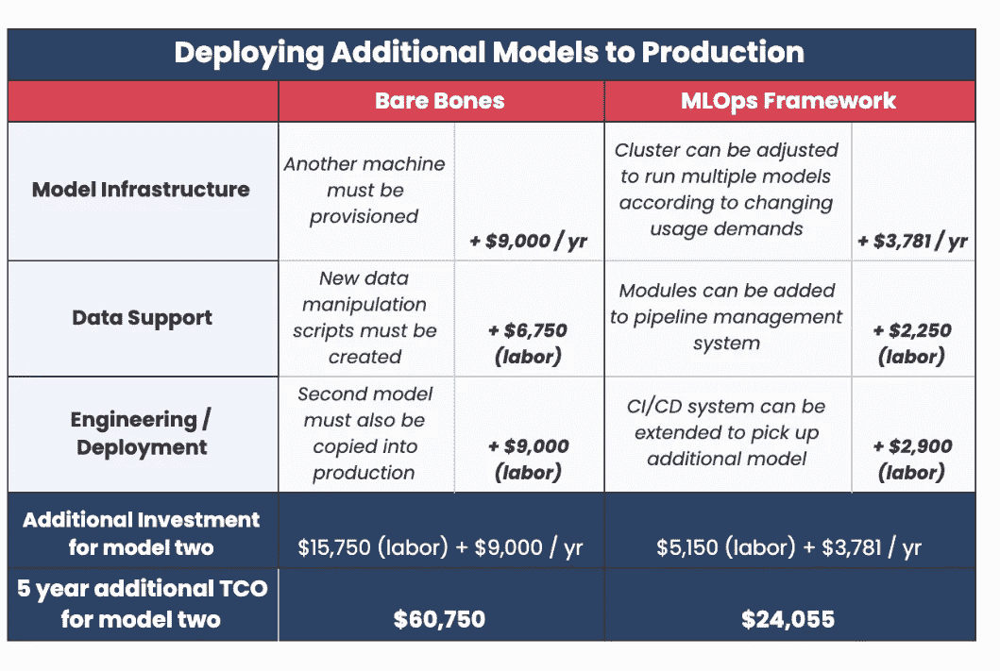
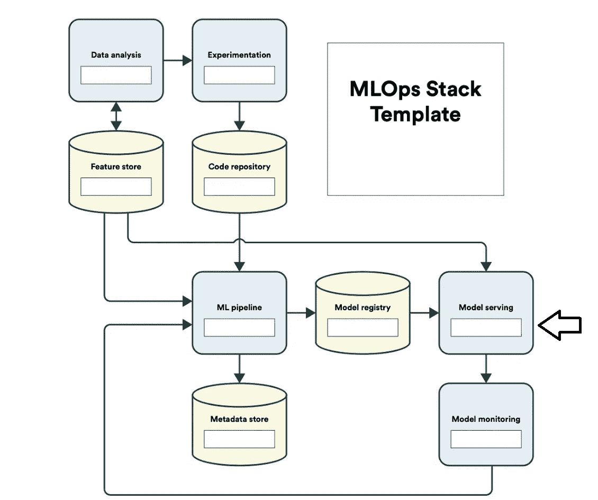
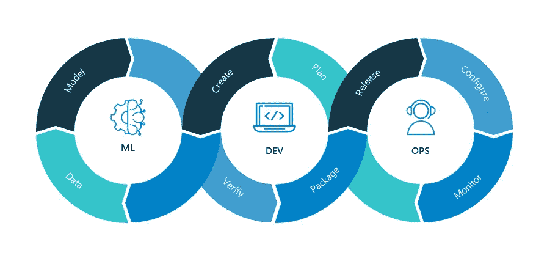
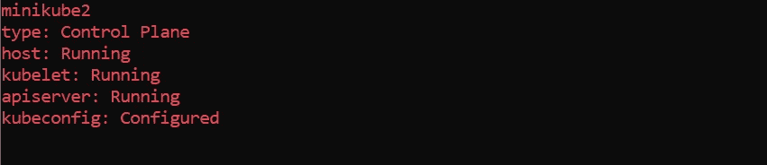
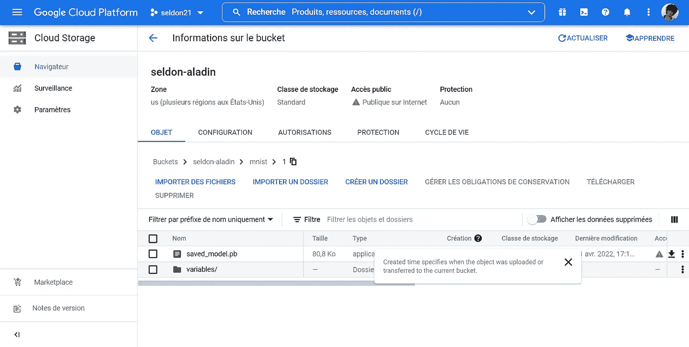
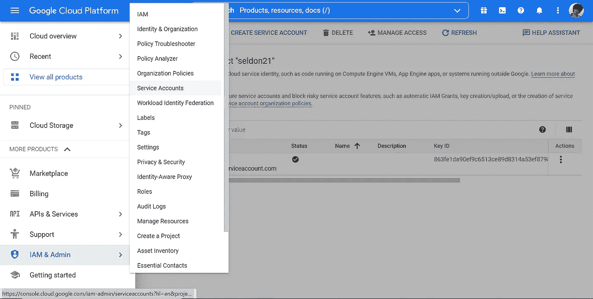
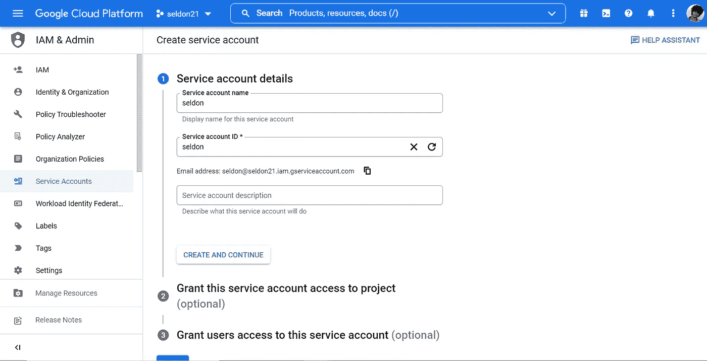
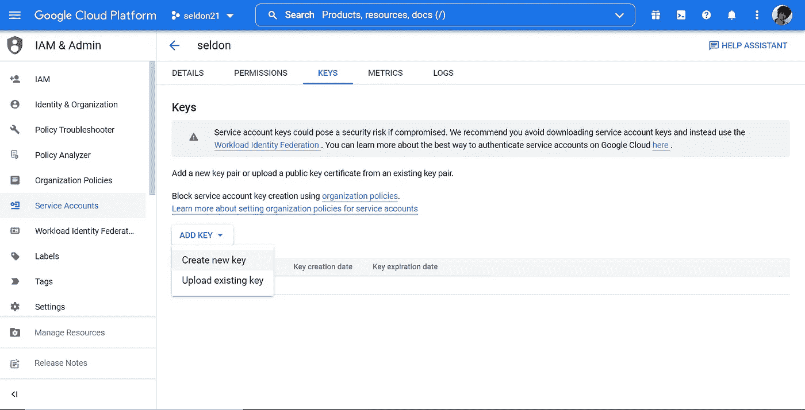
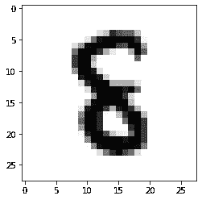
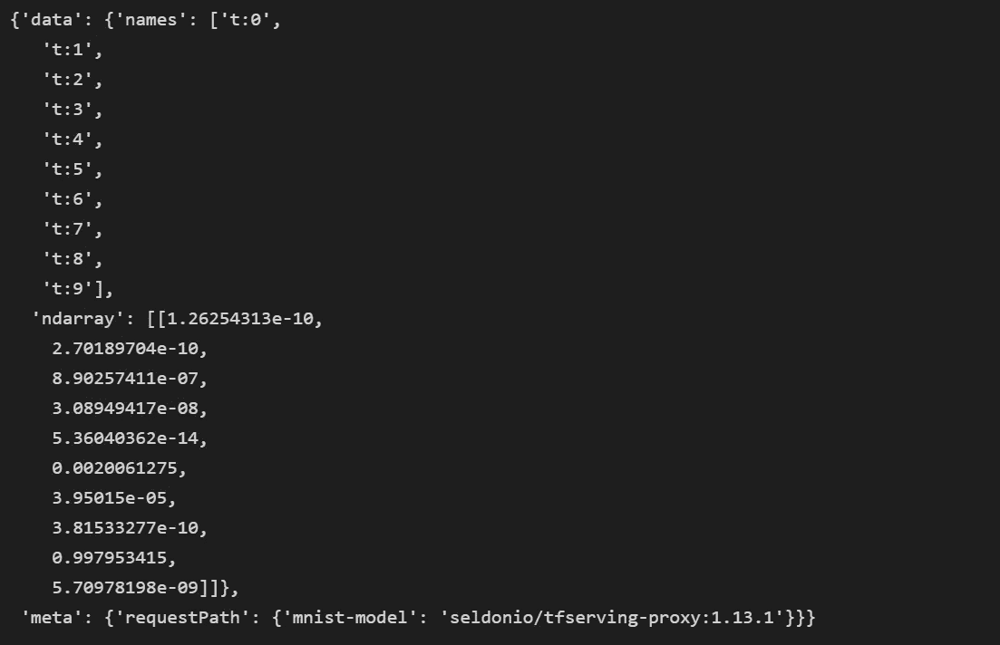

# 在 Kubernetes 2022 上使用 Seldon Core 服务和部署 ML 模型

> 原文：<https://betterprogramming.pub/serving-deploying-ml-models-with-seldon-core-on-kubernetes-2022-eb459bb4d47a>

## 在 Kubernetes 下部署 Ml 模型作为微服务


在数据科学领域，我们曾经听说预处理需要 80%的时间，并且它是机器学习管道中成功的 ML 模型的最重要的任务，但是当我们需要将“成功的”ML 模型部署到生产中时，80%到 90%的 ML 训练模型从未投入生产，这是由于许多因素(数据的一致变化，模型退化)或者甚至有时它在 intern 上表现良好，但是一旦我们部署该模型，我们就会失去准确性(例如，我们有图像分类；我们的模型是在猫和狗上训练的，但是我们给他一张大象的图片)。此外，模型部署是一项艰巨的任务，需要花费大量的资源和时间。



**来源:** [phdata.io 博客](https://www.phdata.io/blog/what-is-the-cost-to-deploy-and-maintain-a-machine-learning-model/)

我们认识到 MLOps 方法在当今机器学习项目中的重要性，特别是 CI/CD/CT(持续集成、开发和培训)使这项任务变得更加容易和流畅。
例如，我们正在尝试对一幅猫或狗的图像进行分类，我们已经训练了五个模型，但是随着数据的不断变化，我们可能会有一个新的模式显示出来，我们的模型在尝试对它进行分类时遇到了困难，所以我们必须花很短的时间根据新的输入训练新的模型，然后在没有问题或人们在生产中识别它的情况下部署它。



Mlops 堆栈

我们还可以通过三个阶段(数据处理、数据建模和操作化)来定义 MLOps 管道。



MlOps 管道

我们将致力于模型服务和部署部分，为了处理这个重要的任务，我们将使用 Seldon Core，它是一个成熟的开源工具，包含重要的文档。在本教程中，我们将部署一个在 MNIST 数据集上训练的基本 CNN 模型。

## 什么是模特服务？

一旦我们开发出一个机器学习模型，我们就需要将它部署到生产中，允许最终用户从移动应用程序或浏览器的 API 访问它，以便应用程序可以将人工智能融入他们的系统。模型服务是至关重要的，因为一个企业不能在不使其产品可访问的情况下向大量用户提供人工智能产品。在生产中部署机器学习模型还涉及资源管理和模型监控，包括操作统计和模型漂移。

## 塞尔顿核心

> Seldon 处理成千上万个生产机器学习模型的扩展，并提供开箱即用的高级机器学习功能，包括高级度量、请求日志、解释器、离群点检测器、A/B 测试、Canaries 等。

**需求** —在本教程中，我们需要一个谷歌云账户，这样我们就可以用 Docker 将我们训练过的 MNIST 分类器保存在一个谷歌桶和一个可用的 Kubernetes 环境(Minikube 或 Kind)中。

## 迷你库贝

> Minikube 对于 K8s 初学者来说是一个很好的工具，它是一个本地的 Kubernetes 环境，有简单易学的基本命令。
> 我们将使用 Docker 容器来启动我们的 Kubernetes 集群。

**安装 Minikube** —我们可以从他们的官方文档网站[这里](https://minikube.sigs.k8s.io/docs/start/)安装，我们可以通过命令`kubectl version`验证是否安装好

## 码头工人

> *Docker 是一个开发、发布和运行应用程序的开放平台。Docker 使您能够将应用程序从基础设施中分离出来，这样您就可以快速交付软件*

**安装 docker** —如果没有安装 **Docker** ，[点击这里](https://docs.docker.com/desktop/windows/install/)安装。

一旦我们设置好环境，我们就可以安装 Seldon Core，但它需要验证一些先决条件:

*   Kubernetes 集群版本等于或高于 1.18
*   在我们的例子中，安装方法是 Helm 3.0 或更高版本
*   从外部访问我们不同集群服务的入口(Istio 1.5 或 Ambassador v1)

## 舵

> Helm 是一个 Kubernetes 部署工具，用于为 Kubernetes 集群自动创建、打包、配置和部署应用程序和服务。我们可以根据您的操作系统从 [**这里**](https://helm.sh/docs/intro/install/) 安装它，我们需要将它添加到我们的环境变量中，这样我们就可以启动我们的**舵**命令。

## 伊斯迪奥

> Istio 扩展了 Kubernetes，使用强大的特使服务代理建立了一个可编程的、应用感知的网络。Istio 可处理 Kubernetes 和传统工作负载，为复杂的部署带来标准、通用的流量管理、遥测和安全性。我们可以从这里的 [**安装**](https://istio.io/latest/docs/setup/getting-started/) **。**

现在一切都是古驰，我们可以开始安装谢顿核心，但首先，我们将在我们的 K8s 集群中为它创建一个`namespace`。

要启动我们的 K8s 集群，我们可以从以下内容开始:

```
minikube start
```

我们可以通过`minikube status`验证一切是否正常



Minikube 状态

然后我们可以用`kubectl create namespace seldon-system`创建我们的名称空间，你可以给它起任何你想要的名字，但是最好是用这个名字。

现在我们将安装我们的工具:

```
helm install seldon-core seldon-core-operator \
 — repo [https://storage.googleapis.com/seldon-charts](https://storage.googleapis.com/seldon-charts) \
 — set usageMetrics.enabled=true \
 — set istio.enabled=true \
 — namespace seldon-system
```

如果你使用的是 Windows 命令行，你可以用`^`来改变`\`

我们可以通过检查管理`seldon-core`的 pod 的健康状况来验证它:

```
kubectl get pods -n seldon-system
```

## **训练 MNIST 分类器**

我们将创建自己的 CNN 基本模型来对我们从 0 到 9 的不同数字进行分类。让我们创建一个新的 python 文件，我们将其命名为`mnist_predict.py` *。*

我们的模型将保存在我们的文件夹`saved_model`中，然后我们将通过 google bucket 将它存储在我们的 Google 存储中。要创建你的 Google bucket，你可以勾选[这个](https://cloud.google.com/storage/docs/creating-buckets?hl=en)。

由于分类器是用 Tensorflow 软件包训练的，我们必须创建一个名为 ***1、*** 的新目录，并将我们训练好的模型保存在那里。我们要像这样的东西。



Google bucket 概述

## 服务帐户

> 服务帐户是一种特殊类型的非人类特权帐户，用于执行应用程序和运行自动化服务、虚拟机实例和其他进程。服务帐户可以是特权本地帐户或域帐户，在某些情况下，它们可能具有域管理特权。

我们将创建一个 GCP 和一个 JSON 键，所以我们可以从不同的 API 访问我们的存储模型。



指定服务帐户的唯一名称后，我们只需点击 Done 按钮，然后生成 JSON 文件，该文件将允许我们访问存储的 MNIST 分类器。



我们创建一个新的关于 JSON 扩展的键。此外，我们只需下载我们的 JSON 文件，用一个简单的名字如`seldon-credentials`重命名它，并把它放在同一个目录中。

让我们创造我们的秘密:

```
kubectl create secret generic user-gcp-name --from-file=gcloud-application-credentials.json=<LOCALFILE>
```

在我们的例子中，我们的`LOCALFILE`将是`seldon-credentials`，用户名可以是任何东西。

我们的服务帐户可以通过 YAML 文件创建:

`kubectl apply -f serviceaccount.yaml`

现在，我们负责部署 Ml 模型的很少部署对象替换了`gs://<your_bucket_name>/mnist`

`kubectl apply -f seldondeployment.yaml`

最后但同样重要的是，我们将创建入口文件，该文件将允许我们通过不同的外部服务访问我们部署的模型。

我们将不得不用`kubectl get svc`检查我们的新服务，并把它放入我们的配置 YAML 文件中的服务名参数。
对于您的`host`参数，您可以只放入`localhost`或者在您的`/etc/hosts`文件中定义一个自定义的。

我们通过相同的命令创建入口:

```
kubectl apply -f ingress.yaml
```

现在，既然一切正常，我们可以得到我们的辅导成果，这就是预测。

让我们最后看一下我们的数据集:

## **通过 Rest webservice 进行预测**

我们创建了两个函数，一个用于查看我们选择的要预测的 MNSIT 数字，最后一个用于其余部分的预测。



要预测的输出列表

我们必须将我们的 pod 进行端口转发，以便我们可以访问群集外部的 mnist 分类器，这可以通过以下方式完成:

```
kubectl port-forward pods/pod-name desired-port-number:9000
```

因为这是一个 Rest 预测，所以可以使用 9000 端口来完成，并且您可以使用`kubectl get pods`
来获得 pod 名称。我们选择端口号 9500 作为所需的端口号，我们的预测可以这样完成:

```
result = rest_predict_request("mnist.plz:9500", data) 
result
```



模型预测法

值字段总共有十个值(用逗号分隔)。第一个值表示图像为“0”的概率，第二个值表示图像为“1”的概率，依此类推。

因此，第九个值表示该图片是“8”的最高概率，我们可以看到该模型表现良好，因为数字 8 预测分数是 99%的可靠准确度。

# 结论

在本教程结束时，我们能够将我们的模型部署为 Kubernetes 下的微服务。

Seldon Core 支持许多我在本文中没有提到的高级特性，但是我鼓励您仔细阅读该项目的[大量文档](https://docs.seldon.io/projects/seldon-core/en/latest/index.html)，以便更好地理解它的整体设计和丰富的特性集。

我会写更多关于谢顿核心的文章，阐述不同的复杂推论部分，并挑战它的不同特性。小心点！！

# 参考

1.  [谢顿核心——谢顿核心文件](https://docs.seldon.io/projects/seldon-core/en/latest/index.html)
2.  [欢迎光临！| minikube (k8s.io)](https://minikube.sigs.k8s.io/docs/)
3.  [创建存储桶|云存储|谷歌云](https://cloud.google.com/storage/docs/creating-buckets?hl=en)