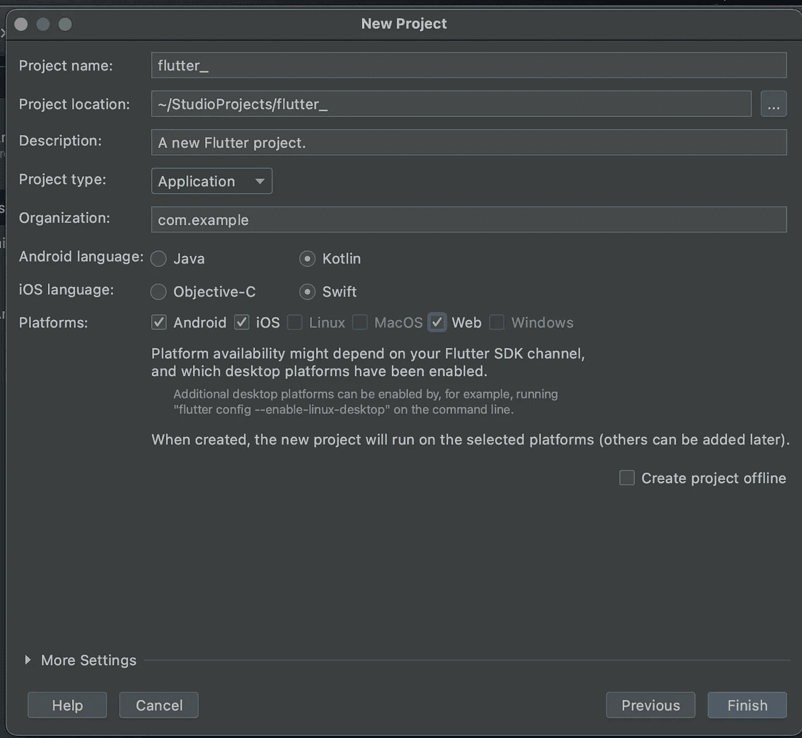
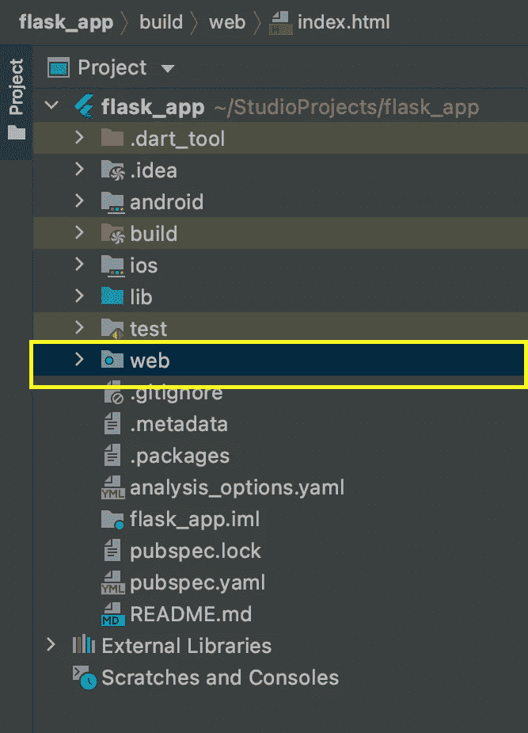
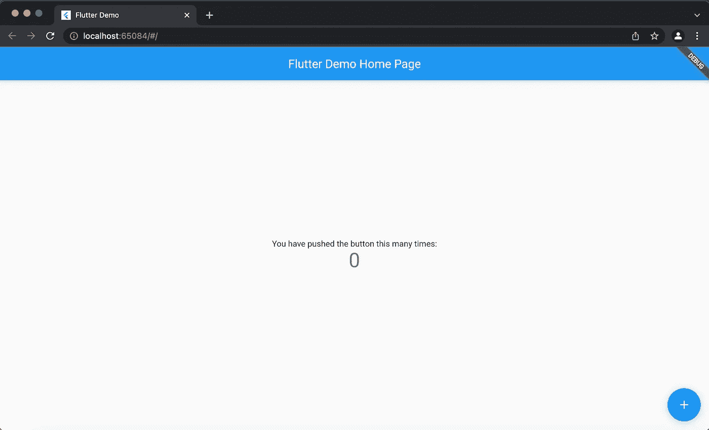
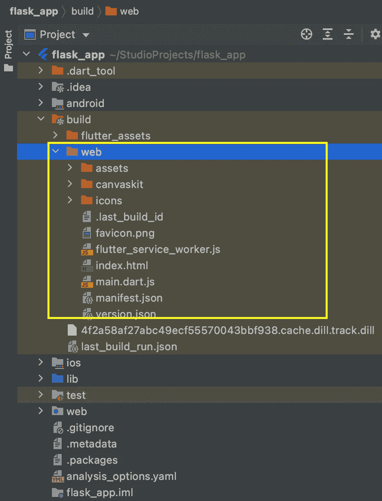
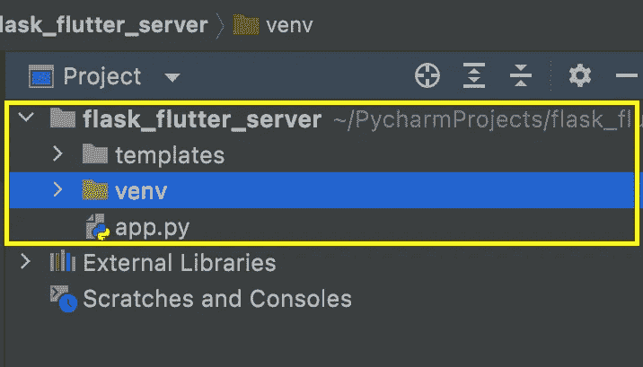
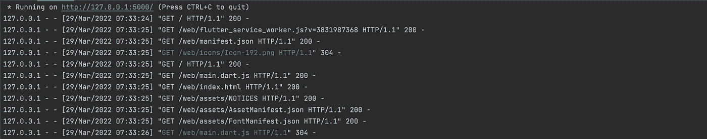

# 用 Python-Flask 服务于 Flutter Web 应用

> 原文：<https://betterprogramming.pub/serving-flutter-web-applications-with-python-flask-c60ab5fc3fc1>

## 从任何后端框架交付 Flutter web 应用程序的指南


你的每一个失误都会有漏洞，所以不要忽视文献。

在私有服务器上提供 Flutter web 应用需要一点努力。问题是当你启动一个 flutter web build 的流行的`index.html`文件时，flutter 通过运行`main.dart.js`和`flutter_service_worker.js`文件中的代码来呈现你的 UI——这些文件在你的文件树中的某个地方。

Flutter 还需要来自其他资产文件(图像、字体、清单等)的数据。)来正确地呈现您的应用程序，这些在文件树中的其他地方。挑战在于，在 Flutter 渲染过程中，无论何时通过 HTTP 请求这些文件，都要将它们提供给 Flutter。

刚才陈述的原因是为什么当你在浏览器上启动一个 Flutter web build 的 index.html 文件时通常什么都不会发生——没有 API 来提供所需的文件。

我们现在将构建一个 Flask 项目，为 Flutter web 应用程序提供所需的文件，因为它们是 Flutter 所请求的。

本文假设您熟悉 Flask 和 Flutter web 应用程序。即使你只熟悉一点点，你也应该能听懂。

我们将遵循这 4 个步骤。

1.  构建 Flutter web 应用程序。
2.  修改 Flask API 的构建文件。
3.  构建和配置 Flask 应用程序。
4.  为颤振应用服务的代码 REST API。

在任何情况下，确保您的 Flask 应用程序满足步骤 2 和 4 的要求。

# **1。构建一个 Flutter Web 应用程序**

如果您能够生成并定位您的 Flutter web 构建文件，请随意跳过这一步。

我选择的编辑器是出色的 android studio。当然，您也可以使用 VSCode。我们将构建一个 Flutter 应用程序，因此创建一个并将其命名为`flask_ui_app` ( *或您想要的——您知道该如何操作*)。如果你使用 android studio，不要忘记启用网络支持。



使用 android studio 启用 web 支持。

如果您创建了一个没有 web 支持的项目，您可以通过终端输入以下命令来添加它。

```
> flutter create .
```

其中终端目录被设置为当前 Flutter 项目的根目录。

现在，您应该可以在项目树中看到 web 文件夹。



Web 支持的颤振应用

现在运行您的 Flutter web 应用程序，确保它安全地加载默认的计数器应用程序。



默认颤振计数器应用。

现在我们可以开始构建我们的发布文件了。

将命令终端的根文件夹设置为当前 Flutter 项目的根文件夹，通过输入以下命令构建 web 应用程序。

```
> flutter build web --release -v
```

构建完成后，您可以在路径`[project_root]/build/web/`中找到 web 发布文件。我们需要那个文件夹里的所有文件。



包含发布文件的 Web 生成文件夹

# **2。修改烧瓶**的构建文件

正如 [@sbilkoloft](https://medium.com/@sbilkoloft) 所指出的，只要用下面的终端命令构建你的 flutter app(步骤 1)就可以跳过这一步。

```
> flutter build web --release --base-href=/web/
```

这一步只需要通过替换以下行来修改 web build 文件夹中的`index.html`文件:

```
<base href="/">
```

随着

```
<base href="/web/">
```

您将很快看到,“web”可以替换为另一个术语，如“app ”,只要它们与 API 路线相对应。

# **3。构建和配置 Flask 应用程序。**

如果您已经在使用 Flask 应用程序，或者您知道如何创建一个简单的 Flask 应用程序，您可以打开 Flask 项目并跳过这一步。

在这里，我们可以使用 pip 简单地生成一个 Flask 应用程序。要完成这一步，您需要在系统上安装 Python、pip 和 virtualenv。如果您没有安装这些指南，可以按照它们进行操作。

*   Python 安装 [*指南*](https://realpython.com/installing-python/) 。
*   Pip 安装 [*导轨*](https://packaging.python.org/en/latest/guides/installing-using-pip-and-virtual-environments/) 。
*   Virtualenv 安装 [*指南*](https://packaging.python.org/en/latest/guides/installing-using-pip-and-virtual-environments/) 。

现在创建一个空的项目文件夹，并给它命名——我的名字是`flask_flutter_app`。在命令终端中导航到文件夹目录。

```
> cd [path to new project]
```

首先，我们将在这个文件夹中创建一个虚拟环境，这是 Python 项目的建议。您可以通过在命令终端窗口中运行以下命令来做到这一点。

```
> python -m venv env
```

接下来，我们将通过在 Linux/mac 用户的终端中运行以下命令来激活 Python 虚拟环境。

```
> source env/bin/activate
```

如果在 windows 系统上，您将不得不运行这个。

```
> .\env\Scripts\activate
```

您的终端窗口现在应该表明您的虚拟环境是活动的。

```
(env)> 
```

接下来，我们将通过运行以下命令在虚拟环境中安装 Flask。

```
 (env)> pip install flask
```

开始编码。我们将使用一个名为`app.py`的 Python 文件，因此在项目根文件夹中创建一个，在您喜欢的代码编辑器中打开这个文件，然后粘贴下面的设置代码。

```
from flask import Flask app = Flask(__name__)

@app.route('/')
def say_hello():
    return ('Hello world')

if __name__ == '__main__':
    app.run()
```

代码片段应该看起来很熟悉，它确实是一个非常基本的 Flask 应用程序。

我们可以通过在终端中运行以下命令来测试应用程序。

```
> flask run
```

此时，结果应该包含类似这样的内容。

```
 * Debug mode: off
 * Running on [http://127.0.0.1:5000/](http://127.0.0.1:5000/) (Press CTRL+C to quit)
```

如果在浏览器中启动 url `[http://127.0.0.1:5000/](http://127.0.0.1:5000/)`显示“hello world”文本，那么我们就可以开始了。

# **4。为颤振应用服务的代码 REST API**

现在，好戏开始了。首先要做的是将步骤 1 中 Flutter web 构建目录中的所有文件复制到一个新目录中，我们将其命名为“模板”。您的 Flask 项目文件树现在应该如下所示:



烧瓶项目结构

Flask 特别注意`templates`目录中的文件。当 API 使用内置的 Flask 方法`render_template`从 Flask 应用程序请求网页时，Flask 会查看这个目录。

但是，在实例化 Flask 应用程序时，可以更改默认的模板目录，如下面的代码片段所示。

```
# Optional - not for this step
app = Flask(__name__, template_folder='web')
```

我们现在需要做的就是编写 API 函数，使用内置的 Flask `send_from_directory`方法返回 Flutter web build 文件夹中的文档文件。

首先，将以下导入语句添加到您的`app.py`文件的顶部。

```
from flask import Flask
from flask import send_from_directory
from flask import render_template
```

接下来，将这段代码复制并粘贴到 Flask 应用程序中。

你会注意到`render_page_web`函数被附加到`web`路径上，所以下次运行 Flask 应用程序时，你将能够从 url `[local_host]/web`启动 Flutter 应用程序。

我将我的应用程序进一步简化，用相同的渲染代码替换了回家的路线——现在 Flutter 应用程序是我的 Flask 应用程序的主页。

```
@app.route('/')
def render_page():
    return render_template('/index.html')
```

如果您此时运行 Flask 应用程序，您将会看到在使用`[local_host]/web` url 和这些请求的 url 模式启动 index.html 页面之后，Flutter 所请求的文档。



Flask 日志显示获取构建文件的 flutter 请求`.`

您会注意到，模板目录中所请求文件的路径嵌入在请求的 URL 中。因此，`return_flutter_doc`函数从请求 URL 中提取所请求文件的路径，并通过 HTTP 提供来自`templates`文件夹的文件。

在这个 [GitHub 库](https://github.com/Algure/flask_flutter_server.git)上找到所有代码。

如果你理解了其中的逻辑，你应该能够用你所熟悉的任何后端框架方便地服务你的 Flutter web 应用程序。