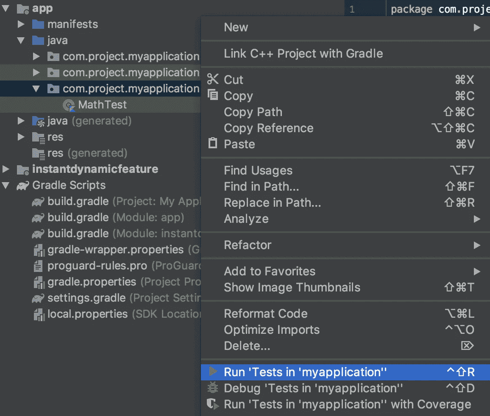
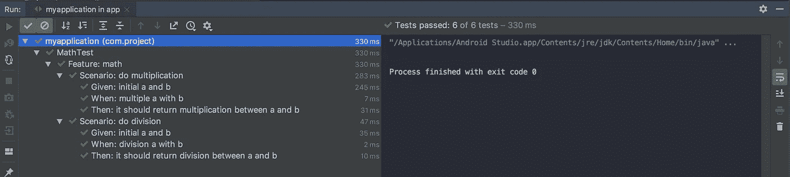

# 用 Kotlin Spek 2 设置 Android BDD 样式

> 原文：<https://betterprogramming.pub/set-android-bdd-style-with-kotlin-spek-2-14176f235d17>

## 给出你项目的时间概念


科特林·斯佩克框架

Spek 是为 Kotlin 设计的强大的行为驱动测试框架。有了 [Spek](http://spekframework.org/) ，我们可以快速实现一个 BDD(行为驱动开发)环境，允许你以一种清晰、可理解和人类可读的方式轻松定义你的测试。

此时，我们可以学习如何使用 [Spek](http://spekframework.org/) 创建一个 [Android](https://www.android.com) 单元测试。希望这能帮助那些不习惯测试的开发人员。

但是在我们开始之前，我们有一个问题。 [Spek](http://spekframework.org/) 在 JUnit5 上运行良好 [Android](https://www.android.com) 在 JUnit4 上卡死。我们需要另一个图书馆。

这是我们要用的:

*   [安卓 JUnit 5](https://github.com/mannodermaus/android-junit5)
*   Spek 框架第二版

# 步骤 1 —设置 JUnit5

首先，打开`build.gradle`(项目级)来添加存储库和依赖项:

```
repositories {
    maven { url "http://dl.bintray.com/jetbrains/spek" }
}
dependencies {
    classpath "de.mannodermaus.gradle.plugins:android-junit5:**1.5.1.0**"
}
```

然后打开`build.gradle`(应用级)并应用:

```
apply plugin: "de.mannodermaus.android-junit5"
```

然后，对于依赖关系:

```
testImplementation "org.junit.jupiter:junit-jupiter-api:**5.5.1**"
testRuntimeOnly "org.junit.jupiter:junit-jupiter-engine:**5.5.1**"
```

注意:你应该注意 Junit 5 版本和库版本的 mannodermaus 是不同的

# 步骤 2 —设置 Spek2

在`build.gradle`(应用级)中仍然需要一个小的补充。在`testOptions`上添加`junitPlatform`:

```
android {
    testOptions {
        junitPlatform {
            filters {
                engines {
                    include 'spek2'
                }
            }
        }
    }
}
```

接下来，添加`spek2`依赖项:

```
testImplementation "org.spekframework.spek2:spek-dsl-jvm:**2.0.7**"
testImplementation "org.spekframework.spek2:spek-runner-junit5:**2.0.7**"
```

# 步骤 3 —开始测试

创建一个纯类和一些函数:

```
class Math {
    fun multiplication(x: Int, y: Int) = x.times(y)
    fun division(x: Int, y: Int) = x.div(y)
}
```

然后做一个测试用例:

```
package com.project.myapplication

import org.junit.jupiter.api.Assertions.assertEquals
import org.spekframework.spek2.Spek
import org.spekframework.spek2.style.gherkin.Feature

object MathTest : Spek({
    **Feature**("math") {
        val math = Math()

        **Scenario**("do multiplication") {
            var a = 0
            var b = 0
            var multiple = 0
            val result = 21

            **Given**("initial a and b") {
                a = 3
                b = 7
            }

            **When**("multiple a with b") {
                multiple = math.multiplication(a, b)
            }

            **Then**("it should return multiplication between a and b") {
                assertEquals(result, multiple)
            }
        }

        **Scenario**("do division") {
            var a = 0
            var b = 0
            var division = 0
            val result = 3

            **Given**("initial a and b") {
                a = 21
                b = 7
            }

            **When**("division a with b") {
                division = math.division(a, b)
            }

            **Then**("it should return division between a and b") {
                assertEquals(result, division)
            }
        }
    }
})
```

最后，右键单击文件夹 test 来运行它:



spek 运行测试

# 试验结果



spek 情景测试

GWT 是一种将场景或测试用例分解成三个部分的方法:

*   **给定**是在这个场景中执行行为之前的初始状态。你可以说这是测试的先决条件。
*   **什么时候**是我们将要采取的行为或行动
*   **然后**描述你预期的因指定行为而产生的变化。

现在你的测试结果更容易阅读和理解，因为 BDD 环境已经在你的 Android 项目中实现了！