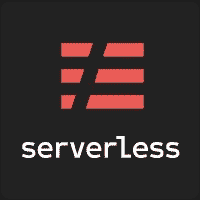
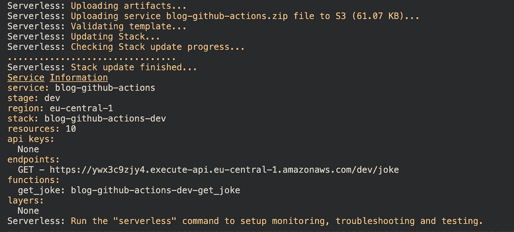
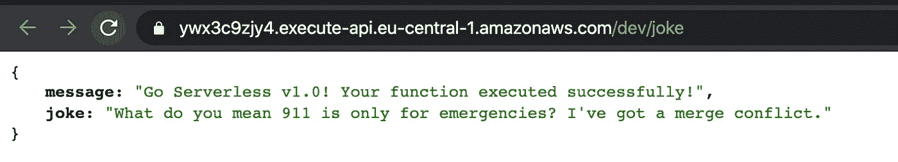
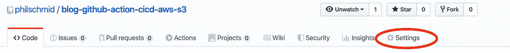
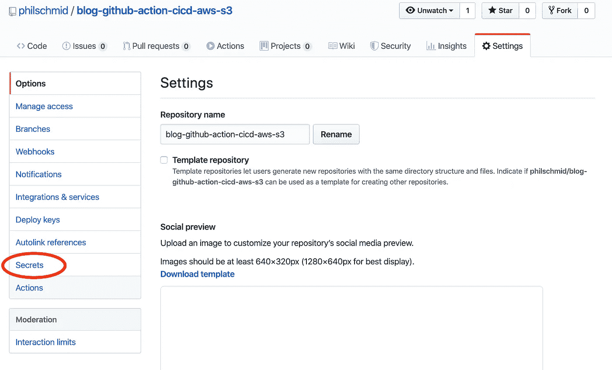
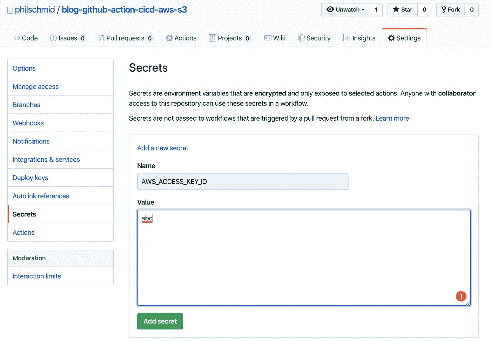
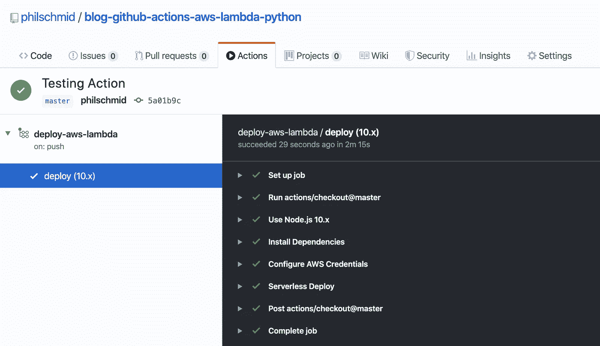
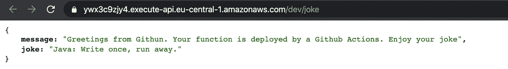

# 如何用 GitHub 操作和无服务器设置 AWS Lambda 的 CI/CD 管道

> 原文：<https://betterprogramming.pub/set-up-a-ci-cd-pipeline-for-aws-lambda-with-github-actions-and-serverless-in-under-5-minutes-fd070da9d143>

## 在不到五分钟的时间内自动部署 Python 函数及其依赖项


照片由[蒂姆·斯万](https://unsplash.com/@timswaanphotography?utm_source=unsplash&utm_medium=referral&utm_content=creditCopyText)在 [Unsplash](https://unsplash.com/s/photos/bridge?utm_source=unsplash&utm_medium=referral&utm_content=creditCopyText) 拍摄

# 介绍

作为开发人员，为您的项目提供 CI/CD 管道功能是非常有价值的。谢天谢地，用 Github Actions 建立这样一个管道并不难。

在我之前的文章[5 分钟内使用 Github Actions 在 AWS 上为您的 Webapp 设置 CI/CD 管道](https://medium.com/@schmidphilipp1995/set-up-a-ci-cd-pipeline-for-your-webapp-on-aws-with-github-actions-within-5-minutes-810b10749833)中，我演示了如何为您的前端应用程序设置 CI/CD 管道。这一次，我将把重点放在后端。

我将向您提供一个快速简单的分步教程，介绍如何使用 Github 操作为 AWS Lambda 设置 CI/CD 管道。对于我的 AWS Lambda，我选择 Python 作为运行时。我还将介绍如何包含 Python 包，如`scikit-learn`或`pandas`。

# TL；速度三角形定位法(dead reckoning)

如果你不想阅读完整的帖子，只需从这个 Github 库中复制动作和`Serverless`配置[，并将 Github 秘密添加到你的库中。如果你失败了，回来看看这篇文章！](https://github.com/philschmid/blog-github-actions-aws-lambda-python)

# 要求

这篇文章假设你已经安装了用于部署 AWS Lambda 功能的[无服务器框架](https://serverless.com/),并且已经安装了 Github 账户和 Docker。无服务器框架帮助我们开发和部署 AWS Lambda 功能。它是一个 CLI，开箱即可提供结构、自动化和最佳实践。它还允许您专注于构建复杂的、事件驱动的、无服务器的架构，由函数和事件组成。



无服务器框架徽标

如果你不熟悉或者还没有设置无服务器框架，看看这个[无服务器框架快速入门](https://serverless.com/framework/docs/providers/aws/guide/quick-start/)。

现在让我们开始学习教程。

# 创建 AWS Lambda 函数

首先，使用无服务器 CLI 和`aws-python3`模板创建我们的 AWS Lambda 函数:

```
serverless create --template aws-python3 --path <your-path>
```

这个 CLI 命令将创建一个新目录，其中包含一个`[handler.py](<http://handler.py>)`、`.gitignore`和`serverless.yaml`文件。`handler.py`包含一些基本的样板代码:

`serverless.yaml`包含部署该功能的配置。如果你有兴趣知道`serverless.yaml`可以配置什么，看看这里的。

# 添加 Python 需求

接下来，我们需要将 Python 需求添加到 AWS Lambda 函数中。为此，我们使用无服务器插件`serverless-python-requirements`。它自动捆绑来自`requirements.txt`的需求，并使它们在我们的`PYTHONPATH`中可用。`serverless-python-requirements`插件甚至可以让你捆绑非纯 Python 模块。如果你有兴趣，看看这里。

# 安装插件

要安装插件，请运行以下命令:

```
serverless plugin install -n serverless-python-requirements
```

这将插件自动添加到您的项目的`package.json`和`serverless.yml`中的插件部分。

下一步是调整`serverless.yaml`并包含`custom` Python 需求配置。我们需要这个额外的配置，因为我们的 Github Actions 运行时是 Node，通过这个配置，我们可以将 python 需求捆绑到 docker 容器中。

我也:

*   删除了所有评论。
*   增加了`HTTP-Event`。
*   增加了`package`部分，将`node_modulues`排除在展开之外。
*   将地区更改为`eu-central-1`。

```
service: <name-of-your-function>provider:
  name: aws
  runtime: python3.7
  region: eu-central-1custom:
  pythonRequirements:
    dockerizePip: truepackage:
  individually: false
  exclude:
    - package.json
    - package-log.json
    - node_modules/**functions:
  get_joke:
    handler: handler.get_joke
    events:
      - http:
          path: joke
          method: getplugins:
  - serverless-python-requirements
```

# 创建部署脚本

除了我们在`serverless.yaml`中的配置，我们还需要编辑`package.json`并将`serverless`包含为`devDependencies`。此外，我们添加了一个`deploy`脚本来稍后部署该功能。我们稍后将在 Github 操作中使用这个部署脚本:

```
{
  "name": "blog-github-actions-aws-lambda-python",
  "description": "",
  "version": "0.1.0",
  "dependencies": {},
  "scripts": {
    "deploy": "serverless deploy"
  },
  "devDependencies": {
    "serverless": "^1.67.0",
    "serverless-python-requirements": "^5.1.0"
  }
}
```

# 对`requirements.txt`增加要求

我们必须在根级别创建一个`requirements.txt`文件，包含所有需要的 Python 包。但是要小心——解压缩后的部署包大小不能超过 250 MB。你可以在这里找到所有 AWS Lambda 限制的列表。

另一个提示:`boto3`包是预装的——你不必把它包含在`requirements.txt`中。

出于演示的目的，我选择了`pyjokes`包，并让函数用一个笑话来响应所有请求。我在`requirements.txt`中加入了`pyjokes`。

之后，我将`pyjokes`添加到`handler.py`中的函数，它返回一个随机笑话:

# 手动部署功能

在使用 Github Actions 之前，我们使用下面的命令*手动部署该功能(注意:Docker 必须启动并运行)*:

```
npm run-script deploy
```

在您的 CLI 中，您应该会看到如下输出:



成功部署的 CLI 输出

我们可以通过点击`endpoints`部分提供的 URL 来测试我们的功能。



来自 AWS Lambda 端点的成功响应

# 创建 GitHub 操作

## 创建文件夹和文件

对于我们的操作，我们要做的第一件事是在您的项目根级别上创建文件夹`.github`和文件夹`workflows`。之后，在其中创建`deploy-aws-lambda.yaml`文件。

## 添加 Github 操作

将这段代码片段复制到`deploy-aws-lambda.yaml`文件中:

```
name: deploy-aws-lambdaon:
  push:
    branches:
      - master
jobs:
  deploy:
    runs-on: ubuntu-latest
    strategy:
      matrix:
        node-version: [10.x]
    steps:
      - uses: actions/checkout@master
      - name: Use Node.js ${{ matrix.node-version }}
        uses: actions/setup-node@v1
        with:
          node-version: ${{ matrix.node-version }}
      - name: Install Dependencies
        run: npm install
      - name: Configure AWS Credentials
        uses: aws-actions/configure-aws-credentials@v1
        with:
          aws-access-key-id: ${{ secrets.AWS_ACCESS_KEY_ID }}
          aws-secret-access-key: ${{ secrets.AWS_SECRET_ACCESS_KEY }}
          aws-region: eu-central-1
      - name: Serverless Deploy
        run: npm run-script deploy
```

这段代码描述了该操作。Github 动作将在`master`分支上的`push`之后被触发。您可以通过调整代码片段中的`on`部分来改变这一点。如果你想为你的行动找一个不同的触发器，看这里的。

# 将机密添加到您的存储库中

第三步也是最后一步是将秘密添加到 Github 存储库中。对于这个 Github 动作，我们需要来自 IAM 用户的访问密钥 ID 和秘密访问密钥，作为名为`AWS_ACCESS_KEY_ID`和`AWS_SECRET_ACCESS_KEY`的秘密。

如果您不确定如何为访问密钥 ID 和秘密访问密钥创建 IAM 用户，请阅读此。

# 添加秘密

要添加秘密，你必须转到你的存储库的“设置”标签。



Github 存储库选项卡-导航

然后转到左侧导航面板中的“秘密”。



Github 存储库设置页面

在秘密页面上，您可以添加您的两个秘密，`AWS_ACCESS_KEY_ID`和`AWS_SECRET_ACCESS_KEY`。



Github 存储库添加秘密

# 拿一杯咖啡，享受它

我们快完成了。最后一步是测试它。因此，编辑`handler.py`，并将其推送到您的存储库的主分支。

推送之后，我们可以看到部署 AWS Lambda 函数的操作:



Github 操作概述

在成功运行 Github 操作后，我们可以再次请求我们的函数，看看它是否有效:



来自 AWS Lambda 端点的成功响应

我创建了一个带有完整示例的演示库，你可以在这里找到[。](https://github.com/philschmid/blog-github-actions-aws-lambda-python)

如果有不清楚的地方，请告诉我，我会修改的。

感谢阅读！