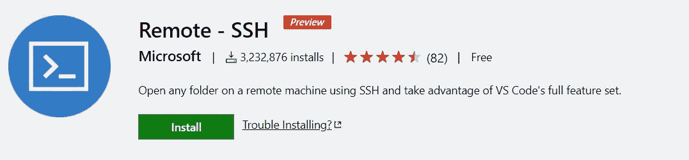
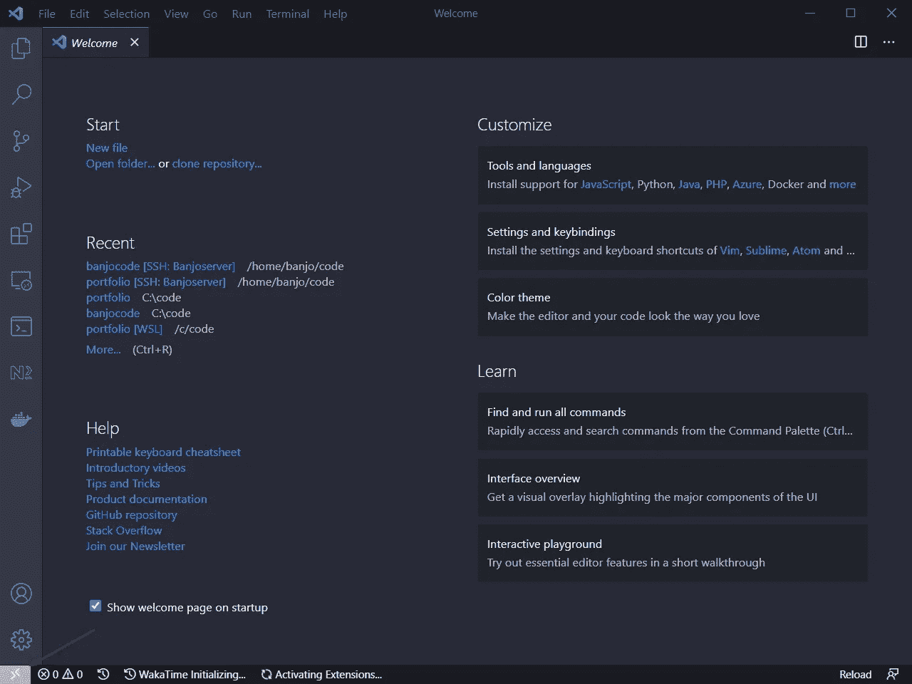
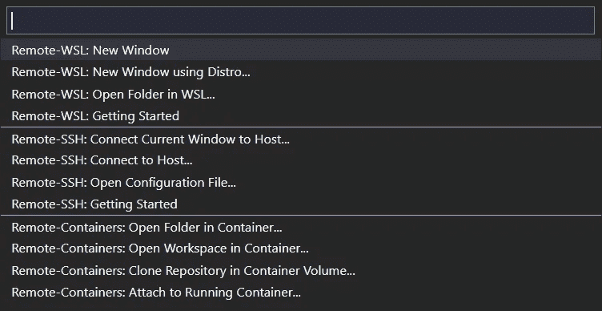
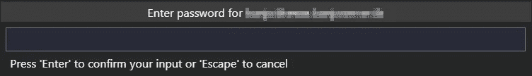
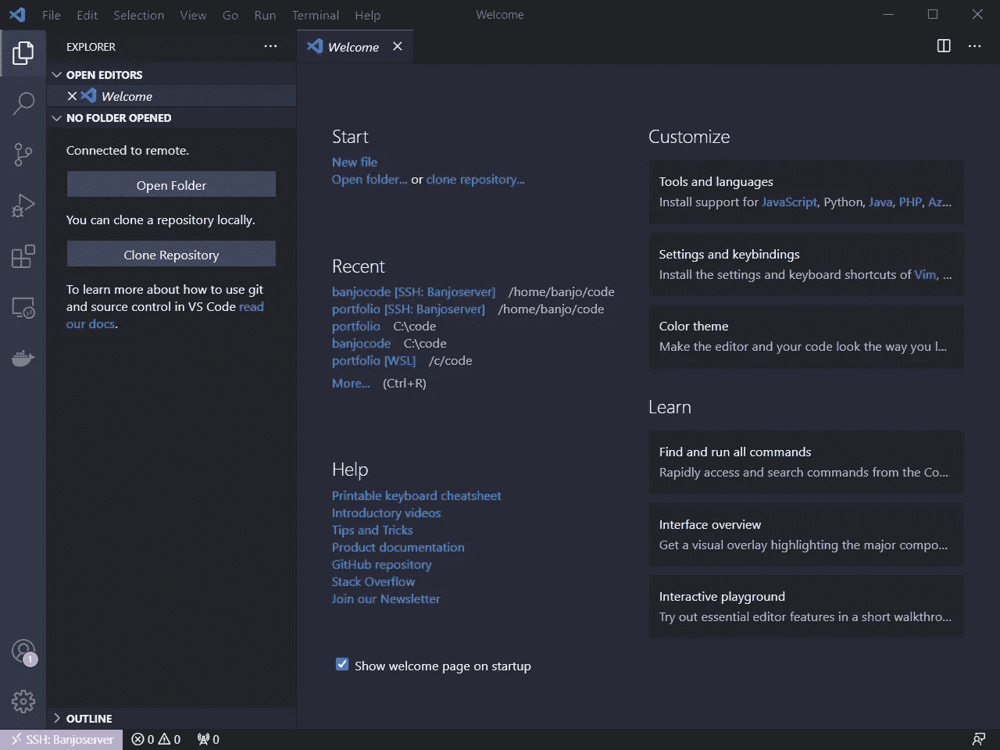
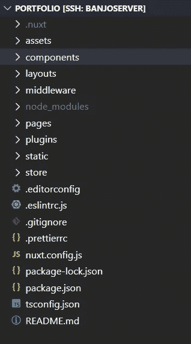
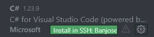
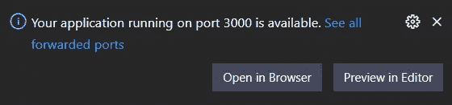
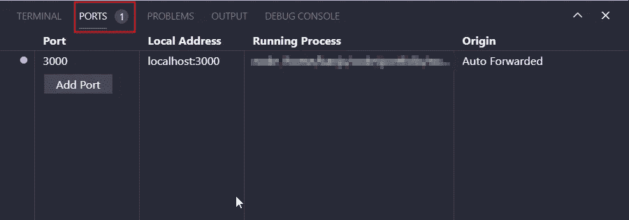

# 用 Linux 和 VS 代码建立一个远程开发环境

> 原文：<https://betterprogramming.pub/set-up-a-remote-development-environment-with-linux-and-vs-code-e948f6b3f8e7>

## 配置远程工作空间的快速指南


由[米尔蒂亚迪斯·弗拉基迪斯](https://unsplash.com/@_miltiadis_?utm_source=medium&utm_medium=referral)在 [Unsplash](https://unsplash.com?utm_source=medium&utm_medium=referral) 拍摄的照片。

建立一个开发环境可能是相当乏味的——特别是当你想远程使用它的时候。这是一个快速的“入门”指南，所以你可以从任何地方使用 Ubuntu、VS Code 和 SSH 访问你的工作空间。

在偏远的工作场所工作有很多好处。现代工具和互联网让你可以实时这样做，实际上有很多好处:

*   低廉的月租费带来惊人的性能。
*   在任何地方工作，访问相同的环境。
*   使用大多数服务器使用的 Linux 环境。
*   使用“更便宜”的计算机是可能的，因为加载发生在服务器上。
*   更快的构建时间和互联网速度。

VS Code 有一个名为[Remote——SSH](https://marketplace.visualstudio.com/items?itemName=ms-vscode-remote.remote-ssh)的扩展，它允许你远程工作，并且它实际上非常容易设置和连接。您只使用 SSH，它在大多数服务器环境中是默认安装的。

# 入门指南

首先，我们需要一个服务器。你可以阅读我关于如何使用 Hetzner 轻松设置 Linux 服务器的指南。在我看来，这是你能以便宜的价格得到的最好的东西了。

您还需要安装上面提到的扩展(Remote——SSH ),因为您需要它连接到您的服务器并像在本地一样使用它。



# 连接到您的服务器

连接到您的服务器实际上很容易。安装完扩展后，您会在左侧看到一个新符号:



按下它进入 SSH 菜单，允许你做很多事情。



要连接到您的服务器，只需按“远程-SSH:连接到主机...”您可以选择直接输入 SSH 命令，或者添加一个新的 SSH 主机，以便可以方便地保存它供以后使用。


按“添加新的 SSH 主机...”添加您的连接并保存。您可以像这样编写命令:

```
ssh <user>@<ip-address> -A
```

`-A`标志用于端口转发，您可能需要将您的应用程序从您的服务器转发到您自己的计算机来测试它们。稍后我会告诉你如何做。

添加后，您的服务器将出现在我们之前访问的 SSH 菜单的列表中。只需按下它并在随后的提示中输入您的密码，即可连接到您的服务器:



为了显示您已经成功连接，左下角的按钮将显示您的主机名。


# 访问您的项目

要访问您的项目(您可能已经使用 Git 下载到您的服务器上)，选择“打开文件夹”并转到您的项目。



您可能需要再次输入密码，但现在您可以像在自己的电脑上一样访问服务器上的文件。并且终端连接到服务器的终端。



可能值得一提的是，您需要在您的远程服务器上安装所有的扩展，这非常简单。你可以直接进入侧边菜单的扩展栏，浏览到你已经安装的扩展。如果您的远程服务器上可能需要它们，它们会清楚地显示在列表中。有些是不必要的，如主题和字体，因为它们在您的本地计算机上。



# 端口转发到您的本地机器

为了能够在远程开发时使用您的应用程序，您将需要转发到在提供网页等服务时使用的端口。VS 代码会自动处理这个问题。只需运行您的命令来服务您的 web 应用程序(在本例中，对我来说是`npm run dev`)以获得在您的本地计算机上打开它的提示。



如果您愿意，您可以在终端窗口中管理您的端口转发。



就是这样。这就是为开发而设置远程服务器的方式。