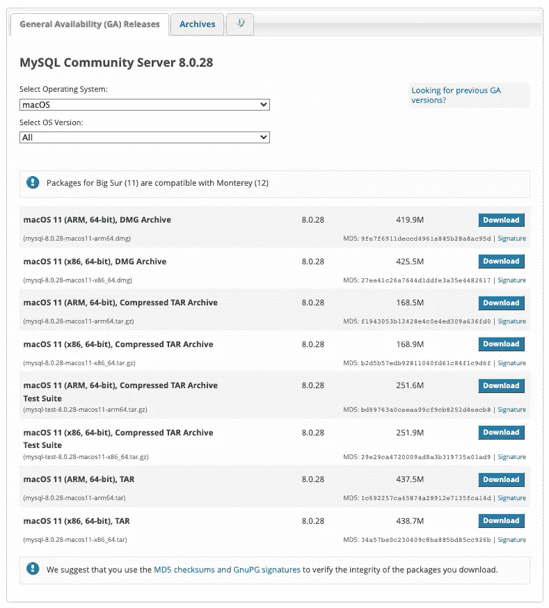
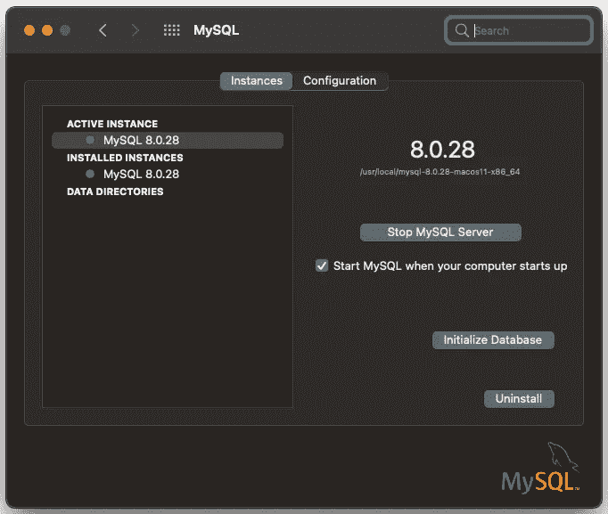
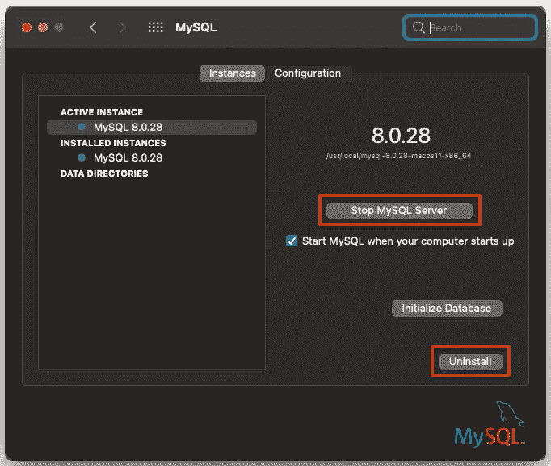
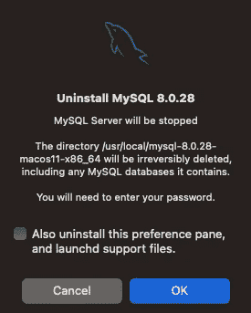

# 在 Create React 应用程序环境中设置和使用 MySQL

> 原文：<https://betterprogramming.pub/set-up-and-use-mysql-in-create-react-app-environment-22a4c7dc077f>

## 如何管理 MySQL for Node.js 应用程序的详细步骤


照片由[努贝尔森·费尔南德斯](https://unsplash.com/@nublson?utm_source=medium&utm_medium=referral)在 [Unsplash](https://unsplash.com?utm_source=medium&utm_medium=referral) 上拍摄

20 世纪 70 年代开发的 SQL 数据库是具有固定行和列的表。流行的 SQL 数据库有 Oracle、MySQL、Microsoft SQL Server 和 PostgreSQL。

21 世纪后期开发的 NoSQL 数据库是非表格数据库，它存储数据的方式不同于关系表。MongoDB 和 CouchDB 专注于文档，Redis 和 DynamoDB 是针对键值对，Cassandra 和 HBase 专注于宽列，Neo4j 和 Amazon Neptune 是针对图形设计的。

SQL 在 2022 年还相关吗？

是的。我们正在用 React + Express + Node.js + MySQL 构建一个端到端的项目。

[MySQL](https://en.wikipedia.org/wiki/MySQL) 是一个开源的关系数据库管理系统(RDBMS)。“My”是联合创始人迈克尔·维德纽斯(Michael Widenius)女儿的名字，SQL 是结构化查询语言的缩写。MySQL 是世界上第三大流行的 RDBMS，它继续为许多现有的和新的项目提供动力。

在本文中，我们概述了如何为 [Node.js](/3-major-features-of-node-js-17-4bee7135df02) 应用管理 MySQL 的细节。

# 安装本地 MySQL

对于本文，可以在 MacOS 上下载一个社区版(免费)MySQL。

进入[官网](https://dev.mysql.com/downloads/mysql/)，根据操作系统和 OS 版本选择下载包。



作者图片

MySQL 下载完成后，在 MacOS 上打开`System Preferences...`。点击 MySQL app，显示活动实例为`MySQL 8.0.28`。



作者图片

# 使用 MySQL CLI

CLI`mysql`可用于管理数据库:

1 号线接入位于`/usr/local/mysql/bin`的`mysql`。

在安装过程中，我们创建了一个带有密码的用户`root`。在第 11 行，我们将密码更改为`'password'`，在第 14 行，为新密码刷新特权。

该项目需要 MySQL 协议的 JavaScript 客户端。有两种流行的选择，`[mysql](https://github.com/mysqljs/mysql)`和`[mysql2](https://github.com/sidorares/node-mysql2)`。如果没有上述更改，`mysql`连接会显示以下错误:

```
ER_NOT_SUPPORTED_AUTH_MODE: Client does not support authentication protocol requested by server; consider upgrading MySQL client
```

不过这些变化对于`mysql2`来说并不是必须的。

CLI 也可用于操作数据库:

第 1 行创建了一个数据库，名为`myDB`。

第 4 行选择数据库，`myDB`。

第 7 行显示了`myDB`中的所有表格，这是一个空集(第 8 行)。

第 10 行创建了一个表，名为`students`。该表有`id`、`name`、`age`和`grade`列。除了`name`是最大长度为 255 的变长字符串外，其他列都是整数。

第 13 行显示了`myDB`中的所有表格。加上新增加的`students`，它有 1 个表(第 14-19 行)。

第 21 行在`students`中插入一条新记录。

第 24 行选择来自`students`的数据。显示新添加的记录(第 25–30 行)。

# 创建 React 应用环境

通常创建 Node.js 项目来管理 MySQL 数据库。然而，我们选择 [Create React App](/an-in-depth-guide-for-create-react-app-5-cra-5-b94b03c233f2) 作为基础，有以下两个原因:

*   React 是构建 UI 所需要的，这是我们项目的一部分。
*   Create React App 包含项目所需的 Express 服务器。

以下命令创建一个 React 项目:

```
npx create-react-app my-app
cd my-app
```

设置`mysql` ( `mysql2`工作方式类似)，MySQL 协议的 JavaScript 客户端:

```
npm i mysql
```

设置`inquirer`，Node.js 的直观提示库。

`mysql`和`inquirer`成为`package.json`中`[dependencies](/package-jsons-dependencies-in-depth-a1f0637a3129)`的一部分。

此外，我们在`package.json`中将 type 设置为`"module"`以使用 [ES 模块](/what-might-be-coming-in-npm-9-6985cf2678a6)，这是处理模块的 ECMAScript 标准。

我们准备在 Node.js 应用程序中管理 MySQL。

# 在 Node.js 应用程序中管理 MySQL

`server/index.js`是为了管理 MySQL 而创建的:

第 1 行为 MySQL 协议导入`mysql`。

第 2 行为直观提示导入了`inquirer`。

第 4–8 行定义了用户配置。

第 10–12 行使用用户配置创建 MySQL 连接。第 11 行启用多个语句，默认情况下是禁用的，以避免可能的 SQL 注入攻击。

第 14–23 行定义了`query`函数，它查询 SQL 语句。如果有错误，它会被记录在控制台上(第 17 行)。否则，打印查询结果(第 19 行)。查询结束后，app 准备好下一个`inquire`(第 21 行)。

第 25–41 行定义了提示`'mysql>'`的`inquire`函数。它将用户输入作为调用`query`函数的参数(第 38 行)。如果输入是`'quit'`(第 34 行)，连接结束(第 36 行)，应用程序退出。

第 43–52 行定义了连接到数据库的`connect`函数。如果有错误，它会被记录在控制台上(第 46 行)。否则，调用`inquire`功能(第 49 行)。

第 54 行调用`connect`函数。

通过`'node server'`运行节点 app。其功能类似于`mysql` CLI。

第 3 行选择数据库，`myDB`。

第 14 行显示了`myDB`中的所有表格，其中包含 CLI 创建的`students`表格。

第 16 行放下`students`工作台。

第 27 行显示了`myDB`中的所有表格，这是一个空集(第 28 行)。

第 29 行创建了一个表，名为`students`。该表有`id`、`name`、`age`和`grade`栏。除了`name`是最大长度为 255 的变长字符串外，其他列都是整数。

第 40 行显示了`myDB`中的所有表格。加上新增加的`students`，它有 1 个表(第 41 行)。

第 42 行向`students`中插入一条新记录。

第 53 行选择来自`students`的数据。显示新添加的记录(第 54 行)。

第 55 行退出应用程序。

# 删除本地 MySQL

我们已经使用社区版本的 MySQL 来测试我们的代码。事实上，我们的项目在云中使用了一个 MySQL 实例。可以停止本地 MySQL。



作者图片

我们可能想卸载它。



作者图片

卸载后，有几个额外的清理步骤:

*   运行`ps -ax | grep mysql`来检查任何 MySQL 进程。如果有正在运行的，停止并终止它们。
*   确保清理了所有目录:

# 结论

我们已经展示了如何管理 MySQL for Node.js 应用程序的详细步骤。是 Node.js + MySQL 上的服务器端工作。一个社区版本的 MySQL 被用来说明这项工作，其中节点应用程序的功能类似于`mysql` CLI。

在另一篇文章的[中我们还在 Remix React 框架中设置了 MySQL。](https://medium.com/p/8dc56eb6a9c7)

感谢阅读。我希望这有所帮助。有兴趣的话可以看看[我的其他媒介文章](https://jenniferfubook.medium.com/jennifer-fus-web-development-publications-1a887e4454af)。

*注:感谢朱家林和邀请我使用 React + Express + Node.js + MySQL 参与这个有趣的项目。*