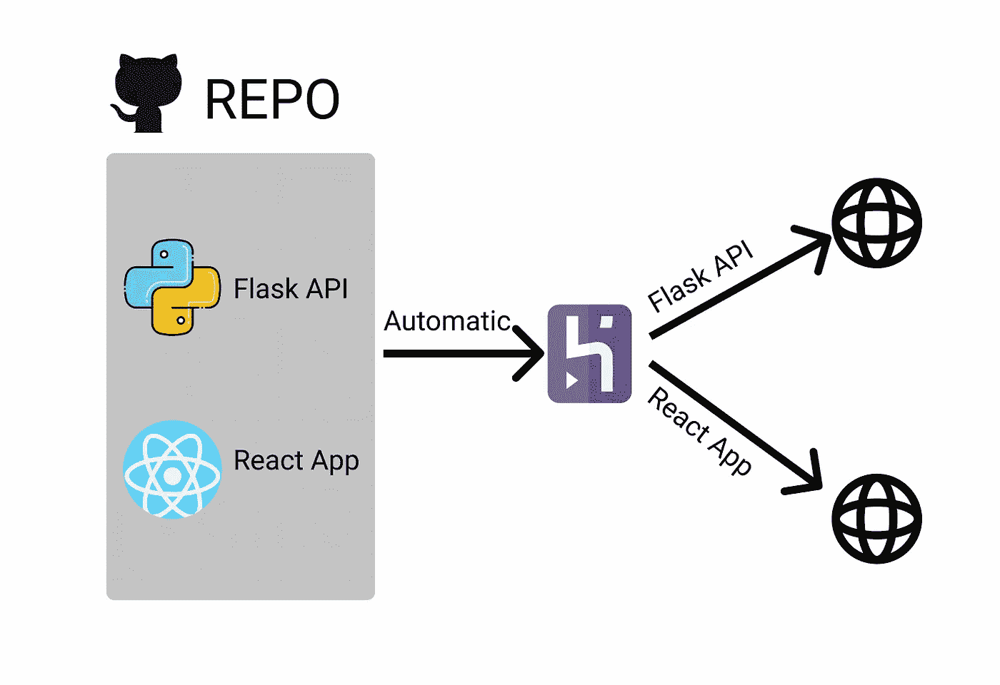
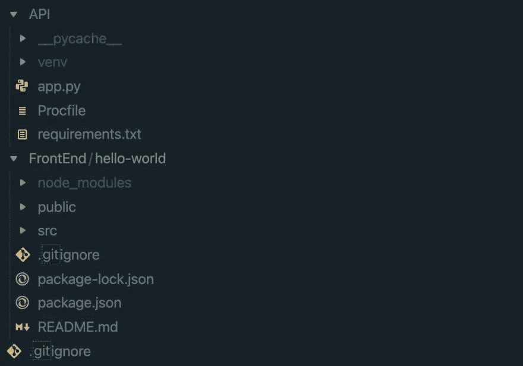
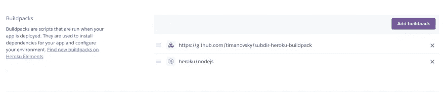
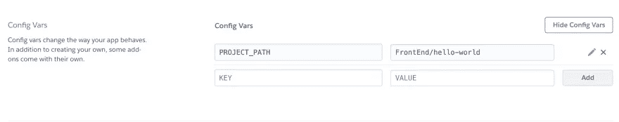
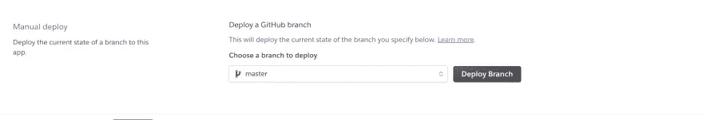
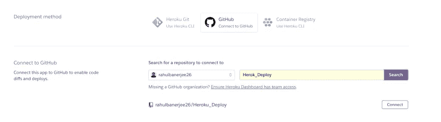
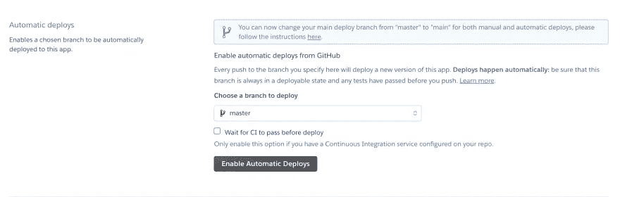
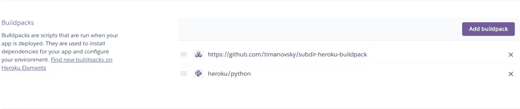
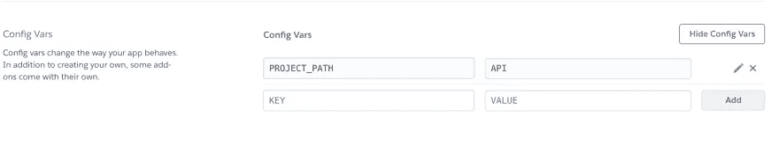

# 在 Heroku 的一个 Github 存储库下为多个应用程序设置自动部署

> 原文：<https://betterprogramming.pub/set-up-automated-deployments-for-multiple-apps-under-a-single-github-repository-in-heroku-42f887f49a0a>

## 加快您的部署速度



作者图片

在本教程中，我们将看到如何在 Heroku 的一个 GitHub 存储库下设置多个应用程序的自动化部署。如果您想将 GitHub repo 中的子目录部署到 Heroku，这也会很有帮助。

# 介绍

最近，我在尝试部署应用程序时遇到了一些问题。这是一个全栈应用程序，有一个单独的文件夹存放所有的 React 内容，另一个文件夹存放 Flask API。

我们的应用程序是这样设置的——必须部署 flask API，并且在 React 应用程序中调用部署的 API 的 URL。在本教程中，我将讨论我的解决方案。

# 你会学到什么？

*   如果你的应用程序在子目录中，也就是说，它不在根目录中，你将学习如何将应用程序部署到 Heroku。假设您有一个包含多个 API 的 GitHub Repo，并且希望单独部署其中的每一个 API。
*   您将了解如何使用不同的构建包部署多个应用程序。在本教程中，我将有一个 React+Flask 应用程序。然而，如果您使用不同的技术堆栈，本教程仍然会有所帮助
*   每当你推送到“部署”分支时，你的前端和 API 将自动部署到 Heroku

# 我的文件夹结构

你可以在这里找到 GitHub 回购

下面是应用程序的文件夹结构的截图



回购结构

在根文件夹中，有三个文件。

*   一个名为 API 的文件夹。它包含 flask API，必须作为一个单独的项目部署在 Heroku 上
*   一个叫做前端的文件夹。这个文件夹有另一个名为 hello-world 的文件夹，这是一个简单的 react 应用程序，使用“create-react-app”创建
*   答。gitignore 文件

# 部署 React 应用程序

在移动之前，确保你所有的文件都被推送到 GitHub repo。我的回购的名称是“Heroku_Deploy”

在 Heroku 上创建一个[新项目](https://dashboard.heroku.com/new-app)

对于部署方法，选择第二个选项“连接到 GitHub”。搜索您的回购，然后单击“连接”按钮


新项目的屏幕截图

选择要部署的分支，然后单击“启用自动部署”。每当您向分支推送任何更改时，React 应用程序都会被重新部署。


分行截图

现在，向上滚动并进入设置。转到“BuildPacks”并单击“Add Buildpacks”按钮。添加以下内容`buildpack`:

```
[https://github.com/timanovsky/subdir-heroku-buildpack](https://github.com/timanovsky/subdir-heroku-buildpack)
```

完成后，为您的应用添加`buildpack`。在我的例子中，由于它是一个 React 应用程序，我将添加 Node.js buildpack。



构建包的屏幕截图

> *确保 subdir-heroku-buildpack 位于其他构建包的顶部。*

现在转到 Config Vars 设置，添加以下配置变量。键是`PROJECT_PATH`，值是应用程序的路径。在我的例子中，react-app 位于文件夹`hello-world`中，而文件夹`hello-world`位于文件夹`FrontEnd`中

```
FrontEnd>hello-world>react-app
```

在我的例子中，配置变量如下所示



配置变量的屏幕截图

现在，向上滚动并转到“部署”部分。单击“部署分支”。



分行截图

> *一切就绪。每当您向您的分支推送任何更改时，heroku 将自动重新部署您在* `*PROJECT_PATH*`中指定的应用

# 部署 Flask API

这是一个与上面类似的过程。

在 Heroku 上创建一个新项目

对于部署方法，选择第二个选项“连接到 GitHub”。搜索您的回购，然后单击“连接”按钮



新项目的屏幕截图

选择要部署的分支，然后单击“启用自动部署”。每当您将任何更改推送到分支时，Flask API 将被重新部署。



分行截图

现在，向上滚动并进入设置。转到“BuildPacks”并单击“Add Buildpacks”按钮。添加以下`buildpack`

```
[https://github.com/timanovsky/subdir-heroku-buildpack](https://github.com/timanovsky/subdir-heroku-buildpack)
```

完成后，为您的应用添加`buildpack`。在我的例子中，因为它是一个 Flask API，所以我将添加 Python `buildpack`



构建包的屏幕截图

> *确保 subdir-heroku-buildpack 位于其他构建包的顶部。*

现在转到`Config`变量设置，添加下面的`Config`变量。键是`PROJECT_PATH`，值是你的应用程序的路径。在我的例子中，Flask 应用程序位于一个名为“API”的文件夹中，所以我的配置变量如下所示



配置变量的屏幕截图

现在，向上滚动并转到“部署”部分。单击“部署分支”。


分行截图

> 你已经准备好了。每当你对你的分支进行任何修改，heroku 将自动重新部署你在 中指定的应用

# 测试

在我的例子中，我让 Heroku 跟踪两个项目中的主分支。因此，每当我将任何更改推送到主分支时，它都会自动构建并重新部署 React 应用程序和 Flask API。我用[这个 commit](https://github.com/rahulbanerjee26/Heroku_Deploy/commit/2713a4981d9b75b25014bfe2bca36d7d367d7251) 测试了它，它自动重新部署了 [React App](https://front-end1212.herokuapp.com/) 和 [Flask API](https://api1212.herokuapp.com/) 。

# 结论

我希望这篇文章能让你免去我花几个小时设置 Heroku 在同一个 repo 中自动部署多个应用程序的麻烦。

*这个故事最初发表于*[*realpythonproject.com*](https://www.realpythonproject.com/how-to-setup-automated-deployment-for-multiple-apps-under-a-single-github-repository-in-heroku/)*。*