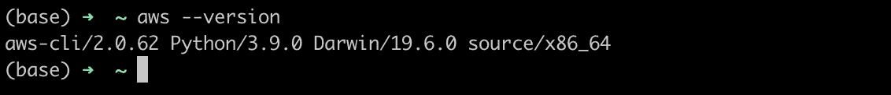
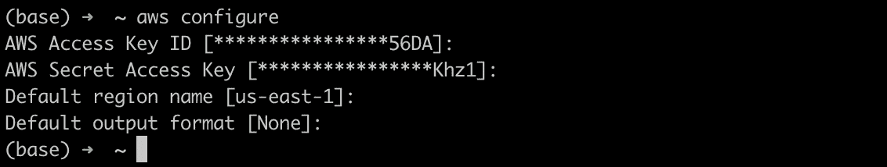

# 分两步在 Mac 上设置 AWS CLI

> 原文：<https://betterprogramming.pub/set-up-aws-cli-on-your-mac-in-2-steps-78faa3ea8a1e>

## 从命令行部署、管理 AWS 实例等等


潘卡杰·帕特尔在 [Unsplash](https://unsplash.com/?utm_source=medium&utm_medium=referral) 上的照片。

亚马逊网络服务(AWS)是云计算领域的市场领导者之一。它有很多服务，从基础设施即服务(IAAS)到平台即服务(PAAS)和一些软件即服务(SAAS)。

可以通过两种方式访问 AWS 服务:通过 GUI(AWS 管理控制台)和通过 API、CLI、SDK 等进行编程访问。

在本文中，我们将重点介绍如何设置 CLI 界面。

使用 AWS CLI 界面有两大好处:

*   它节省时间。
*   它有助于 AWS 服务中工作流/流程的自动化。

# 安装

## **先决条件**

*   创建或拥有一个 [AWS 账户](https://aws.amazon.com/free/?all-free-tier.sort-by=item.additionalFields.SortRank&all-free-tier.sort-order=asc&awsf.Free%20Tier%20Types=*all&awsf.Free%20Tier%20Categories=categories%23compute&trk=ps_a134p000004f2ogAAA&trkCampaign=acq_paid_search_brand&sc_channel=PS&sc_campaign=acquisition_EMEA&sc_publisher=Google&sc_category=Cloud%20Computing&sc_country=EMEA&sc_geo=EMEA&sc_outcome=acq&sc_detail=%2Baws%20%2Bcloud&sc_content=Cloud%20Hosting_bmm&sc_matchtype=b&sc_segment=467752261635&sc_medium=ACQ-P|PS-GO|Brand|Desktop|SU|Cloud%20Computing|Solution|EMEA|EN|Text|xx|EU&s_kwcid=AL!4422!3!467752261635!b!!g!!%2Baws%20%2Bcloud&ef_id=Cj0KCQiA7qP9BRCLARIsABDaZzgnTYvK-VTlugI-HRDw75TuvxDMjDL0vmSueTxmZHdSLQbqb7MV6ecaApV8EALw_wcB:G:s&s_kwcid=AL!4422!3!467752261635!b!!g!!%2Baws%20%2Bcloud)。
*   创建具有编程访问权限的 AWS 用户。编程访问允许用户使用带有 AWS 访问密钥 ID 和 AWS 秘密访问密钥的 CLI 界面。

*注意:创建用户时，记得下载包含访问密钥的 CSV 文件。*

*   为 Mac 安装 [Brew](https://brew.sh/) 。

让我们开始吧。

# **第一步**

走向您的终端，键入以下代码:

```
>> brew install awscli
```

一旦安装完毕，请使用下面的代码确保安装成功:

```
>> aws --version
```



作者照片。

如果您的输出看起来像上面的示例图像，您可以进入第二步。如果没有，您可能需要重新安装它或调试错误信息。

# **第二步**

在您的终端上，键入以下代码:

```
>> aws configure
```

一旦你输入并按下回车键，你将被提示一个接一个地输入四件事:

*   AWS 访问密钥 ID-这是您刚刚创建或已经创建的 AWS 用户的访问密钥 ID。该提示是正确填写所必需的。
*   AWS 秘密访问密钥—这是您刚刚创建或已经创建的 AWS 用户的秘密密钥。该提示是正确填写所必需的。
*   默认区域名称-您喜欢的 AWS 区域。这是可选的。您可以用一个相关的区域来填充它，或者将其留空并转到最后一个提示。
*   默认输出格式-输出格式默认为 JSON。这也是可选的。您可以用您喜欢的输出来填充它，或者将其留空并单击 enter。

下面是提示符的一个示例:



作者照片。

完成第 2 步后，就可以开始通过 CLI 界面访问 AWS 服务了。

最后一步是尝试访问并列出你的 AWS 账户中的所有 S3 股票。

为此，请键入以下代码:

```
>> aws s3 ls
```

如果出现与权限或访问被拒绝有关的错误，可能是因为您的用户组不允许访问 S3 服务。您可以联系您的管理员，授予您的用户访问 S3 的权限。如果出现与您的用户凭据不正确有关的错误，您可以重复第二步并输入正确的访问凭据。

感谢阅读！