# 10 分钟在 Google 云平台和 GitHub 上用 Firebase 设置 CI/CD

> 原文：<https://betterprogramming.pub/set-up-ci-cd-with-firebase-gcp-and-github-in-10-minutes-be76bee4579e>

## 自动化您的部署工作流程并设置持续集成


照片由[你好，我是尼克🎞](https://unsplash.com/@helloimnik?utm_source=medium&utm_medium=referral) on [Unsplash](https://unsplash.com?utm_source=medium&utm_medium=referral) 。

想了解如何自动化您的部署工作流吗？那就别再找了。在本指南中，我将介绍在 Google 云平台(GCP)上使用 Firebase 设置 CI/CD 所需的步骤。

但首先，为什么？

当你在一个团队中工作时，新的特性会不断地被实现。一旦实现了这些特性，就需要对它们进行测试、部署和发布。将您的应用从本地环境迁移到生产环境需要许多步骤。但是有一种方法可以自动化这些步骤。这就是持续集成(CI)和持续部署(CD)的用武之地。采用 CI/CD 可以帮助团队在早期发现 bug。

什么是持续集成(CI)和持续部署(CD)？

持续集成可以允许开发人员将变更推送到共享存储库。可以进行测试，以确保代码为下一阶段做好准备。

连续部署是一个过程，在这个过程中，新的代码更改在将代码转移到生产环境之前被推到一个阶段环境中。

# **创建一个 React 应用程序(可选)**

如果您已经准备好了一个应用程序，请继续执行步骤 1。

运行以下命令创建并启动一个名为`cicd-demo`的应用程序:

```
npx create-react-app cicd-demo
npm start
```

您应该会看到这样一个页面:

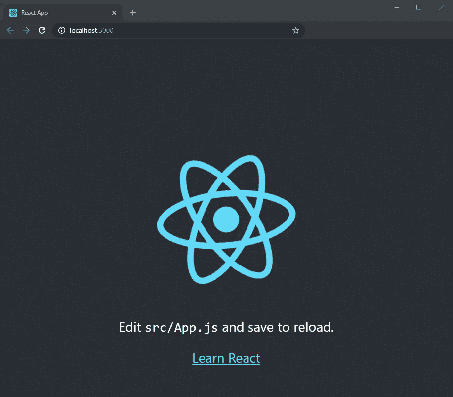

# **1。创建一个 Firebase 项目**

如果您有一个现有的 Firebase 项目，请转到步骤 2。

前往 [Firebase 的网站](https://firebase.google.com)，进入控制台，创建一个新项目。通过在 Firebase 中创建一个新项目，相同的项目也会出现在 GCP 控制台中。对于本指南，我创建了一个名为 CICD 演示的项目来完成这些步骤。

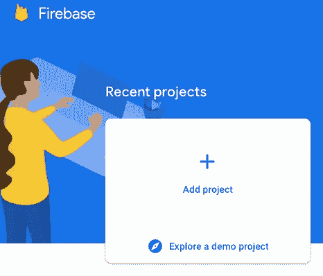

一旦您创建了一个项目，您应该会被定向到项目主页:

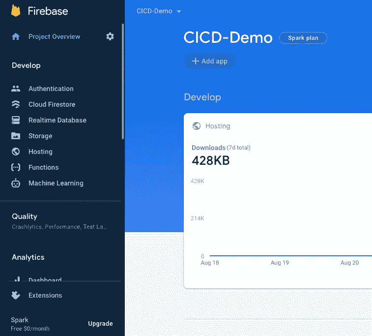

Firebase 项目主页

# **2。设置连续部署**

在您的项目根目录中，创建一个`cloudbuild.yaml`文件。该文件的目的是列出构建应用程序的必要步骤:

```
steps:
      # Install
      - name: 'gcr.io/cloud-builders/npm'
        args: ['install']
      # Build
      - name: 'gcr.io/cloud-builders/npm'
        args: ['run', 'build']
      # Deploy
      - name: gcr.io/project-id/firebase
        args: ['deploy', '--project=project-id', '--only=hosting']
```

# **3。将应用程序链接到 Firebase**

安装 Firebase CLI 并登录:

```
npm install -g firebase-tools
firebase login
```

认证后，您需要初始化您的项目:

```
firebase init
```

确保选择“使用现有项目”，因为我们已经在 Firebase 控制台中创建了一个项目。

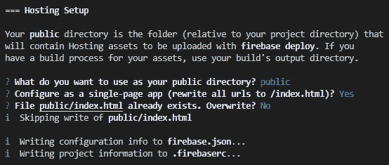

Firebase 托管设置

由于这是一个 React 应用程序，在`firebase.json`文件中将“公共”改为“构建”:

```
"public": "build"
```

# **4。建立 GCP 项目**

进入[谷歌云平台](https://console.cloud.google.com)网站，如果你有多个项目，在左上角选择正确的项目。

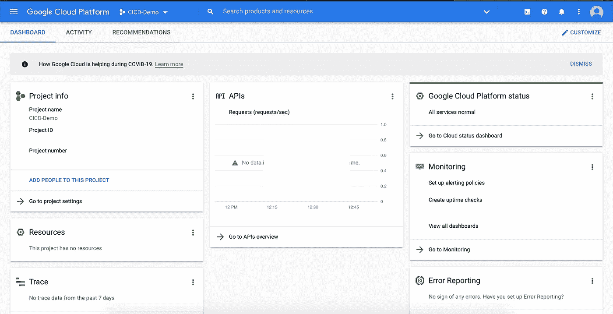

GCP 项目仪表板

打开侧边栏，进入“云构建”启用云构建 API:

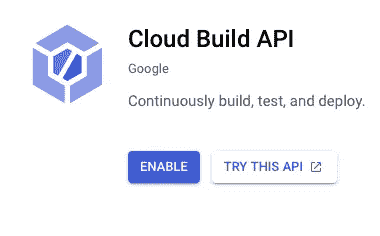

如果你刚到 GCP，你可能需要添加一个付费账户。转到侧边栏上的“帐单”选项卡来设置帐户:

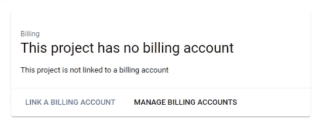

GCP 项目开单标签

# **5。创建一个触发器**

当您推入分支时，创建触发器将自动开始构建。在“云构建”选项卡中，选择“触发器”以启动流程:

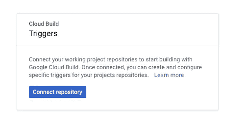

选择 GitHub 作为您的来源:

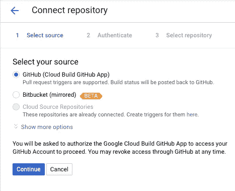

应该会弹出一个新窗口，让您验证您的 GitHub 帐户。完成后，选择正确的存储库并继续:

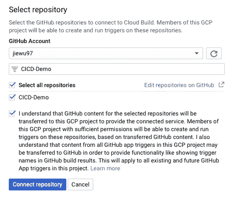

然后选择“创建推送触发器”您应该会看到这样的触发页面。当有推送到任何分支时，此触发器将开始构建:

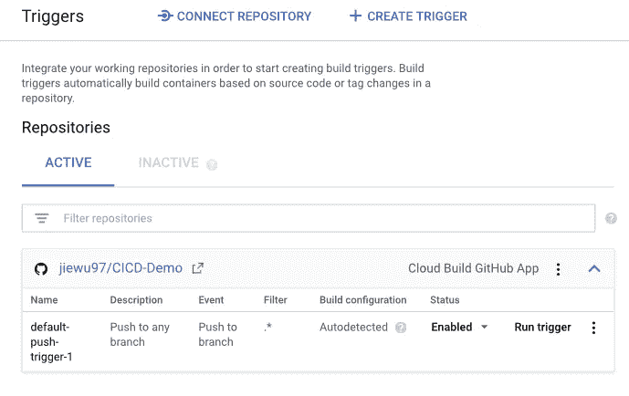

*可选:如果您想将触发限制为仅主分支，单击* `*default-push-trigger-1*` *进行编辑。*

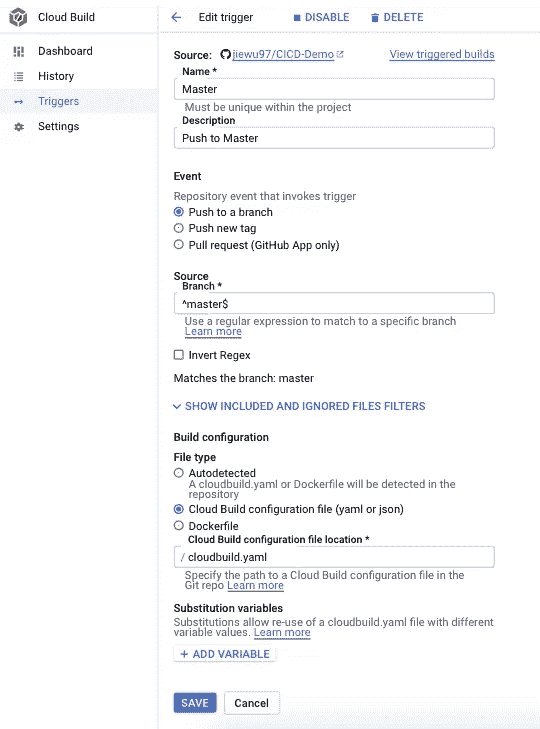

触发器编辑页面

# **6。安装 gcloud SDK**

去 [Cloud SDK 网站](https://cloud.google.com/sdk/)安装 gcloud SDK，然后初始化:

```
gcloud init
```

使用您的帐户登录并选择正确的项目。这将确保在下一步中为正确的项目创建图像。

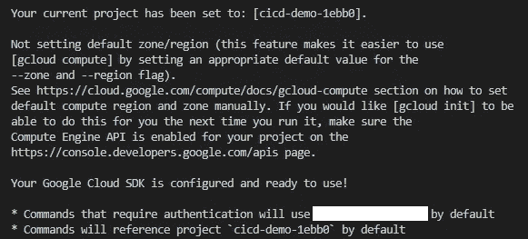

# **7。建立云构建者社区**

由于我们使用 Firebase，云构建没有正确的映像。因此，我们需要使用来自云构建器社区的图像。

转到它的 [GitHub 页面](https://github.com/GoogleCloudPlatform/cloud-builders-community)并克隆回购。确保将 repo 克隆到您的根目录。然后，导航到 Firebase 文件夹并打开 docker 文件。

用以下步骤替换 Dockerfile 文件中的内容:

```
FROM node
RUN apt-get update
RUN apt-get upgrade -y
RUN apt-get install dos2unix
RUN echo "Installing firebase tools ..."
RUN npm i -g firebase-tools
ADD firebase.bash /usr/bin
RUN chmod +x /usr/bin/firebase.bash
RUN dos2unix /usr/bin/firebase.bashENTRYPOINT [ "/usr/bin/firebase.bash" ]
```

由于文件格式的原因，Cloud Builder 社区 Dockerfile 文件中的原始内容将导致以下错误。要修复它，请安装 dos2unix:

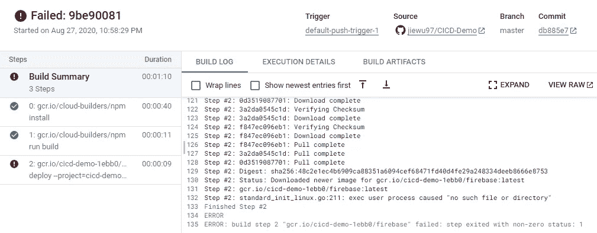

然后建立图像。输出应以`SUCCESS`结束。

```
gcloud builds submit .
```

# **8。配置权限**

既然已经设置了 CI/CD 管道，我们需要为 Firebase 部署授予服务帐户权限。进入 GCP 侧边栏和“IAM & Admin”标签。找出以 cloudbuild.gserviceaccount.com 结尾的成员。然后转到 edit，添加另一个名为“Firebase Admin”的角色如果你的应用程序使用 API，你必须添加“API Keys Admin”

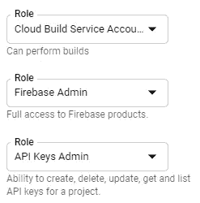

# 9。推送至 GitHub

创建一个 GitHub 库，如果你还没有这样做的话，把你的代码推上来。

```
git add --all
git commit -m 'initial commit'
git push
```

# 10。测试 CI/CD 管道

为了测试您的 CI/CD 管道，对您的项目进行一些更改，并向上推送代码。一旦你完成了修改，转到 GitHub，你应该会在提交旁边看到一个黄点。这表明构建正在进行中。您可以点击构建日志，转到“详细信息”，进入云构建历史。


正在构建

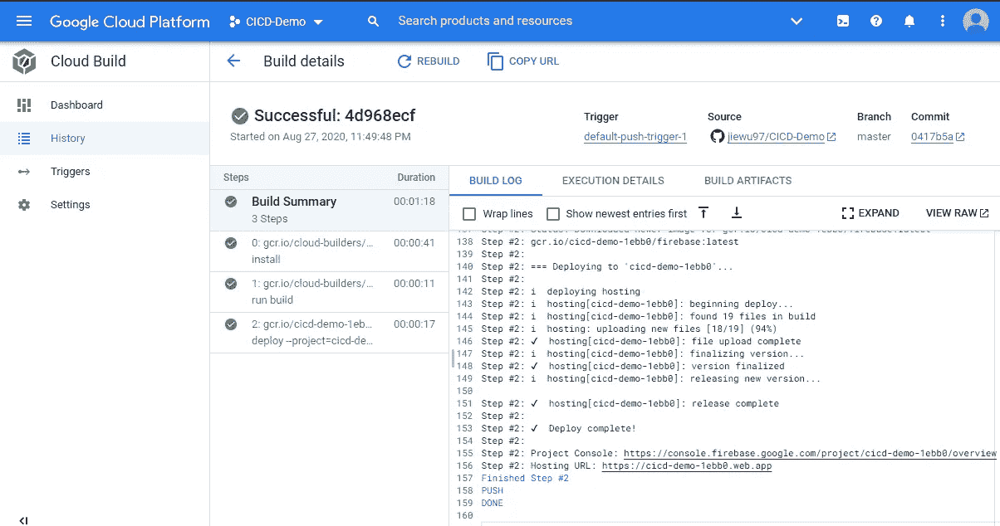

成功构建

# **参考文献**

1.  [CI/CD 教程](https://www.youtube.com/watch?v=Zd014DjonqE) by Fireship
2.  [https://cloud . Google . com/cloud-build/docs/deploying-builds/deploy-firebase](https://cloud.google.com/cloud-build/docs/deploying-builds/deploy-firebase)
3.  [https://cloud.google.com/sdk/docs/quickstart-windows](https://cloud.google.com/sdk/docs/quickstart-windows)