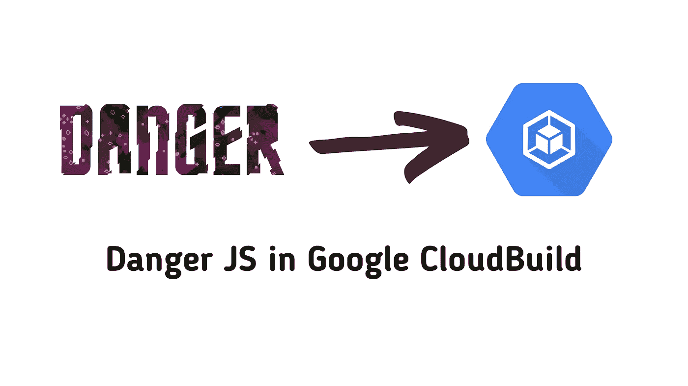
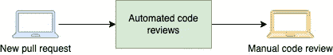
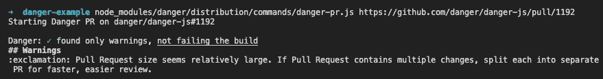
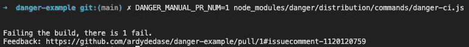
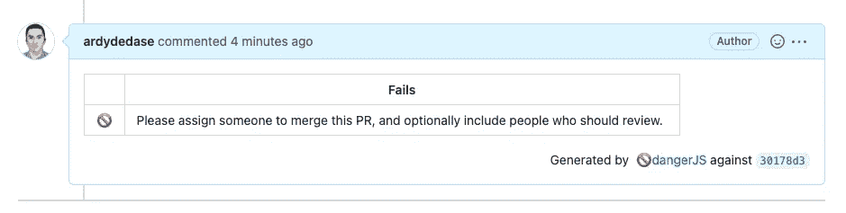
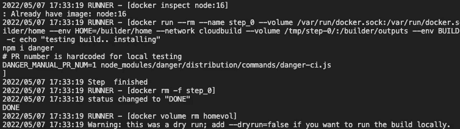
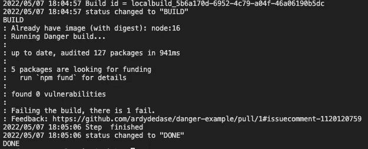
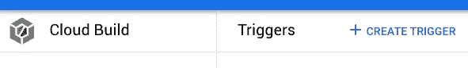
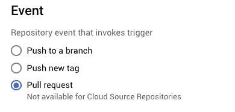

# 想要自动化代码审查吗？为不受支持的配置项设置危险 JS

> 原文：<https://betterprogramming.pub/set-up-danger-js-for-unsupported-cis-927a577ad03b>

## 以 Google CloudBuild 为例



# 什么是危险 JS？

*如果已经熟悉* [*危险 JS*](https://github.com/danger/danger-js) *可以跳过这一节。*

Danger JS 是一个开源的构建工具，允许软件开发人员自动化常见的代码审查杂务。使用 Danger JS，我们可以针对您的 Pull 请求(PR)自动运行一组规则，并留下代码审查注释。

**它自动化重复和琐碎的代码评审注释，如:**

> 他的 PR 很大，请考虑将其分解，以便我们可以有效地审查。

或者

> 请更新变更日志文件。

它帮助开发人员专注于审查 PR 试图解决的问题，而不是被代码审查杂务分散注意力。



自动处理代码审查杂务。

## 示例代码

为了更好地理解它是如何工作的，让我们以一个常见的用例为例:*如果一个拉取请求太大，我们想留下一个评论怎么办？*

您可以使用 Danger JS 编写一个 JS 函数来完成这个用例:

如果拉请求中更改的行数大于任意的`bigPRThreshold`值，那么在拉请求中留下“警告”注释。

## 设置危险 JS

下面，我总结了在您的配置项中设置危险 JS 所涉及的步骤。

*   通过运行`yarn add danger —dev`或`npm install --save-dev danger`安装危险。
*   创建一个*危险文件*，并将其包含在您的库的根文件夹中。可以是`dangerfile.ts`或者`dangerfile.js`。
*   设置一个 GitHub bot 和/或生成一个 GitHub 令牌，该令牌有足够的权限来评论、批准或拒绝一个 Pull 请求。
*   根据您使用的配置项，请参考此[设置说明列表](https://danger.systems/js/guides/getting_started.html#setting-up-danger-to-run-on-your-ci)。

# 我的配置项不受支持怎么办？

例如，如果您想在公司的内部 CI 或 Google Cloud Build 中使用 Danger JS。在撰写本文时，Google Cloud Build 还不是一个受支持的配置项。

我们有两个选择:

*   [促成](https://github.com/danger/danger-js/blob/main/CONTRIBUTING.md)回危。
*   **使用 Danger 的【手动模式】**， **w** 这就是我们将在接下来的章节中介绍的。

# 1.写下你的危险档案

从安装危险开始。我们将以 npm 为例。

```
npm install --save-dev danger
```

从我们的危险包裹中进口我们需要的东西。

```
import {danger, warn, markdown} from 'danger';
```

创造我们的`dangerfile.ts`。我们将实现以下功能:

*   `reviewLargePR()`与我们之前的代码示例相同
*   `ensurePRHasAssignee()`如果没有受让人，请购单失败。

我们的`dangerfile.ts`:

# 2.使用 danger-pr 进行本地测试

我们可以使用`danger-pr.js`在本地测试我们的`dangerfile`。这不会在拉取请求上留下注释。它将在终端中打印出预期的公关评论。这个选项允许我们在本地调试`dangerfile`,而不会在一个真实的 PR 上发送垃圾评论。

在您的存储库的根文件夹中运行以下命令，与`dangerfile.ts`在同一个文件夹中:

```
# Your GitHub API token
export DANGER_GITHUB_API_TOKEN=<yourtoken>node_modules/danger/distribution/commands/danger-pr.js [https://github.com/danger/danger-js/pull/1192](https://github.com/danger/danger-js/pull/1192)
```

在上面的例子中，我们使用一个[公共公关来威胁 JS](https://github.com/danger/danger-js/pull/1192) 的 GitHub 库。在写这篇文章的时候，这篇文章已经修改了大约 7000 行。根据我们的危险文件规则，这个数字是“大”的。

我们的输出将显示 PR 很大:



# 3.使用“手动模式”在危险 ci 下运行

通过使用“手动模式”, Danger 可以支持不在其当前支持列表中的配置项。

## 运行危险的 CI 命令

既然我们的 dangerfile 像预期的那样工作，让我们使用`danger-ci`在本地运行。该命令将在我们指定的 PR 上留下注释。

ℹ️确保您在运行 CI 命令时已经配置了所需的 GitHub 访问权限。

## 设置环境变量

我们可以通过设置所需的环境变量来启用手动模式。

设置您的配置项的名称:

```
# Replace with your unsupported CI's name, e.g. CloudBuild
export DANGER_MANUAL_CI=<UNSUPPORTED_CI_NAME>
```

指定您的 GitHub 存储库:

```
# Replace with your GitHub repository
export DANGER_MANUAL_GH_REPO=<githuborg/githubrepo>
```

如果您还没有设置 GitHub API 访问令牌，请设置:

```
# Replace with your GitHub API token
export DANGER_GITHUB_API_TOKEN=<yourtoken>
```

## 运行危险配置项命令

既然我们已经设置了所需的环境变量👆，运行`danger-ci`命令:

```
DANGER_MANUAL_PR_NUM=<PR Number> node_modules/danger/distribution/commands/danger-ci.js
```

环境变量`DANGER_MANUAL_PR_NUM`是我们希望 Danger 查看的 PR 的 PR 号。比如你的 PR 是:`[https://github.com/danger/danger-js/pull/1192](https://github.com/danger/danger-js/pull/1192)`，那么环境变量就是`DANGER_MANUAL_PR_NUM=1192`。

## 一个例子

ℹ️注意，我们可以选择编写一个 shell 脚本来运行本例中的所有命令，而不是一次运行一个命令。

让我们以我设置的一个公共 GitHub Pull 请求为例。

*   储存库是[ardydedase/danger-示例](https://github.com/ardydedase/danger-example)。
*   [示例公关](https://github.com/ardydedase/danger-example)是[https://github.com/ardydedase/danger-example/pull/1](https://github.com/ardydedase/danger-example/pull/1)。请注意我们的 PR 号`1`。
*   我们将使用相同的`dangerfile`来检查 PR 是否太大以及它是否有受让人。*参见我们示例库中的*[*danger file . ts*](https://github.com/ardydedase/danger-example/blob/main/dangerfile.ts#L8-L13)*。*

让我们设置我们的环境变量:

```
# Replace with your unsupported CI's name, e.g. CloudBuild
export DANGER_MANUAL_CI=MyCI
# Replace with your GitHub repository
export DANGER_MANUAL_GH_REPO=ardydedase/danger-example
# Replace with your GitHub API token
export DANGER_GITHUB_API_TOKEN=<yourtoken>
```

然后使用 PR 号运行`danger-ci`命令，在本例中是`1`:

```
DANGER_MANUAL_PR_NUM=1 node_modules/danger/distribution/commands/danger-ci.js
```

在我们的示例中，PR 失败是因为没有为 PR 分配用户。



GitHub 上的公关评论将是:



☝️:我在这个演示中使用了我的个人 GitHub 令牌，所以 PR 上显示的是我的用户名。理想情况下，我们应该建立一个 GitHub 机器人。

我们将在不支持的配置项中执行相同的步骤:设置环境变量并运行`danger-ci`命令。我们将在下一节讨论这个问题。👇

# 4.使用不支持的配置项在本地运行 Danger(Google cloud build)

在步骤 3 中测试了我们的 dangerfile 之后，我们现在已经准备好用我们不支持的 CI 配置 Danger 了。

在我们的示例中，我们将使用 Google CloudBuild 作为 CI，因为:

*   在撰写本文时，Google CloudBuild 还不是一个受支持的 CI in Danger JS。
*   它有一个本地云构建器 CLI 工具，我们可以使用它在本地测试我们的构建配置 YAML。

## Google 云先决条件

我们需要安装我们的 CloudBuild CLI 工具，以便在本地使用 Google Cloud 测试我们的 Danger build。请参考以下链接的文档:

*   先决条件:确保您已经安装了 Google Cloud CLI。[参考本文件](https://cloud.google.com/sdk/docs/install-sdk)。
*   安装本地云构建器 CLI 。我们将需要这个来运行`cloud-build-local`。

## CloudBuild 配置文件

让我们创建我们的配置文件:

ℹ️用你的令牌替换掉`GITHUB_API_TOKEN`。

当我们运行`cloud-build-local`时，默认情况下`dryrun`是启用的，除非我们另外指定。这给了我们检查构建语法的选项，节省了我们测试的时间。让我们从运行下面的`cloud-build-local`命令开始，确保我们的配置文件没有语法错误:

```
cloud-build-local --config=./cloudbuild-local.yaml .
```

如果上述命令成功，输出将是:



现在让我们将`dryrun`标志设置为 false，以便在本地运行危险构建:

```
cloud-build-local --config=./cloudbuild-local.yaml --dryrun=false .
```

👆以上命令需要几分钟才能完成。下载节点 docker 映像将花费最多的时间。

成功的构建将显示类似的输出，如下所示:



它还应该留下公关评论:


# 5.Google 云设置

现在，我们的本地配置按预期工作，我们可以在我们的生产云构建设置中使用相同的配置。

## 生产环境的配置

我们的生产设置几乎是相同的，除了我们从 CloudBuild 检索 PR 号。我们将把`$_PR_NUMBER`分配给`DANGER_MANUAL_PR_NUM`，而不是硬编码。

我们的危险 CI 命令将是:

```
DANGER_MANUAL_PR_NUM=$_PR_NUMBER node_modules/danger/distribution/commands/danger-ci.js
```

我们还应该将我们的 GitHub API 令牌存储在 Google Cloud 的秘密管理器或您正在使用的任何“秘密”管理器中。

如果我们使用 Google Secrets manager，我们需要更新我们的构建配置来使用它:

```
availableSecrets:
  secretManager:
    - versionName: projects/$PROJECT_ID/secrets/<my-github-token>/versions/1
      env: DANGER_GITHUB_API_TOKEN
```

用你的秘密名字替换`<my-github-token>`。

我们使用 Pull Request number `$_PR_NUMBER`和 Secrets Manager 中的 secret 构建配置:

## 设置 CloudBuild 触发器

最后一步是配置我们的 CloudBuild 触发器，以确保它按预期工作。

在 Google Cloud Console 中，通过在 CloudBuild 中创建新的触发器:



创建触发器时，请确保选择“拉动请求”作为事件。这使得我们的配置文件可以访问`$_PR_NUMBER`。如果我们不这样做，`$_PR_NUMBER`将返回一个空字符串。



选择*存储库*作为我们的配置文件的位置。指定构建配置文件的路径。


您可以保留其余的输入字段。

这就是我们所需要的。现在，您已经有了一个很好的 Google CloudBuild 设置，它具有由 Danger JS 提供支持的自动化代码审查功能！

ℹ️:尽管我们使用 TypeScript 或 JavaScript 编写 Dangerfile，但 Danger JS 可以与任何代码库一起工作，而与编程语言无关。

你可以在这里找到 GitHub 库供你参考:

[](https://github.com/ardydedase/danger-example) [## GitHub-ardydedase/danger-示例

### 使用 npm 安装危险。设置 GitHub 令牌 env 变量。导出 DANGER_GITHUB_API_TOKEN=这个就不评论了…

github.com](https://github.com/ardydedase/danger-example) [](https://blog.ardy.me/membership) [## 通过我的推荐链接- blog.ardy.me 加入 Medium

### 作为一个媒体会员，你的会员费的一部分会给你阅读的作家，你可以完全接触到每一个故事…

blog.ardy.me](https://blog.ardy.me/membership)