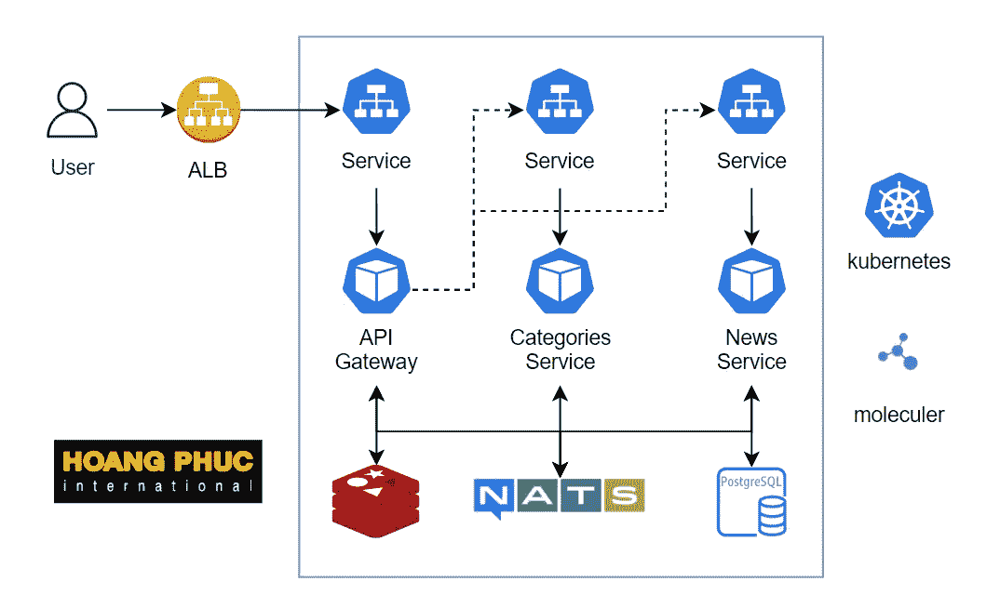

# 在 Kubernetes 上设置微服务—编写配置文件

> 原文：<https://betterprogramming.pub/set-up-microservice-on-kubernetes-write-config-file-8df7c2b07a4c>

## 将微服务部署到 Kubernetes


由[萨凡纳·维克菲尔德](https://unsplash.com/@sw_creates?utm_source=medium&utm_medium=referral)在 [Unsplash](https://unsplash.com?utm_source=medium&utm_medium=referral) 上拍摄的照片

在本教程中，我们将学习如何在 Kubernetes 上建立一个微服务系统。在第一部分中，我们将讨论如何为微服务系统的每个组件编写配置文件。

这是在 Kubernetes 上设置微服务系列的第一部分:

1.  在 Kubernetes 上设置一个微服务——写配置文件。
2.  [在 Kubernetes 上建立一个微服务——用 ArgoCD 自动化 Kubernetes](https://medium.com/@hmquan08011996/setup-microservices-on-kubernetes-automating-kubernetes-with-argocd-cb94622dac5b)。
3.  在 Kubernetes 上设置微服务-实施 CI/CD。

# 系统结构



我们使用一个叫做 [Moleculer](https://moleculer.services/docs/0.14/) 的框架来构建上图中的微服务系统。Moleculer 是一个用于 [Node.js](https://nodejs.org/en/) 的快速、现代、强大的微服务框架。它帮助您构建高效、可靠的&可扩展服务。Moleculer 为构建和管理您的微服务提供了许多功能。

[API 网关](https://moleculer.services/docs/0.14/moleculer-web.html)向最终用户公开分子服务。网关是运行 HTTP、WebSockets 等的常规分子服务。)服务器。

NATS，也就是传送器，它是服务用来交换消息的通信总线。它传输事件、请求和响应。

类别和新闻服务是一个简单的 JavaScript 模块，包含了复杂应用程序的一部分。它是孤立的，自成一体的。

缓存系统使用 Redis，数据库使用 Postgres。

我已经简要介绍了我们将在 Kubernetes 上部署的架构，我们现在将开始工作。

# 构建 Docker 容器映像

从[https://github.com/hoalongnatsu/microservices](https://github.com/hoalongnatsu/microservices)克隆源代码。转到文件夹`microservices/code`并运行以下命令来构建一个映像。**图像名称应为** `**<docker-hub-username>/microservice**`。

```
git clone [https://github.com/hoalongnatsu/microservices.git](https://github.com/hoalongnatsu/microservices.git) && cd microservices/code
docker build . -t 080196/microservice
docker push 080196/microservice
```

接下来，我们将为每个组件编写一个配置文件。

# 部署 API 网关

首先，我们为 API 网关编写一个配置文件。创建一个名为`api-gateway-deployment.yaml`的文件。

```
apiVersion: apps/v1
kind: Deployment
metadata:
  name: api-gateway
  labels:
    component: api-gateway
spec:
  revisionHistoryLimit: 1
  selector:
    matchLabels:
      component: api-gateway
  template:
    metadata:
      labels:
        component: api-gateway
    spec:
      containers:
        - name: api-gateway
          image: 080196/microservice
          ports:
            - name: http
              containerPort: 3000
              protocol: TCP
          livenessProbe:
            httpGet:
              path: /
              port: http
          readinessProbe:
            httpGet:
              path: /
              port: http
          env:
            - name: NODE_ENV
              value: testing
            - name: SERVICEDIR
              value: dist/services
            - name: SERVICES
              value: api
            - name: PORT
              value: "3000"
            - name: CACHER
              value: redis://redis:6379
            - name: DB_HOST
              value: postgres
            - name: DB_PORT
              value: "5432"
            - name: DB_NAME
              value: postgres
            - name: DB_USER
              value: postgres
            - name: DB_PASSWORD
              value: postgres
            - name: TRANSPORTER
              value: nats://nats:4222
```

我们之前建立的名为`080196/microservice`的映像，包括三个名为`api`、`categories`和`news`的服务。我们通过将服务的名称传递给名为 SERVICES 的环境变量来选择需要运行的服务。

在上面的配置文件中，我们将 API 网关的值作为`api`传递。

如果您查看 code/services/api.service.ts 文件中的代码，我们将在第 15 行看到 api 网关的设置。

```
...
settings: {
  port: process.env.PORT || 3001,
...
```

使用端口 env，API 网关监听端口 3000。CACHER env 用于声明服务使用的 Redis 主机。前缀为 DB_ 的 env 用于数据库。运行以下命令创建部署。

```
kubectl apply -f api-gateway-deployment.yaml
```

结果。

```
$ kubectl get deploy
NAME         READY   UP-TO-DATE   AVAILABLE   AGE
api-gateway  0/1     1            0           100s
```

我们已经创建了 API 网关，但是当你得到 pod 时。您将看到它没有成功运行，而是会一次又一次地重新启动。

```
$ kubectl get pod
NAME                           READY   STATUS    RESTARTS   AGE
api-gateway-79688cf6f5-g88f2   0/1     Running   2          93s
```

检查日志以找出原因。

```
$ kubectl logs api-gateway-79688cf6f5-g88f2
...
[2021-11-07T14:53:37.449Z] ERROR api-gateway-79688cf6f5-g88f2-28/CACHER: Error: getaddrinfo EAI_AGAIN redis
    at GetAddrInfoReqWrap.onlookup [as oncomplete] (dns.js:60:26) {
  errno: 'EAI_AGAIN',
  code: 'EAI_AGAIN',
  syscall: 'getaddrinfo',
  hostname: 'redis'
}
```

此处显示的错误是 pod 无法连接到 Redis，因为我们尚未创建任何 Redis，接下来我们将创建 Redis。

# 部署 Redis

创建一个名为`redis-deployment.yaml`的文件。

```
apiVersion: apps/v1
kind: Deployment
metadata:
  name: redis
  labels:
    component: redis
spec:
  strategy:
    type: Recreate
  selector:
    matchLabels:
      component: redis
  template:
    metadata:
      labels:
        component: redis
    spec:
      containers:
        - name: redis
          image: redis
          ports:
            - containerPort: 6379
```

运行以下命令。

```
$ kubectl apply -f redis-deployment.yaml
deployment.apps/redis created$ kubectl get deploy
NAME          READY   UP-TO-DATE   AVAILABLE   AGE
api-gateway   0/1     1            0           16m
redis         1/1     1            1           14s
```

接下来，如果我们想要连接到 Redis，我们需要为它创建一个服务资源。创建一个名为`redis-service.yaml`的文件。

```
apiVersion: v1
kind: Service
metadata:
  name: redis
  labels:
    component: redis
spec:
  selector:
    component: redis
  ports:
    - port: 6379
```

运行命令。

```
kubectl apply -f redis-service.yaml
```

重新启动 API 网关部署。

```
kubectl rollout restart deploy api-gateway
```

检查 API 网关的日志，我们仍然看到它没有运行。

```
$ kubectl logs api-gateway-7f4d5f54f-lzgkd
...
[2021-11-07T15:05:10.388Z] INFO  api-gateway-7f4d5f54f-lzgkd-28/CACHER: Redis cacher connected.Sequelize CLI [Node: 12.13.0, CLI: 6.2.0, ORM: 6.6.5]Loaded configuration file "migrate/config.js".
Using environment "testing".ERROR: connect ECONNREFUSED 127.0.0.1:5432Error: Command failed: sequelize-cli db:migrate
ERROR: connect ECONNREFUSED 127.0.0.1:5432
    at ChildProcess.exithandler (child_process.js:295:12)
    at ChildProcess.emit (events.js:210:5)
    at maybeClose (internal/child_process.js:1021:16)
    at Process.ChildProcess._handle.onexit (internal/child_process.js:283:5) {
  killed: false,
  code: 1,
  signal: null,
  cmd: 'sequelize-cli db:migrate'
} 
Sequelize CLI [Node: 12.13.0, CLI: 6.2.0, ORM: 6.6.5]Loaded configuration file "migrate/config.js".
Using environment "testing".ERROR: connect ECONNREFUSED 127.0.0.1:5432
...
```

显示的错误是 pod 无法连接到数据库。接下来，我们将创建一个数据库。

# 部署数据库

为了部署数据库，我们使用 StatefulSet。创建一个名为`postgres-statefulset.yaml`的文件。

```
apiVersion: apps/v1
kind: StatefulSet
metadata:
  name: postgres
  labels:
    component: postgres
spec:
  selector:
    matchLabels:
      component: postgres
  serviceName: postgres
  template:
    metadata:
      labels:
        component: postgres
    spec:
      containers:
        - name: postgres
          image: postgres:11
          ports:
            - containerPort: 5432
          volumeMounts:
            - mountPath: /var/lib/postgresql/data
              name: postgres-data
          env:
            - name: POSTGRES_DB
              value: postgres
            - name: POSTGRES_USER
              value: postgres
            - name: POSTGRES_PASSWORD
              value: postgres
  volumeClaimTemplates:
    - metadata:
        name: postgres-data
      spec:
        accessModes:
          - ReadWriteOnce
        storageClassName: hostpath
        resources:
          requests:
            storage: 5Gi
```

**`**storageClassName**`**字段取决于您的 Kubernetes 集群，您将指定相应的** `**storageClassName**` **字段。**运行以下命令创建 STS。**

```
kubectl apply -f postgres-statefulset.yaml
```

**为数据库服务资源创建一个名为`postgres-service.yaml`的文件。**

```
apiVersion: v1
kind: Service
metadata:
  name: postgres
  labels:
    component: postgres
spec:
  selector:
    component: postgres
  ports:
    - port: 5432
```

**创造它。**

```
kubectl apply -f postgres-service.yaml
```

**重新启动 API 网关部署。**

```
kubectl rollout restart deploy api-gateway
```

**检查 API 网关的日志，我们将看到它正在成功运行。**

**接下来，我们部署类别和新闻服务。**

# **部署类别和新闻服务**

**创建一个名为`categories-news-deployment.yaml`的文件。**

```
apiVersion: apps/v1
kind: Deployment
metadata:
  name: categories-service
  labels:
    component: categories-service
spec:
  revisionHistoryLimit: 1
  selector:
    matchLabels:
      component: categories-service
  template:
    metadata:
      labels:
        component: categories-service
    spec:
      containers:
        - name: categories-service
          image: 080196/microservice
          env:
            - name: NODE_ENV
              value: testing
            - name: SERVICEDIR
              value: dist/services
            - name: SERVICES
              value: categories
            - name: CACHER
              value: redis://redis:6379
            - name: DB_HOST
              value: postgres
            - name: DB_PORT
              value: "5432"
            - name: DB_NAME
              value: postgres
            - name: DB_USER
              value: postgres
            - name: DB_PASSWORD
              value: postgres
            - name: TRANSPORTER
              value: nats://nats:4222---
apiVersion: apps/v1
kind: Deployment
metadata:
  name: news-service
  labels:
    component: news-service
spec:
  revisionHistoryLimit: 1
  selector:
    matchLabels:
      component: news-service
  template:
    metadata:
      labels:
        component: news-service
    spec:
      containers:
        - name: news-service
          image: 080196/microservice
          env:
            - name: NODE_ENV
              value: testing
            - name: SERVICEDIR
              value: dist/services
            - name: SERVICES
              value: news
            - name: CACHER
              value: redis://redis:6379
            - name: DB_HOST
              value: postgres
            - name: DB_PORT
              value: "5432"
            - name: DB_NAME
              value: postgres
            - name: DB_USER
              value: postgres
            - name: DB_PASSWORD
              value: postgres
            - name: TRANSPORTER
              value: nats://nats:4222
```

**创造它。**

```
kubectl apply -f categories-news-deployment.yaml
```

**接下来，我们为我们的`moleculer`服务创建一个可以与他人通信的 NATS 传输器。**

# **部署 NATS**

**创建一个名为`nats-deployment.yaml`的文件。**

```
apiVersion: apps/v1
kind: Deployment
metadata:
  name: nats
  labels:
    component: nats
spec:
  strategy:
    type: Recreate
  selector:
    matchLabels:
      component: nats
  template:
    metadata:
      labels:
        component: nats
    spec:
      containers:
        - name: nats
          image: nats
          ports:
            - containerPort: 4222
```

**创造它。**

```
kubectl apply -f nats-deployment.yaml
```

**为 NATS 创建一个名为`nats-service.yaml`的文件。**

```
apiVersion: v1
kind: Service
metadata:
  name: nats
  labels:
    component: nats
spec:
  selector:
    component: nats
  ports:
    - port: 4222
```

**创造它。**

```
kubectl apply -f nats-service.yaml
```

**检查 API 网关的日志，我们会看到类别和新闻服务连接到 API 网关。**

**所以我们的应用程序已经成功运行😁。**

**但是您是否注意到我们声明的 env 变量在我们的部署文件中有点长且重复？我们可以说得更清楚。**

# **通用配置声明**

**我们可以使用 ConfigMap 进行集中配置。创建一个名为`microservice-cm.yaml`的文件。**

```
apiVersion: v1
kind: ConfigMap
metadata:
  name: microservice-cm
  labels:
    component: microservice-cm
data:
  NODE_ENV: testing
  SERVICEDIR: dist/services
  TRANSPORTER: nats://nats:4222
  CACHER: redis://redis:6379
  DB_NAME: postgres
  DB_HOST: postgres
  DB_USER: postgres
  DB_PASSWORD: postgres
  DB_PORT: "5432"
```

**创造它。**

```
kubectl apply -f microservice-cm.yaml
```

**更新文件`api-gateway-deployment.yaml`。**

```
apiVersion: apps/v1
kind: Deployment
metadata:
  name: api-gateway
  labels:
    component: api-gateway
spec:
  revisionHistoryLimit: 1
  selector:
    matchLabels:
      component: api-gateway
  template:
    metadata:
      labels:
        component: api-gateway
    spec:
      containers:
        - name: api-gateway
          image: 080196/microservice
          ports:
            - name: http
              containerPort: 3000
              protocol: TCP
          livenessProbe:
            httpGet:
              path: /
              port: http
          readinessProbe:
            httpGet:
              path: /
              port: http
          env:
            - name: SERVICES
              value: api
            - name: PORT
              value: "3000"
          envFrom:
            - configMapRef:
                name: microservice-cm
```

**更新文件`categories-news-deployment.yaml`。**

```
apiVersion: apps/v1
kind: Deployment
metadata:
  name: categories-service
  labels:
    component: categories-service
spec:
  revisionHistoryLimit: 1
  selector:
    matchLabels:
      component: categories-service
  template:
    metadata:
      labels:
        component: categories-service
    spec:
      containers:
        - name: categories-service
          image: 080196/microservice
          env:
            - name: SERVICES
              value: categories
          envFrom:
            - configMapRef:
                name: microservice-cm---
apiVersion: apps/v1
kind: Deployment
metadata:
  name: news-service
  labels:
    component: news-service
spec:
  revisionHistoryLimit: 1
  selector:
    matchLabels:
      component: news-service
  template:
    metadata:
      labels:
        component: news-service
    spec:
      containers:
        - name: news-service
          image: 080196/microservice
          env:
            - name: SERVICES
              value: news
          envFrom:
            - configMapRef:
                name: microservice-cm
```

**更新一下。**

```
kubectl apply -f api-gateway-deployment.yaml
kubectl apply -f categories-news-deployment.yaml
```

**检查我们的系统。**

```
$ kubectl get pod
NAME                                  READY   STATUS    RESTARTS  
api-gateway-86b67895fd-cphmv          1/1     Running   0
categories-service-84c74cd87c-zjtd2   1/1     Running   0
nats-65687968fc-2drwp                 1/1     Running   0
news-service-69f45b8668-kv9dm         1/1     Running   0
postgres-0                            1/1     Running   0
redis-58c4799ccc-qhv2z                1/1     Running   0
```

**因此，我们已经将微服务部署到 Kubernetes，正如您所见，这并不困难，不是吗？**

**如果你喜欢我的文章，你可以给我买杯咖啡来支持我。☕️，谢谢你。**