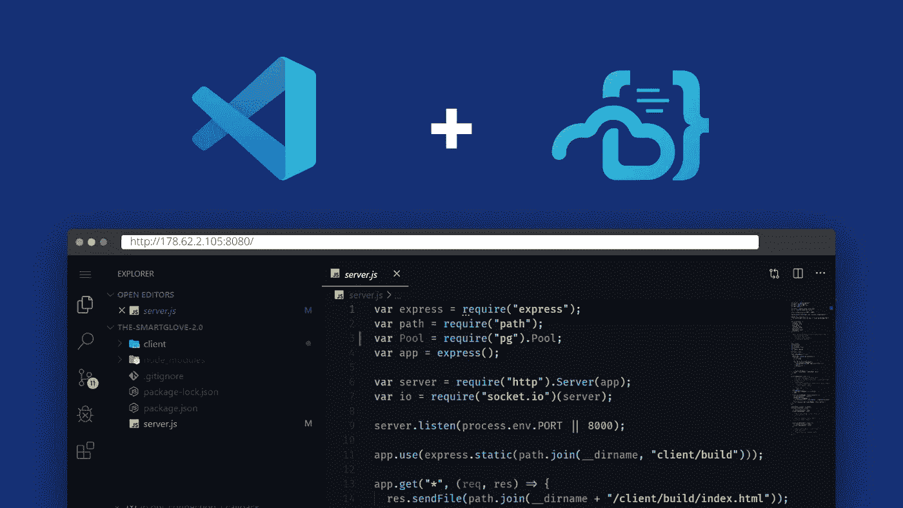
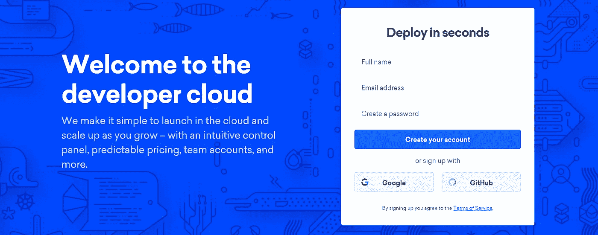
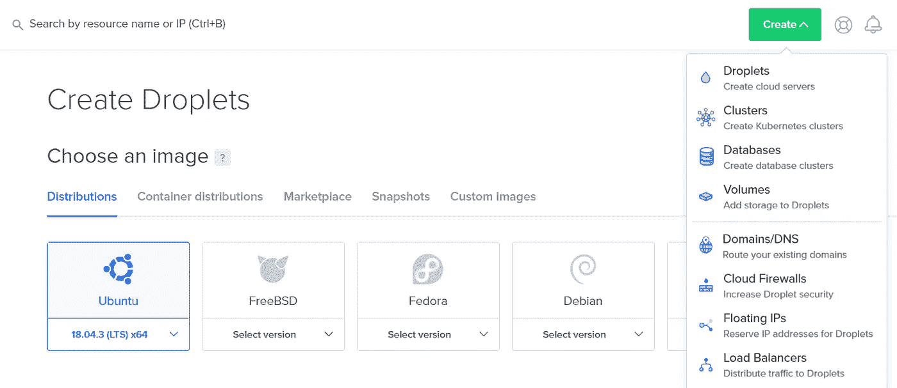
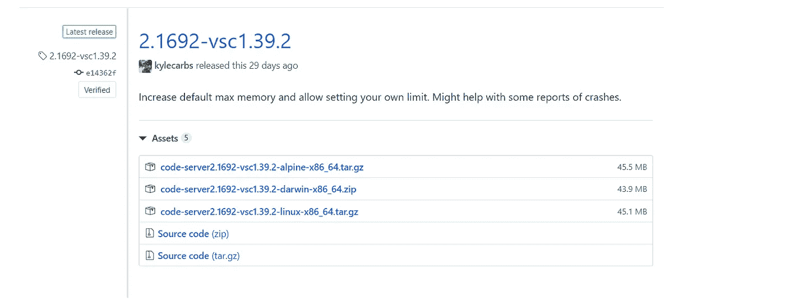
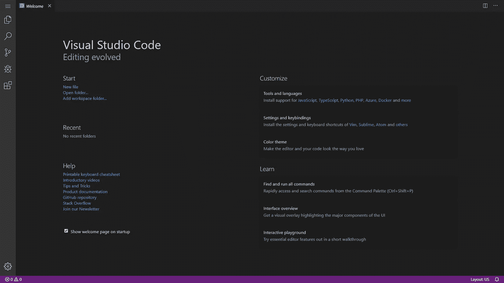
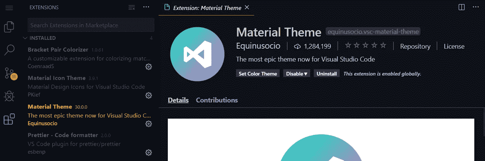
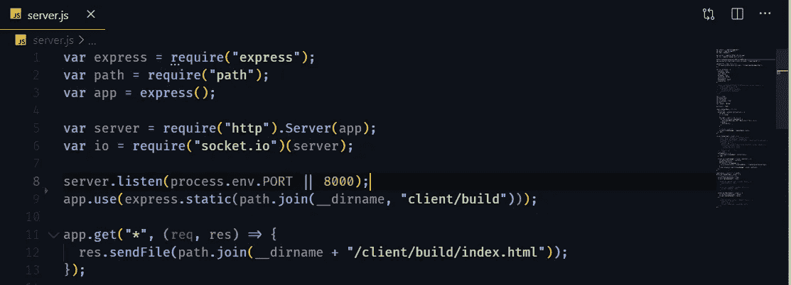
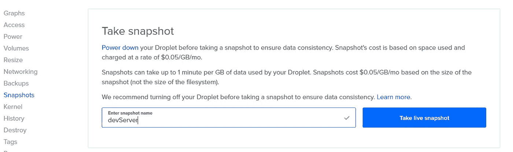
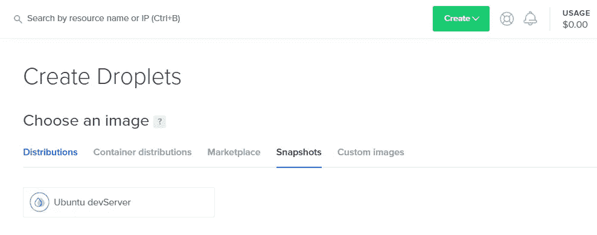

# 在浏览器中使用 VS 代码设置远程开发

> 原文：<https://betterprogramming.pub/set-up-remote-development-with-vs-code-in-your-browser-4b5750d3d141>

## 只需点击一个按钮，即可远程启动您喜欢的开发设置



在本指南中，我将通过[数字海洋](https://www.digitalocean.com/)和 [VS 代码服务器](https://github.com/cdr/code-server)的设置，以及我用来创建一个干净、简单的工作流程的调整。

代码服务器在可通过浏览器访问的远程服务器上运行 [Visual Studio 代码](https://code.visualstudio.com/)。

# 我为什么需要这个？

*   一致的环境:有了这样的设置，你可以在 Chromebook、平板电脑和笔记本电脑上用一致的开发环境编写代码，感觉就像在家一样。
*   多平台:您将拥有 VS 代码的能力和灵活性，可以从任何浏览器访问，包括平板电脑。
*   服务器驱动的:您可以利用大型云服务器来加速测试、编译、下载等等。有了这个 DigitalOcean 设置，服务器可以扩展到任何规模。
*   电池寿命:由于所有密集型计算都在您的服务器上运行，因此您可以在旅途中保持电池寿命。

# 设置

我发现以下设置在灵活性、生产率和成本效益方面非常有用。

1.  从预先构建的图像，从移动设备创建水滴。
2.  从 GitHub 获取最新更新。(启动)
3.  用代码服务器在浏览器中提供 VS 代码。
4.  做事。
5.  推送至 GitHub。
6.  摧毁水滴。

# 液滴生成

对于指南，我选择使用 [DigitalOcean](https://m.do.co/c/aa2a5d78f490) ，因为它们的设置过程简单而直观——然而，其他平台也可以。

## 签约雇用

如果您还没有帐户，请在 [DigitalOcean](https://m.do.co/c/aa2a5d78f490) 上创建一个帐户。



## 创建水滴

现在是时候创建我们的 Droplet 了——VS Code Server 将在其中运行的虚拟服务器，以及您的项目。



*   图片:Ubuntu 18.04(默认)。
*   计划:15 美元/月，2 GB/2 CPU(最理想)。
*   地区:纽约(默认)。
*   选项:(本教程不需要)。
*   认证:[创建一个新的 SSH 密钥](https://www.digitalocean.com/docs/droplets/how-to/add-ssh-keys/create-with-putty/)并[将其上传到仪表板](https://www.digitalocean.com/docs/droplets/how-to/add-ssh-keys/to-account/)。

现在点击*创建*按钮！

## 使用 SSH 连接

就我个人而言，我使用 [Termius](https://termius.com/) ，但是任何 SSH 客户端都可以工作。这里是数字海洋的[简明指南。](https://www.digitalocean.com/docs/droplets/how-to/connect-with-ssh/putty/)

# 代码服务器安装

是时候设置代码服务器了。转到[最新版本页面](https://github.com/cdr/code-server/releases/latest)，复制 Linux 最新版本的链接。



在控制台中执行以下命令:

```
# Download latest release from Github (insert copied link)
wget https://github.com/cdr/code-server/releases/download/{version}/code-server{version}-linux-x64.tar.gz # Unpack tarball
tar -xvzf code-server{version}-linux-x64.tar.gz# Run Code Server
cd code-server{version}-linux-x64
./code-server
```

从 DigitalOcean 控制面板中检索您的 Droplet 的公共 IP 地址，并将浏览器指向`http://{PUBLIC IP ADDRESS}:8080/`。

从控制台输出中复制生成的密码，并登录到代码服务器。

现在，您应该可以直接从浏览器中获得完整的 VS 代码功能——这多酷啊！



# 用户化

## 证明

默认情况下，使用随机生成的密码启用密码身份验证。您可以设置`PASSWORD`环境变量来使用您自己的:

```
sudo nano /etc/environmentand append the following:
PASSWORD= “Your Password”sudo reboot
```

## 扩展ˌ扩张

由于不能使用官方的 VS 代码市场，Coder 创建了一个管理开源扩展的定制市场[。](https://github.com/cdr/code-server#extensions)



## 字体

如果您在本地计算机上安装了字体，所有字体都可以正常工作，因为是您的浏览器呈现文本。例如， [FiraCode](https://github.com/tonsky/FiraCode) :



# 建筑形象

## 开机启动

对于设置，我添加了以下 cron 作业，以便在启动时从 GitHub 获取最新的代码，并从一开始就在 Code-Server 中提供。

```
crontab -eAnd add the following (just an example): @reboot cd /root/AwesomeProject && git pull
@reboot /root/code-server[$VERSION]-linux-x86_64/code-server
```

## 拍快照

DigitalOcean 提供了一种简单的方法来创建完美的服务器图像，未来可以从这些图像中构建相同的液滴。重命名并拍摄快照。一旦完成，你可以销毁你当前的水滴。



## 重建

在液滴创建过程中，点击*快照*并选择您新创建的图像。



注意:区域和基础平面设置仅限于创建快照的液滴。

创建 Droplet 后，您应该能够像以前一样访问代码服务器，并从您停止的地方继续。

# 更进一步

总之，现在您只需点击一个按钮，就可以启动并访问您最喜欢的开发设置，而不管网络或计算机，只需花费最少的成本。

就我个人而言，我希望能够在旅途中通过手机访问我的数字海洋控制面板。有一些非官方的应用程序可以使用他们的 API，尽管功能有限。([安卓](https://play.google.com/store/apps/details?id=com.yassirh.digitalocean&hl=en_GB) 或者[iOS](https://apps.apple.com/us/app/manager-for-digital-ocean/id1037626977) )。)

从测试 Android 客户端来看，它对于创建水滴来说足够好了。

## 可能的升级

*   运行 Git push 24 小时后，使用 API 自动终止 Droplet，以避免忘记销毁正在运行的 Droplet 的成本。
*   为程序和开发使用块存储，以保存自上次访问以来的准确状态，在创建时动态挂载到新的 Droplets，以避免不断推送到 GitHub。

# 资源

[](https://github.com/cdr/code-server) [## cdr/代码-服务器

### 在远程服务器上运行 VS 代码。在 GitHub 上创建一个帐户，为 cdr/代码服务器开发做贡献。

github.com](https://github.com/cdr/code-server) 

感谢阅读！如果能在下面听到你的想法和建议，那就太好了。