# 使用 TestCafe、Gitlab CI 和 Slack 上的警报设置计划测试

> 原文：<https://betterprogramming.pub/set-up-scheduled-tests-with-testcafe-gitlab-ci-and-alerts-on-slack-9c55ca17c235>

## 每小时测试您部署的 React 应用程序

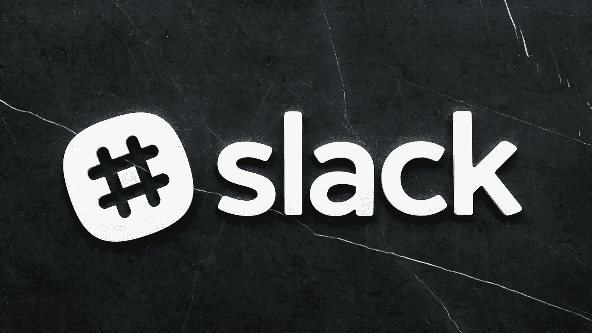

斯科特·韦伯在 [Unsplash](https://unsplash.com/s/photos/slack?utm_source=unsplash&utm_medium=referral&utm_content=creditCopyText) 上拍摄的照片

我们在本教程中有很多内容要讲，所以让我们开门见山吧！

# 目标

有一个前端测试我们的网站，每小时运行，并提醒我们任何懈怠的失败。

# 创建 React 应用程序

用`npx create-react-app periodic-testing`创建一个新的 React 项目。

我对`App.js`做了一个小调整——现在看起来是这样的:

# 编写测试

为了给我们的应用程序添加一个测试，让我们使用`[TestCafe](https://devexpress.github.io/testcafe/)`，一个端到端的测试工具。因为我们只需要这个库进行测试，所以我们可以用`npm i -D testcafe`将它作为开发依赖项添加进来。

下面是我们的基本测试:

tests/smokeTest.js

为了执行测试，我们需要告诉`TestCafe`在哪个浏览器上运行哪个测试。要获得该设置的快捷方式，让我们向`package.json`添加另一个脚本，如下所示:

```
"smoke-test": "testcafe 'chrome' tests/smokeTest.js"
```

如果现在我们运行我们的应用程序`npm run start`，然后运行测试`npm run smoke-test`，我们可以看到`TestCafe`打开一个新的 chrome 窗口，并试图按下一个有文本“Learn React”的按钮。如果我们输入错误，将`smokeTest.js`中的`Selector`改为寻找`Learn Rxact`并重新运行`npm run smoke-test`，则测试失败。

让我们将测试保持在失败状态，这样我们就可以知道如何处理失败场景，并开始向我们的测试添加更多的逻辑。此外，我想在两个浏览器上使用同一个文件进行测试，因此，为了让测试过程知道我们在哪个浏览器上，我将在我们的`package.json`中编辑`smoke-test`脚本和一个名为`BROWSER`的环境变量:

```
"smoke-test:chrome": "BROWSER=Chrome testcafe 'chrome' tests/smokeTest.js",
"smoke-test:firefox": "BROWSER=Firefox testcafe 'firefox' tests/smokeTest.js"
```

让我们现在也编辑我们的测试文件，以使用这个环境变量:

tests/smokeTest.js

测试的输出是:`Test failed on Firefox`。

# 创建时差警报

然而，我们希望测试在每次测试失败时提醒我们有懈怠。因此，让我们创建一个新的松弛工作空间和一个松弛通道，当测试失败时，我们在这里接收通知——我将我的命名为“生产测试”然后我们转到 Slack 上的“管理应用程序”设置:

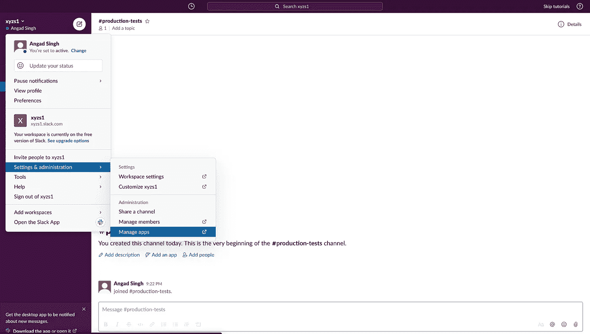

我们如何从 Slack workspace 主页到达那里

在这个新屏幕上，我们点击“浏览应用程序目录”，搜索“传入的 WebHooks”，并将其添加到我们的 Slack 工作区。这就是我说的应用程序:

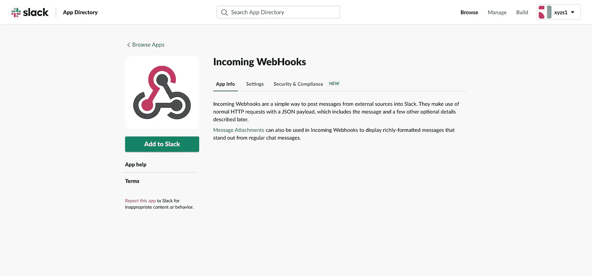

传入 WebHooks Slack 应用程序

将应用程序添加到 Slack 后，我们可以简单地选择我们将在这个实验中使用的频道:

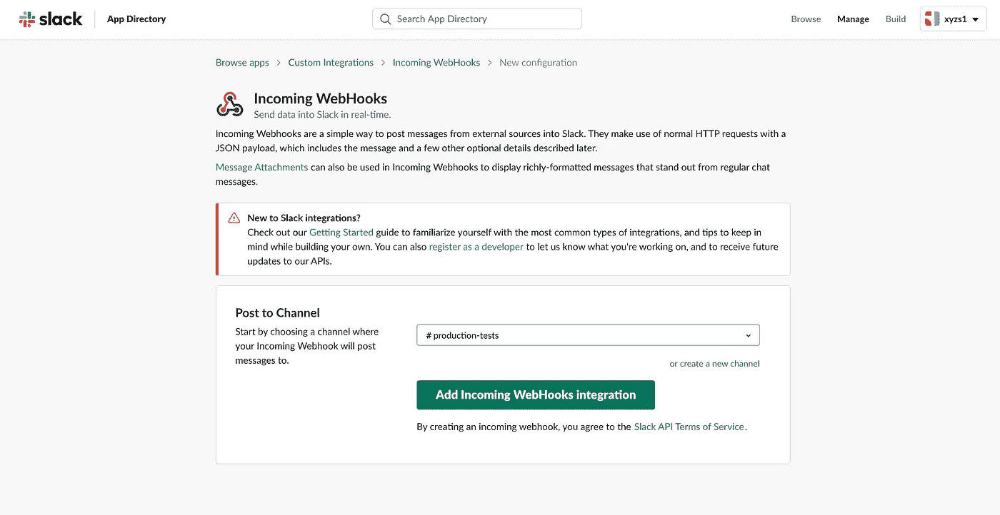

信道选择

在“设置说明”部分，该应用程序会给我们一个网络挂钩的地址。我们可以简单地点击这个 URL，让它在 Slack 上通知我们。这是我的样子:

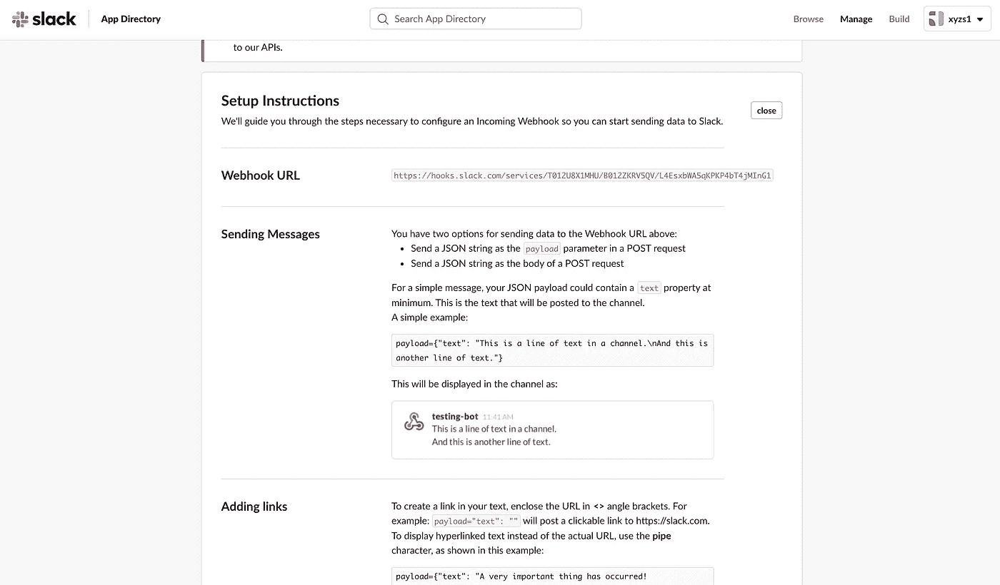

WebHook 设置说明

现在我们有了发送应用失败的 URL，我们可以替换测试的 catch 块中的`console.log`,改为使用`axios`来触发 WebHook。我们来补充一下`axios`:

```
npm i axios
```

接下来，我们调整我们的`smokeTest.js`文件:

tests/smokeTest.js

现在，如果我们重新运行测试，而不是简单地获得 console.log，我们会在 slack 通道上获得如下所示的通知:

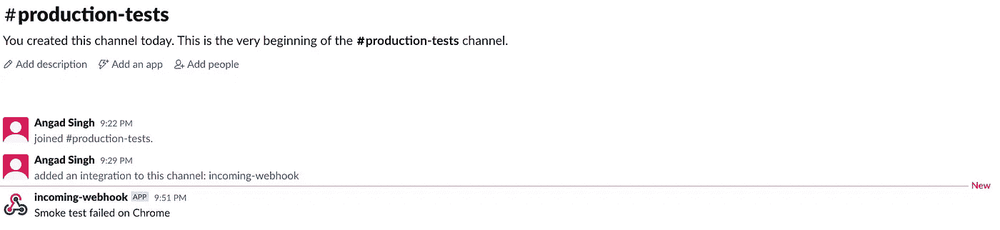

时差通知

# 在互联网上部署我们的应用程序

好的，目前看起来不错。然而，我们的目标是在我们的网站上运行一个预定的测试。到目前为止，我们一直在使用`[http://localhost:3000](http://localhost:3000,)` [，](http://localhost:3000,)进行测试，但这在 Gitlab runner 上无法运行。此外，我们应该将我们的实际应用程序部署在网上的某个地方，这样当我们进行定期测试时，我们可以确保我们测试的设置和环境与用户看到的完全相同。

为了方便使用并且不增加成本，我将使用亚马逊的 S3 在这个 url 上托管我的 React 应用程序:[http://unique-bucket-name-xysz 1 . S3-website . eu-central-1 . Amazon AWS . com/](http://unique-bucket-name-xysz1.s3-website.eu-central-1.amazonaws.com/)。

您可以使用任何其他方法来部署或了解我如何部署我的 React 应用程序[在这里](https://medium.com/@angadsingh_40633/easiest-and-free-way-to-host-your-react-app-fb8fd2ba2f74)。

部署后，我们还必须编辑我们的测试，以使用我们的应用程序的 URL 而不是`localhost`，就像这样:

tests/smokeTest.js

请注意，我们还做了另一个添加，现在在捕获它后抛出一个错误。这是因为 Slack 消息“Chrome/Firefox 上的冒烟测试失败”不够有用。如果我们抛出一个错误，那么我们将能够在稍后检查我们的管道，一旦我们设置 GitLab CI 并调试错误是什么。

# 为我们的测试建立一个时间表

有许多方法可以做到这一点—最简单的方法之一是使用 GitLab CI。现在让我们创建一个 GitLab 项目，它将使我们能够创建一个计划来定期运行这个测试。您也可以选择将您的项目托管在另一个网站上，如 GitHub，然后将 GitLab CI 集成到该存储库中，但是为了简单起见，在本教程中我们还是坚持使用 GitLab。我将我的应用程序代码推送到这里:【https://gitlab.com/AngSin/periodic-testing[。](https://gitlab.com/AngSin/periodic-testing)

一旦你完成了这些，你必须添加一个文件来告诉 GitLab 为我们创建一个 GitLab runner 并运行一些任务——在我们的例子中，我们将只在我们之前写的测试中使用它。为了让 GitLab 知道作业是在哪里定义的，我们必须将文件命名为`gitlab-ci.yml`。然后，我们可以将作业定义如下:

gitlab-ci.yml

现在让我们推动它，并定义一个时间表。在您的 GitLab 存储库页面上，单击“CI/CD”部分中的“Schedules ”,然后单击“New Schedule”。在这里，您可以为您的计划命名，并定义管道的频率。我每小时都去，在 Cron 语法中被描述为`0 * * * *`。我的完整设置如下所示:

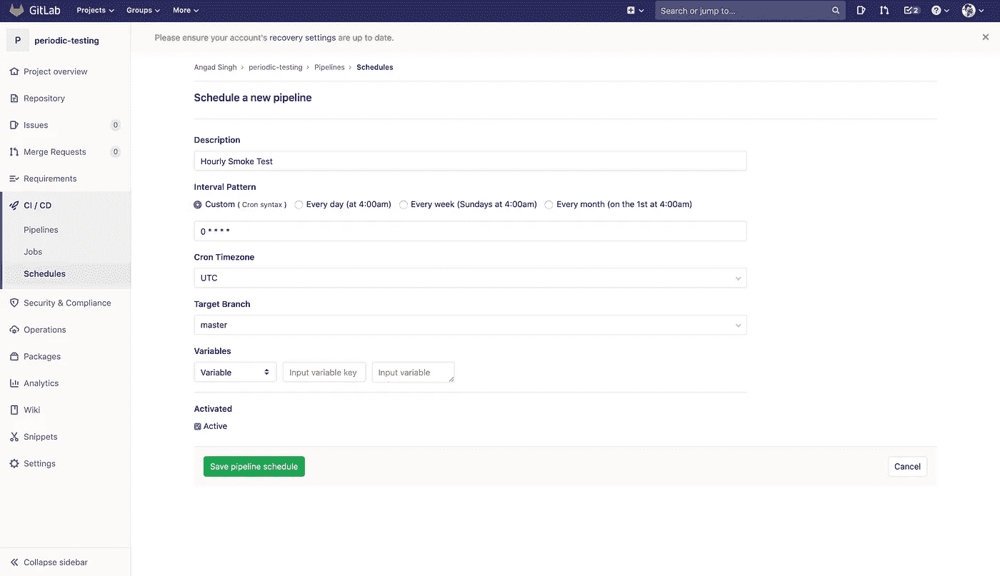

计划定义

# 测试我们的测试

保存后，我们将每小时运行一次新的计划管道。但是，您可以点击日程表上的“播放”图标，开始新的渠道，而不是等待。您将收到以下成功消息:

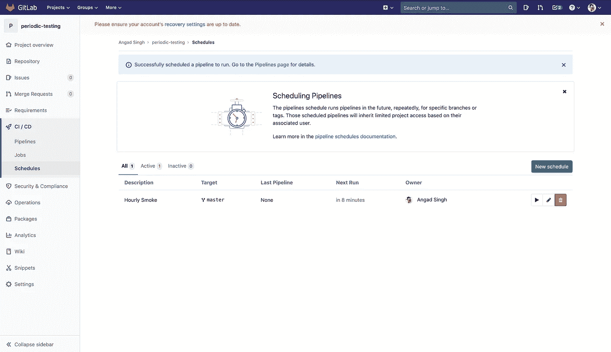

管道计划

重新加载页面后，您将看到“最后一个管道”列中现在有一个活动管道。单击该活动管道链接，您将看到作业的详细描述:

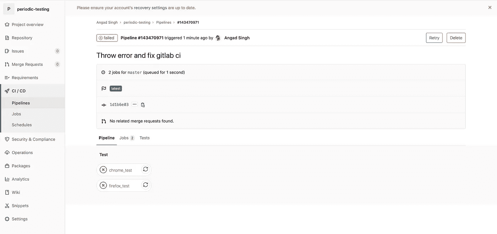

成品管道

由于我们有两个失败的测试，我们应该看到通知弹出我们的懈怠！

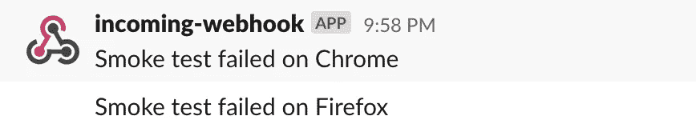

时差通知

如果您想了解这些冒烟测试失败原因的更多详细信息，您可以返回 GitLab 的管道并单击其中一个作业:

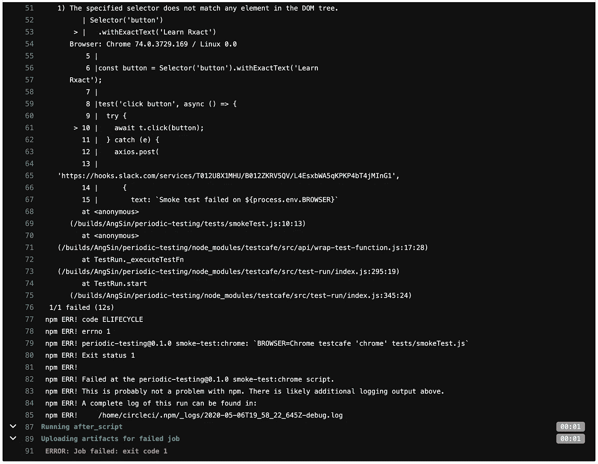

错误详细信息

这里我们可以看到详细的错误“指定的选择器与 DOM 树中的任何元素都不匹配。”哎呀！我们正在寻找一个按钮的文字“学习 Rxact”而不是“学习反应”。为了解决这个问题，我们可以简单地改变我们的测试来搜索“Learn React”，特别是如果我们不想每小时都有 slack 通知的话！

我们网站上的这个冒烟测试相当基础。为了更好地利用 GitLab CI，我们还可以拥有为 React 组件安装和运行单元测试的分支管道。要了解如何对 React 组件进行全面的单元测试，点击[这里](https://medium.com/better-programming/fully-testing-a-react-component-e81eb5c4f9d)。

您是否可以扩展或者更好地创建只在合并请求中运行的作业，这些请求在 React 组件上运行单元测试？提示:`gitlab-ci.yml`中的作业定义应该是这样的:

```
only:
  - merge_requests
```

祝你好运！如果你喜欢你读到的内容，请在推特上关注我[。](https://twitter.com/captainkong_eth)