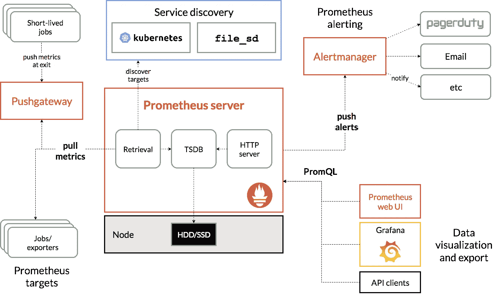
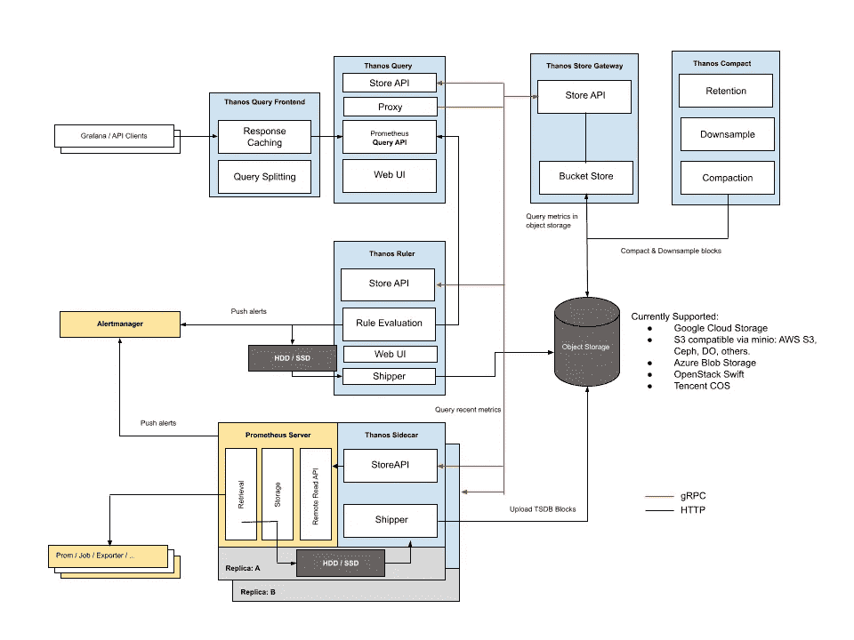
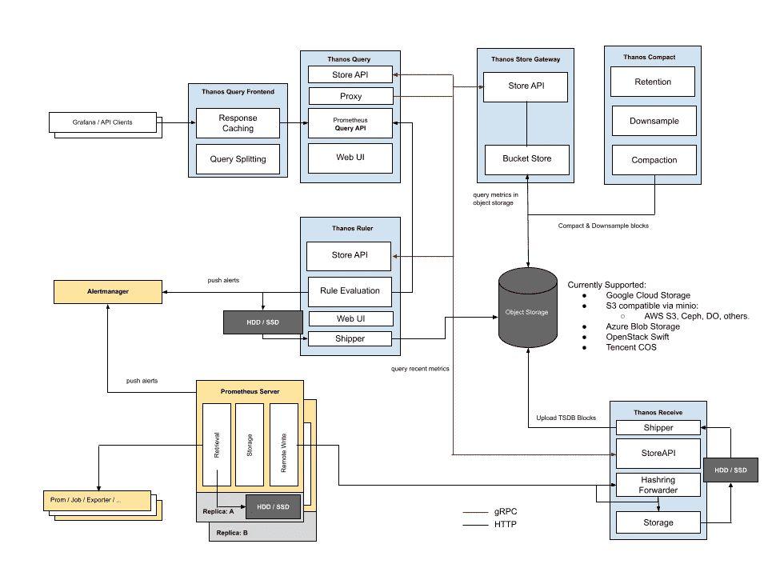

# 用多租户设置灭霸来启动你的普罗米修斯

> 原文：<https://betterprogramming.pub/set-up-thanos-with-multi-tenancy-to-power-up-your-prometheus-70123e6ea555>

## 基于启用多租户的普罗米修斯和灭霸设计一个高可用性监控解决方案

克利姆·穆萨利莫夫在 [Unsplash](https://unsplash.com?utm_source=medium&utm_medium=referral) 上拍摄的照片。

[Prometheus](https://prometheus.io/) 是众所周知的开源监控解决方案，也是 Kubernetes 环境中可观测性的事实标准。

由于出色的[操作符](https://github.com/prometheus-operator/prometheus-operator)使得在 Kubernetes 集群中部署完整的监控堆栈变得非常容易，所以它特别受欢迎:

*   Prometheus 从动态发现的端点(pod、服务等)收集指标。)然后使用 PromQL 提供存储指标的查询功能。
*   通过 AlertManager，您可以创建自己的规则，在出现问题时得到通知，并与 Slack 或 [Pager Duty](https://www.pagerduty.com/) 等流行的解决方案相集成。
*   [Grafana](https://grafana.com/) 可以添加到 mix 中(不包括在 operator 中),以便有一个漂亮的仪表板来显示所有这些指标。

来源:[普罗米修斯](https://prometheus.io/docs/introduction/overview/)

关于普罗米修斯的运作方式，有几件事需要理解:

*   Prometheus 定期从已配置的端点收集指标。
*   端点(例如，在 pod 中运行的应用程序)公开端口上的指标。你可以使用[官方客户端库](https://prometheus.io/docs/instrumenting/clientlibs/)在每一种流行语言中这样做。
*   Prometheus 将指标存储在本地的永久卷中。这里没有对象存储！

另一方面，在过去的几个月里，Prometheus 堆栈已经扩展到:

*   [Loki](https://grafana.com/oss/loki/) 用于汇总日志。
*   [符合 OpenTelemetry 追踪的速度](https://grafana.com/oss/tempo/)。

本文将关注核心堆栈以及如何构建一个健壮的、可伸缩的 Prometheus 设置。

# 挑战

## 高可用性

但是，如果您希望 Prometheus 系统具有高可用性，该怎么办呢？通常，您会添加第二个实例，然后在您的两个实例前面进行某种负载平衡，这样就完成了。

但在这种情况下不会，因为在普罗米修斯中没有“集群模式”。Prometheus 的每个实例将独立运行，从相同的端点获取相同的指标，并将数据存储在本地文件系统中。两个实例的指标在开始时是相同的，但随着时间的推移会逐渐偏离。

因此，根据处理查询的 Prometheus 实例，如果进行负载平衡，将不会得到相同的结果。您可以为这种负载平衡增加一些粘性，但这不是一种可伸缩的设计。

显然，您需要一个智能负载平衡系统来聚合两个实例的数据，并呈现统一的指标。

## 长期储存

Prometheus 实例只能将其数据存储在本地磁盘上。这也带来了自身的挑战:

*   您需要监控磁盘，并随着大小的增长移动旧数据或扩展存储。
*   为了节省一些钱，您可能会尝试降低指标分辨率(例如，六个月后，只保留每小时而不是每分钟的数据)。
*   为了确保没有数据丢失，您需要创建备份并恢复磁盘策略。

尤其是在对象存储(想想 S3)已经变得如此流行的世界里，提供长期的、无限制的大小，而不需要花什么力气来设置，这可不是一件容易的事。不幸的是，Prometheus 没有内置的方法来写入对象存储桶。

您将需要 Prometheus 和您的对象存储提供者之间的类似代理的服务来存储度量。

# 可用的解决方案

解决这些问题的两种流行解决方案是:

*   格拉法纳实验室的[皮质](https://grafana.com/oss/cortex/)。
*   [灭霸](https://thanos.io/)被爆料。

这两种解决方案有着大致相同的承诺，并且都是 [CNCF 孵化项目](https://landscape.cncf.io/?project=incubating)的一部分，用于观察和分析。他们提供:

*   通过多个 Prometheus 实例和一个统一的查询端点实现高可用性。
*   使用您选择的对象存储(AWS S3、Google 云存储、MS Azure Blob 等),长期、持久地存储指标。).

他们很相似，相互合作，相互学习。没有明显的赢家！

在这里，我们将把重点放在灭霸。

# 灭霸建筑

## 使用边车的基本架构

灭霸很受欢迎，因为它可以使用基本部署场景快速轻松地进行设置:

*   你在你的普罗米修斯实例中启用了一个边车。
*   您可以配置一个对象存储桶来存储指标。
*   sidecar 将定期将指标推送到对象存储器。
*   您可以从一个名为`Query`的端点使用优秀的 PromQL 查询所有 Prometheus 实例。
*   `Query`组件可以与 Prometheus 实例对话以获取新数据，或者与对象存储对话以获取旧数据。

来源: [GitHub](https://github.com/thanos-io/thanos)

这种体系结构运行良好，但是有一个主要缺点:每两个小时(取决于您的 Prometheus 配置)将通过 sidecar 将指标推送到对象存储

因此，如果一个普罗米修斯崩溃并重新启动，您将丢失两个小时的价值指标！

要实时存储指标并支持多租户，您需要一个更复杂的架构。

## 使用接收组件的架构

这种架构用`Receive`组件取代了灭霸边车:

*   您启用 Prometheus 的[远程写入](https://prometheus.io/docs/prometheus/latest/configuration/configuration/#remote_write)特性，将指标实时推送到`Thanos Receive`。
*   `Receive`将数据写入对象存储(并在本地缓存)。
*   `Query`直接从`Receive`获取指标，或者在桶中获取旧数据。
*   像在以前的架构中一样，作为一个客户端，您只需要与`Query`对话来查询指标。

来源: [GitHub](https://github.com/thanos-io/thanos)

# 灭霸和多租户

灭霸组件支持多租户，这是使用这部分堆栈的另一个原因。

## 软多租户

在软多租户场景中:

*   度量被推送到一个带有`THANOS-TENANT` HTTP 头集的`Receive`实例。
*   `Receive`将在存储桶上存储指标时使用此标题来填充标签`tenant_id`。
*   然后，在使用此标签进行 PromQL 查询时，您可以按租户过滤指标。

注意，普罗米修斯不允许你在推进到灭霸时设置任意的头球。您需要使用类似 Nginx 的反向代理来填充正确的头。

如果到灭霸的输入度量没有这样的报头，它将与标签`tenant_id`的默认值一起存储。

我们在这里描述的实际上是软租赁，因为`Receive`实例是在租户之间共享的。但是您也可以通过配置多对`Receive`和`Bucket`来选择真正的硬租赁。

## 硬性多租户

在硬多租户场景中:

*   我们从软多租户架构开始。
*   但是这一次，我们添加了其他的`Receive`实例。
*   每个`Receive`实例可以专用于一个或多个特定的租户。
*   任何`Receive`都可以从 Prometheus 获得一个传入的推送，并将数据分派给负责这个租户的专用实例。

简单来说，多个`Receive`实例组成一个集群。集群定义是通过一个 JSON 文件完成的:

在本例中:

*   `tenant-a`是一组专用于租户 a 的两个`Receive`实例
*   `tenant-b-c`是一组专用于租户 B 和 c 的两个`Receive`实例
*   `soft-tenants`是一种“默认”租户，用于既不是 A、B 也不是 c 的租户。它也用于没有`THANOS-TENANT`标题集的租户(例如匿名租户)。

# 履行

看一下[这个回购](https://github.com/dsayan154/thanos-receiver-demo)，了解启用了软硬租赁的灭霸的完整实施。我不是作者，但这是一部了不起的作品！

需要注意一些事情:

*   如果您将自己局限于软租用，那么只有一组`Receive`实例(在示例中称为“default ”)就足够了。
*   要安装灭霸堆栈，不使用原始资源，您可以使用支持`Receive`组件的 Helm chart。比特纳米灭霸掌舵图就是其中之一。Bitnami 图表永远不会出错！

# 结论

分布式监控的最大挑战是建立 HA。您当然不希望您的诊断工具在您需要的时候让您失望。

灭霸已成为 Prometheus 解决高可用性的经典解决方案，但随着最近推出的`Receive`组件，您现在可以从多租户和实时指标推送中受益。