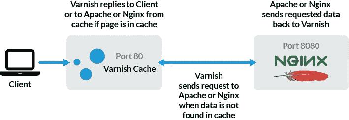
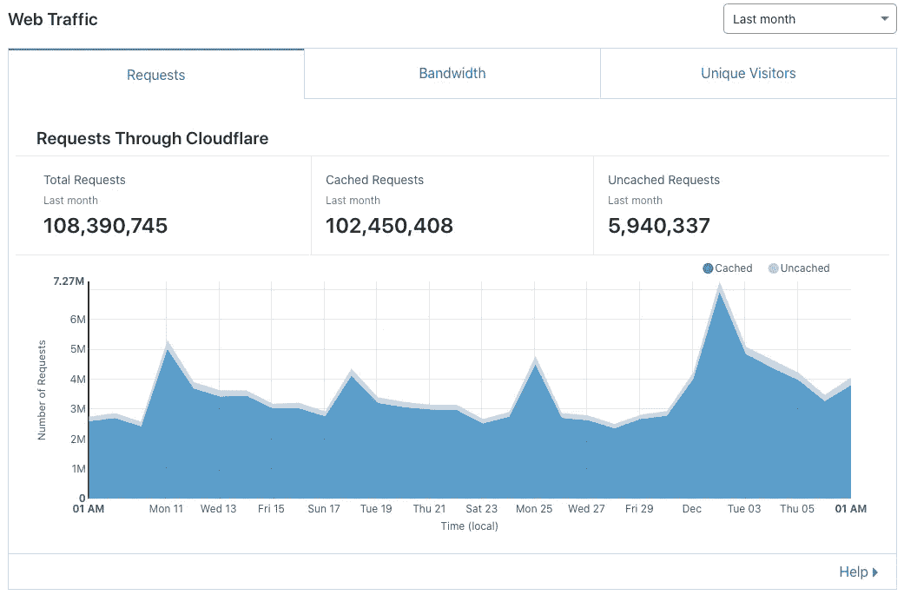

# 为 WordPress 设置 Varnish-Cache 4

> 原文：<https://betterprogramming.pub/set-up-varnish-cache-for-wordpress-8e2ac92ce347>

## 加速你的 WordPress 站点


安妮·斯普拉特在 [Unsplash](https://unsplash.com/s/photos/work?utm_source=unsplash&utm_medium=referral&utm_content=creditCopyText) 上的照片

如前一篇文章所述，我一直在使用 Varnish 来提高高流量网站的速度和可靠性，同时降低服务器成本:

[](https://medium.com/swlh/save-60-on-server-costs-with-this-setup-7f036e67bf70) [## 通过这种设置节省 60%的服务器成本

### 使用 Varnish 来加速您的高流量网站，并在您的服务器上节省 60%以上

medium.com](https://medium.com/swlh/save-60-on-server-costs-with-this-setup-7f036e67bf70) 

# 什么是清漆缓存？

Varnish 是一个充当整页缓存机制的工具。它可以设置为反向代理—在它向后端系统请求某个 HTTP 请求之前，它会对自己的缓存存储进行缓存检查。如果缓存命中，它将返回之前存储的完整 HTML 页面，而如果未命中，它将请求一个后端端点来处理请求，存储它，然后将其返回给请求用户。



# 表演

清漆性能极佳。它通常受到网络速度的限制，实际上将性能变成了一个无关紧要的问题。我们已经看到 Varnish 在常规现成硬件上提供 20 Gbps 的速度。



# 如何为 WordPress 设置它

与每个应用程序一样，有些请求可以完全缓存，而有些请求则根本无法缓存。

根据具体情况，可能会有无法缓存的 get 请求。通常，在 WordPress 站点上，所有 get 请求都可以被缓存。

对于 WordPress，不应该被缓存的是 API 端点，它们在路径`/wp-json/`下，当然还有所有的 POST 请求。我发现有些插件不需要使用任何缓存，比如 Elementor。

缓存的保留期显然取决于网站和内容更改的频率。在我的例子中，我为 WordPress 创建了一个简单的插件，在 post/page 更新时挂钩，它将为我清除缓存。正确的做法是只为刚刚更新的条目清除缓存。我没有做到那一步，只是在每次新文章或文章更新时删除所有缓存。

# 配置

这里我们有三个参与者:WordPress、Varnish-Cache 反向代理和 web 服务器，在我的例子中是 Nginx。

首先，我们需要设置 Varnish-Cache 作为反向代理，不缓存任何东西。

## 在 Varnish-Cache 中设置后端

```
backend default {
  .host = "10.0.0.5";
  .port = "8080";
}
```

在我的配置中，所有实例都在 Azure 网络中，Web 服务器的 IP 地址是 10.0.0.5。

## 处理请求

```
sub vcl_recv {
  return(pass);
}
```

将忽略缓存，只将请求委托给后端。有了这两个块，Varnish-Cache 就被设置为一个反向代理，它将总是向后端请求每个请求。

*全档****/etc/varnish/default . VCL:***

## **NGinX 设置**

NGinX web 服务器配置上唯一需要更新的是改变它监听的端口。

```
server {
   server_name **your_server_name.com**; ..... listen **8080**;
}
```

## **SSL 设置**

我正在用 # generate the SSL certificate with it listen **443** ssl;
ssl_certificate **path_to_cetificate/fullchain.pem**;
ssl_certificate_key **path_to_private_key**/privkey.pem;}

在我的 Azure 网络内部，连接将不使用 SSL，因此这个服务器块将调用转发到端口 80 上 10.0.0.4 处的 Varnish-Cache 实例。

它还将转发所有与 HTTPS 相关的标题，以便 WordPress 能够正常工作。

## 让 WordPress 使用上面的配置

在 WordPress 安装的根目录下，在`wp-config.php`文件的末尾添加以下内容:

```
if (strpos($_SERVER['HTTP_X_FORWARDED_PROTO'], 'https') !== false) {
   $_SERVER['HTTPS']='on';
}
```

这将防止 WordPress 无限重定向到一个“https://”协议，因为它不知道当前请求已经在 https 上。

# 启用缓存

现在我们已经有了所有的基础部分，我们可以配置 Varnish 来对请求进行缓存。

首先，让我们为希望从缓存中排除的请求添加几个块:

```
sub vcl_recv { **# Exclude caching Ajax requests**
  if (req.http.X-Requested-With == "XMLHttpRequest") {
     return(pass);
  } **# Exclude all POST requests or Authorization requests**
  if (req.http.Authorization || req.method == "POST") {
     return (pass);
  } **# Exclude everything that is neither GET nor HEAD**
  if (req.method != "GET" && req.method != "HEAD") {
     return (pass);
  } **# Exclude everything related to the backed, using a 
  # Regular Expression we can match the url against 
  # wp-admin, post.php, edit.php, wp-login, wp-json.**
  if (req.url ~ "(wp-admin|post\.php|edit\.php|wp-login|wp-json)") {
     return(pass);
  } **# Exclude wp-cron or when the front end is being 
  # previewed from the administrator/developer**
  if (req.url ~ "/wp-cron.php" || req.url ~ "preview=true") {
     return (pass);
  } **# Exclude explicitly a specific file when requested
  # from a specific host_name**
  if ((req.http.host ~ "**myhost.com**" && req.url ~ "^**specific_file_name\.(css|js)**")) {
     return (pass);
  }}
```

对于实际将被缓存的其他请求，应该应用以下内容:

```
sub vcl_recv { ... **# Remove the has_js cookie**
  set req.http.Cookie = regsuball(req.http.Cookie, "has_js=[^;]+(; )?", ""); **# Remove the wp-settings-1 cookie**
  set req.http.Cookie = regsuball(req.http.Cookie, "wp-settings-1=[^;]+(; )?", ""); **# Remove the wp-settings-time-1 cookie**
  set req.http.Cookie = regsuball(req.http.Cookie, "wp-settings-time-1=[^;]+(; )?", ""); **# Remove the wp test cookie**
  set req.http.Cookie = regsuball(req.http.Cookie, "wordpress_test_cookie=[^;]+(; )?", ""); **# Remove the PHPSESSID in members area cookie**
  set req.http.Cookie = regsuball(req.http.Cookie, "PHPSESSID=[^;]+(; )?", ""); unset req.http.Cookie;}
```

## 清理缓存

最后一步是从特定的 HTTP 请求中清除缓存:

```
sub vcl_recv { if (req.method == "PURGE") {
    return (purge);
  } if (req.method == "CLEANFULLCACHE") {
    ban("req.http.host ~ .*");
    return (synth(200, "Full cache cleared"));
  }}
```

有了这两个条件，我们就可以轻松清空满缓存了。

调用清理的 CURL 调用看起来像这样`curl -XCLEANFULLCACHE http://varnishurl_or_ip`。

满`/etc/varnish/default.vcl`

# **自动缓存更新**

这个难题的最后一部分是当一篇新文章/页面被创建，或者一个现有的实体被更新时，让 WordPress 清空缓存。

为此，在[WordPress-root-installation]/WP-content/plugins/内创建一个新文件夹，例如[WordPress-root-installation]/WP-content/plugins/**cachecleaner.php**。

在刚刚创建的文件夹中创建一个新文件。我们可以把 cachcleaner.php 的 T2 叫做 T3。

将下面的代码添加到文件中，然后从 WordPress 管理面板中启用这个新插件。

完整档案【cachecleaner.php 

根据你自己的需要，改变 Varnish 缓存地址和 WordPress 插件信息。