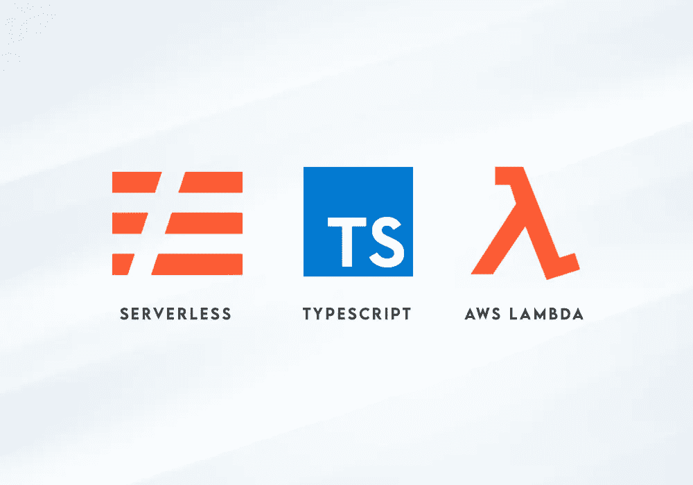

# 用 TypeScript 设置您的无服务器项目，准备部署到 AWS

> 原文：<https://betterprogramming.pub/set-up-your-serverless-project-with-typescript-ready-to-deploy-to-aws-6cfd7b2e5263>

## 构建一个简单的无服务器 TypeScript 应用程序启动模板，并设置部署到 AWS 所需的凭据



图片来源:作者

作为 Doctissimo[一个伟大团队的首席开发人员，我已经潜心研究云计算三年多了。几个月前，我有机会启动了一个全新的全无服务器项目并为其奠定了基础，该项目旨在管理我们的各种内容索引、更新和发布工作流。](https://www.welcometothejungle.com/en/companies/doctissimo)

我首先尝试从不同的现有项目模板中获取灵感，尽可能地遵循最佳实践，没有多余的东西。

所以我在这里，通过这个小小的丰富经验，编写一个简单的分步指南，介绍如何构建一个准备部署到 AWS 的无服务器 Typescript 项目模板。

这是我们要处理的一些事情:

*   [无服务器框架](https://www.serverless.com/)
*   以打字打的文件
*   埃斯林特，更漂亮
*   AWS 身份证明(IAM 用户、组、策略)
*   使用无服务器部署到 AWS(创建 Lambda、API 网关端点等。)

你可以在 [my GitHub](https://github.com/saybou/serverless-typescript-aws) 上找到最终结果，准备好与 Docker 一起使用。

# 要求

*   [Node.js](https://nodejs.org/en/)
*   无服务器

```
npm install -g serverless
```

# 项目初始化

让我们开始用无服务器模板 aws-nodejs-typescript 初始化我们的项目。

```
serverless create --template aws-nodejs-typescript
```

现在我们有了一个包含一些初始文件的基本模板:示例函数(`handler.ts`)、无服务器配置(`serverless.yml`)、类型脚本配置(`tsconfig.json`)和`webpack.config.js`。

让我们添加一些配置来增强我们的应用程序。

# 添加支持类型脚本的 ESLint

[打字稿 ESLint](https://github.com/typescript-eslint/typescript-eslint/)

```
npm install --save-dev eslint @typescript-eslint/parser @typescript-eslint/eslint-plugin
```

*   创造`.eslintrc.js`

这个文件在这里配置我们的林挺过程，以保持我们的代码质量容易。

*   创建`.eslintignore`(我们不想丢弃的文件):

```
node_modules
.serverless
.vscode
*.config.js
.webpack
**/*.js
```

# 添加更漂亮

[有绒毛的更漂亮](https://prettier.io/docs/en/integrating-with-linters.html)

只是为了确保我们保持干净的代码格式。

```
npm install --save-dev prettier eslint-config-prettier eslint-plugin-prettier
```

*   创建`.prettierrc.js`(只是一个简单漂亮的启动配置):

```
module.exports = {
  printWidth: 120,
  singleQuote: true,
  trailingComma: 'all',
};
```

*   创建`.prettierignore`(我们不想运行得更好的文件):

```
node_modules
.serverless
.webpack
```

*   更新`.eslintrc.js`扩展规则(只需添加两个规则来正确地将 Prettier 集成到我们的林挺工作流中，并防止冲突):

```
extends: [
  'eslint:recommended',
  'plugin:@typescript-eslint/eslint-recommended',
  'plugin:@typescript-eslint/recommended',
  'prettier/@typescript-eslint',
  'plugin:prettier/recommended',
],
```

# 网络包

启用在单独的进程上运行 TypeScript 类型检查器的 Webpack 插件。

更新`webpack.config.js`:

```
plugins: [
  new ForkTsCheckerWebpackPlugin({
    eslint: true,
    eslintOptions: {
      cache: true,
    },
  }),
],
```

# 用正确的类型更新处理程序

让我们更新`handler.ts`，设置正确的类型，以便类型检查验证可以成功。

# NPM 剧本

让我们为`package.json`中的应用程序添加一些运行脚本:

```
"scripts": {
  "lint": "eslint . --ext js,ts --cache --fix",
  "prettier": "prettier --list-different './**/*.{js,ts}'",
  "typecheck": "tsc --noEmit",
  "test": "echo \"Error: no test specified\" && exit 1"
},
```

测试它:

```
# linter
npm run lint# prettier
npm run prettier# type checking
npm run typecheck
```

现在我们已经准备好将我们的应用程序部署到 AWS。不完全是。我们需要设置一些 AWS 凭证，特别是我们需要一个 AWS 用户来部署我们的应用程序。

如果您还没有 AWS 帐户，我邀请您尽快[创建一个](https://aws.amazon.com/)。

# 配置 AWS 凭据

在这里，我们希望创建一个新的 IAM 策略，并将其附加到一个新的 IAM 组，我们将把我们的新用户附加到该组。

## 创建 IAM 用户

登录到您的 AWS 控制台，然后转到身份和访问管理(IAM)服务。创建一个新用户`serverless-deploy`，具有编程访问权限。不要给它任何权限。

然后，您将能够保存您的用户凭证(不要丢失它们，否则您将需要获取新的凭证)。

下面让我们看看如何使用您的凭据。(您可以在[官方文档](https://www.serverless.com/framework/docs/providers/aws/guide/credentials/)中找到使用无服务器凭证的不同方式。)

## 使用无服务器设置您的用户凭据

将您的 AWS 配置文件声明到`~/.aws/credentials`(不要忘记设置您自己的值):

```
[serverless-deploy]
aws_access_key_id = XXX
aws_secret_access_key = XXX
region = XXX
```

在您的`serverless.yml`中设置此配置文件，以便无服务器可以使用它进行部署。

```
provider:
  profile: serverless-deploy
```

或者可以用`--profile`参数将它传递给`serverless deploy`命令。

现在，尝试部署您的无服务器应用程序。

```
serverless deploy -v# -v enables verbose output so you can see what happens
```

您应该会看到以下错误:

```
serverless-deploy is not authorized to perform: cloudformation:DescribeStacks
```

这已经足够清楚了:)所以我们现在需要将这个 IAM 用户权限授予我们的用户。

## IAM 组和 IAM 策略

让我们回到 AWS 控制台，创建一个没有任何策略的新 IAM 组`serverless-deploy-group`。

现在，让我们创建一个新的 IAM 策略:

*   创建新的 IAM 策略。
*   为 CloudFormation 服务添加一个策略，允许`List:DescribeStacks`操作。
*   指明将此权限应用于所有资源，然后单击“审阅策略”按钮。(如有必要，您可以指定特定的资源来应用权限。)
*   将这个策略命名为`serverless-deploy-policy`(只是为了保持一致)，然后完成创建。

现在回到我们创建的组`serverless-deploy-group`,并将其附加到该策略。

然后返回到用户`serverless-deploy`并将其附加到组`serverless-deploy-group`。

现在让我们再次尝试部署:

```
serverless deploy -v
```

现在，您应该看到以下新错误:

```
serverless-deploy is not authorized to perform: cloudformation:CreateStack on resource
```

我们现在必须编辑我们的策略并添加一些新的权限。

## 扩展您的 IAM 策略

回到我们创建的`serverless-deploy-policy`策略，编辑它，并为 CloudFormation 服务添加`CreateStack`权限。

您可以尝试再次部署并添加每个缺失的策略。这是确保只添加必要权限的最佳方式。有时需要逐步手动删除资源，以便能够再次测试新的完整部署。

# 基本策略示例

对于此示例项目，以下是所需的最低权限:

在 AWS 上部署无服务器应用程序的基本 IAM 策略

一旦您设置了最终策略，您就可以执行完全部署了。

# 部署

```
serverless deploy -v
```

默认情况下假定为开发阶段。

无服务器是做什么的？

*   打包我们的应用程序(使用 webpack)
*   创建云形成堆栈
*   创建一个 S3 桶
*   上传云层模板到 S3
*   将我们的应用程序包上传到 S3
*   设置 IAM 角色
*   设置日志组
*   配置 ApiGateway 端点
*   为我们的服务提供 Lambda 函数

您现在可以调用您的服务:

```
serverless invoke -f hello -l# -f specifies the function name, -l specifies to output the logs to the console
```

您还可以使用 API 网关端点来测试它，当部署结束时，它会打印在您的终端中。它应该是这样的(替换[xxxxxx]和[region]):

```
[https://[xxxxxx].execute-api.[region].amazonaws.com/dev](https://[xxxxxx].execute-api.[region].amazonaws.com/dev)
```

# 删除您的服务

您可以简单地删除所有以前创建的堆栈。

```
serverless remove
```

# 包扎

感谢阅读！我希望你喜欢这篇文章，并从中获得一些有用的东西。现在，您应该准备好使用 Serverless、TypeScript 和 ESLint 启动自己的项目，并将其部署到 AWS。

你可以在 [my GitHub](https://github.com/saybou/serverless-typescript-aws) 上找到这篇文章的最终结果，准备与 Docker 一起使用。

现在是你的时候了！更新您的功能，更新您的无服务器提供商配置，创建新的功能，并根据您的需要部署您自己的服务！