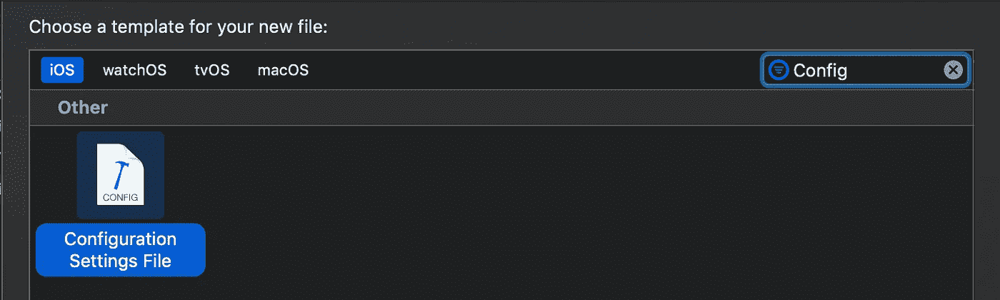
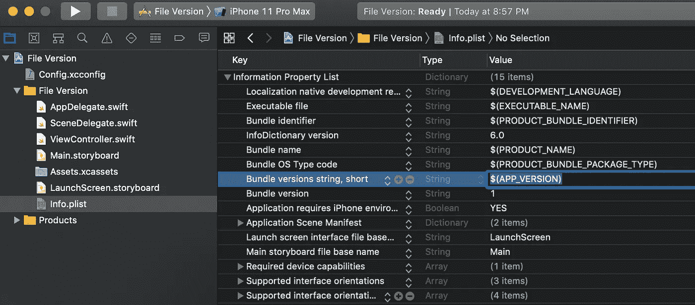
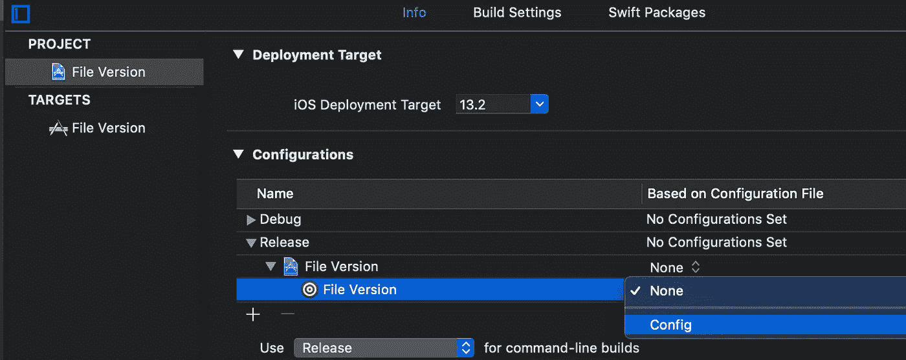
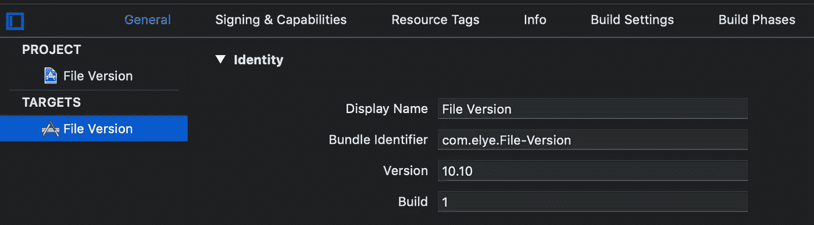

# 如何通过本地文件设置 iOS 和 Android 应用版本

> 原文：<https://betterprogramming.pub/setting-ios-and-android-app-version-through-a-file-e95cec9573b2>

## 在一个地方更新您的版本和内部版本号


Maksym Kaharlytskyi 在 [Unsplash](https://unsplash.com/s/photos/file?utm_source=unsplash&utm_medium=referral&utm_content=creditCopyText) 上拍摄的照片

每当我们想要上传一个新版本的应用程序时，我们需要手动编辑多少次版本(Android 版为`build.gradle`, iOS 版为`Info.plist`)?这是一项令人生畏的工作！

如果它在一个文本文件中，我们可以编写一个脚本来自动更新它(并根据回购协议检查更新，并运行所有需要的步骤来自动发布应用程序)，那该有多好？

在这里，我将向您展示如何获取文件中的应用程序版本。

# 在安卓系统中

这相对简单。在应用程序的`build.gradle`文件中，将`versionName`设置为一个函数名，比如`getVersionName()`。

```
defaultConfig **{** applicationId "com.elyeproj.fileversion"
    minSdkVersion 21
    targetSdkVersion 29
    versionCode 1
    versionName **getVersionName()**
 **}**
```

在同一个`build.gradle`文件中，编写从文件中读取版本的函数，如下所示。

```
static def getVersionName() {
    return new File("./app/versionName").getText().trim()
}
```

然后，相应地创建文件。在我们的例子中，应该是`./app/versionName`。在我的示例代码中，我写了`10.10`。

# 在 iOS 中

我们需要设置`.xconfig`文件来获取应用程序版本。

您可以通过新建文件对话框窗口创建一个新的配置文件来实现。选择配置设置文件，如下所示。



创建文件后，使用指向它的键将应用程序版本写入其中，例如`APP_VERSION = 10.10`(这是我在下面的代码示例中编写的)。

之后，转到`Info.plist`文件，按照如下所示键入密钥(在我的例子中是`APP_VERSION`)。



然后，转到项目的信息设置页面，进入配置部分添加您的配置，如下图所示。对发布版本和调试版本都这样做。



最后，您可以通过下面的 Identify 部分来检查版本，您将看到版本根据您的配置文件中的内容进行了更新。



**附加说明:**如果你的配置文件有很多变量，你想分离出版本变量，你可以在有很多变量的配置文件上使用`#include “VersionFile.xcconfig”`，创建另一个名为`VersionFile.xcconfig`的文件，只包含版本变量。

# 结论

这样，您的 Android 和 iOS 版本名称值现在位于一个单独的文件中。您可以编写一个 Bash 脚本来自动更新它，并执行必要的更新自动化和发布过程。

您可以从以下位置获取代码示例:

[](https://github.com/elye/demo_ios_android_file_app_version) [## elye/demo _ IOs _ Android _ file _ app _ version

### 展示了如何在一个文件中为 iOS 和 Android 设置应用版本

github.com](https://github.com/elye/demo_ios_android_file_app_version) 

享受自动化！