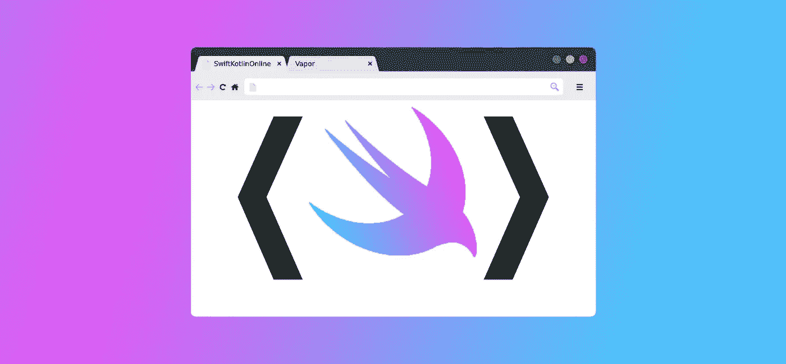

# 在网络上释放 Swift

> 原文：<https://betterprogramming.pub/setting-swift-free-on-the-web-94e1f3f68d88>

## 使用服务器端，让任何人都能从浏览器上享受 Swift



图片由作者提供

当我参加 2016 年 WWDC 时，我记得我参加了名为“[借助 Swift 开源软件](https://developer.apple.com/videos/play/wwdc2016/415/) *走向服务器端”的会议*最初，我对苹果与 IBM 的新合作关系感到吃惊，然后，我对服务器端 Swift 的概念感到惊讶。当我回家做一些研究时，我发现很多开发人员都渴望它，甚至到了乞求苹果公司采纳有助于萌芽中的开源服务器框架的建议的程度。

今天，服务器端 Swift 社区仍然充满热情。目前有多种框架，其中最流行的是[完美](https://perfect.org/)、[基图拉](https://www.kitura.io/)和[蒸汽](https://vapor.codes/)。可能最明显的目的是为用 Swift 编写的应用程序编写一个 Swifty 后端，特别是使用共享代码来节省时间，消除重写错误，并减少无关的数据处理。然而，也有一些开发者对 Swift 充满热情，他们在 Swift 中建立了完整的网站和 API，而没有任何 Swift 客户端使用它们。

# 分享是关怀

最近，我正在为 iOS (Swift)和 Android (Kotlin)做一个移动项目。因为 Swift 和 Kotlin 实际上非常相似，所以它们允许两个版本之间的架构和设计非常相似。由于 Swift 版本总是略微领先，我发现了一个名为 [SwiftKotlin](https://github.com/angelolloqui/SwiftKotlin) 的开源 Mac 应用程序，它被证明是一个非常有用的转换工具。

当我玩得开心的时候，我的一些同事有点嫉妒——主要是因为我碰巧有一台可以运行该工具的 Mac，而他们在 Windows 环境中却不能。我开始主动提出接更多的翻译工作，但这成了一个瓶颈。但愿 Swift 能够跨平台运行，而我的同事无需下载和安装任何工具集、语言或依赖项。

这就是我为服务器端 Swift 项目设计用例的方式。因为 SwiftKotlin 是开源的，所以转换框架很容易获得。然后，我的计划是写一个基本的网站，任何人都可以下载 Swift 代码，让它通过 SwiftKotlin 框架运行，并获得转换后的 Kotlin 代码。

注意:虽然这是一个特定的用例，但是这个概念适用于大多数框架/包/pods。如果您心中有一个，您仍然可以遵循这些说明，将我的例子换成您的用例。

# 建造我的蒸汽发动机

您将需要 Xcode、终端和 Vapor。就是这样！你可以从[这个回购](https://github.com/dbolella/SwiftKotlinOnline)中提取我的代码。

对于这个项目，我决定使用 Vapor，因为它是前面提到的三个项目中唯一一个我还没有尝试过的。最后，事情变得相当简单，我对结果非常满意。要进行设置，只需遵循[安装指南](https://docs.vapor.codes/3.0/install/macos/)。

从终端，我们将使用 web 模板启动一个新的 Vapor 项目。这样，我们的 Windows 同事可以简单地从他们选择的浏览器进行转换。为此，请运行:

```
vapor new SwiftKotlinOnline — template=web
```

这将建立一个已经建立了叶框架的项目。Leaf 是一种编写模板化网页的方式，也可以链接到 Swift 功能。我们稍后会深入探讨这一点。

接下来，我们想引入 SwiftKotlin 作为一个 Swift 包并转换(一个助手包)。打开新项目目录中的`Package.swift`文件，并添加这些依赖项:

```
.package(url: “[https://github.com/yanagiba/swift-transform](https://github.com/yanagiba/swift-transform)", .exact(“0.18.10”)),
.package(url:”[https://github.com/angelolloqui/SwiftKotlin.git](https://github.com/angelolloqui/SwiftKotlin.git)", .revision(“e993ad55276531e5f723b0ede47d0619ea734dcf”))
```

然后将它们添加到我们的应用目标:

```
.target(name: “App”, dependencies: [“Vapor”, “Leaf”, “SwiftKotlinFramework”, “swift-transform”]),
```

为了引入这些依赖项并创建我们的 Xcode 项目，我们现在可以运行`vapor xcode`。完成后，系统会提示您输入`y`自动打开 Xcode。Xcode 启动后，我们的项目启动了，点击 Run 以确保到目前为止一切正常。在控制台中，您最终会看到应用程序在`localhost:8080`运行。将该链接复制并粘贴到浏览器中，并确保您看到它可以工作。如果是这样的话，我们就成功了！

## 路线

到此为止，我们可以快速检查一些东西。首先，看一下`routes.swift`。这就是我们的服务器如何决定如何处理来自 web 的请求，并建立我们决定建立的任何连接。您将看到“welcome”被设置为默认`get`路线。当我们准备好路线的时候，我们会回到这里。现在，让我们跳到`welcome.leaf`来看看什么是树叶，我们需要渲染什么。

## 离开

你会看到一些`#`标记以及一些熟悉的`<div>`和``标签。在 Lead 中，`#set`告诉 Leaf 对于某个变量(例如，title ),将在引用它们的地方插入以下内容。在底部，我们看到`#embed`，它告诉 Leaf 这些值将被插入到指定的模板中(例如，base)。如果我们跳到`base.leaf`，我们会看到一个更完整的 HTML 主体，但是在我们希望那些值被嵌入它的其他叶子插入的地方插入了`#get`。这是对 Leaf 如何工作的高度概括，尽管我建议查看[文档](https://docs.vapor.codes/3.0/leaf/overview/)。

因为这是我们制作 UI 的方式，我们将在这里开始构建我们的站点。现在，我不是一个熟练的 web UI 开发人员，所以我们在这里只做两个简单的叶子。其中一个将有一个文本字段，将 Swift 代码放入其中，使用 Javascript 将其放入表单进行处理，然后发送到我们的服务器。另一片叶子将获取翻译结果，并使用`<pre>`和`<code>`标签简单地显示它们。两者都简单地嵌入`base.leaf`来构建它们周围的 HTML。

要点如下:

## 控制器

蒸汽的最后一个区域是蒸汽控制器。简而言之，它们允许我们对自定义 Swift 功能进行分组，并编写方法来处理请求和响应以及代码。

对我们来说，这也是我们通过在控制器中实现 SwiftKotlin 框架开始编码的地方。参考它在作者的应用程序实现中的使用方式，我们将从中提取基础知识来设置翻译。然后我们将编写一个方法，它接受 Vapor `Request`参数并返回一个`Future<View>`。

为了继续，我在下面贴了我的代码的要点，这样我可以带我们浏览一下。您将看到`store`接受请求，从中提取 Swift 代码，并处理请求过程中放入的一些字符串垃圾。然后，我们确保我们甚至有代码要处理。否则，设置一个默认值(实际上是为了测试)。然后，我们调用`translate`(取自原始代码)并将结果存储在一个变量中。最后，我们从我们的`routes.swift`文件中返回看起来像一行的东西。我们所说的是渲染`transfer.leaf`(我们马上就要做)并把翻译作为一个名为`output`的参数传递。

## 所有的路都通向我们的路线

我们最后回到`routes.swift`，在这里我们将配置我们的两个页面并使用我们的控制器。对于输入，我们可以简单地将第一个路径中的“欢迎”替换为“输入”，因为它只是一个`GET`，我们希望它成为我们的默认页面。

```
router.get { req **in
  return** **try** req.view().render(“input”)
}
```

然后对于我们的翻译叶和控制器:

```
**let** translateController = TranslateKotlinController()
router.post(“translate”, use: translateController.store)
```

我们首先设置我们的控制器的实例，然后告诉路由器，对于转换路由，`use`我们的`store`以请求作为参数运行。

## 结果！

现在我们再次点击 Run，转到`localhost:8080`，试一试。


我们的两片叶子和我们转换后的 Swift 代码，现在在科特林！

是的，用户界面可以进行大规模的翻新，但重要的是(至少对我和我的团队来说)我们现在在浏览器上有了我们的功能！现在，我的同事可以高兴了，因为他们也可以简单有效地享受这样一个强大的 Swift 框架。

# 处处迅捷！

正如我前面提到的，这是一个非常具体的用例。无论如何，无论上下文如何，获取 Swift 包裹并将其包装到网上的概念是相同的。知道它是多么简单和容易理解，我希望它至少能吸引您考虑如何也能把 swift 的实施扩展到全世界！

在 GitHub 上看到:[https://github.com/dbolella/SwiftKotlinOnline](https://github.com/dbolella/SwiftKotlinOnline)