# 设置 MacBook M1 开发机器

> 原文：<https://betterprogramming.pub/setting-up-a-macbook-m1-development-machine-cda22a92fa22>

## 采用 M1 架构的全新 MacBook Pro 上的游戏开发、编码和创作环境指南


照片由[威森王](https://unsplash.com/@wesson?utm_source=medium&utm_medium=referral)在 [Unsplash](https://unsplash.com?utm_source=medium&utm_medium=referral) 上拍摄

## 罗塞塔（f.）

关于 Rosetta 的注意事项——在安装过程中的某个地方，会提示您安装 Rosetta。出现提示时，请尽快安装。对我来说，这发生在 Xcode 发布的时候。这是翻译为英特尔构建的应用程序以在苹果芯片上运行所必需的。

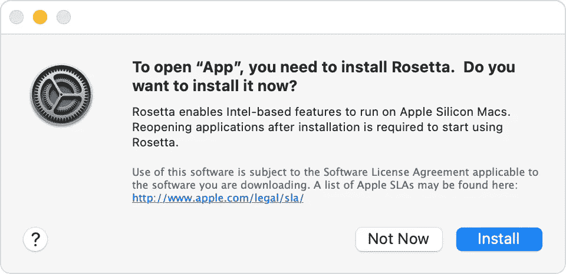

如果您需要在未来检查某个应用程序是否正在使用 Rosetta，您可以右键单击该应用程序并选择“*获取信息*”，在常规部分下，您会看到“*使用 Rosetta 打开”*:


申请信息，通过右键点击*获取信息*

# Apple 原生工具链

## Xcode

首先，我总是从本地开发工具开始:Xcode，用于编译器和命令行工具。去 AppStore，安装苹果的 [Xcode](https://apps.apple.com/us/app/xcode/id497799835?mt=12) 。

完成后，启动 Xcode 接受许可协议。

如果您有 Apple 开发者帐户，请通过 *Xcode、偏好设置…帐户*选项卡登录您的 Apple ID:

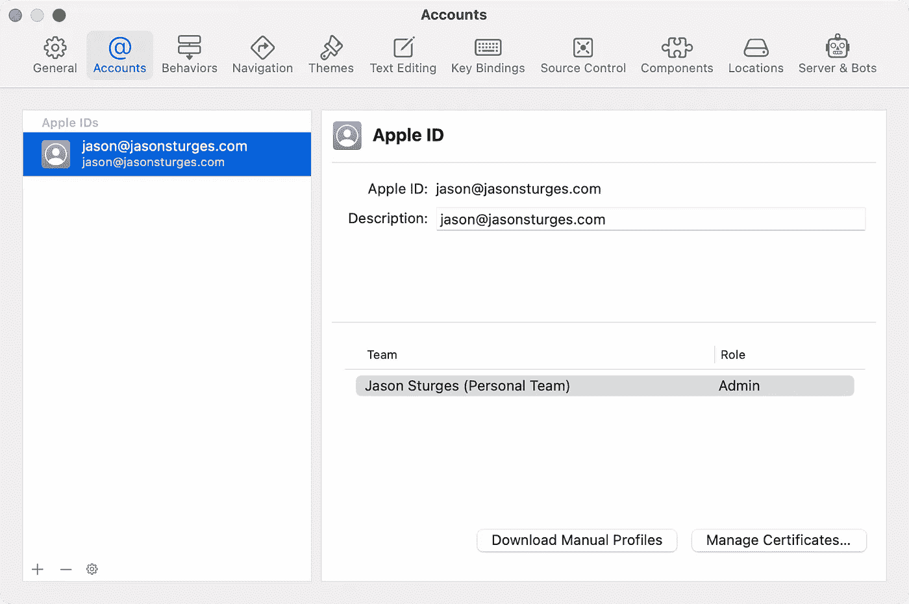

最后，通过打开终端并执行以下命令来安装命令行开发工具:

```
xcode-select --install
```

这将提示确认命令行开发工具的安装:

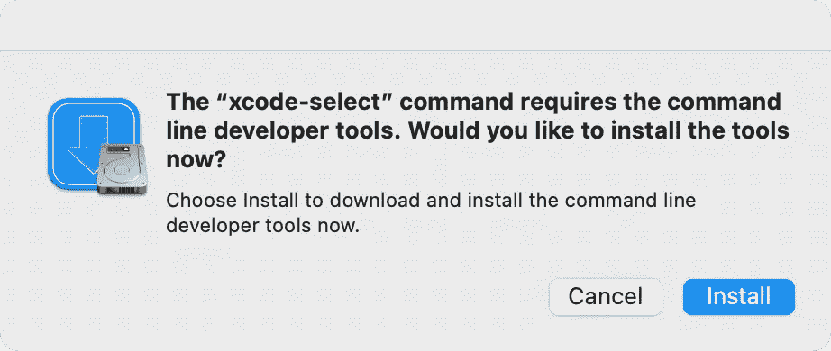

现在，我们应该有诸如 git 和编译器之类的工具。执行`which git`会告诉我们安装位置:

```
/usr/bin/git
```

Git 版本应该报告:

```
git version 2.30.1 (Apple Git-130)
```

# 版本控制

## 饭桶

大多数版本控制服务都需要 SSH 密钥。

> 注意:如果你像我一样讨厌管理这些东西，可以考虑跳到下一节使用 GitKraken 来管理 SSH 密钥和集成。

否则，如果您想要手动配置 git，请通过在终端中执行以下命令来设置您的用户配置文件:

```
git config --global user.email "[you@example.com](mailto:you@example.com)"
git config --global user.name "Your Name"
```

这将在您的主帐户中创建一个 git 配置:`~/.gitconfig`

```
[user]
    email = [y](mailto:jason@jasonsturges.com)ou@example.com
    name = Your Name
```

登录 [GitHub](https://github.com) ，从屏幕右上方的个人资料头像中选择*设置*，导航到[T21【宋承宪】和 GPG 键](https://github.com/settings/keys) 组。

按照 GitHub 的 [*使用 SSH*](https://docs.github.com/en/authentication/connecting-to-github-with-ssh) 指令连接 GitHub，在 [*下生成一个新的 SSH 密钥，并将其添加到 ssh-agent*](https://docs.github.com/en/authentication/connecting-to-github-with-ssh/generating-a-new-ssh-key-and-adding-it-to-the-ssh-agent) 文档页面。

生成 SSH 密钥:

```
ssh-keygen -t ed25519 -C "*you@example.com*"
```

将生成的 SSH 文件的内容粘贴到*键*字段中。使用`pbcopy`将内容复制到剪贴板:

```
pbcopy < ~/.ssh/id_ed25519.pub
```

验证它是否正常工作:

```
ssh -T [git@github.com](mailto:git@github.com)
```

或者，添加到 SSH 代理:

```
$ eval "$(ssh-agent -s)"
$ ssh-add -K ~/.ssh/id_ed25519
```

您的密钥存储在`~/.ssh`目录中。

## GitKraken，Git GUI 客户端

虽然 git 有很多 GUI 客户端，但我更喜欢 GitKraken。它有丰富的功能，免费或公平的定价层次。

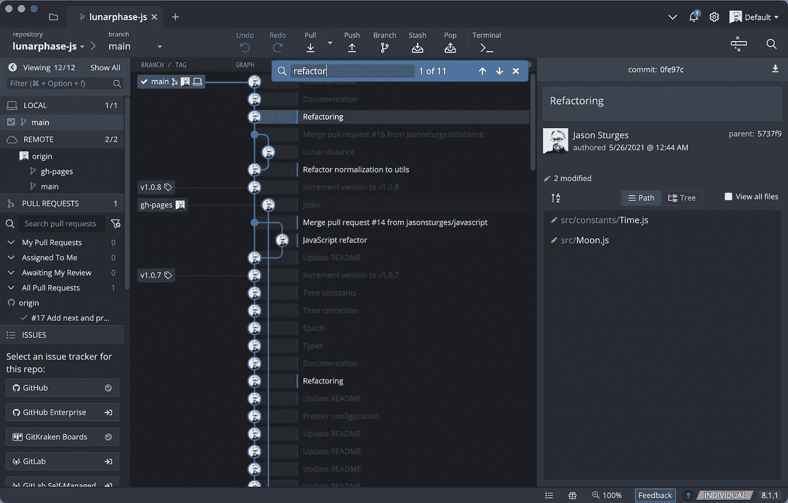

GitKraken 客户端，搜索提交

下载、安装并启动 GitKraken——出现提示时，登录或创建 git kraken 帐户并设置您的个人资料:

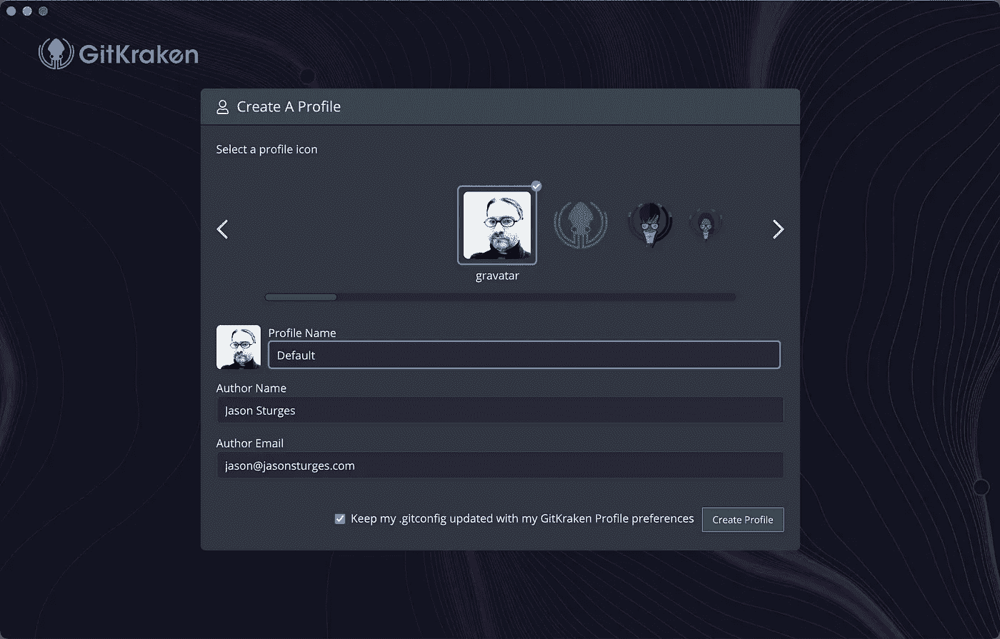

从 *GitKraken* 菜单中，选择*首选项*并转到*集成*选项卡*连接到 GitHub* 。这将重定向到 GitHub 进行授权。

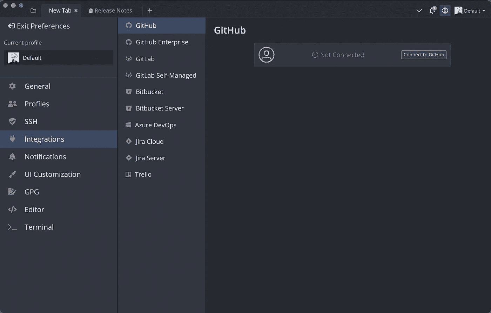

一旦连接好，就可以添加上一步中的 SSH 密钥；或者，让 GitKraken 管理 ssh 密钥。

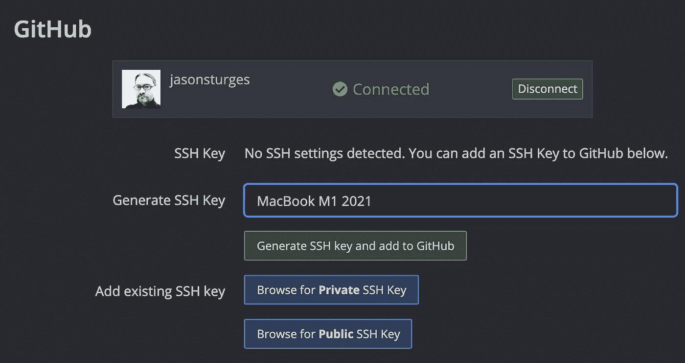

## 全局 git 忽略

为特定于操作系统或工具的文件设置一个全局 git 忽略文件，而不是不断地将它们添加到每个存储库中，这是一个很好的实践。这在提交拉取请求时与第三方回购合作时也很方便。

从终端，cd 到您的主目录，并使用`vi`创建文件:

```
% cd ~
% vi .gitignore-global
```

对于我的工具链，我包括:

```
# JetBrains IDEs: IntelliJ, RubyMine, PhpStorm, AppCode, PyCharm
## Directory-based project format
.idea/## File-based project format
*.ipr
*.iws
*.iml# Visual Studio Code
.vscode/
.vs/# Mac
.DS_Store# Windows
Thumbs.db
```

按`ESC`和`ZZ`保存并退出 vi。

执行以下 git 命令来注册全局 gitignore:

```
git config --global core.excludesfile ~/.gitignore-global
```

这将更新您的`~/.gitconfig`以包括:

```
[core]
    excludesfile = /Users/jasonsturges/.gitignore-global
```

# 包管理器

## 公司自产自用

虽然我通常更喜欢直接从官方供应商那里获得二进制文件，但家酿仍然是一个重要的软件包管理器，现在支持苹果芯片。

通过在终端中执行以下命令进行安装:

```
/bin/bash -c "$(curl -fsSL [https://raw.githubusercontent.com/Homebrew/install/HEAD/install.sh](https://raw.githubusercontent.com/Homebrew/install/HEAD/install.sh))"
```

安装完成后，按照终端中的*后续步骤*将 brew 添加到您的路径中:

```
echo 'eval "$(/opt/homebrew/bin/brew shellenv)"' >> /Users/[username]/.zprofileeval "$(/opt/homebrew/bin/brew shellenv)"
```

在你的 mac 上，自制软件将在`/opt/homebrew`安装

要编译 ARM64 的包，例如在 yarn 构建期间接收 node-gyp 错误，请按照以下方式指定体系结构:

```
arch -arm64 brew install pkg-config cairo pango libpng jpeg giflib librsvg
```

## 节点. js

从 v16 开始，现在完全支持 M1 ARM64。从 Node.js [下载](https://nodejs.org/en/download/)页面，选择 64 位/ ARM64 安装程序。

运行安装程序后，`node`和`npm`将被安装到:

*   Node.js: `/usr/local/bin/node`
*   npm: `/usr/local/bin/npm`

要安装`yarn`，请执行:

```
sudo npm install --global yarn
```

# 结构

## 。NET 框架

如果考虑跨平台开发。NET(以前。NET Core)和 Unity 等工具，这个安装程序包含了。NET SDK 和。NET 运行时(撰写本文时是版本 6)。

下载并运行[安装包](https://dotnet.microsoft.com/download)；或者，使用自制软件安装:

```
brew install dotnet
```

**Java**

从版本 17 开始，Oracle 的 Java SE 开发套件支持 macOS Arm64。从 [Java SE 下载页面](https://www.oracle.com/java/technologies/downloads/#jdk17-mac)中，选择 *macOS Arm64*

# 编辑器和 ide

## VS 代码

现在，让我们来看看一些编辑。Visual Studio Code 是一个不可思议的开源代码编辑器，安装起来总是很有用，即使不是您的主要 IDE。

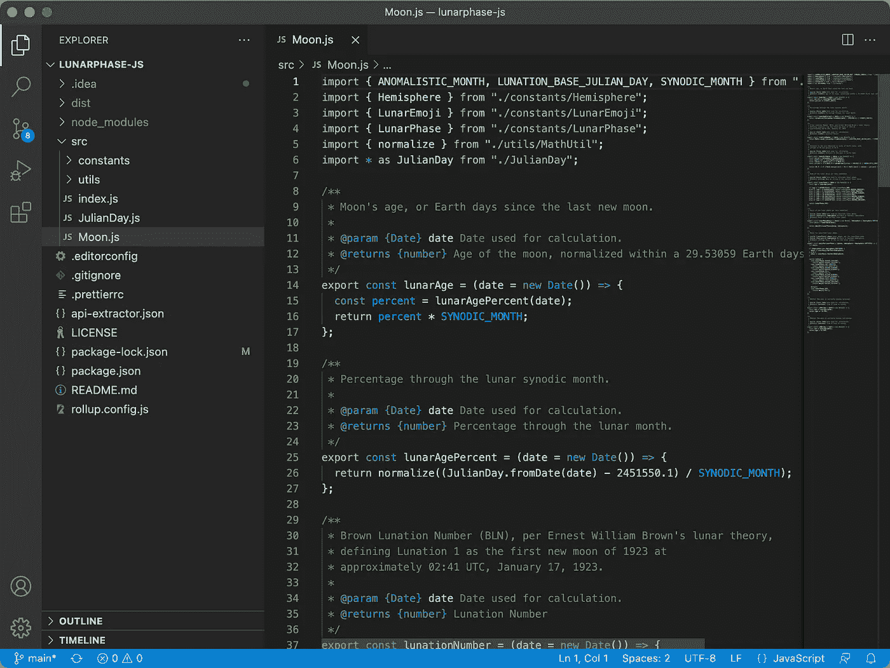

从 [VS 代码下载](https://code.visualstudio.com/download)页面，在 *Mac 下，*选择*苹果芯片*安装。

没有安装程序；因此，将 *Visual Studio Code* 应用程序拖放到 mac 的应用程序文件夹中。

## JetBrains

我使用了许多 JetBrains 技术，提供了从编辑器 ide 到数据库等等的解决方案。

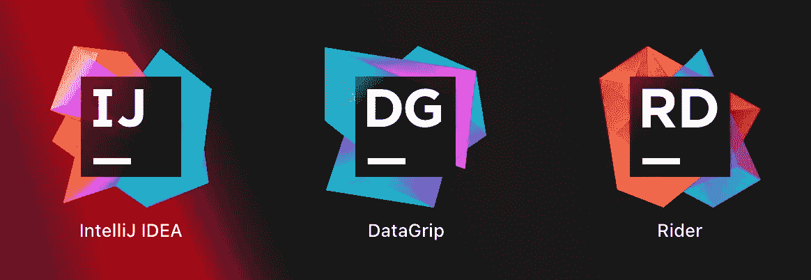

他们的产品套件是经过深思熟虑的，提供了您期望从本地解决方案提供商那里得到的强大的重构和分析工具。

## JetBrains IntelliJ 想法

我的主要 IDE 是 IntelliJ IDEA。从[下载](https://www.jetbrains.com/idea/download/#section=mac)页面，有免费的*社区*版，也有付费的*终极*版。单个许可证价格合理，如果您使用多个 JetBrains 产品，请考虑购买 [*所有产品包*](https://www.jetbrains.com/all/) 订阅。

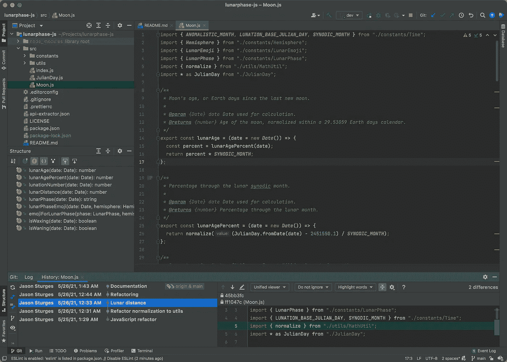

在下载链接中，确保选择*。dmg(苹果硅)*:

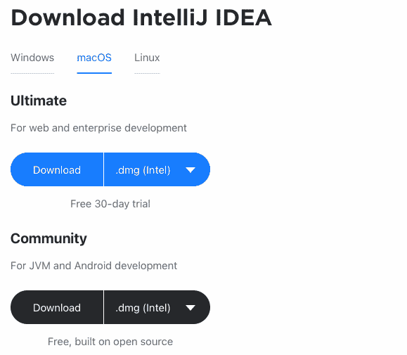

## JetBrains 骑手

因为。NET 并集成有 Unity 或者虚幻引擎的游戏开发，我推荐安装 [Rider](https://www.jetbrains.com/rider/) 。Rider 通过强大的 ReSharper 扩展提供跨平台游戏、web、云和本机应用程序开发。

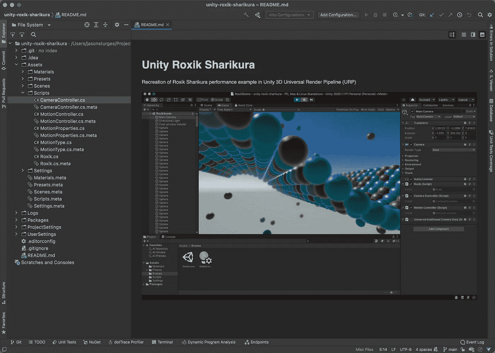

更多关于与 Unity 集成的信息请见下文。

## JetBrains DataGrip

我经常使用的另一个 JetBrains 产品是 [DataGrip](https://www.jetbrains.com/datagrip/) ，这是一个数据库 IDE，能够自省和修改数十个数据库引擎，包括 MySQL、PostgreSQL、SQL Server、Oracle、Azure、MariaDB、Cassandra、MongoDB、MariaDB、SQLite 和许多其他引擎。

# 虚拟化

## 码头工人

现在支持 Apple silicon，Docker 是通过容器化应用程序维护多个环境的基本策略。

选择*苹果芯片 Mac 下载 [Docker 桌面](https://www.docker.com/products/docker-desktop)。*

或者，使用自制软件安装:

```
brew cask install docker
```

# 数据库

为了支持多个数据库环境，我通常使用 Docker 从一个容器中运行多个版本。

例如，要启动最新的 Postgres 数据库:

```
docker run --name postgres -p 5432:5432 -e POSTGRES_PASSWORD=postgres -d postgres
```

然后，连接到数据库:

```
docker exec -i [container] psql -U user -d database
```

MySQL 也是如此:

```
docker run --name mysql -p 3306:3306 -e MYSQL_ROOT_PASSWORD=dbpassword -d mysql
```

使用这种方法，您可以通过指定标签来运行多个版本，例如:

```
-d mysql:8.0
-d mysql:5.6
```

# 云

虽然你可能会使用[微软 Azure](https://azure.microsoft.com/en-us/) (带[存储浏览器](https://azure.microsoft.com/en-us/features/storage-explorer/))、[谷歌云](https://cloud.google.com)及其`gcloud`和`gsutil`的[云 SDK](https://cloud.google.com/sdk/docs/install) ，但我主要使用[亚马逊 AWS](https://aws.amazon.com) 来提供基于云的服务。

## AWS CLI

按照亚马逊[入门说明](https://docs.aws.amazon.com/cli/latest/userguide/getting-started-install.html)安装 AWS CLI，完成后再配置

```
aws configure
```

# 创造性创作

## 搅拌机

我的工作空间包括 [Blender](https://www.blender.org) ，免费的 3D 和动画开源工具。

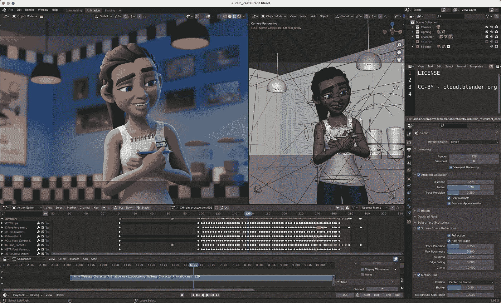

Blender 现在支持苹果硅。从[下载页面](https://www.blender.org/download/)，确保选择 *macOS 苹果芯片*选项

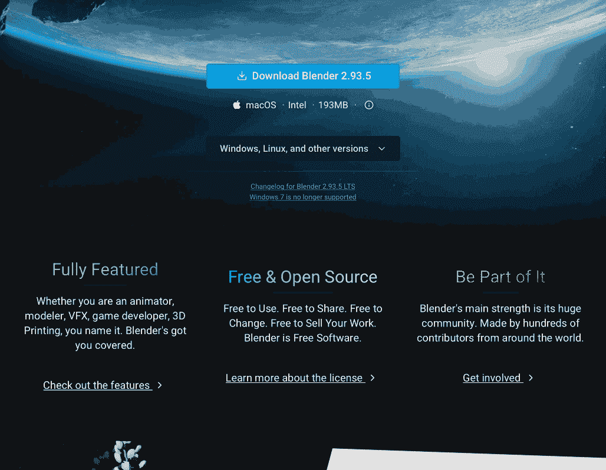

## 一致

提供一套令人难以置信的游戏服务，电影，动画，电影艺术，汽车，建筑，工程，虚拟和增强现实， [Unity](https://unity.com) 以[个人计划](https://store.unity.com/#plans-individual)为特色，对学生和个人许可证免费。

通过[入门](https://unity.com/download#how-get-started)页面安装 Unity Hub。

要将 Unity 与 JetBrains Rider 集成，请阅读我的故事:

[](https://jasonsturges.medium.com/using-rider-with-unity-4dbb25311039) [## 结合 Unity 使用 JetBrains Rider

### JetBrains Rider 引入了与 Unity 的深度集成，尤其是在 macOS 上

jasonsturges.medium.com](https://jasonsturges.medium.com/using-rider-with-unity-4dbb25311039) 

## 砖坯黏土

[Creative Cloud](https://www.adobe.com/creativecloud.html) 是我光栅和矢量图形、视频、音频、字体和 UI/UX 工作流程中不可或缺的一部分。

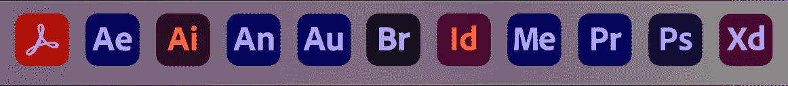

[Acrobat](https://www.adobe.com/products/acrobat-pro-cc.html) 、 [After Effects](https://www.adobe.com/products/aftereffects.html) 、Animate、 [Audition](https://www.adobe.com/products/audition.html) 、Bridge、 [Illustrator](https://www.adobe.com/products/illustrator.html) 、 [InDesign](https://www.adobe.com/products/indesign.html) 、 [Media Encoder](https://www.adobe.com/products/media-encoder.html) 、 [Photoshop](https://www.adobe.com/products/photoshop.html) 、 [Premiere Pro](https://www.adobe.com/products/premiere.html) 、 [XD](https://www.adobe.com/products/xd.html) 。

## 手闸

作为 Adobe 媒体编码器的替代产品， [HandBrake](https://handbrake.fr) 是一个快速、轻量级、开源的媒体编码解决方案。从[下载页面](https://handbrake.fr/downloads.php)安装 macOS Universal。

## 达芬奇决心

作为 Adobe Premiere Pro 用于视频编辑的替代产品，请考虑 Blackmagicdesign 的 [DaVince Resolve](https://www.blackmagicdesign.com/products/davinciresolve/) 。有了免费版本，这是一套强大的基于节点的视频编辑工具。

## 其他选择

其他可以考虑的创作选择有 [Inkscape](https://inkscape.org) 、 [Krita](https://krita.org/) 和 [DarkTable](https://www.darktable.org) 。

# 生产力工具

## LICEcap

对于动态 gif 截屏，我使用 Cockos 公司的 LICEcap。

向下滚动到*下载*部分，选择适用于 macOS 的 LICEcap*，其中包含 Apple Silicon 原生支持。*

## *概念*

*对于高级笔记和文档协作，我使用[概念](https://www.notion.so)。它可以通过网络或作为一个独立的客户端。*

*从[下载页面](https://www.notion.so/desktop)，会提示你安装苹果 M1 版本的*MAC。**

*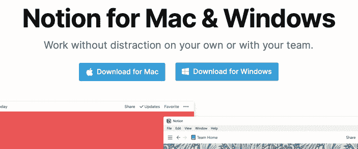*

## *微软办公*

*别忘了必备的微软 Office 产品套件，Office、Work、Excel、Outlook，这些现在都针对苹果芯片进行了优化。从您的 Office 门户或 Microsoft 帐户获取它们。*

## *即时消息*

*最后， [Slack](https://slack.com) 、 [Zoom](https://zoom.us) 或[微软团队](https://www.microsoft.com/en-us/microsoft-teams/log-in)下载，用于远程消息传递和团队协作。*

# *最后的想法*

*我的 M1 之旅才刚刚开始，等待苹果硅芯片的新 M1 Pro 和 Max 版本。请务必对任何发现进行评论，并期待本文的更新或未来故事中的更深入探讨。*