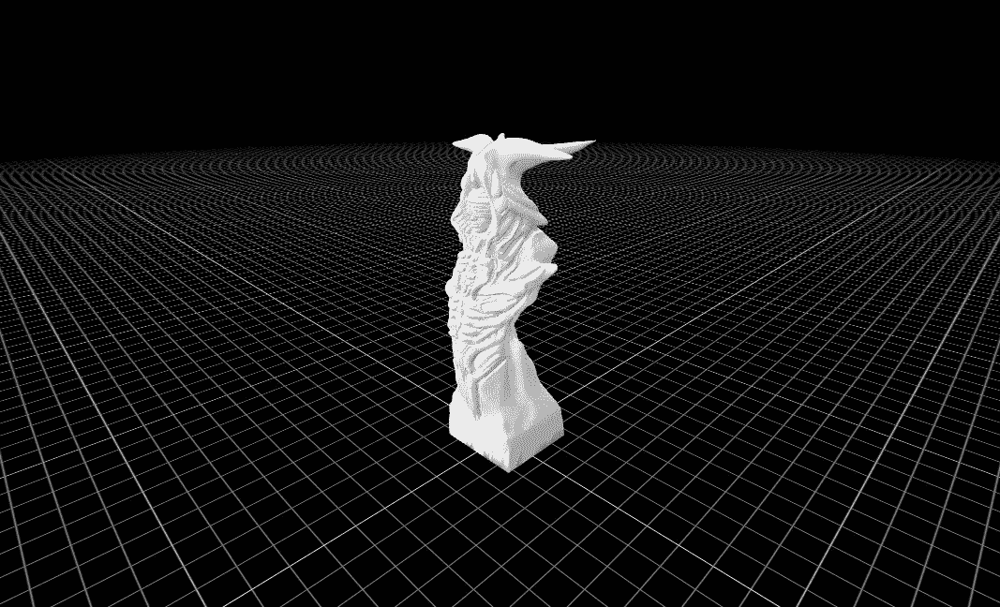
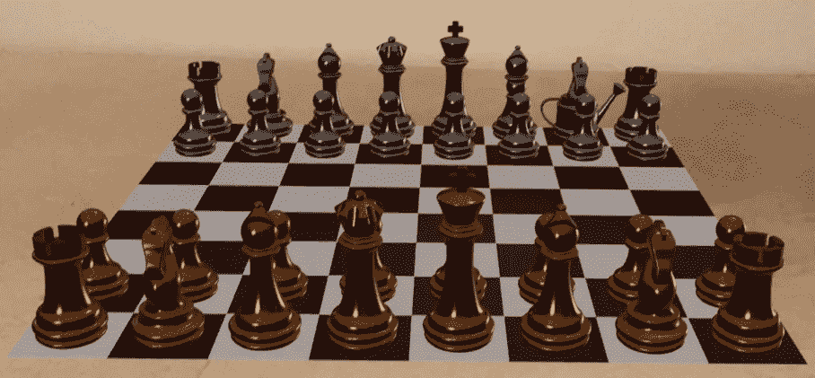

# 使用 RealityKit、ARKit 和 SwiftUI 设置多人 3D 象棋

> 原文：<https://betterprogramming.pub/setting-up-a-multiplayer-3d-chess-using-realitykit-arkit-and-swiftui-905345301153>

## “用 await/async 和 actors 构建 3D 象棋”的后续



我的外星棋局中的女王截图

我一直在修改今年早些时候写的一篇关于使用 SceneKit 创建 3D 象棋游戏的文章。

在某种程度上基于 RealityKit 上的 WWDC2019 演示文稿的返工——尽管本文需要观看的演示文稿是[这个](https://www.google.com/url?sa=t&rct=j&q=&esrc=s&source=web&cd=&ved=2ahUKEwjzgvb5-eH7AhVBU6QEHSqOA9UQwqsBegQICxAB&url=https%3A%2F%2Fdeveloper.apple.com%2Fvideos%2Fplay%2Fwwdc2019%2F610%2F&usg=AOvVaw1lQq1RTuLfTJSjEVyHx7Dx)。和我一起填写 WWDC2019 演示文稿中的空白和更多内容。

在实现多对等框架时，我发现自己也深陷在 async/await/actor 代码中，这不是前者的先决条件，但却是更好的编程。

多点框架基于 BONJOUR 协议——苹果公司在 2002 年推出的“zeroconf”技术组的一部分。

尽管当时很少有人意识到，这是苹果的一个战略举措，以帮助建立他们今天的生态系统套件的标志——一个所有产品都可以透明地相互对话的生态系统。

我相信你知道我的意思；你的 Apple watch 可以和你的 iPhone 通话，iPhone 连接到你在 AppleTV 上使用的电脑——相信我，当我在 80 年代中期进入 IT 世界时，情况并不是这样的。

# 多对等框架

建立多对等框架有点挑剔。

首先，您需要向`info.plist`文件添加三个标志。

一个是网络安全设置，第二个和第三个是您想要创建的 bonjour 服务的名称。

*预先警告 BONJOUR 服务的名称必须以下划线开头，它使用的协议也是如此。所以是 _tcp 或者 _udp。*

```
<?xml version="1.0" encoding="UTF-8"?>
<!DOCTYPE plist PUBLIC "-//Apple//DTD PLIST 1.0//EN" "http://www.apple.com/DTDs/PropertyList-1.0.dtd">
<plist version="1.0">
<dict>
 <key>NSBonjourServices</key>
 <array>
  <string>_chess-game._tcp</string>
  <string>_chess-game._udp</string>
 </array>
</dict>
</plist>
```

# 多对等服务

完成后，您可以设置服务并启动浏览器来查找它，这取决于您所在的代码分支。

我在代码中创建了一个专门的类来做这件事。

注意:这里的`serviceType`的名字没有下划线！奇怪的怪癖。

```
class ChessMultipeerSession: NSObject, ObservableObject {
    static var shared = ChessMultipeerSession()

    private let serviceType = "chess-game"
    private let myPeerId = MCPeerID(displayName: UIDevice.current.name)
    private var serviceAdvertiser: MCNearbyServiceAdvertiser!
    private var serviceBrowser: MCNearbyServiceBrowser!
    public var session: MCSession!

    deinit {
        serviceAdvertiser.stopAdvertisingPeer()
        serviceBrowser.stopBrowsingForPeers()
    }

    func startHost() {
        session = MCSession(peer: myPeerId, securityIdentity: nil, encryptionPreference: .required)
        session.delegate = self
        serviceAdvertiser = MCNearbyServiceAdvertiser(peer: myPeerId, discoveryInfo: nil, serviceType: serviceType)
        serviceAdvertiser.delegate = self
        serviceAdvertiser.startAdvertisingPeer()
    }

    func startClient() {
        session = MCSession(peer: myPeerId, securityIdentity: nil, encryptionPreference: .required)
        session.delegate = self
        serviceBrowser = MCNearbyServiceBrowser(peer: myPeerId, serviceType: serviceType)
        serviceBrowser?.delegate = self
        serviceBrowser.startBrowsingForPeers()
    }
}
```

好吧——但是等等！这里有更多的微妙之处，你需要考虑。因为我们知道我们将只有一个主机和一个客户端，所以我们可以设置对话，以便主机一检测到客户端，就邀请他们加入，而客户端一收到邀请，就接受邀请。显然，在野外你可能要多考虑一下这个问题。

```
extension ChessMultipeerSession: MCNearbyServiceAdvertiserDelegate {
    public func advertiser(_ advertiser: MCNearbyServiceAdvertiser, didReceiveInvitationFromPeer peerID: MCPeerID, withContext context: Data?, invitationHandler: @escaping (Bool, MCSession?) -> Void) {
        log.info("didReceiveInvitationFromPeer \(peerID)")
        print("invitationHandler")
    }
}

func browser(_ browser: MCNearbyServiceBrowser, foundPeer peerID: MCPeerID, withDiscoveryInfo info: [String: String]?) {
        log.info("ServiceBrowser found peer: \(peerID)")
        browser.invitePeer(peerID, to: self.session, withContext: nil, timeout: 10)
}
```

为了保持简洁，我在这里展示了最少的代码，没有任何错误处理。

```
class Coordinator: NSObject, ARSessionDelegate {
        private let arView: ARView
        private var pieceTemplates: [ChessEntity] = []

        private var chessSession = ChessMultipeerSession.shared
        private var common = Common.shared
        private var config = ARWorldTrackingConfiguration()
        private var tapGesture:UITapGestureRecognizer!

        init(_ view: ARView) {

            config.isCollaborationEnabled = true

            self.arView = view
            super.init()
            print("common.role \(common.role)")

            if common.role == .host {
                print("host ")
                chessSession.startHost()
                tapGesture = UITapGestureRecognizer(target: self, action: #selector(handleTap(_:)))
                arView.addGestureRecognizer(tapGesture)
            } else {
                print("client ")
                chessSession.startClient()
                tapGesture = UITapGestureRecognizer(target: self, action: #selector(handleTap2(_:)))
                arView.addGestureRecognizer(tapGesture)
            }
            do {
                arView.scene.synchronizationService = try MultipeerConnectivityService(session: chessSession.session)
                arView.session.run(config, options: [])
                arView.session.delegate = self
            } catch {
                print("unable to sync")
            }
}
```

RealityKit 和 ARKit 一起处理客户端同步中的所有事情。例如，在这种情况下，它将创建第二个棋盘，用棋子填充它，并保持两个棋盘同步。

为了确保资产正确转移，y *ou 必须在建立连接之前创建实体* `Codable`并上传它们。

谈到资产，这里也需要对我上次构建的原型进行微妙但关键的更改。在其中，我从文件中加载了一个资产作为材料，然后将其添加到实体中。这是一个不能跨多个设备工作的事件序列[即使资产在那里],因为同步将尝试从文件系统引用中引用预加载的资产，这在第二个客户机上将是错误的！

为了解决这个问题，*你必须使用一个间接引用*，比如一组资产材料，一个可以在你所有的 iOS 设备上工作的引用。这适用于任何/所有资产。

```
class Common: ObservableObject {
    static var shared = Common()
    @Published var role:Roles = .host
    @Published var pieceModels:[ChessEntity] = []
    private var loading:Cancellable!

    func loadKing(_ andFire:Bool, onCompletion: @escaping () -> Void) {
        let assetName = "GCHKing"
        loading = Entity.loadModelAsync(named: assetName)
            .sink(receiveCompletion: { completion in
                if case let .failure(error) = completion {
                    print("Unable to load a model due to error \(error)")
                }
                self.loading?.cancel()

            }, receiveValue: { [self] (entity: Entity) in
                if let entity = entity as? ModelEntity {
                    loading?.cancel()
                    print("Congrats! Model is successfully loaded!")

                    let piecePlayer = ChessEntity()
                    piecePlayer.model = entity.model

                    piecePlayer.position = SIMD3(x: 0, y: 0, z: 0)
                    piecePlayer.setScale(SIMD3(0.0025,0.0025,0.0025), relativeTo: piecePlayer)
                    piecePlayer.generateCollisionShapes(recursive: true)
                    piecePlayer.name = "GCHKing"
                    piecePlayer.components[PieceComponent.self] = PieceComponent(color: .white, value: 0)
                    pieceModels.append(piecePlayer)
                    //anchor.addChild(piecePlayer)
                }
            })
        print("completed")

    }
}
```

此处显示的`loadKing`也应该在您启动应用程序时调用，因此登录屏幕。

*注意:这里要同步的服务名称有* ***没有下划线，另一个怪癖*。**

# 行动者

当然，我需要的不仅仅是一个国王，我把方法改成了`loadAssets`上传半打。

但是把它放到一个循环中，我马上就遇到了访问我的模型数组的困难——我使用 Combine 框架解决了这个问题，我使用它来对需要添加到我的数组中的条目进行排队。

```
pushing = push
    .sink(receiveValue: { [self] model in
        common.pieceModels.append(model)
        print("saved \(common.pieceModels.count)")
})
```

我之所以说修复，是因为我后来读了一篇由 matt 写的文章，这篇文章告诉我你应该永远不要在 Combine 框架中使用 async/await。为什么是马特？如果你知道为什么，请告诉我为什么，如果你在评论中知道，有人认识马特？替我问他。

我考虑了一下，认为这是尝试实现一个 actor——async/await 表亲——的好机会。使用此处显示的代码块，最终结果。

```
actor ModelsDB: ObservableObject {
    static var shared = ModelsDB()
    var chessModels:[ChessEntity] = []

    func saveModel(model: ChessEntity) {
        chessModels.append(model)
    }
}
```

在我开始之前，让我解释一下。

所以我用这里看到的`chessModels`代替了`pieceModels`阵。一个数组，你只能在守护它的演员里面访问它——我不禁想起了曼达洛人的那句台词——“这就是方法”——我喜欢演员；尽管实现起来很痛苦，但它们迫使您编写结构化代码。
我创建了一个保存方法并修改了克隆方法——这是异步/等待编码动态的一个很好的练习。

## 复制

是的，你是对的。这听起来越来越像《星球大战》了。事情是这样的。在国际象棋中，你有六个模型，只有六个。你有国王和王后，主教，骑士，城堡和卒。你可以重复加载模型，尽管正如 WWDC 所说，那是疯狂的。

不，有一个具体的命令来处理这个，即`clone()`。我只需要加载一次原理模型，然后克隆它们。

这里的第一个挑战是延迟克隆过程，直到我有了所有的六个模型——我通过放入一个标志来确保我不会开始克隆过程，直到**我确信**一切都被锁定和加载。

```
if chessModels.count == 6 {
    print("downloaded, now cloning")
    sortPlayersV()
}
```

下一个挑战是我不能确定模型会按照我期望的顺序加载到数组中，尽管这被证明是一种预防措施。我调用了序列 X，但可能以序列 y 结束。为了解决这个问题，我以这段代码结束。

```
func returnPiece(pieceName:String) -> ChessEntity? {
    for piece in chessModels {
        if piece.name == pieceName {
            return piece
        }
    }
    return nil
}
```

除此之外，很容易使用“*抵抗方法*”这个例程使用 Swift 的可选参数来克隆/构建对方团队。我的团队涂上了金属棕色，看起来像金色，和金属灰色，看起来像银色。

```
func cloneUpdateModel(chessPiece: ChessEntity? = nil, index:Int? = nil, x:Float? = nil, y:Float? = nil, z:Float? = nil, material:SimpleMaterial? = nil, color:PieceColor? = nil) {
    var clonedCopy: ChessEntity!
    if chessPiece != nil {
        clonedCopy = chessPiece?.clone(recursive: true)
    }
    if index != nil {
        clonedCopy = chessModels[index!].clone(recursive: true)
    }
    //let newIndex = cloneModel(index: index!)
    if x != nil {
        clonedCopy?.position.x = x!
    }
    if y != nil {
        clonedCopy?.position.y = y!
    }
    if z != nil {
        clonedCopy?.position.z = z!
    }
    if material != nil {
        clonedCopy?.model?.materials = [material!]
    }
    if color != nil {
        clonedCopy?.piece.color = color!
    }
    chessModels.append(clonedCopy!)
}
```

我对放置板子和锚的手势做了一个小小的改动。

```
@objc func longPress(_ sender: UIGestureRecognizer? = nil) {

    let result = arView.raycast(from: (sender?.location(in: arView))!, allowing: .estimatedPlane, alignment: .horizontal).first

    if result != nil {
        // Create anchor to sync
        let arAnchor = ARAnchor(name: "chess-game", transform: result!.worldTransform)
        self.arView.session.add(anchor: arAnchor)
        // Add anchor to local scene
        let anchorEntity = AnchorEntity(anchor: arAnchor)
        self.arView.scene.addAnchor(anchorEntity)
        self.doBoard(anchor: anchorEntity)
    } else {
        print("error")
    }
}
```

这一切看起来都很好，虽然，虽然我们还没有完全完成多人游戏，我们有两个玩家，一个棋盘和一些加载的棋子，以及一个基本的移动方式，它都工作了——但只是从一边。

回到 WWDC2019 演讲，这显示了我们需要管理它的代码。我们需要更改用于移动的例程，在尝试这样做之前，更新它以请求棋子的所有权。

# 所有权

最初，主机拥有所有资产，第二方只有读取权限。没有概念所有权。这是一个对等系统，所有系统都是平等的。

```
@objc func handleTap(_ sender: UIGestureRecognizer? = nil) {
    let tapLocation = sender?.location(in: arView)

    if let piece = arView.entity(at: tapLocation!) as? ChessEntity {
        piece.requestOwnership { request in
            if request == .granted {
                piece.movePiece()
            }
        }
    }
}
```

# 表演

但是，当我在 128 Gb 内存的 iPhone 13 上运行这个应用程序时，我很快遇到了一个更严重的问题，出现了一些严重的延迟和性能问题。我的外星人国际象棋里有太多的几何图形。我通过移除光线使事情变得稍微好了一点，但最终唯一合理的解决办法是找到一套新的象棋模型，从几何学的角度来看，这要简单得多。



用 ARKit 锚定的 3D 国际象棋，用 RealityKit 绘制

# 将来的

这就把我带到了这篇长文的结尾。在我有一个最小可行的产品之前，主要剩下的工作是整理动作和一些游戏管理——哦，对了，修复黄金骑士+主教，这两个都指向错误的方向！敬请期待下一部分！