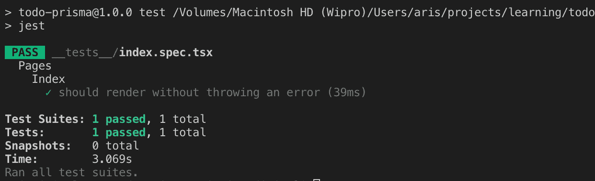

# 使用 TypeScript、Sass 和 Jest 设置 Next.js 项目

> 原文：<https://betterprogramming.pub/setting-up-a-next-js-project-with-typescript-sass-and-jest-d9b2d3bfb34a>


照片由 [Goran Ivos](https://unsplash.com/@goran_ivos?utm_source=unsplash&utm_medium=referral&utm_content=creditCopyText) 在 [Unsplash](https://unsplash.com/search/photos/code-program?utm_source=unsplash&utm_medium=referral&utm_content=creditCopyText) 上拍摄

[下一个](https://nextjs.org/)。js 是一个 React 框架，用于构建生产就绪的网站，具有许多特性，如 SSR、静态导出、零设置要求等等。

这个故事是一个更大的故事的第一部分，在这里我们学习如何使用 [Prisma](https://www.prisma.io/) 创建一个待办事项应用程序。

我选择 Next.js 的原因是它有很大的灵活性。您可以轻松地添加许多不同的附加组件( [Jest](https://jestjs.io/) 、 [Sass](https://sass-lang.com/) ，服务器端开发)，只需最少的配置麻烦，并使应用程序在服务器端呈现时仍能运行良好。

您可以轻松创建前端应用程序，并将其转换为全栈应用程序。

# 我们开始吧

我们需要做的第一件事是创建一个名为`todo-projectname`的项目文件夹，并用 [Visual Studio 代码](https://code.visualstudio.com/)打开它。

```
mkdir todo-**projectname**
```

让我们安装`react`、`react-dom`和`next`。

```
npm init -ynpm install -save react react-dom next
```

现在，我们需要创建一个 pages 文件夹来运行页面。

```
mkdir pages
```

下一步是尝试创建我们的第一页。在这个文件夹中，创建`index.js`文件并复制下面的代码。

是时候测试我们的第一个 Next.js 页面了。在控制台上运行以下命令:

```
npm run dev
```

在你的浏览器上加载以下内容`[http://localhost:3000](http://localhost:3000)`，你应该能看到我们的 Hello World。

# 添加 TypeScript 支持

这些最初的步骤只是为了设置我们的环境。

我们接下来要做的是添加 TypeScript。为此，我们必须添加一些文件，并对样板文件进行一些更改。

在根文件夹中，创建名为`next.config.js`的文件。

现在，您需要在项目中安装一个支持 TypeScript 的包。

在控制台上，运行以下命令:

```
npm install --save @zeit/next-typescript
```

在该文件中，复制以下代码:

```
const withTypescript = require('@zeit/next-typescript')module.exports = withTypescript()
```

在根文件夹中创建一个`.babelrc`文件，并添加以下配置代码:

注意，我们根本不需要添加`tsconfig`，因为我们已经添加了`.babelrc`。

最后，我们将用我们的 TypeScript 实现替换`index.jsx`:

您将得到相同的输出，但是这次它将是一个更大胆的(因为我们使用 H1) Hello World！

您现在有了一个基于类型脚本的 Next.js 样板文件。

# 添加 Sass

如果您想创建使用 Sass 的组件，我们可以用 Next.js 轻松做到这一点。

为此，我们需要安装另一个包。使用我们的控制台，我们可以通过运行以下命令来做到这一点:

```
npm install --save @zeit/next-sass
```

然后我们需要在我们的`next.config.js`内部做一些改变。

我们也将不得不修改我们的`index.tsx`文件，使我们的 H1 蓝色。

为此，我们将进行以下两项更改，如下所示:

我们需要在文件夹的路径中添加`index.scss`:

```
.example { color: blue;}
```

请注意，每次对`next.config.js`进行更改时，都需要重启服务器。使用`CTRL+ C`重启，然后再次运行`npm run dev`。

你现在应该可以在你的 H1 上看到蓝色了。

# 用 Jest 添加测试

下一步是添加 Jest 测试。你可以按照 [Miin](https://medium.com/@miiny) 的文章中的说明去做。

在我们的项目中，我们需要做一些改变。一些配置不再工作，我不得不添加一些修改来解决这个问题。

我们需要安装以下软件包:

```
npm install --save-dev jest babel-jest babel-core babel-preset-env babel-preset-react
```

然后改变我们的`package.json`来添加测试脚本:

```
"scripts": { 
      "test": "jest", 
      "test:watch": "jest — watch", 
      "test:coverage": "jest — coverage"
},
```

接下来，让我们安装[酶](https://airbnb.io/enzyme/)测试库:

```
npm install --save-dev enzyme enzyme-adapter-react-16
```

由于我们选择用 TypeScript 编写，我们还需要安装:

```
npm install --save-dev typescript ts-jest @types/enzyme @types/enzyme-adapter-react-16 @types/jest
```

此外，对于 Jest，我们还需要为 Jest 设置一个配置文件，为 TypeScript 和 Jest 设置一个配置文件。

`jest.tsconfig.json`:

和`jest.config.js`:

您需要对`package.json`文件进行一些更改——添加以下内容:

为此，您需要创建一个名为`__mocks__`的文件夹，并在其中添加两个文件:

```
//__mocks__/fileMock.jsmodule.exports = 'test-file-stub';
```

并且:

```
//__mocks__/stylesMock.jsmodule.exports = {};
```

然后，我们需要将`enzyme.js`文件添加到我们的文件夹的根目录中，并添加以下代码。

在其他一些例子中，我看到它被添加到每个测试的顶部，但是通过下面的操作，它将被包括在内，而不必添加它。

```
const Adapter = require('enzyme-adapter-react-16')require('enzyme').configure({adapter: new Adapter()})
```

现在创建一个`__tests__`文件夹，并添加下面的示例测试文件`index.spec.tsx`。

您可以在终端上使用以下命令运行测试:

`npm run test`



它成功了，太棒了！

# 完全回购

你可以在这里找到完整的回购协议:

[](https://github.com/arismarko/nexttsboiler) [## aris Marko/nextts 锅炉

### 使用 Next.js、TypeScript、Sass 和 Jest - arismarko/nexttsboiler 的样板文件

github.com](https://github.com/arismarko/nexttsboiler) 

感谢阅读！