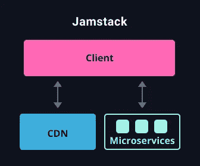

# 如何用 TypeScript 设置无服务器项目

> 原文：<https://betterprogramming.pub/setting-up-a-serverless-project-with-typescript-eef4af832733>

## *让我们将 Jamstack 与 Next.js 和 TypeScript 一起使用*


由 [Artem Sapegin](https://unsplash.com/@sapegin?utm_source=unsplash&utm_medium=referral&utm_content=creditCopyText) 在 [Unsplash](/s/photos/javascript?utm_source=unsplash&utm_medium=referral&utm_content=creditCopyText) 上拍摄

一种被称为 Jamstack 的新兴技术正在慢慢地在 MEAN 和 MERN 之间占据一席之地。它基于微服务的原理，而不是真正的中央服务器。Gatsby 和 Vercel 等公司使得设置和部署这一技术堆栈变得异常容易。

我们将看看如何建立一个遵循 Jamstack 的基本项目。我将简单介绍一下 Jamstack，我们将使用 TypeScript(这是可选的)来设置这个项目。

# Jamstack

Jamstack 是一个相当新的技术堆栈，正在发展并接管互联网。它作为客户端工作，由 CDN 提供服务，并作为后端与微服务连接。提供这种功能的几个框架是 [Gatsby](https://www.gatsbyjs.com/) 、 [Nuxt.js](https://nuxtjs.org/) 和 [Next.js](https://nextjs.org/) 。



来自 [Jamstack 网站](https://jamstack.org/)

像 Vercel 这样的平台使得部署变得容易，而且对于开源项目来说通常是免费的。如果你想用 Jamstack 做一个，它对博客甚至 SaaS 平台都很有用。

你可以在专为 Jamstack 设计的官方网站[上了解更多信息。您还可以找到更多遵循这种模式的框架，以及可以部署漂亮项目的地方。](https://jamstack.org/)

# 设置

我们想使用 [Next.js](https://nextjs.org/docs/getting-started) 创建一个非常小的项目。您可以使用一个启动器，或者您可以手动安装所有的包，并尽量减少膨胀。我将使用 npm 安装所有东西——你也可以使用 Yarn。

```
npm init -y
npm i next react react-dom
```

这将初始化 npm 并安装我们需要开始用 Next.js 构建的基本库。如果您愿意，您可以按照本文完成剩余的特定于 JavaScript 的安装。

我们需要为 Next.js 添加一个名为`pages`的目录，目前这个文件夹可以是空的。我们还需要在我们的`package.json`中添加`"dev": "next dev"`作为脚本来运行 Next.js。要运行这个项目，我们可以调用`npm run dev`。

## 以打字打的文件

为了增加对 TypeScript 的支持，我们将在项目的根目录下添加一个`tsconfig.json`文件，并且我们将添加更多的包来进一步支持 TypeScript。

```
npm i --save-dev typescript [@types/react](http://twitter.com/types/react) [@types/node](http://twitter.com/types/node)
```

当您在添加了`tsconfig`之后，试图在没有安装正确的 TypeScript 包的情况下运行项目时，您会得到一个错误，提示您需要安装这些包。

## 第一页

当您运行项目时，您将得到一个 404 错误。这是有意义的，因为我们还没有添加任何页面。我们将为第一页创建两个文件。

我们将添加`_app.tsx`，这将是我们的主要布局文件。在这个文件中，你可以为样式文件和网站的`head`中的所有内容添加导入。我将保持它最小化，因为我不需要任何额外的东西，但添加它总是一个好的做法。

我们将添加的最后一个文件是`index.tsx`，它将是我们的索引或主页。如果你用其他方式命名它，它将创建一个新的 URL。例如，`profile.tsx`将驻留在`localhost:3000/profile`中。这也适用于文件夹。你自己试试！

我们简单的主页将包含一些文本和一个外部的`div`。您可以从项目根目录下的`components`文件夹中添加 React 组件，并且可以从映射到`/`的`public`文件夹中提供静态文件。

我们现在使用 Next.js 为 Jamstack 设置了一个非常小的项目。关注一些 Next.js 或 Gatsby 教程，或者如果你喜欢 Vue，关注 Nuxt.js。

# 结论

Jamstack 可能会留在这里。现在下结论还为时过早，但它每天都得到越来越多的支持，我个人喜欢与 Next.js 和 Gatsby 合作不同的项目。

我希望这篇文章对一些人有用，尽管如此，它仍然是一个很好的读物。

感谢您的阅读，祝您度过美好的一天。