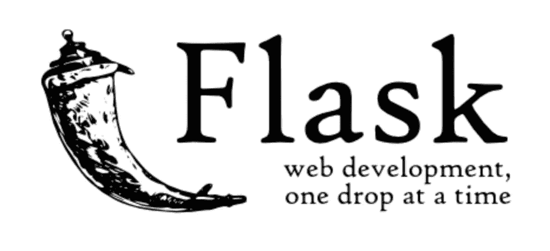
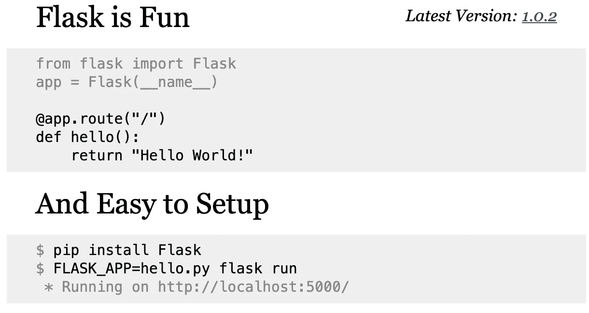
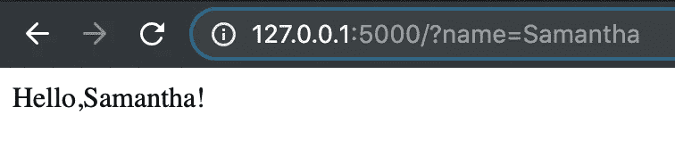
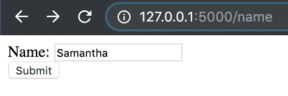
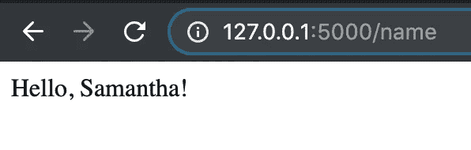
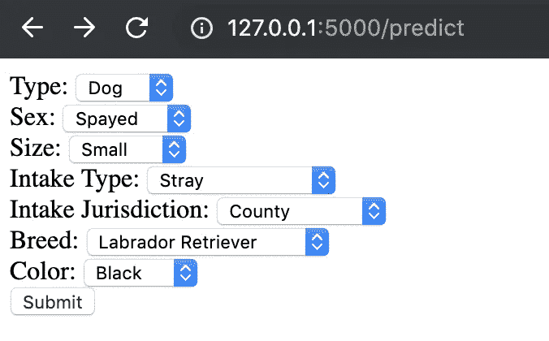
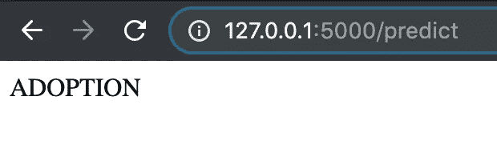

# 使用 Flask 构建简单的 API

> 原文：<https://betterprogramming.pub/setting-up-a-simple-api-b3b00bc026b4>

## 我认识弗拉斯克的旅程

照片由[希特什·乔杜里](https://unsplash.com/photos/D9Zow2REm8U?utm_source=unsplash&utm_medium=referral&utm_content=creditCopyText)在 [Unsplash](https://unsplash.com/search/photos/python-flask?utm_source=unsplash&utm_medium=referral&utm_content=creditCopyText) 拍摄

最近，我一直在处理数据并创建可以预测的模型…无论我训练它们预测什么！我使用来自动物收容所的数据集来创建一个模型，该模型将根据动物的摄入细节(品种、颜色、大小、位置等)来预测动物在收容所的结局。)

创建和调整这些模型是令人着迷的，但是希望有一天有人会想要使用我以自动化的方式构建的模型。理想情况下，这不需要他们打开我的 Jupyter 笔记本，运行所有的单元格来获得预测。为了避免这种情况，我需要设置一个 API 来接受输入(更确切地说，是特性)，并根据我训练的模型做出预测。

# 你好烧瓶

根据其[登陆页面](http://flask.pocoo.org/)，Flask 是*“一个基于 Werkzeug、Jinja 2 和 good intentions 的 Python 微框架。”*

[http://flask.pocoo.org/](http://flask.pocoo.org/)

换句话说，Flask 有助于用 Python 构建生产就绪的应用程序。我发现 Flask 特别吸引人，因为它的入门门槛很低——它们让入门变得极其容易！

这是直接从他们的登陆页面

在到达他们的网页的几秒钟内，你就可以启动并运行一个基本的应用程序。只需复制您看到的 python 代码并保存为“hello.py”，从您的终端安装 pip flask，然后运行您的“hello”flask 应用程序！

只用几行代码，Flask 就帮助我启动了一个简单的内置 API 服务器。太简单了！

# 启动并运行

现在我是 Flask pro(笑话！)，我可以将“hello”应用程序的基本格式应用到我最初创建的应用程序中。在处理一个模型之前，我从小处着手，决定尝试通过返回“hello，{name}！”来为我的“hello.py”文件添加功能。

对 Flask 文档的快速搜索揭示了一个简单的解决方案。我只需**导入请求**并**将** `name = request.args.get('name')`添加到我的“hello.py”文件中。成功了！

通过添加请求代码，我能够将一个参数(名称)放入 URL，API 将返回一个定制的问候。它看起来像这样:

一个令人兴奋的开始，但不是我想要的

这很酷，但不是我想要的。向 URL 中添加大量参数似乎很繁琐——我需要找到一种更好的方法。

## 初学者的快速笔记

现在是注意的好时机，每次我改变我的。py 文件，我不得不关闭正在运行的 flask 实例(在我的终端中 ctrl+c ),并在刷新我的浏览器之前重新运行`$ flask run`。这有点痛苦，直到我发现运行`$flask run —-reload`告诉 flask 在保存 python 文件时自动重新加载代码。

# 向上拉平

同样，为了获得额外的功能，我只需要对我的 python 文件进行微小的修改。然而，要完全理解我所做的改变，我需要了解更多关于 API 服务器的基本功能。据我所知，Flask 促进了我编写的 python 脚本(它将充当 API 服务器)和来自客户端(即 Web 浏览器)的任何传入请求之间的通信。根据 [Gonzalo Vázquez](https://restful.io/@gonzalovazquez?source=user_popover) 的说法，一个有效的请求需要四样东西:URL、方法、标题列表和主体。下面我将集中讨论前两个，因为我需要配置我的 API 来处理这些。幸运的是，Flask 让这变得很容易。

如果您将这段代码与上一段代码进行比较，您可以看到**装饰器**发生了变化。通过简单地添加这个装饰器，我已经配置了一个 URL，客户端可以在那里与 API 进行交互，并且我已经告诉 Flask，它可以在那里引导我的 API 将接受的两种不同类型的请求。一个来自客户端的`['GET']`请求请求服务器检索一个资源——在本例中，它将检索我添加的 HTML(可以通过 web 浏览器呈现为带有提交按钮的提交表单)。一个`['POST']`请求要求服务器创建一个资源(即使用输入返回输出)。

设置好这个 API 服务器后，从我的 web 浏览器访问它看起来像这样:

参赛表格—用户可以输入他们的名字，然后点击“提交”

点击“提交”后输出！

真的很酷！是时候看看我是否能让这个为一个模特工作了。

# 泡菜

不是这种泡菜。Monika Grabkowska 在 [Unsplash](https://unsplash.com/search/photos/pickle?utm_source=unsplash&utm_medium=referral&utm_content=creditCopyText) 上拍摄的照片

让我的模型通过 API 进行预测的一个重要步骤是酸洗。我腌了我的`LabelEncoder`、`PolynomialFeatures`，还有我的模型本身。基本上，任何符合我的数据的东西都被剔除了。这允许我在新的 python 文件中快速调用这些模型，而不需要在每次 API 服务器启动时重新训练模型。

通过酸洗我的`LabelEncoder`和我的`PolynomialFeatures`，它可以接受字符串作为输入，只需要基本的特性。因为这两个都已经符合我的数据，所以我简单地对每个的输入特性调用`.transform()`,就像我在 Jupyter 笔记本上训练它们之后所做的那样。

至于我的模型，一旦加载了 pickled 模型，我只需在我的编码特性上调用`.predict()`，它就会返回一个预测。

# 动物收容所结果预测

下面的代码展示了我如何设置一个 API 服务器来产生一个基于动物特征的预测。如您所见，它与我的“hello.py”文件具有相同的基本特性——装饰器告诉 Flask 可以访问它的 URL、它将接受的请求类型以及如何响应这些请求。唯一的区别是我创建了一个渲染模板来保存 HTML(因为 HTML 又长又丑)。

看看这些泡菜！

响应我的 web 浏览器的 API 如下所示:

# 结论

Flask 非常容易上手，并且有很好的文档。它还提供模板，使您的应用程序创建尽可能无痛。我仅仅触及了 Flask 及其用途的表面，但是我已经能够将我正在构建的这些有用的模型转化为 Python 环境之外的有用的东西。

*所有代码在我的* [*Github*](https://github.com/MsJacksonIYN/first_flask_app) 上都有