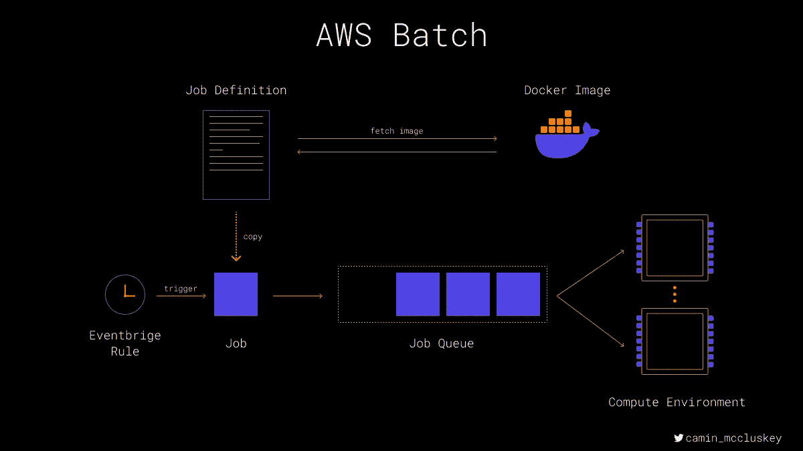
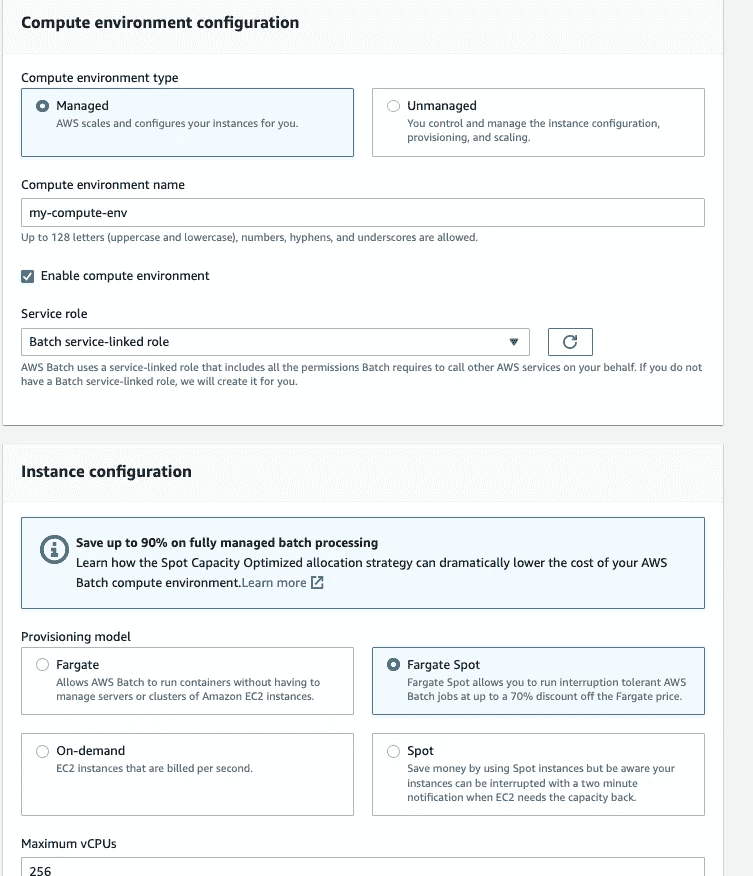
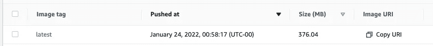
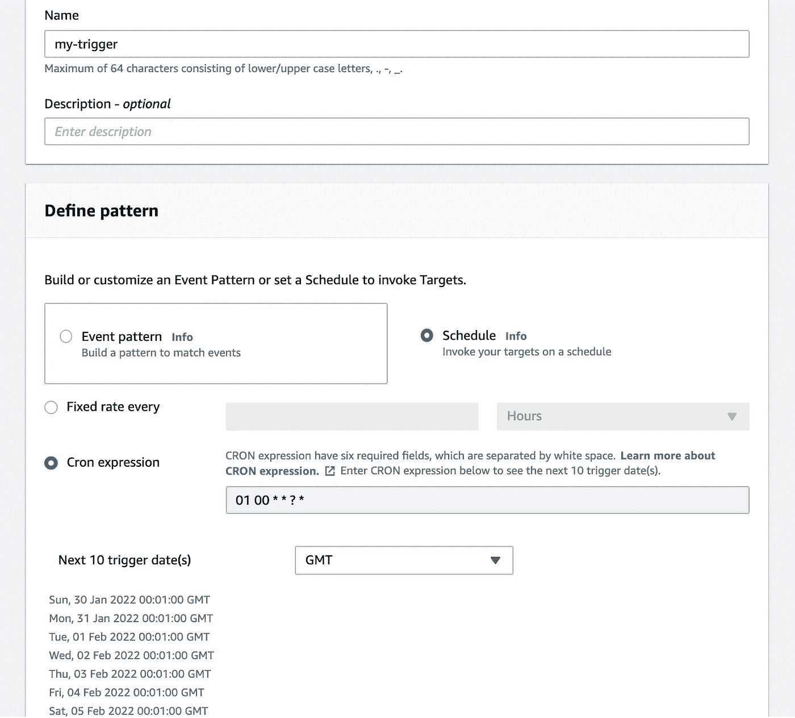
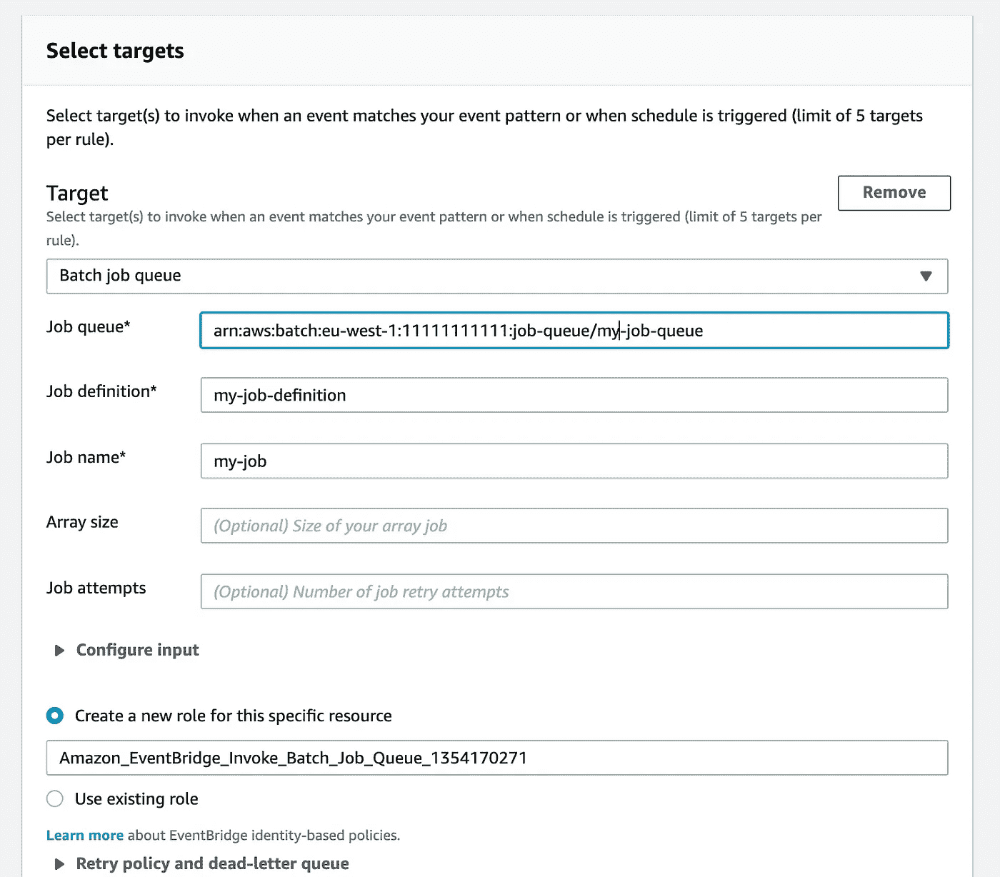

# 设置 AWS 批处理作业以处理日常任务

> 原文：<https://betterprogramming.pub/setting-up-an-aws-batch-job-to-process-daily-tasks-4d31d6bac257>

## 了解如何为您的工作创建 Docker 映像和存储库


特里斯坦·加塞特在 [Unsplash](https://unsplash.com?utm_source=medium&utm_medium=referral) 拍摄的照片

本文描述了如何设置 AWS 批处理作业，使其在每天的 cron 触发器上运行。

这将有助于任何人谁是建立他们的第一批工作或有人谁是试图找出如何触发一个重复的基础上的工作。本教程还描述了如何创建更复杂的需要权限来调用其他 AWS 服务的作业，因为这在 AWS 文档中是相当模糊的。

在介绍如何为您的工作创建 Docker 映像和存储库之前，我将简要地向您介绍 AWS 批处理的核心概念。然后，在结束之前，我将通过解释如何设置触发作业的 AWS Eventbridge 规则，一步步地解释如何设置 AWS 批处理基础设施。

# 概念



*   **作业**:实际的计算单位。作业指定它们从哪个作业定义继承，并被推入作业队列。
*   **作业定义**:描述作业的模板。在这里，您定义了表示将要运行的容器的映像、传递给该容器的角色、计算类型(EC2 或 Fargate)和任何环境变量(以及更多可选的配置)。
*   **作业队列**:保存准备由下一个可用计算资源处理的作业。队列指定他们希望作业在什么计算环境中运行(可以是多个，按某种顺序)。
*   **计算环境**:表示作业可以运行的实际计算资源。

# 批处理作业代码

首先，您需要定义在触发作业时实际运行的代码。

对于本例，您将希望将作业作为 Docker 容器运行。您可以选择任何您喜欢的语言，但是关键的要求是容器的一些入口点。这是作业启动时将运行的命令。

Python 作业的简单`Dockerfile`如下所示:

```
FROM python:3.10.0WORKDIR /appCOPY requirements.txt requirements.txt
RUN pip install -r requirements.txt COPY src src/ ENTRYPOINT ["python3", "-m", "src.main"]
```

在这个`Dockerfile`中，您将依赖项需求文件复制到 Docker 映像中，安装依赖项，然后复制 src 目录的内容。最后，您指定容器应该通过运行 src 目录中的`main.py`脚本来启动。

您可以在此处查看并派生一个简单的 AWS 批处理作业报告[示例。](https://github.com/camin-mccluskey/example-aws-batch-python)

## 为映像创建一个 ECR 存储库

现在您已经有了作业代码和创建 Docker 映像的能力，您需要某种方法使这个映像可用于您稍后将创建的作业定义。

您将使用 AWS 弹性容器注册中心(ECR)来托管您的映像。转到 AWS 控制台中的 ECR，然后单击 create repository。您很可能想要一个私有存储库，并且您可能希望按照以下约定来命名它:`<batch-job-name>-repo`

其他设置很可能会保留为默认设置。但是，您可能希望禁止 Docker 图像标签被覆盖。

对于这个例子，您将总是使用`:latest`标签，因此要求标签是可变的。

## 将您的图像推送到 ECR

您现在需要将 Docker 映像推送到 ECR 存储库。您可以从终端手动完成这项工作，或者使用类似 Github 的动作在代码推送时自动将新版本的图像推送到存储库中。

**手动** 运行以下 4 个命令，将 AWS 区域替换为您的 ECR repo 所在的区域、带有已命名的 AWS 概要文件名称的概要文件(仅当您有多个概要文件时需要)以及 AWS 帐号。您需要在您的机器上安装 [aws-cli](https://docs.aws.amazon.com/cli/latest/userguide/getting-started-install.html) 。

```
$ aws ecr get-login-password --region <aws-region> --profile <named-profile-with-ecr-access> | docker login --username AWS --password-stdin <aws-account-number>.dkr.ecr.<aws-region>.amazonaws.com$ docker build -t <your-image-name> .$ docker tag <your-image-name>:latest <aws-account-number>.dkr.ecr.<aws-region>.amazonaws.com/<ecr-repo-name>:latest$ docker push <aws-account-number>.dkr.ecr.<aws-region>.amazonaws.com/<ecr-repo-name>:latest
```

请注意，上述内容仅适用于 aws-cli 版本> 2。我在旧版本中遇到了一些问题，ECR 身份验证无声地失败了。如果这一步有问题，请检查您的版本。

**使用 Github 动作** Github market place 有一个 [Push to ECR 动作](https://github.com/marketplace/actions/push-to-amazon-ecr)，您可以将它安装在您的存储库中。这是对职务代码进行更改的首选方法，但是您可能希望先使用手动方法来完成本教程。

# AWS 批处理基础设施

您可以按照 AWS 批处理[向导](https://console.aws.amazon.com/batch/home#/wizard)进行操作，但是请记住，如果不触发作业的第一次运行，则*似乎无法完成向导。如果您想在所需的一切就绪之前设置作业，这可能会带来问题。以下步骤与向导完全相同，但允许您设置作业而无需运行它。*

## 设置计算环境

首先转到 AWS Batch，在 AWS 控制台中单击“计算环境”。单击 create，您将看到计算环境创建页面。

您很可能想要一个托管计算环境，但是您需要决定您需要哪种类型的计算。对于批量工作负载，您几乎肯定需要 Fargate 计算。如果您的作业**在执行过程中会被中断，那么最好运行 Fargate Spot 实例。查看[此处](https://containersonaws.com/introduction/ec2-or-aws-fargate/)了解 EC2 与 Fargate 的更多细节，查看[此处](https://docs.aws.amazon.com/AWSEC2/latest/UserGuide/using-spot-instances.html)了解 spot 实例的更多信息。**

这里用默认的`Batch service-linked-role`就可以了。如果这是您的第一个 AWS 批处理作业，则会为您创建该角色。除非您有特定的网络要求，否则所有其他设置很可能会保留为默认设置。单击“创建计算环境”完成。您的环境在被视为“有效”之前将处于“正在创建”状态，此时您可以创建作业队列。



## 设置作业队列

现在，您可以创建队列，作业在被计算环境处理之前将位于该队列中。从批处理控制台转到“作业队列”,然后单击创建。为您的队列命名，并将“优先级”保留为 1(这意味着该队列中的作业在释放计算资源时首先获得计算资源)。最后，连接上面创建的计算环境。


## 设置作业定义

这是这项任务的真正要点。作业定义描述了每个作业的“形状”——可以把它想象成一个模板。这也是您将告诉 AWS Batch 实际要运行什么图像的地方。转到批处理控制台中的“作业定义”，单击“创建”并选择“单节点”。大多数字段都是不言自明的，但我想指出几个您可能需要编辑的字段:

*   您可能想要编辑**超时**值来终止长时间运行的作业
*   如果您为您的计算环境选择了该选项，您将需要选择 **Fargate**
*   如果您的工作需要进行出站网络调用(例如，调用外部 API)，您需要启用**分配公共 IP** 选项。
*   如果您的 AWS ECS 代理需要访问 AWS APIs，您可能需要一个定制的**执行角色**。如果需要自定义角色，请参见下面的“创建自定义执行角色”一节。如果您不需要自定义角色，那么将为您提供角色`ecsTaskExecutionRole`。请注意，这比您的**容器**需要访问 AWS APIs 的可能性要小，这也将在下面解释(参见“创建自定义作业角色”)。
*   您的图像值将是您之前创建的 ECR **图像**的 **URI** 。您可以通过返回到存储库并复制推送到存储库的最新映像的 URI 来获取它。



*   如果您的工作需要访问其他 AWS 资源，您可能需要为您的工作**容器**定制一个**工作角色**。如果是这种情况，请参见下面的“创建自定义工作角色”一节。
*   你可能想记录你的工作是什么。您可以选择记录到特定的 Cloudwatch 日志组，或者留空以获取每次运行的预配日志组。

## 创建自定义执行角色(可选)

*仅当您的* ***ECS 代理*** *需要访问其他 AWS 服务时，才需要此步骤。*

如果是这种情况，您需要跳转到 AWS IAM 查看这一部分。

转到角色>创建新角色>弹性容器服务>(滚动到底部)弹性容器服务任务。现在点击“下一步”并搜索`AmazonECSTaskExecutionRolePolicy` —该角色允许对 ECR(对于您刚刚推送的可爱的新图像)的读访问和对 Cloudwatch 日志的写访问。单击策略名称左侧的小框以附加到角色。

现在，您可以创建一个自定义策略来允许您的 ECS 代理访问其他 AWS 服务。要做到这一点，点击“创建策略”，这将打开一个新的标签与政策编辑器准备就绪。如果您愿意，可以使用可视化编辑器，或者粘贴到 json 策略中。点击标签，除非您的组织使用它们，然后为您的新策略命名和(可选)描述。单击“Create policy ”(创建策略),然后返回到上一个选项卡，在这里我们会将您的新策略附加到角色。

单击“创建策略”最右侧的刷新按钮。这将重新加载策略列表。现在搜索您的新策略的名称—再次单击小框进行附加。点击标签，并为您的角色命名和(可选)描述。您应该看到附加了两个策略 AWS 托管策略和您的自定义策略。点击“创建角色”，您现在可以完成设置您的工作定义。

## 创建自定义工作角色(可选)

*仅当您的* ***工作*** *需要访问其他 AWS 服务时，才需要此步骤。*

这些步骤大致反映了上面的步骤，只有一个例外。你不需要在你的工作岗位上管理 AWS`AmazonECSTaskExecutionRolePolicy`。

转至 IAM >角色>创建新角色>弹性容器服务>(滚动到底部)弹性容器服务任务。

现在，您需要创建一个自定义策略来附加到您的角色。根据您的工作需要访问哪些服务，您的策略会有所不同。查看 [AWS IAM 示例策略](https://docs.aws.amazon.com/IAM/latest/UserGuide/access_policies_examples.html)或者使用可视化编辑器为您的用例构建所需的策略通常是个好主意。

创建完策略后，返回角色创建选项卡并搜索新策略。单击左侧的小框以附加到自定义工作角色。点击标签，并为您的角色命名和(可选)描述。点击“创建角色”，您现在可以完成设置您的工作定义。

# Eventbridge 触发器

最后一步是创建一个触发器，它将按照一些预先确定的时间表运行作业。为此，您将创建一个 AWS Eventbridge 规则，方法是在控制台中选择该服务，转到“规则”并点击“创建规则”。

选择一个规则名称，然后选择“计划”。您可以在固定速率(例如每小时 1 个事件)或 cron 表达式之间进行选择。在我们的例子中，我们选择“cron expression ”,因为我们希望我们的作业在每天的同一时间运行。请注意，AWS 使用的 cron 表达式不同于您可能在网上看到的一些生成器。可以阅读 AWS [文档](https://docs.aws.amazon.com/AmazonCloudWatch/latest/events/ScheduledEvents.html)了解更多(Tl；dr:表达式的形式是— `MM HH DD MM DOW YY`。当您输入一个有效的 cron 表达式时，您将看到接下来的 10 个事件弹出。



向下滚动，我们想要使用“AWS 默认事件总线”——因为我们不依赖外部合作伙伴来提供事件。最后我们选择目标。这应该是“批处理作业队列”。用上面的信息填写所需的详细信息—除非您想重试失败的作业，否则可以省略选项。将角色保留为默认角色，然后点击“创建”。



# 结论

就是这样！当期望的时间到来时，将触发您的事件，创建一个从您的作业定义继承的新作业。然后，该作业将被放入您的作业队列中，由您的计算环境进行处理。您可以从 AWS 批处理作业控制台监视整个过程，如果您配置了日志记录，您还可以观察流入的 Cloudwatch 日志。

希望这简化了为您创建 AWS 批处理作业的过程。请随意使用示例 [repo](https://github.com/camin-mccluskey/example-aws-batch-python) 并保存文章顶部的图形作为快速参考。

```
**Want to Connect?**I am the Co-Founder and CTO of [Telescope](https://gotelescope.ai/) — a platform that revolutionizes life science sales, based in London. You can read more of my thoughts on [Twitter](https://twitter.com/camin_mccluskey) where I tweet about technology and entrepreneurship (mostly).
```