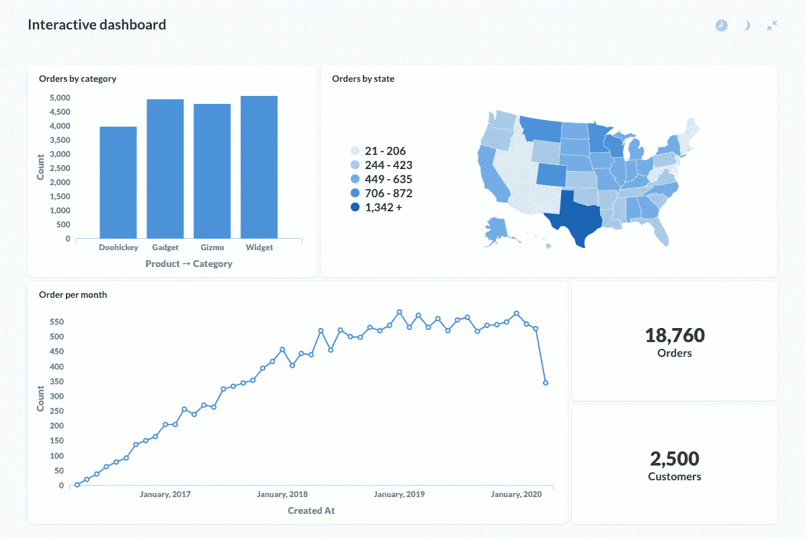
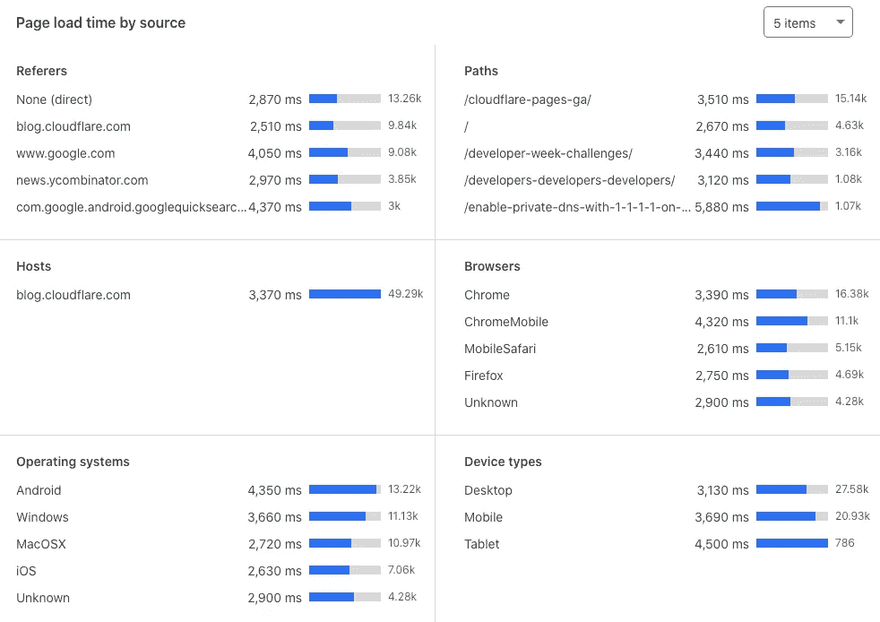
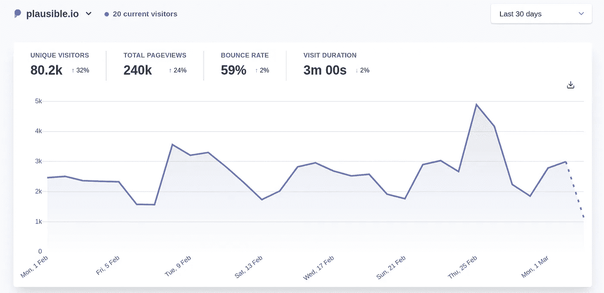
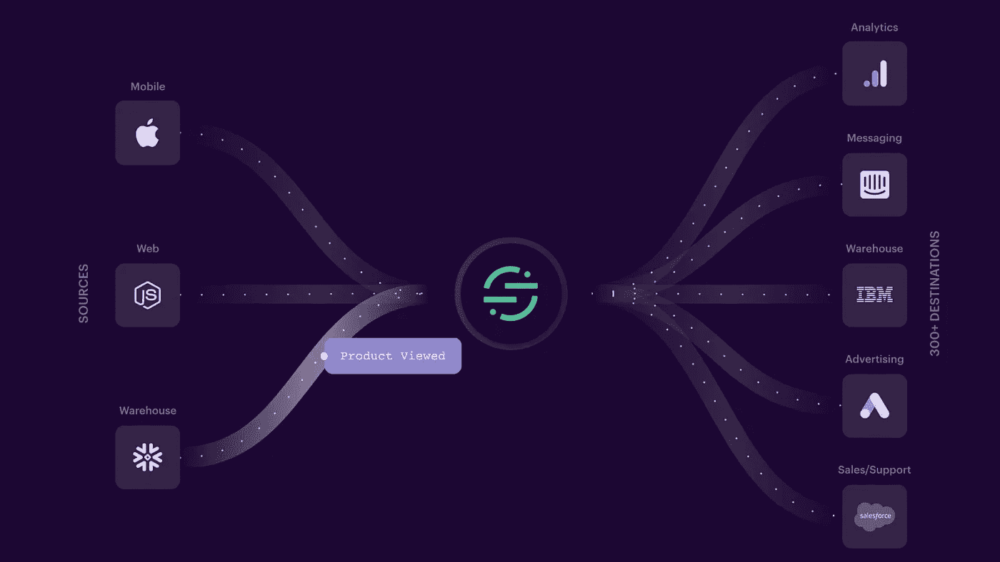
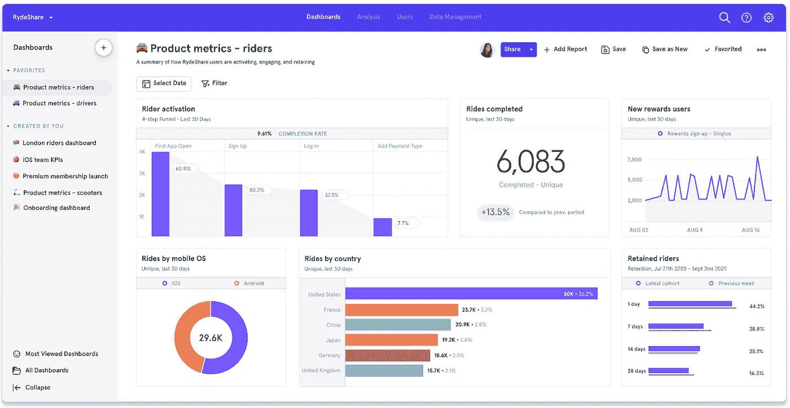

# 为你的产品设置分析:程序员概述

> 原文：<https://betterprogramming.pub/setting-up-analytics-for-your-product-a-programmers-overview-1e0bd44bc3ec>

## 从开发人员的角度理解拥挤的分析空间

卢卡斯·布拉塞克的照片

当你发布一个产品时，你很快就会想了解它是如何被使用的。

为了提高，你至少需要了解什么进展顺利，什么进展不顺利。

你的用户喜欢什么功能？他们讨厌什么功能？是什么把一个免费用户变成了付费用户？

这就是分析的用武之地。

但是“分析”*实际上*是什么样子的呢？你会把谷歌分析放在你的产品上就完事了吗？

实际上，分析领域非常拥挤，每家公司做的事情都略有不同。

因此，作为一名软件开发人员，他在一家分析公司构建数据管道，并与各种形状和大小的公司一起运行技术演示，我想我应该给你一个各种分析设置可能看起来像什么的快速概述。

# 归零地

日志是开始分析的一种方式——照片由[提莫·c·丁格](https://unsplash.com/@tcdinger?utm_source=unsplash&utm_medium=referral&utm_content=creditCopyText)拍摄

在早期，分析往往远远不是首要任务。你只是专注于让你的产品起飞。

然后，也许你成长了一点，意识到“你在盲目飞行”——是时候建立一些分析了。

在这个阶段，你可能会设置一些分析工具，看看你的图表如何只有一个数据点，并开始责备自己到目前为止没有做任何分析。

要获得任何真正有意义的见解，你需要等到你有了至少几周的数据。

然而，在这一点上并没有失去一切。您可能已经有了一些可以利用的数据。

## 看，数据！

首先，你有你的数据库。这可能不会告诉您用户 XYZ 在上周二上午 11 点点击了注册按钮，但它可能包含一些有用的数据，如购买历史、上次登录、团队中的用户总数等。

这里做一些分析的最简单的方法是连接到您的数据库实例，并对它运行一些原始查询。

在网上，你会发现很多对基本分析查询有用的片段，这通常足以让你离开地面。

如果你真的想让你的设置简洁，你可以把数据转储到 Excel 之类的东西里，然后在那里生成一些漂亮的可视化效果。

此外，您可能还会有一些有用的日志。将数据库中的数据与服务器日志配对，您就为自己建立了 hacky analytics 设置的基础。

现在，如果你想让你的游戏更上一层楼，你可以考虑使用 BI ( *商业智能*)平台。

像 [Metabase](https://www.metabase.com/) 、 [Tableau](https://www.tableau.com/) 、 [Apache Superset](https://superset.apache.org/) 、 [PowerBI](https://powerbi.microsoft.com/en-au/) 和 [Looker](https://looker.com/) 这样的产品可以连接到您现有的数据库，并允许您非常容易地运行查询和构建可视化，因此您可以从现有的数据中挤出值，并很好地显示出来。

他们的[文档](https://www.metabase.com/docs/latest/users-guide/07-dashboards.html)中的元数据库仪表板示例

此外，这些工具能够连接到各种数据源，还可以用于监控数据库，并允许您在一个更安全/更好的环境中运行针对生产数据的查询(即，无需 SSH 连接到 prod 实例)。

因此，随着您的成长，您可能会看到使用 BI 工具的更多价值，而不是一路抛弃它。

> *⭐开源大喊:* *无论是* [*元数据库*](https://github.com/metabase/metabase) *还是* [*超集*](https://github.com/apache/superset) *都是可以自己托管的开源工具。*

## 等等，我已经有分析了？

另一件你应该检查的事情是，如果你已经设置了数据分析，那么在你为没有早点设置数据分析而懊恼之前。

*嗯？*

在不知情的情况下，你使用的一些服务可能已经在为你收集一些分析数据。

虽然这不会是为你量身定做的，但这可能是一个好的开始。

CloudFare、AWS、Firebase、Netlify 和许多其他平台(不胜枚举)提供了一定程度的分析，这是一个很好的起点，因此绝对有必要检查一下您已经使用的平台是否一直在为您收集一些数据。

他们的[文档](https://developers.cloudflare.com/analytics/web-analytics/understanding-web-analytics/dimensions)中的 CloudFare 仪表盘示例

# 投入一些工作

他们的[文档](https://plausible.io/docs/guided-tour)中的可信仪表板示例

已经从您的设置中榨出了每一点分析价值，您现在决定更进一步—您想要实际设置一个工具来为您做一些额外的跟踪。

对于易于设置的基本分析，您有许多选项，例如:

*   [**谷歌分析:**](https://analytics.google.com/) 大多数刚起步的人的首选工具，因为它是免费的。该工具在过去几年中已经变得越来越好，现在支持跟踪移动应用程序、自定义事件(稍后会有更多介绍)，以及更高级的可视化，如漏斗。然而，谷歌分析在涉及用户隐私时具有很强的侵入性，它被大多数广告拦截器拦截，导致你的数字被低估。
*   [⭐ **马托莫**](https://matomo.org/) **:** 也许是最知名的开源谷歌分析替代方案。Matomo 在 GitHub 上有将近 16k 颗星星，并且有云和自托管两种选择。虽然他们有跟踪移动应用的软件开发工具包，但他们仍然主要关注网络。使用 Matomo 而不是 Google Analytics 的一个缺点是，你要么必须花钱自己托管它，要么必须花钱使用他们的云选项。
*   [**⭐似是而非:**](https://plausible.io/) 似是而非的是这位“新来的小伙子”，他在过去的一年里经历了[许多成功](https://plausible.io/blog/bootstrapping-saas)。随着似是而非，简单和隐私是关键的卖点。他们也是开源的 T21，但只提供网络分析(至少目前如此)。似是而非的主要缺点是缺乏你在其他平台上看到的功能，以及像大多数非 GA 工具一样，你必须付费才能使用它。

**开源工具标有星号。*

这个领域还有很多其他公司，所以这只是我经常听说的三个平台的一个非常简单的概述。最终，Google Analytics 仍然是遥遥领先的市场领导者，但是开源的以隐私为中心的替代方案最近已经获得了很大的吸引力。

最后，像这样的工具的主要好处是它们非常容易设置。这不会花你一个下午的时间；更像是半个小时或者更少。特别是对于网络分析，通常只是在你的网站上添加一个 JavaScript 代码片段。

# “现代数据堆栈”

[段的网站](http://segment.com)截图。虽然它旨在展示 Segment 作为平台的强大功能，但它实际上很好地展示了现代数据堆栈的样子。

好了，我们现在已经了解了基础知识。但是大公司的现代分析堆栈是什么样的呢？

如你所料，这变化很大，所以无论我在这里做什么概括都是有限的。

然而，大公司的分析体系大致由四个主要部分组成，我称之为:

1.  数据管道
2.  核心分析
3.  数据仓库
4.  “临时演员”

所以我们来探讨一下这些。

## **数据管道**

我所说的“数据管道”组件实际上是一个相当广泛的方面，甚至可能跨越各种工具。

在我看来，这个“组件”涉及两个主要职责:收集和交付数据。数据管道的第三个额外职责是在收集和交付之间转换数据。

为了进行分析，你必须首先收集数据，通常来自多个来源:你的营销网站、你的网络应用、你的移动应用等。

然后，您需要将这些数据放入用于分析这些数据的服务中，还需要将数据转储到一个潜在的存储位置(比如数据仓库，稍后会详细介绍)。

也许，在这一过程中，数据需要被解析/转换，原因包括丰富化，或者与您使用的不同工具兼容。

对于您的数据管道，您有许多选择:

1.  建立你自己的

2.利用下一节中的一个工具来兼做管道

3.使用提供此服务的平台(通常称为 CDP —客户数据平台)

许多公司选择选项 3，因为快速设置将为您提供一个强大的管道，支持转换、重试、从大量来源提取数据，并将其发送到更多目的地。

这一领域的一些公司包括:

*   [**细分:**](https://segment.com/) 细分是该领域最成熟的工具，最近[以数十亿美元的交易](https://www.twilio.com/blog/twilio-acquires-segment)出售给了 Twilio。它是行业标准，可以连接您需要它连接的任何东西。
*   [**⭐snowplow:**](https://snowplowanalytics.com/)**snowplow 是 CDP 领域的“原创”开源工具，自 2012 年问世。它主要专注于将数据导出到仓库，但是它正在扩展到包括到其他 SaaS 工具的连接器。它的关键卖点是我们前面提到的“转换”步骤，因为它们非常关注干净、标准化和“高质量”的数据。**
*   **[⭐**RudderStack:**](https://rudderstack.com/)**与 Snowplow 不同，rudder stack 的侧重点略有不同，它是一个开源工具，在许多方面都是一个替代产品。它们还与 Segment API 兼容，使得转换更加容易。RudderStack 正在获得牵引力，但它比 Snowplow 和 Segment 都年轻得多。****

******优秀奖:**最近刚在 HackerNews 上看到 [⭐ **柔术**](https://jitsu.com/) 发布。它们是 YC 支持的开源领域的替代方案，看起来也很有前途。****

# ****核心分析****

********

****他们的[文档](https://developer.mixpanel.com/docs/what-is-mixpanel)中的 Mixpanel 仪表板示例****

****核心分析是我用来指你为你的产品做大部分数据分析的平台的术语。****

****其中一些工具我们已经讨论过了，比如 Google Analytics 及其替代品。但是还有一类工具我们还没有涉及到:产品分析平台。****

****这些类别之间的界限是模糊的。传统上，产品分析平台拥有允许对您的产品进行更深入的端到端分析的工具，并为用户和组级分析提供支持，这与我们之前介绍的工具所使用的聚合数据模型相反。****

****这种情况正在改变，特别是谷歌分析近年来一直在扩大其范围。然而，以下是市场上自称的顶级产品分析工具([恰好都是 YCombinator 公司](https://yakkomajuri.github.io/blog/yc-product-analytics?utm_source=medium)):****

*   ****[**振幅:**](https://www.amplitude.com/) 振幅是产品分析领域最成功的公司。他们也是第一批上市的公司，最近已经上市了。他们已经存在了大约十年，他们有一个成熟的产品，可以提供你回答大部分产品分析问题所需的一切。****
*   ****[**Mixpanel:**](https://mixpanel.com/)**出工具我这里先提一下，Mixpanel 是最古老的。他们在 2009 年穿越了 YC，他们的特征叠加几乎与振幅相当。从我(有限的)经验来看，用户倾向于真正欣赏 Mixpanel UI，以及他们用于跟踪和管理广告活动的工具。******
*   ******[**Heap:**](https://heap.io/)**Heap 是另一个涵盖完整产品分析堆栈的工具，但它通过提供事件自动捕获来区分自己。与 Mixpanel 和 Amplitude 不同，在 Mixpanel 和 Amplitude 中，开发人员需要检测他们想要跟踪的每个事件，Heap 将默认捕获用户行为，如点击，它有一个成熟的堆栈来清理和追溯解析这些数据。********
*   ******[**⭐post hog:**](https://posthog.com/)**post hog 是这个领域最年轻的公司之一，它是开源的，因此允许用户在自己的基础设施上自托管平台。********

*********免责声明:*** *我在 PostHog 工作，是一名软件工程师(这也是我如何知道本文中的一切)。然而，没有人知道我正在写这篇文章，它完全是在我的空闲时间写的。*******

******荣誉奖:**[6 月](https://june.so/)是我见过的在产品分析领域最年轻的公司。他们依靠上述部门进行数据收集，并且似乎通过简单的设置和使用来区分自己。****

## ****数据仓库****

****到目前为止，在本文中，我们已经介绍了十几种或更多可以在分析堆栈中找到自己的工具。****

****这些平台中的每一个(除了那些位于数据库之上的平台)都有自己的数据仓，但是您可能希望通过一起分析来自这些不同来源的数据来获得洞察力。****

****进入数据仓库。****

****数据仓库是设计用来保存大量数据(通常来自多个来源)的平台，作为您收集的所有数据的集中入口。****

****您可以使用它们来长期存储数据，以及满足复杂的分析需求。****

****仓库传统上由较大的公司使用，但我看到初创公司越来越倾向于在早期将数据仓库添加到他们的堆栈中，这可能是当今人们可以轻松收集的大量数据的功能。****

****实际上，任何扩展性好的数据库都可以兼作数据仓库。然而，选择合适的仓库解决方案在很大程度上取决于您想要存储的数据类型以及您的目的。****

****鉴于理论上任何数据库都可以是一个仓库，这个领域是巨大的。然而，专用云仓储空间由[雪花](https://www.snowflake.com/)、[谷歌 BigQuery](https://cloud.google.com/bigquery/) 、[亚马逊红移](https://aws.amazon.com/redshift/)领衔。****

****至于你可以托管自己的开源⭐选项， [Apache Hive](https://hive.apache.org/) 是 Facebook 最初建立的专用仓库，而专注于分析的数据库系统，如 [ClickHouse](https://clickhouse.com/) 、[时标](https://www.timescale.com/)和 [Apache Druid](https://druid.apache.org/) 也是一些可以用于数据仓库的工具示例。****

## ****临时演员****

****最后，我们单子上的最后一项。****

****“extras”是一个松散的组，指的是其他三个类别中没有提到的所有类型的工具。****

****它们由通常不是必不可少的工具组成，但仍然提供了很多价值，这就是为什么它们值得简单讨论的原因。****

****示例包括提供更多定性数据的工具，如热图和会话回放(如 [Hotjar](https://www.hotjar.com/) 、 [Fullstory](https://www.fullstory.com/) )，或用于实验的工具(如[launch darky](https://launchdarkly.com/))。****

****它们也可以是广告跟踪平台、客户信息平台、销售工具等。****

****最终，大多数公司在他们的数据堆栈中都有这些“额外的”东西，这里提到它们是因为考虑它们如何与您的工具的其余部分相适应是很重要的。****

# ****那都是乡亲们！****

****就这样，我们已经介绍了产品分析堆栈的基础知识。****

****一个完整的指南应该有一本书那么大，但是希望它能帮助你开始。****