# 使用“”设置配置。iOS 应用程序中的 xcconfig”文件

> 原文：<https://betterprogramming.pub/setting-up-configurations-using-xcconfig-files-in-ios-app-8df787a75dcd>

## 了解。xcconfig 文件，并使用在您的 iOS 应用程序中添加不同的配置，如暂存和生产。Swift 中的 xcconfig 文件


照片由[银器厂](https://www.pexels.com/photo/man-standing-near-body-of-water-2244330/)

如果你想在你的 iOS 应用中设置单独的环境/配置，比如准备、调试和发布，那么你就来对地方了。在应用程序中设置不同的环境/配置非常重要和有用。在开始设置之前，我们应该了解为什么我们在 iOS 或项目中需要单独的环境或配置。

在你的 iOS 应用程序中拥有像调试和发布这样的独立配置是必要的；它们以多种方式为您提供帮助，包括以下内容:

1.  区分您的生产 API 密钥
2.  为单独的配置创建单独的 API 端点
3.  将独立的第三方库放入您的调试版本中，使测试更加无缝。例如，为您的调试版本使用单独的 Crashlytics。注意:Crashlytics 确实提供了一种实现这一点的方法。
4.  为你的付费图书馆准备单独的钥匙或令牌。大多数库都提供了免费测试的方法，因为你不想在生产环境中测试并为此付费
5.  提供调试工具。当你在大型团队或小型团队中工作时，拥有一些调试工具是很好的，比如网络拦截器、错误报告等。，这样测试就能以无缝的方式进行
6.  安装。您可以在同一台设备上同时安装具有不同配置的相同应用程序

我希望现在我们已经达成共识，我们需要在我们的 iOS 应用程序中有单独的环境或配置。现在的问题是我们应该如何实施它。有很多方法可以做到这一点，但幸运的是 Xcode 提供了一个非常简洁的方法来使用 Xcconfig 文件做到这一点。所以，让我们了解它们并实施它们。

我们将在本文中讨论的内容包括:

1.  了解 XCConfig 文件
2.  如何将它们用于不同的环境和目标
3.  如何使用 xcconfig 定义和管理不同的构建设置
4.  如何从代码中访问生成设置值

那么，什么是 xcconfig 文件呢？xcconfig 代表 Xcode 配置文件，它们是包含键-值对的纯文本文件，有助于定义或覆盖任何项目或目标的构建配置的现有构建设置。

一个在项目级别定义构建配置；这就是为什么它们也可以在项目中的各种目标中使用。

我们可以使用 Xcode 中的“构建设置”面板来更改这些设置，但是如果您有多个目标，这将变得很困难。此外，它更容易出错，而 xcconfig 文件是处理所有这些事情的直接方式。

Xcconfig 文件还提供了继承，并在您的构建设置上有条件语句，这有助于共享设置和定制。如果你对此感到不知所措，不要担心，我们将通过一个例子。真的很简单好用。

关于 xcconfig 文件的理论已经够多了。让我们做一个演示项目，并得到我们的手脏。

# 现有配置并为我们的项目创建一个新的配置

我在 Xcode 中创建了一个名为 ConfigTest 的新应用程序。请随意编码。如果你不想一个人编码，那么[下载](https://github.com/anand2nigam/ConfigTest)完整的代码，打开项目，跟着做。

因此，无论何时创建一个新项目，Xcode 都会默认创建两个配置:调试和发布。你可以在下面的截图中看到这一点。要在您的项目中查看它，请选择您的项目文件，单击该项目，然后转到 info 选项卡。

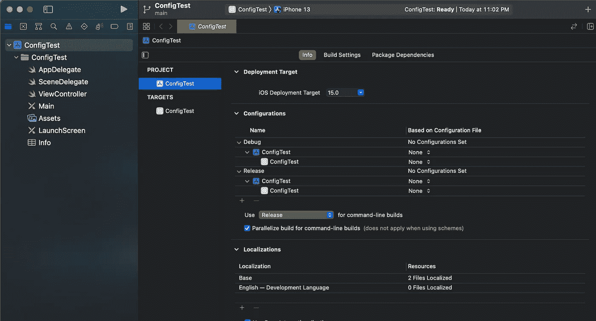

让我们通过单击“Configurations”部分中的加号按钮来创建一个新配置。应该会出现以下弹出窗口。我们可以复制任何一种配置。

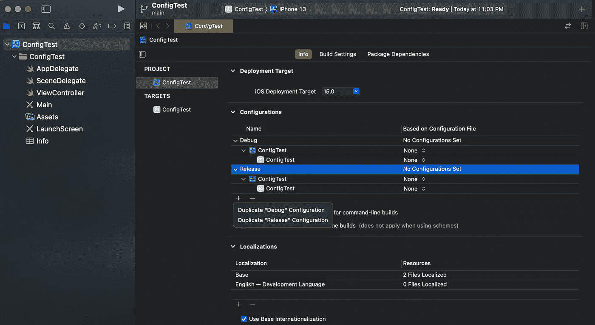

我们将把我们的新配置命名为“Staging”它应该开始显示您可以在下面看到的新配置。就是这样。这就是在 Xcode 中创建新配置的方法。

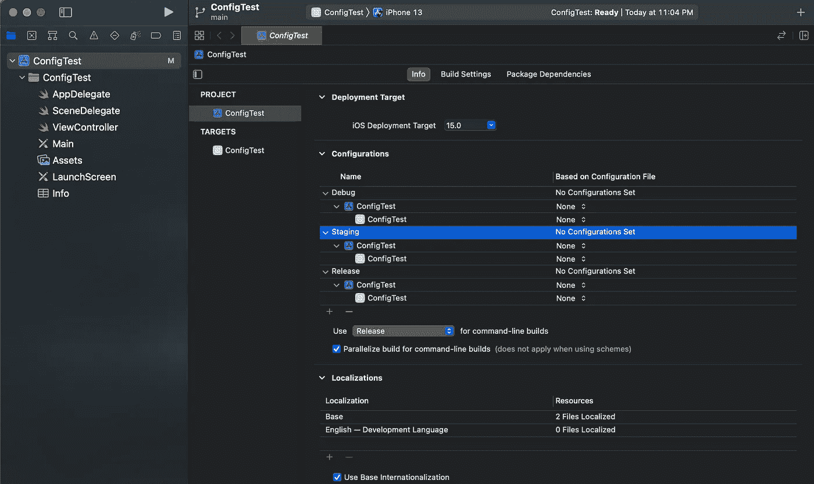

# 正在创建配置设置文件

让我们创建 xcconfig 文件来给我们的三个配置赋值。按`command + N`或【文件】- >新建- >文件。您将会看到以下窗口提示。选择配置设置文件。如果找不到该文件，您也可以进行搜索。

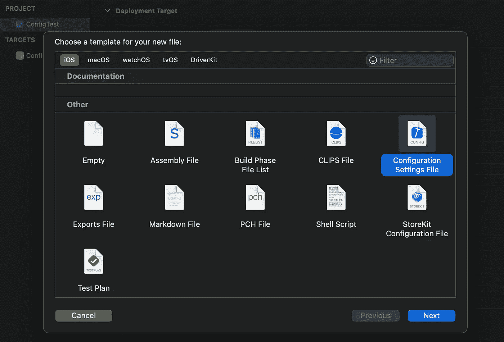

为了便于记忆，我根据文件的配置名来命名它们。随便你给它们起什么名字。

注意:确保您没有选择任何目标。如前所述，我们在项目级别添加这些文件。


现在，为另外两个配置再创建两个配置文件。我已经将我的文件命名为`Release.xcconfig`、`Debug.xcconfig`和`Staging.xcconfig`。是时候将一些代码放入这些文件了。

打开`Debug.xcconfig`文件，输入以下代码:

```
PRODUCT_BUNDLE_IDENTIFIER = com.anandnigam.ConfigTest.debugBUNDLE_DISPLAY_NAME = ConfigTestDebug
```

`BUNDLE_DISPLAY_NAME`属性将帮助您为不同的配置创建不同的应用程序名称，`PRODUCT_BUNDLE_IDENTIFIER`将帮助您使用不同的配置运行构建，而无需从您的手机或模拟器中删除之前的配置。

接下来，在您的`Staging.xcconfig`文件中添加以下代码:

```
PRODUCT_BUNDLE_IDENTIFIER = com.anandnigam.ConfigTest.stagingBUNDLE_DISPLAY_NAME = ConfigTestStaging
```

在您的`Release.xcconfig`文件中添加以下代码:

```
PRODUCT_BUNDLE_IDENTIFIER = com.anandnigam.ConfigTestBUNDLE_DISPLAY_NAME = ConfigTest
```

因此，现在我们已经在 xcconfig 文件中添加了代码，我们需要在测试它们之前将我们的文件分配给它们各自的配置。转到项目的 info 选项卡，展开所有配置，并将文件名传递给它们各自的配置，如下所示。确保您已经分配了所有三个(或者如果您有更多配置，则分配更多)。

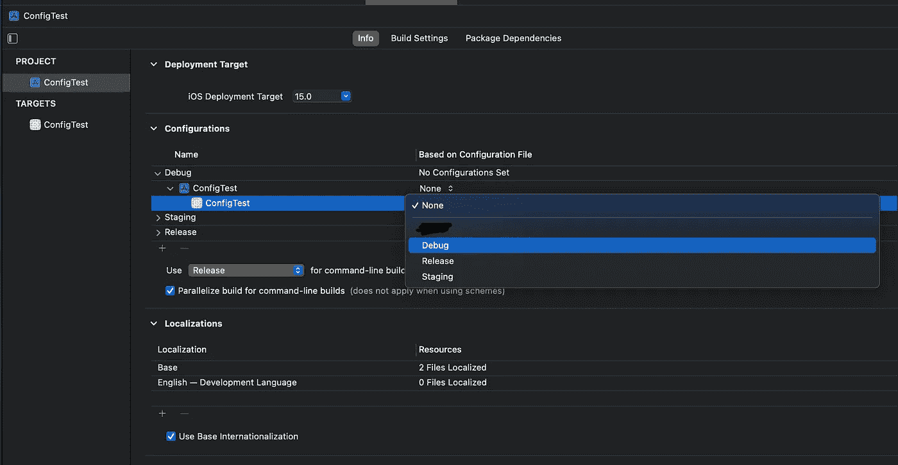

现在，`option + click`在模拟器附近你的 app 的名字上；这将打开下面的菜单。或者你可以点击你的应用名称，选择编辑方案；它将打开下面同样的菜单。在这里，您可以选择想要运行的任何配置。

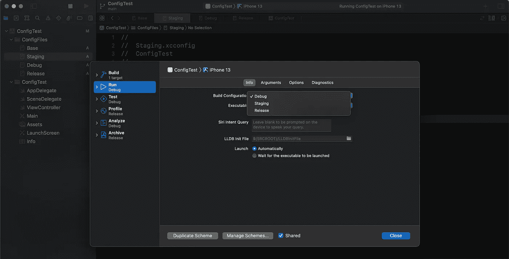

因此，在运行完所有配置后，你可以在你的模拟器或 iPhone 上看到多个类似下面的应用程序。我们可以运行不同名称的应用程序，并同时在一台设备上运行它们。


需要注意的一点是，你也可以使用`APP_NAME`键，并在你的配置文件中为它设置不同的值，而不是`BUNDLE_DISPLAY_NAME`，但是如果你在现有的应用程序中有测试目标，这可能会导致问题。我面临着这个问题，所以为了简单起见，我只改变了`BUNDLE_DISPLAY_NAME`键，但是你可以随意试验。

**一个重要的提示**:这只适用于你使用 cocoapods 的情况。否则可以跳过。

如果您要将这个东西集成到您现有的使用 cocoapods 作为依赖项管理器的代码库中，您必须执行以下步骤:

1.  删除`.xcworkspace`文件、`Podfile.lock`和`Pods/`目录
2.  运行 pod 安装
3.  打开新的。xcworkspace
4.  在各自的配置文件顶部包含以下行

在 Release.xcconfig 中

```
#include “Pods/Target Support Files/Pods-YourAppName/Pods-YourAppName.release.xcconfig”
```

在 Staging.xcconfig 中

```
#include “Pods/Target Support Files/Pods-YourAppName/Pods-YourAppName.staging.xcconfig”
```

在 Debug.xcconfig 中

```
#include “Pods/Target Support Files/Pods-YourAppName/Pods-YourAppName.debug.xcconfig”
```

您可以在这些路径中找到这些与 pod 相关的 xcconfig 文件。如果您的 pods 与通常的 cocoapods 设置路径不同，您可以在 pods 目录下找到这些文件并包含它们的路径。

继续前进。这是我们刚刚使用 xcconfig 文件做的最基本的事情。现在，让我们进入下一个级别，做一些更高级的事情，如使用继承，在配置文件中设置条件，从代码库中的配置文件中获取值，以及如果您的应用程序有多个目标，如小部件扩展或共享扩展，如何进行配置

# 配置文件中的继承和条件语句

让我们从继承和在配置文件中添加条件开始。为此，让我们创建一个名为`Base.xcconfig`的新配置文件，就像我们之前创建其他文件一样。打开文件并粘贴以下代码:

```
//MARK: - App SettingsBASE_BUNDLE_IDENTIFIER = com.anandnigam.ConfigTestBUNDLE_DISPLAY_NAME = ConfigTest//MARK: - Conditional ChecksONLY_ACTIVE_ARCH[config=Debug][sdk=*][arch=*] = YES
```

在这里，我们定义了一个基本的包标识符，这样我们就可以继承它，并为我们不同的配置添加内容。

我们还定义了默认值`BUNDLE_DISPLAY_NAME`。

现在在第三行，我们正在做的是设置标记，以便在配置为任何架构的任何 SDK 进行调试时，仅构建活动架构。*表示任何，当我们使用配置文件时。

条件语句的一般语法是

`BUILD_SETTINGS_NAME_KEY[condition=value] = VALUE`

现在要查看继承，打开`Debug.xcconfig`文件并用下面的代码替换它:

```
#include "Base.xcconfig"PRODUCT_BUNDLE_IDENTIFIER = $(BASE_BUNDLE_IDENTIFIER).debugBUNDLE_DISPLAY_NAME = $(inherited)Debug
```

# 这里发生了什么事

1.  我们正在继承我们的`Debug.xcconfig`文件中的`Base.xcconfig`文件
2.  我们在`Debug.xcconfig`中使用来自`Base.xcconfig`文件的键`BASE_BUNDLE_IDENTIFIER`的值。如果您想使用基本配置文件中的任何值，您只需要像这样定义键`$(KEY_NAME)`。然后，你就可以得到这个值并使用它
3.  在这个过程中，我们通过继承值并添加我们自己的东西来覆盖来自`Base.xcconfig`文件的相同键的值

所以，这是我们可以在配置文件中继承、覆盖或使用其他配置文件中的值的两种基本方法。这些有助于最小化定义和使用不同值的工作

现在，请在各自的文件中进行以下更改

在 Staging.xcconfig 文件中

```
#include “Base.xcconfig”//MARK: — App Settings// to use any value defined in the inherited filePRODUCT_BUNDLE_IDENTIFIER = $(BASE_BUNDLE_IDENTIFIER).staging// to inherit the value from the included config fileBUNDLE_DISPLAY_NAME = $(inherited)Staging
```

在 Release.xcconfig 文件中

```
#include "Base.xcconfig"//MARK: - App SettingsPRODUCT_BUNDLE_IDENTIFIER = $(BASE_BUNDLE_IDENTIFIER)
```

**注意**:在`Release.xcconfig`文件中，我们没有定义`BUNDLE_DISPLAY_NAME`。相反，发布配置将在运行时使用 Base.xcconfig 文件中的键值。这样，如果我们不想定制它，我们可以使用来自`Base.xcconfig`的值。

# 定义与配置相关的数据并检索它们

现在，这些配置文件还可以做一件更重要的事情，这很有帮助。因此，很明显，对于不同的配置，可能需要不同的 URL 或 API 键。这可以确保您在调试或向 QA 提供测试构建时，不会影响生产服务器或使用与生产相关的 API 键。

因此，让我们在配置文件中定义一些 API 键和 URL。

将以下代码粘贴到各自的文件中:

在 Staging.xcconfig 中

```
//MARK: - API KeysFIREBASE_KEY = acnkdjkbvjfbvfibvfj//MARK: - Server URLsBASE_URL = https:/$()/[anand2nigam.medium.com](http://anand2nigam.medium.com/)
```

在 Debug.xcconfig 中

```
//MARK: - API KeysFIREBASE_KEY = acnkdjkbvjfbvfibvfj//MARK: - Server URLsBASE_URL = https:/$()/[www.linkedin.com/in/anand2nigam/](http://www.linkedin.com/in/anand2nigam/)
```

在 Release.xcconfig 中

```
//MARK: - API KeysFIREBASE_KEY = acnkdjkbvjfbvfibvfjscdnkjvrhb//MARK: - Server URLsBASE_URL = https:/$()/[github.com/anand2nigam](http://github.com/anand2nigam)
```

我特意添加了一个随机的 API 键和不同的基本 URL，以展示我们如何在每个不同的配置文件中获取这些值。

现在，转到你的`Info.plist`文件，添加所有你需要的键，以获得在你的代码库中使用的值。对于这个例子，我们将添加`BUNDLE_DISPLAY_NAME`和`BASE_URL`。

确保您在`Info.plist`文件的 value 列中添加了配置文件中正确的密钥名称。`Info.plist`的键列可以根据想要获取的键的名称来填充。我保持原样是为了避免混淆。这里有一个截图可以帮助你:

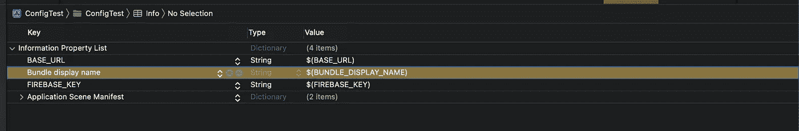

通过执行上述操作，我们已经将所有想要获取的值放置到位。现在，让我们看看如何获取这些值。因此，一个简单的答案是从`Info.plist`获取密钥，并获得配置文件中定义的值。

我们也要这么做。让我们创建一个新文件；我将其命名为`Config.swift`,并添加以下代码:

这个文件创建了一个抽象层，帮助我们从`Info.plist`文件中获取值(带有正确的键名),并在代码库中使用它们。是时候测试我们的代码了，看看这是否可行。将以下代码粘贴到为我们制作的 ViewController.swift 文件 Xcode 中:

这将在一条警告消息中向我们显示基本 URL 值。现在，在不同的配置中运行应用程序，你会注意到我们能够使用在配置文件中定义的各自的基本 URL

还有一种方法可以在 UI 中查看和检查这些属性。转到您的目标并选择构建设置。滚动到底部。您可以在用户定义部分看到您的所有属性，如屏幕截图所示:

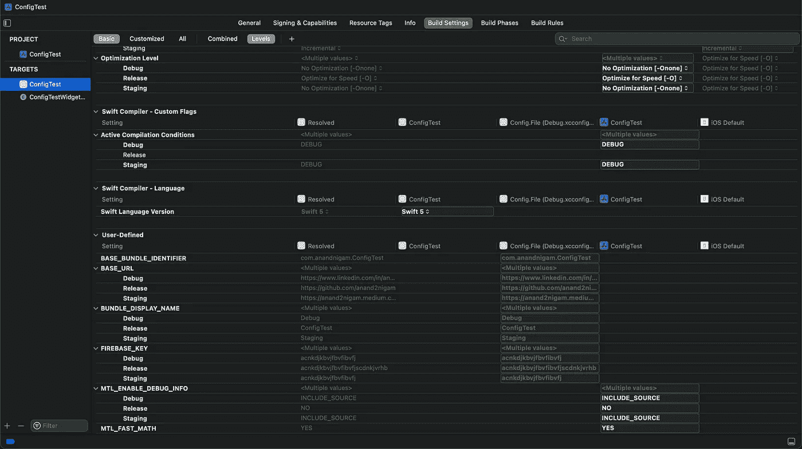

# 对多个目标使用 xcconfig 文件

现在，如果你有多个目标，让我们来看看这个案例。在这种情况下，最好为它们准备单独的配置文件，以避免混淆。但是也可以通过定义不同的键并在不同的目标中使用它们来使用同一个配置文件。在本文中，我们将声明单独的配置文件，这是处理这种情况的最佳方式。

因此，让我们为我们的小 ConfigTest 应用程序添加一个小部件扩展。转到目标并点击底部的加号按钮。您将会看到以下窗口提示。继续命名您的小部件扩展。我将我的命名为 ConfigTestWidget。

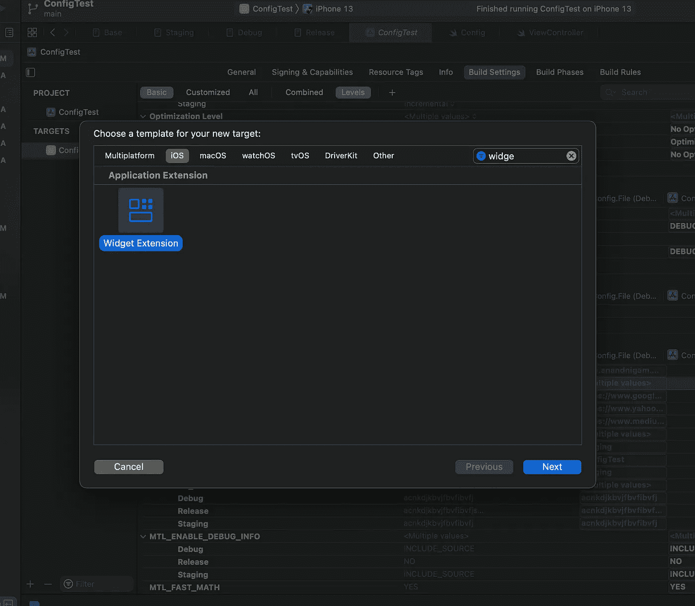

现在，让我们创建三个新的配置文件。我把它们分别命名为`WidgetStaging`、`WidgetRelease`和`WidgetDebug`。现在，转到项目的 Info 选项卡，展开所有配置，并将各自的配置文件分配给它们的目标，如下面的屏幕截图所示:

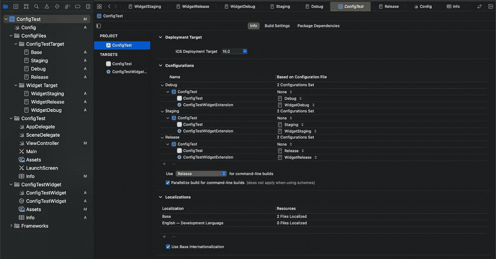

这个过程类似于我们之前所做的。我还将不同的配置文件排列在它们的文件夹中，如上面的截图所示。你也可以这样做。

现在，将以下代码粘贴到他们的文件中:

在 WidgetStaging.config 中

```
#include "ConfigFiles/ConfigTestTarget/Staging.xcconfig"PRODUCT_BUNDLE_IDENTIFIER = $(inherited).ConfigTestWidget
```

在 WidgetDebug.config 中

```
#include "ConfigFiles/ConfigTestTarget/Debug.xcconfig"PRODUCT_BUNDLE_IDENTIFIER = $(inherited).ConfigTestWidget
```

在 WidgetRelease.config 中

```
#include "ConfigFiles/ConfigTestTarget/Release.xcconfig"PRODUCT_BUNDLE_IDENTIFIER = $(inherited).ConfigTestWidget
```

您一定注意到了，我们继承了`PRODUCT_BUNDLE_IDENTIFIER`的值，并添加了我们的小部件名称。这也是在 xcconfig 文件中继承的一个例子，扩展包标识符应该跟在应用程序的包标识符后面。因此，这样我们就省去了重复应用程序包标识符的麻烦。

现在，您可以运行应用程序并使用小部件进行不同的配置。为了节省时间，我在小部件中添加了一些代码。请随意从 [GitHub](https://github.com/anand2nigam/ConfigTest/blob/main/ConfigTestWidget/ConfigTestWidget.swift) 下载。它应该类似于下面的截图:

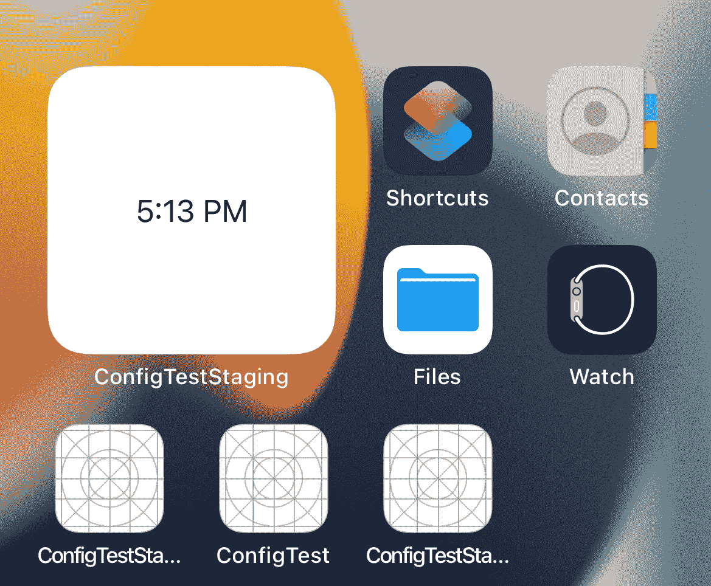

现在，您应该能够运行具有不同应用程序名称和其他属性的三种配置，而无需从设备中删除任何应用程序。我们还可以为不同的配置提供单独的应用程序图标。只需在`Assets.xcassets`中添加另一个名为 AppIcon-Debug 的应用程序图标集，并在配置文件中定义以下键:

在 Debug.xcconfig 和 Staging.xcconfig 中

```
ASSETCATALOG_COMPILER_APPICON_NAME = AppIcon-Debug
```

在 Release.xcconfig 中

```
ASSETCATALOG_COMPILER_APPICON_NAME = AppIcon
```

如果您的更改没有反映出来，请转到目标的构建设置并搜索这个关键的主要应用程序集图标。双击并使用`$(inherited)`编辑字段。这将开始从您的 xcconfig 文件中获取值，看起来类似于下面的屏幕截图:

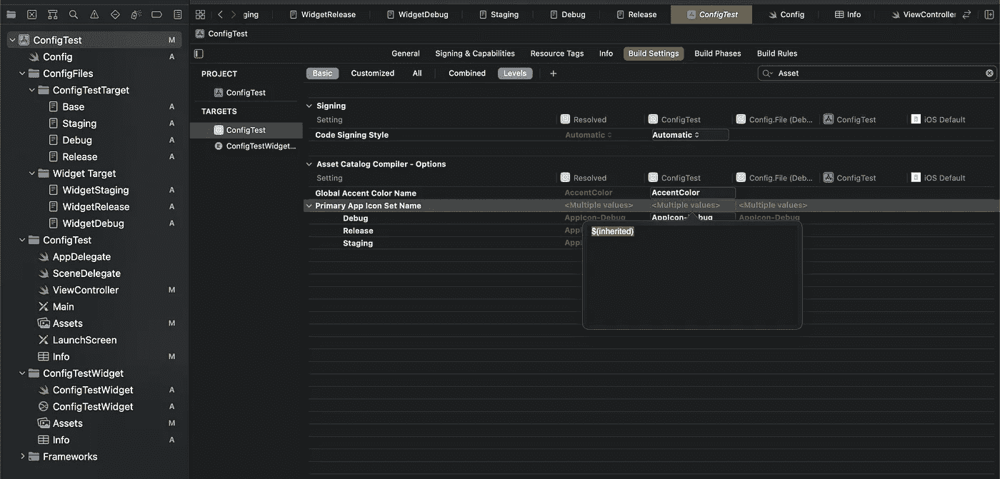

就是这样。这涵盖了在新项目或现有项目中实现 xcconfig 文件所需的大部分内容。在本教程中，我们讲述了以下内容:

1.  如何针对多种环境/配置(如试运行、调试和发布)配置您的应用
2.  如何使用 xcconfig 文件做到这一点
3.  如何在不同的配置文件之间共享值
4.  如何从配置值中检索值

有了所有这些与配置文件相关的东西，你就可以开始配置你的项目了。可以随意从 [GitHub](https://github.com/anand2nigam/ConfigTest) 中查找以上所有代码，作为参考。

[](https://github.com/anand2nigam/ConfigTest) [## GitHub — anand2nigam/ConfigTest

### 此时您不能执行该操作。您已使用另一个标签页或窗口登录。您已在另一个选项卡中注销，或者…

github.com](https://github.com/anand2nigam/ConfigTest) 

# 参考

[https://help.apple.com/xcode/mac/8.3/#/dev745c5c974](https://help.apple.com/xcode/mac/8.3/#/dev745c5c974)

[https://help.apple.com/xcode/mac/8.3/#/itcaec37c2a6](https://help.apple.com/xcode/mac/8.3/#/itcaec37c2a6)

这些链接将帮助您更多地了解 xcconfig 文件中的其他属性和内容。感谢阅读。

```
**Want to Connect?**You can find me on [LinkedIn](https://www.linkedin.com/in/anand2nigam/).
```

[](https://www.linkedin.com/in/anand2nigam/) [## 阿南德·尼甘- SDE 二世-共享聊天| LinkedIn

### 在全球最大的职业社区 LinkedIn 上查看 Anand Nigam 的个人资料。Anand 有 4 份工作列在他们的…

www.linkedin.com](https://www.linkedin.com/in/anand2nigam/)