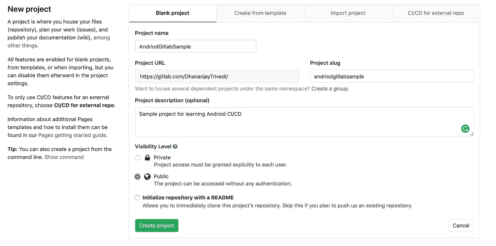
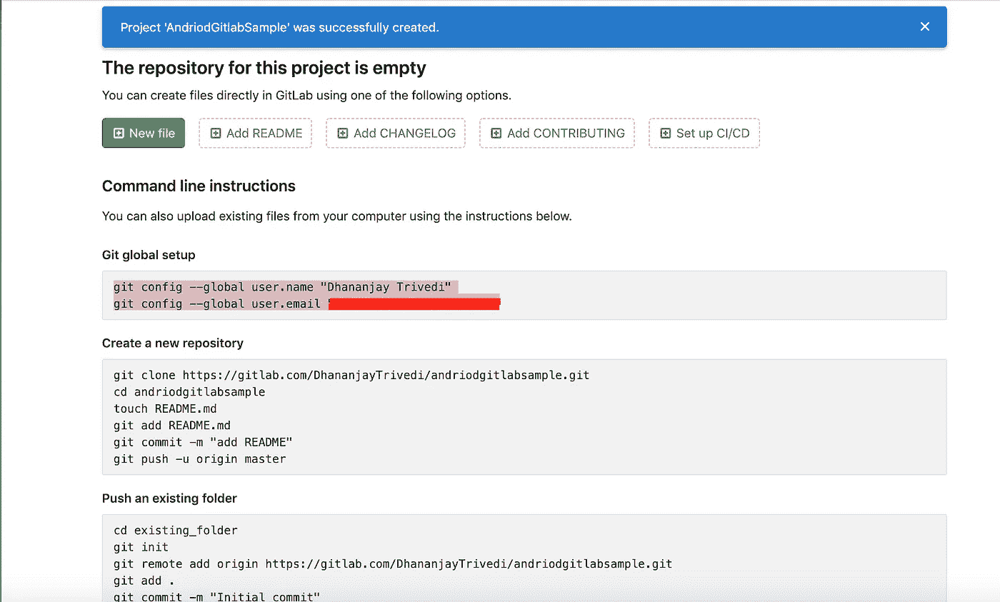
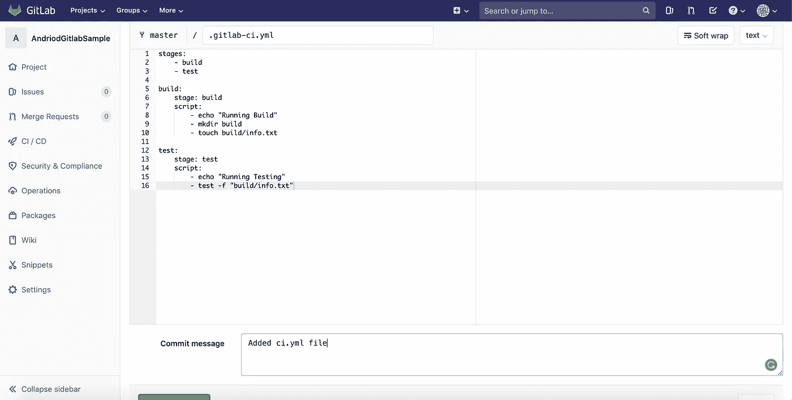
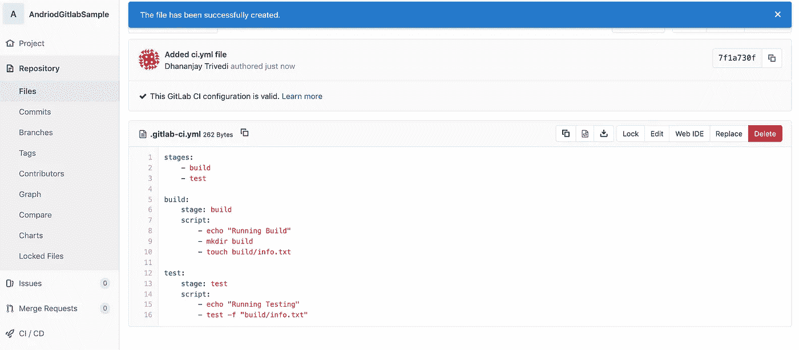
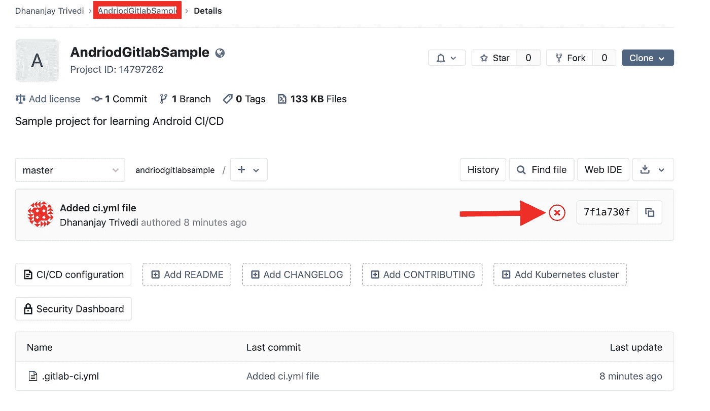
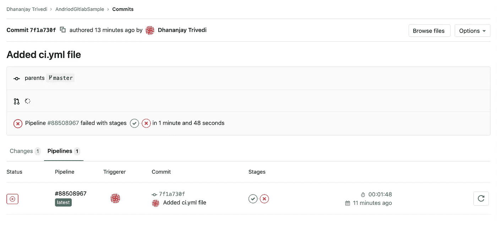
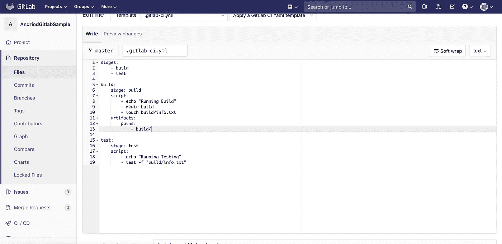
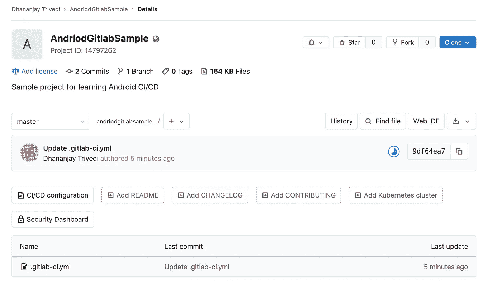
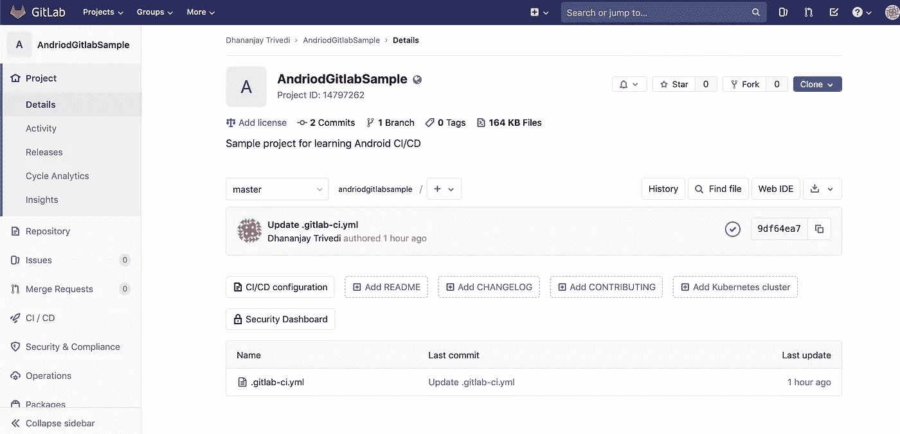

# 在 GitLab 中设置持续集成管道

> 原文：<https://betterprogramming.pub/setting-up-continuous-integration-pipeline-in-gitlab-8a79001dce74>

## # 100 日的第 26 天代码

## 这个流行词已经存在一段时间了，如果你还没有开始，为什么不开始呢？

# 1.在 GitLab 上创建一个示例项目

GitLab 是免费使用的，所以如果您还没有使用它，请不要犹豫。

创建项目后，您应该会看到以下屏幕:

请随意将您的 GitLab 项目与您现有的项目连接起来。

# 2.添加 YAML 文件

*   我们需要定义一个包含自动化指令的`.yml`文件，每次我们做出更改时，我们的 CI 管道都必须运行该文件。
*   我使用 GitLab UI 直接创建文件，您可以随意添加文件。
*   将你的文件命名为`.gitlab-ci.yml`——这非常重要。

这里，我们定义了流程中的两个阶段。

1.  `Build`——我们将在那里构建最终的生产文件，对于 Android，这将是一个 APK 文件。
2.  `Test` —随心所欲地运行各种测试。

然后，我们定义在每个阶段运行哪些命令。

这些是我们正在定义的一些非常简单的命令，但是您将在实际项目中处理更复杂的过程，这些项目可能在它们的管道中有多个自动化过程。

# 3.承诺运行您的第一个 CI 渠道

点击`Commit`按钮。

现在，单击顶部的项目名称，打开项目概述屏幕。看到标有箭头的图标，如果它是一个蓝色的圆圈，这意味着您的 CI 管道正在运行。

运行后会失败。因此，您会看到红色图标。您可以点击图标查看更多详细信息。

你可以看到我们的第一阶段是成功的，但第二阶段让我们失望了。

为什么？在第一阶段之后，创建了一个新的构建文件，但是没有转移到第二阶段。

# 4.在 YAML 文件中定义工件

我们需要在我们的 YAML 文件中定义一个叫做`Artifacts` 的东西。一个`artifact`是应用程序的可部署组件。

这里，我们定义了一个到`artifact`文件的路径，该路径将在`build/` 中，我们已经在`touch`命令中提到过。

# 5.承诺看到您第一个成功的 CI 渠道

*   提交并观察 CI 渠道。
*   您将看到蓝色图标，表示 CI 渠道正在运行，此后您将获得成功。

如果页面没有自动刷新，请随意单击刷新。您将看到绿色勾号图标，表示一切都很成功。

就这样，作为开始。您现在对 CI 有了一个概念。我们将在未来的故事中进行更深入的探讨。敬请关注！

请务必查看之前撰写的故事，以了解有关 CI/CD 的更多信息。

感谢您的阅读。