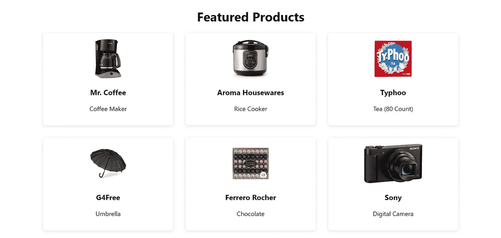
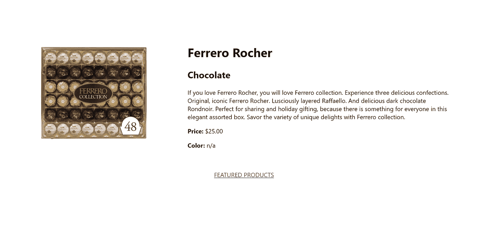
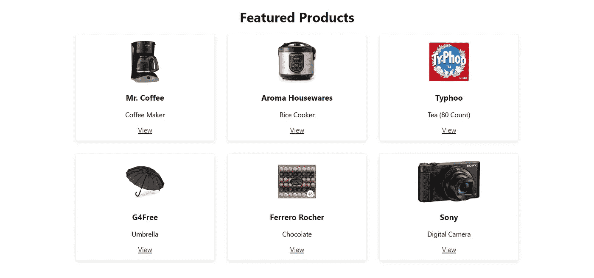
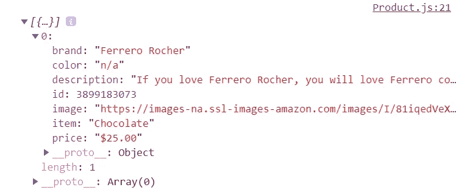
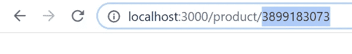
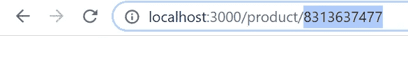

# 在 React 中设置动态路由

> 原文：<https://betterprogramming.pub/setting-up-dynamic-routing-in-react-23ca07d59057>

## 在 React 应用程序中获取和显示数据的第 2 部分


Valeriy Kryukov 在 [Unsplash](https://unsplash.com?utm_source=medium&utm_medium=referral) 上拍摄的照片。

本文将重点介绍在 React 中设置动态路由。之前，[我解释了](/fetching-and-displaying-data-in-react-part-1-d40fe279a8be)如何使用 React Hooks 和 Axios 从 API 获取数据并显示在浏览器中。最后，我们能够创建一个特色产品页面，显示提取的数据:



特色产品页面

在本文中，我们将继续我们停止的地方，并设置动态路由，以便我们可以在自己的页面上动态显示每个项目。最后，我们将能够点击特色产品页面上的每个项目，并转到其单独的页面，每个项目在 URL 中都有自己唯一的 ID。



单个产品页面

# 设置路由

让我们从设置一些路由开始。我们将继续我们停止的最终代码，它在[第 1 部分](/fetching-and-displaying-data-in-react-part-1-d40fe279a8be)的结尾可用。在那里，你可以找到`FeaturedProducts.js`、`App.js`、`App.css`的最终代码。

我们需要做的第一件事是安装 [React 路由器 DOM](https://reactrouter.com/web/guides/quick-start) ，让我们开始吧:

```
npm install react-router-dom
```

接下来，在`App.js`中，让我们继续导入`Router`、`Route`和`Switch`，然后为我们的`FeaturedProducts`组件设置一个路径。我们将把它作为我们的主页，所以我们给它一个路径`/`:

接下来，我们将设置一条动态路线。这将是一个名为`Product`的组件，我们还没有创建，但我们很快就会创建。所以，让我们把它放在最上面。对于路由，路径将是`/product`，然后我们将添加一个冒号，加上我们的参数`id`。这里的这个 route 参数，我们称之为`id`，是 URL 的一部分，它将根据我们想要显示的项目而改变。例如，如果我们想查看产品#1 的信息(例如，`id`为 1)，那么我们将访问路径`/product/1`。

正如 Alex Sears 在`react-router-dom`中提到的那样，“我们通过在 URL 的动态部分前面加一个冒号(`:`)来指定要匹配的部分。”

# 链接到产品组件

我们正准备着手`Product`组件的工作。但在此之前，让我们首先在我们的特色产品页面中创建一个链接，这样我们就可以点击它并转到我们选择的产品。

现在让我们转到`FeaturedProducts.js`。现在我们已经安装了`react-router-dom`，我们可以访问`Link`组件。组件允许我们做的是切换页面，而不需要页面不断地重新加载。当我们导航到其他页面并且页面重新加载时，我们会丢失我们的状态。当我们使用`Link`时，我们的状态被包含，这就是我们想要的。因此，让我们从导入`Link`组件开始。

在`card`下面的`div`里，我们再加上这个`Link`。而每当我们使用`Link`的时候，我们都需要使用`to`，它指向我们想要去的路径。在这个`Link`中，我们可以添加我们的动态数据。为此，我们将使用模板文字。我们将添加路径，这与我们在`App.js`中为`Product`组件`/product`创建的路径相同。然后在这里，我们可以传入`product.id`，它是我们每个项目的惟一 ID。它来自 API。然后我们就让我们的链接显示“查看”这样做的目的是，当我们单击“查看”时，我们将能够转到每个项目的产品页面，我们还将能够在 URL 中看到每个项目的唯一 ID。

如果我们在浏览器中查看，我们现在有一个显示“View”的链接:



特色产品页面

如果我们单击“查看”，我们还看不到任何内容这是因为我们还没有创建`Product`组件页面。所以现在让我们继续努力吧。

# 创建产品组件

所以让我们创建一个名为`Product.js`的文件。同样，为了简单起见，我们将在`src`文件夹中创建它。这将是每个特定项目的组成部分。换句话说，当我们点击我们的特色产品页面上的一个项目时，我们将能够在这个`Product`组件中看到该特定项目的详细信息。在这个功能组件中，我们将使用`useState`、`useEffect`和 Axios。让我们把那些拿进来。

然后，让我们为将要获取的数据设置状态。我们就称它为`data`。和前面一样，由于我们获取的数据本质上是一个大数组，`data`最初将被设置为一个空数组。

现在让我们创建一个名为`fetchProduct`的函数。和以前一样，我们将使用 Axios 来处理 Get 请求。当我们从我们的[购物 API](https://shoppingapiacme.herokuapp.com/shopping/) 中获取数据时，我们的请求看起来与第 1 部分中的相同。但是现在，我们想使用项目的`id`获取一个特定的项目。我们想通过点击上面创建的链接得到的`id`来获取它:`FeaturedProducts.js`中的`/product/${**product.id**}`。

通过`react-router-dom`，我们可以访问一个名为`match`的道具，它被传递到每一条被渲染的路径中。在这个`match`对象内部是另一个名为`params`的对象，它让我们能够访问由我们所在的特定路线指定的`id`。这个值是 URL 中的实际值。因为我们可以访问`match`，所以我们可以用花括号传递它。然后在我们的 URL 中，我们可以做的是将`?id=`添加到末尾，然后将`id`设置为等于我们从路由器获得的内容:`${match.params.id}`。现在，我们应该能够获取一个特定的项目。

然后，和以前一样，我们将调用我们在`useEffect`中的函数:

让我们试一试。因为我们正在记录数据，所以我们应该能够在控制台中看到特定的项目。在我们的特色产品页面上，让我们以费列罗巧克力为例点击一下。


特色产品页面

我们还不能在浏览器中看到任何东西，但是如果我们在控制台中看一看，我们现在应该能够看到我们点击的项目:“费列罗巧克力。”您可以看到我们可以从 API 访问的所有属性(品牌、颜色、描述等。).



提取的特定项目

您会注意到这个产品的`id`现在也出现在 URL 中，遵循我们之前设置的路径。每当我们点击特色产品页面上的特定产品时，我们将被带到每个产品自己的单独页面，该页面有其自己唯一的 URL。现在，我们只需要显示商品及其信息。



每个项目的唯一 ID

# 呈现产品页面

既然我们能够获取每个特定的产品，现在让我们将它显示在屏幕上，这样当我们单击它时就可以看到每个商品的页面。仍然在`Product.js`中，我们将在`return`中做这件事。就像之前我们呈现特色产品页面时一样，我们将通过`map`并使用`id`提供一个键。我们还将为一些基本的样式提供一些`classNames`。因为我们希望这个产品页面包含每个产品的所有细节，所以我们希望呈现我们在 API 中可以访问的所有信息(即图像、品牌、商品、价格和颜色)。

让我们在`App.css`中添加 CSS(`back`将用于下面我们将创建的链接):

现在，如果我们单击我们的一个产品，我们应该会在它自己的页面上看到详细信息:


单个产品页面

如果我们单击另一个项目，我们也可以看到该产品的详细信息:


单个产品页面

您还可以在 URL 中看到产品的 ID:



每个项目的唯一 ID

最后，让我们添加一个链接，返回到我们的特色产品页面。因为我们使用的是`Link`组件，所以请确保也将它导入到顶部:

我们现在有我们的特色产品链接，带我们回到我们的主页。

我们走吧。我们已经设置了动态路由，现在可以访问每个产品的页面并查看其信息:


单个产品页面

# 结论

这是两部分系列的第二部分。在第 1 部分中，我们从 API 获取数据，并使用 React Hooks 和 Axios 显示数据。最后，我们能够在一个特色产品页面上显示所有的产品。

在第 2 部分中，我们设置了动态路由，这样当我们单击特色产品页面上的某个特定商品时，我们就能够在 URL 中找到该特定商品的页面。

# 最终代码

`App.js`的最终代码:

`FeaturedProducts.js`的最终代码:

`Product.js`的最终代码:

`App.css`的最终代码:

# 参考

1.  [获取并显示 React(第一部分)中的数据](/fetching-and-displaying-data-in-react-part-1-d40fe279a8be)
2.  [反应路由器](https://reactrouter.com/web/guides/quick-start)
3.  [路线参数](https://scotch.io/courses/using-react-router-4/route-params)
4.  [购物 API](https://shoppingapiacme.herokuapp.com/shopping/)