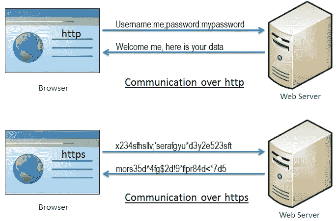

# 在库伯内特斯建立 HTTPS

> 原文：<https://betterprogramming.pub/setting-up-https-on-kubernetes-e3de8225f12f>

## 增加集装箱的安全性


Philipp Katzenberger 在 [Unsplash](https://unsplash.com/s/photos/security?utm_source=unsplash&utm_medium=referral&utm_content=creditCopyText) 上的照片

# 介绍

在我的[上一篇文章](https://medium.com/@puneeth1994/a-beginners-guide-to-docker-3167e635f857)中，我谈到了如何构建 Docker 映像和运行容器。

虽然对于初学者来说这是一个很好的阅读材料，但我还是想关注一个困扰了我几周的问题，这个问题是在 Kubernetes 集群上设置 HTTPS 时出现的，主要是因为文档非常分散。

[Cert manager](https://docs.cert-manager.io/) 是 Kubernetes 中的一个本地插件，可用于管理证书。我们将使用[来加密](https://letsencrypt.org/)作为证书颁发者。

出于本教程的目的，我们将使用一个叫做 [*Helm*](https://helm.sh/) 的工具。Helm 将作为我们的包管理器，帮助我们在集群上安装证书管理器。

# 假设

在本文中，我将假设您有一个 Kubernetes 集群的工作设置，并且至少链接了一个域，或者知道如何将外部流量路由到集群中的服务。

如果没有，我强烈建议浏览以下链接，了解[入口](https://kubernetes.io/docs/concepts/services-networking/ingress/)如何帮助我们[路由流量](https://kubernetes.github.io/ingress-nginx/)。

# 什么是 HTTPS，我们为什么需要它？

HTTPS 是一种通过计算机网络安全通信的方式。它是标准 HTTP 协议的扩展。

HTTP 是一种简单的请求-响应协议，其中客户端请求数据，服务器用请求的数据和指示响应类型的状态代码来响应客户端。

这种方法的问题是发送的数据是明文，可能会被未知的恶意方截获。如果在双方之间交换的数据是敏感的，例如信用卡信息，这可能是一个问题。

这就是 HTTPS 出现的原因。HTTPS 存在的主要原因有两个。

1.  验证对应于服务器的网址是否正确(即，确保您没有访问自称是您试图访问的网站的虚假网站)。
2.  确保只有您可以读取服务器发送给您的内容，反之亦然(即数据加密)。

HTTPS 使用 SSL 实现了上述功能。

SSL(安全套接字层)是在两个系统之间建立加密链接的标准安全技术。这些可以是浏览器到服务器、服务器到服务器或客户端到服务器。

基本上，SSL 确保两个系统之间的数据传输保持加密和私密。

下图显示了通过 HTTP 和 HTTPS 进行通信与加密有何不同。



# 证书管理器

它主要负责从证书颁发机构获取新证书，并通过“让我们加密”来应对新的挑战。

挑战作为一种方式来验证你对一个领域的所有权。这个挑战可能很简单，比如在域名下放置一个 TXT 记录，或者提供一种方法让我们加密，以便从您的 web 服务器检索一个包含特定令牌的文件。

Cert manager 本身包含多个组件，包括证书对象、颁发者、订单等等。这就是赫尔姆会帮助我们的地方。

Helm 负责手工创建所有的 Kubernetes 对象，并对我们的用例进行最小的配置。

当我们想要清理部署时，这也会对我们有利。我们不需要单独删除每一个对象，因为它只需要一个命令就可以完成清理工作。

# 安装舵和证书管理器

Helm 可以从一个非常基础的脚本安装，这将在你的本地机器上安装最新版本的 Helm。

一旦安装了 Helm，我们将需要在请求新证书之前[安装证书管理器](https://cert-manager.io/docs/installation/kubernetes/#installing-with-helm)。

按照上面“使用 Helm 安装”一节下的链接中描述的步骤进行操作。

注意:我们不关注 Helm 和 cert manager 的安装步骤，因为文档往往会有很大变化。最好参考官方链接，了解安装它们的最新方法。

# 为域申请新证书

请求加密以获取新证书包括两个步骤:

1.  首先，代理向 CA(让我们加密)证明 web 服务器控制着一个域。
2.  然后，代理可以请求、续订和吊销该域的证书。

一旦安装了证书管理器，我们需要创建两个对象:

1.  `ClusterIssuer` —它们代表证书颁发机构，并指定需要请求证书的服务器。
2.  证书—此对象包含对颁发者和需要获取证书的 DNS 名称的引用。

可以使用如下所示的一组基本配置来创建集群颁发者对象。

如上面的对象所示，我们指定了需要请求证书的服务器。

证书对象如下所示:

证书通过名称引用我们的集群发行者。

为名为 certificate 和 issuer 的对象创建 YAML 文件，并执行下面的命令来创建对象。

```
Kubectl apply -f certificate.yaml issuer.yaml
```

这将创建证书和挑战，我们可以使用`renewBefore`字段自动更新证书。可以将任意数量的域添加到证书对象中，以便颁发证书。

# 参考

*   您可以阅读证书管理器的更多个人[概念。](https://cert-manager.io/docs/concepts/)
*   此外，为了理解我们如何加密向域颁发证书:
    [它是如何工作的](https://letsencrypt.org/how-it-works/)
*   不同的挑战让我们加密使用:[挑战类型](https://letsencrypt.org/docs/challenge-types/)。