# 为 Unity 设置 iOS 框架

> 原文：<https://betterprogramming.pub/setting-up-ios-framework-for-unity-9ef4e577db89>

## 从 Swift 到 C#

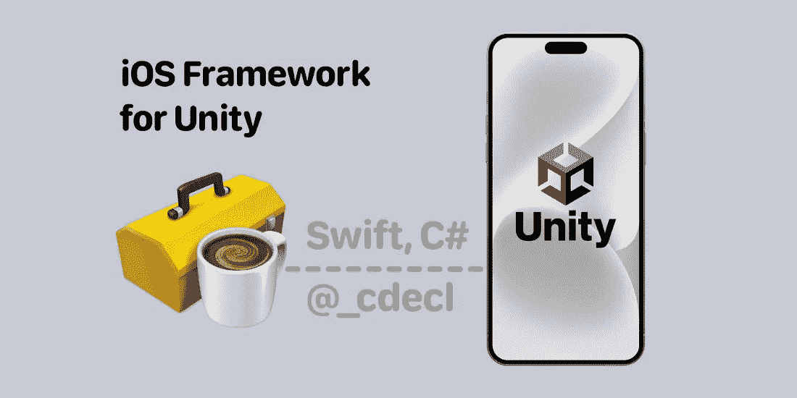

作者图片

# 第一部分。从 Unity 启动`UIViewController`

我不会浪费你的时间来长篇大论地介绍我将在这里描述的技术。你很可能已经是一名 iOS 工程师或游戏开发人员，这意味着你可能对本文的主题有一些疑问。那么，我们开始吧。

这篇文章分为两部分。在第一部分中，您将学习如何从 Unity 启动一个简单的`UIViewController`。我们会强制 C#理解 Swift。在第二部分，我们将尝试扩展 Swift 在 Unity 中的使用，并探讨其局限性。

好了，开始了。

## 先决条件

*   马科斯·蒙特雷
*   Xcode 13(或 14)
*   团结 LTS 2021.3
*   iOS 设备(至少具有 iOS14 或更高版本)

## iOS 框架

打开 Xcode 并创建一个新的 Swift 项目—框架。

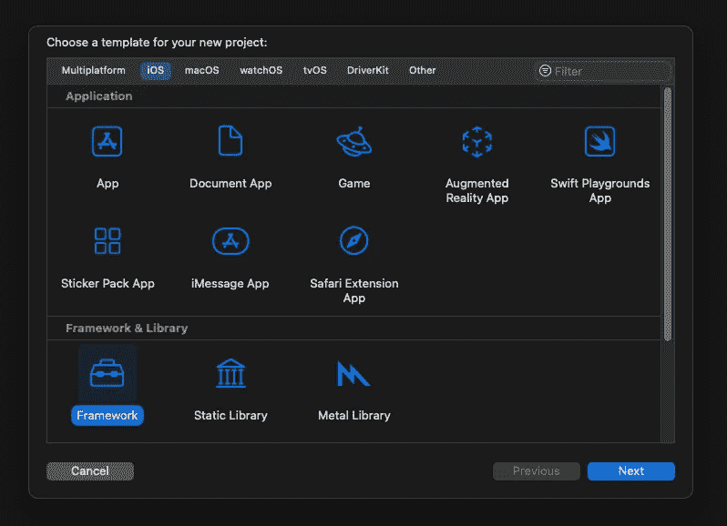

Swift 项目—框架

这个项目的名字由你决定，我把它命名为`SwiftCodeKit`。这将是一个带有一个视图控制器的简单框架。我们只需要三个文件:

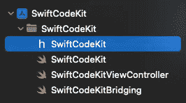

在`SwiftCodeKitViewController`中，让我们创建一个简单的`UIViewController`——在视图的中心有一个按钮。

`SwiftCodeKitViewController.swift`

在`SwiftCodeKit.swift`中，我们将收集我们所有的公共方法。拥有这个公共类将允许你在 iOS 项目中测试你的框架。第一个会是`start()`。这个方法呈现了我们的`SwiftCodeKitViewController`。

`SwiftCodeKit.swift`

第三个文件`SwiftCodeKitBridging.swift`将包含一个带有 C 声明符号`@_cdecl`的公开方法列表。这些方法应该只存储在非本地范围内。首先，我们创建一个方法:`startSwiftCodeKitController()`。

`SwiftCodeKitBridging.swift`

属性`@_cdecl`未被记录。现在，您只需要知道这个属性向 c 暴露了一个 Swift 函数，进一步地，我们将对这个属性做一些实验，并找出它的局限性。

## 建筑框架

在你的 Xcode 项目状态工具栏中选择`Any iOS Device (arm64)`目的地。是的，我们将只为 iOS 设备开发，不为模拟器开发。现在，你只需要点击`Command + B`。


任何 iOS 设备(arm64)目的地

为了得到我们的框架，我们需要找到派生数据，并从那里得到它。您应该从 Xcode 打开“衍生数据”文件夹:前往 Xcode 偏好设置(`cmd + ,`)，然后打开“位置”，并轻按衍生数据路径末端的箭头。

在“衍生数据”文件夹中，找到您的项目并使用以下路径:
`Build / Products / Debug-iphoneos / SwiftCodeKit.framework`

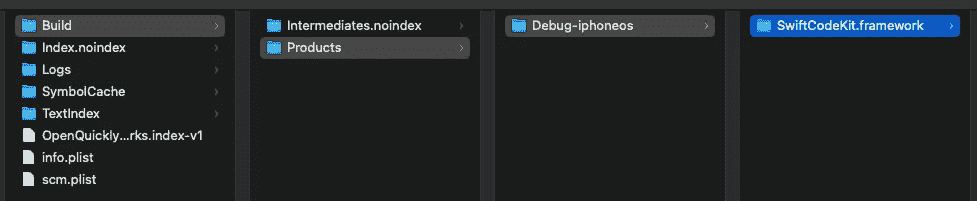

使用 SwiftCodeKit 项目导出数据

## 团结项目

是时候建立我们的团结项目了。打开 Unity，创建一个项目；我称之为`UnityClientProject`。

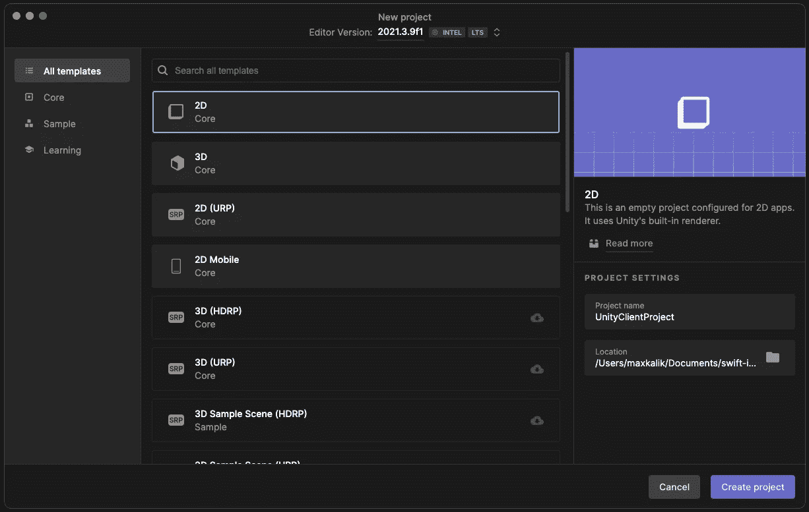

创建 Unity 项目

在 Unity 项目中，您会发现文件夹资源。拖动你的`SwiftCodeKit.framework`放到`Assets`文件夹中。

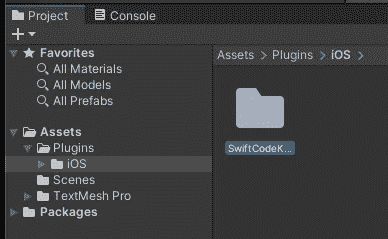

`SwiftCodeKit.framework in Assets / iOS folder`

关于 Unity 中的 UI，我们准备做一个简单的按钮。这个按钮将调用我们的 SwiftCodeKit 视图控制器。右键单击层次结构，选择 UI，然后选择按钮。

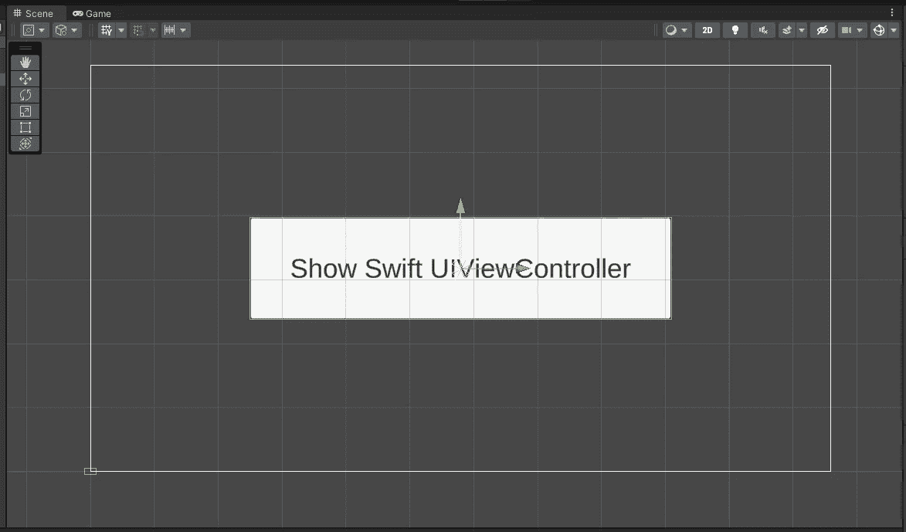

Unity 项目中的按钮

此外，在层次结构中，我们必须为按钮创建另一个对象。我叫它`ButtonController`。在`ButtonController`的检查器中，添加一个组件/新脚本，命名为`ButtonControllerScript.cs`。打开这个文件。

其实我们只需要一个公共方法:`OnPressButton()`。但在此之前，我们还得导入`System.Runtime.InteropServices`。这将帮助我们从`SwiftCodeKit.framework`中认识我们的方法。如果你还记得，我们只有一个公共函数:`startSwiftCodeKitController()`，所以我们用`DllImport`导入它。

cs 使用运行时处理来自 iOS 的方法。InteropServices

## 建设团结项目

我们准备从 Unity 构建我们的 iOS 项目。打开文件/构建设置，将平台改为 iOS。然后按构建。

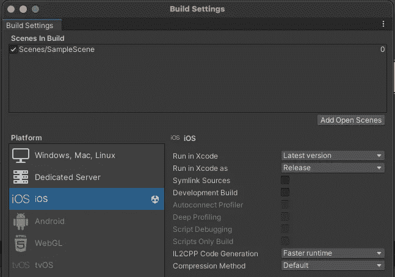

Unity 构建设置

按下 build 后，它会自动运行一个 Xcode 项目。这个项目是由 Unity 生成的，在那里你只会看到一个叫做`UnityFramework`的框架。

这时你可能会遇到几个问题:第一个问题——你必须签署这个项目，第二个问题是位代码错误——这只有在你使用 Xcode 14 时才会发生。没什么大不了的。让我们在这个项目中禁用 bitcode，然后再次运行它。

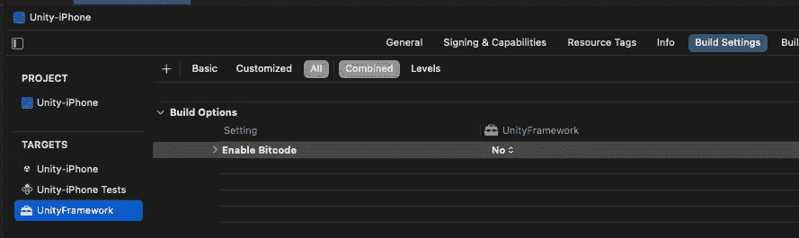

Xcode 构建设置

在您的 iPhone 上，您将看到您的 Unity 应用程序。第一个带按钮的蓝色屏幕——这是 Unity 部分，橙色显示的屏幕是您的框架！

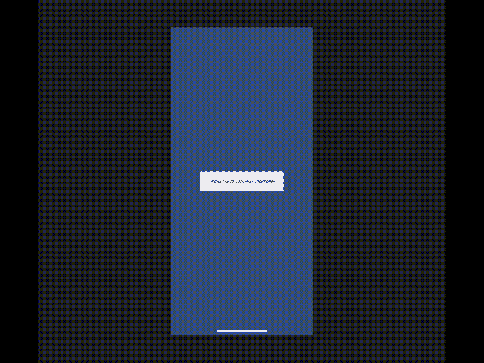

# 包扎

让我们快速回顾一下我们所做的事情:

1.  使用`@_cdecl`属性为 iOS 和 C#准备了一个带有公共方法的框架。
2.  创建了一个简单的 Unity 项目，中心有一个按钮。
3.  将我们的框架添加到 Unity 项目的资产中。
4.  用 C#脚本准备了`ButtonController`对象，我们用`System.Runtime.InteropServices`导入了我们的方法
5.  从 Unity 构建了一个 iOS 项目。

如你所见，这些是基本步骤，给你一个机会去理解它是如何工作的。在第二部分(见下文),我们将努力使这个项目更接近实际应用。我们将对`@_cdecl`属性进行实验，并探索其局限性。

# 第二部分。在 Unity 中向 C#公开 Swift 功能

本文分为两部分。在第二部分中，我们将通过`@_cdecl`来了解 Swift 和 C#互操作性的局限性。让我们开始吧。

如果您阅读了本文的第一部分，您应该记得`SwiftCodeKitBridging.swift`文件:

在这个文件中，我们使用`@_cdecl`属性存储了一个公开的公共方法列表。正如你所看到的，我们已经知道如何从 C#中调用一些函数。但是很明显，它不是很有用，因为在真实的 iOS 应用程序中，我们使用带参数的函数，我们的函数返回一些值，此外，我们使用闭包、委托等等。如何向 Unity 项目公开这些代码？

让我们继续今天要尝试的内容:

*   带参数的函数
*   函数返回值
*   带闭包的函数

## iOS 框架更新

我准备了一个我们`SwiftCodeKitViewController`的小更新。

我又加了两个视图:`UILabel`和`UIStepper`。使用步进控制，我们可以增加和减少一个值，并将其设置为标签。

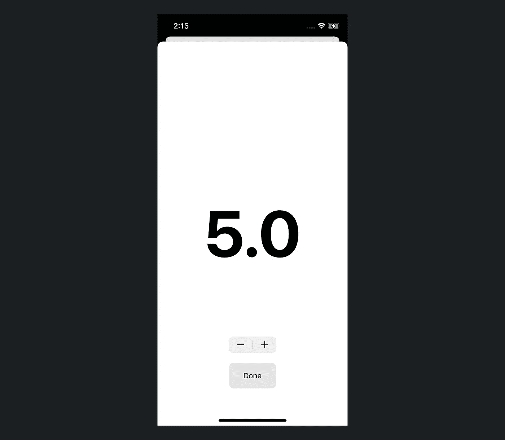

SiwftCodeKit 用户界面

用真实的 UI 做实验就够了。让我们来看看我们的公共课:

正如你所看到的，这个类是用我们将在 C#中使用的方法扩展的。最有趣的部分是`Delegates`——它们用闭包来表示。让我们将所有这些方法连接到我们的 UI。在`viewDidLoad`中，添加我们的第一个委托方法`SwiftCodeKit.swiftCodeKitDidStart?()`。

以下是可以在扩展中使用的其他方法:

## iOS 框架桥接方法

我们所有的公共方法都应该从 C#中识别出来。我建议一个一个地走过它们。

下面是带参数的函数:

带参数的函数

函数返回值(`Double`):

函数以双精度形式返回值

该函数返回一个字符串。这里你可以注意到一个不同之处。特别是对于这种数据，我们需要分配内存并将我们的字符串传递给`strdup()`——这个方法将为`UnsafePointer()`复制字符串。

函数以字符串形式返回值

好，现在`Delegates`。如你所见，它们是带有转义闭包的函数。但是除了转义闭包之外，还有一些有趣的插件叫做`@convention(c)`

有一段来自[docs.swift.org](https://docs.swift.org)的简短描述:

> 将此属性应用于函数的类型，以指示其调用约定。`*c*`参数表示一个 C 函数引用。函数值不携带上下文，使用 C 调用约定。

代表

好了，让我们构建我们更新的框架，获得这个构建，并把它放到 Unity 项目资产文件夹中(参见第 1 部分如何做)。

## Unity ButtonControllerScript `update`

我们的 C#脚本文件目前只有一个导入的函数:`startSwiftCodeKitController`，所以是时候添加其余的函数了。我们将采用与 Swift 方法相同的方式:

下面是带参数的函数:

`ButtonCotrollerScript.cs`中带参数的函数

该函数返回值，如下所示:

函数在`ButtonCotrollerScript.cs`中返回值

使用`AOT`和`Delegates`:

ButtonControllerScript.cs 中的委托

我们要做的最后一件事是更新`OnPressButton()`方法，其中我们使用 Swift 框架中的所有方法。

ButtonControllerScript.cs 中的 OnPressButton()更新

我们直接从 Unity 配置了我们的 iOS 控制器，并使用了我们的三个代理。现在，是时候构建我们的项目了。如果你正确地跟随了我，并且你的所有方法都被 Unity 识别，你的结果将会如下所示:

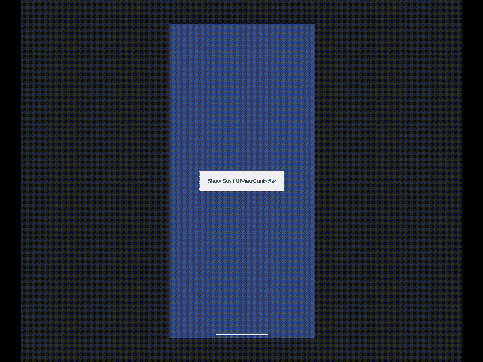

Unity iOS 项目从 Unity 启动

Xcode 的控制台应该会显示如下内容:

```
SwiftCodeKit did start
SwiftCodeKit get value: 10
SwiftCodeKit get version: Swift Code Kit 0.0.1
SwiftCodeKit value did change. Value: 11
SwiftCodeKit value did change. Value: 12
SwiftCodeKit value did change. Value: 13
SwiftCodeKit did finish
```

# 包扎

每次我完成一项任务时，我总是问同一个问题:我怎样才能做得更好？我认为这项任务可以不断改进。我不是 Unity 方面的专家(如果你有更好的了解，请评论)，但我知道我们甚至可以用我们所有的函数构建 DLL 库，并最终将这个构建直接导入到脚本中。

另外，作为一个使用`UnsafePointer`的 iOS 开发者，要记住这个内存应该被释放。

感谢阅读。

# 源代码

[](https://github.com/maxkalik/swift-in-unity) [## GitHub — maxkalik/swift-in-unity:用于 unity 的 iOS 框架

github.com](https://github.com/maxkalik/swift-in-unity) 

```
**Want to Connect?**Don't hesitate to follow me on [Twitter](https://twitter.com/maxkalik).I appreciate any suggestions or comments regarding my research and articles.
```