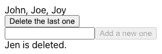
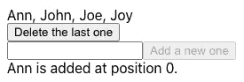

# 为 React 开发、故事书和测试设置模拟

> 原文：<https://betterprogramming.pub/setting-up-mocks-for-react-development-storybook-and-testing-8f5cedb66257>

## fetch-mock JavaScript 库简介


照片由[西格蒙德](https://unsplash.com/@sigmund?utm_source=medium&utm_medium=referral)在 [Unsplash](https://unsplash.com?utm_source=medium&utm_medium=referral) 上拍摄

web 应用程序是运行在 web 服务器上的软件，用户可以通过 web 浏览器访问它。用户界面(UI)提供了一个执行一系列操作的环境，例如查看购物清单或者在购物车中添加或删除商品。

由于 UI 是一个触觉和视觉组件，业务逻辑由后端支持。对于 UI 来说，使用`[fetch](https://developer.mozilla.org/en-US/docs/Web/API/fetch)`、`[axios](https://github.com/axios/axios)`或 [GraphQL](https://graphql.org/) 等进行异步调用是很典型的。

在 UI 开发期间，后端可能暂时不可用。模仿 API 来与 API 并行工作将是一个很好的方法。

`[fetch-mock](https://github.com/wheresrhys/fetch-mock)`是一种模仿用`fetch`发出的 HTTP 请求的流行方式。我们发现使用 mock 进行 UI 开发、故事书和测试是有效的。

`fetch-mock`支持大多数 JavaScript 环境，包括 [Node.js](https://levelup.gitconnected.com/think-and-write-javascript-with-nodejs-88ce9e728eb8) ，web workers，service workers，以及任何支持`fetch`的浏览器。在本文中，我们以 React 为例，探索它模拟 CRUD 操作的能力。

# CRUD 操作的 HTTP 方法

CRUD 是实现 RESTful 服务所必需的四种操作的缩写:创建、读取、更新和删除。 [HTTP](/whats-new-in-http-3-10c2455a4f8c) 支持多种 CRUD 操作方法。这些是常用的方法:

*   GET:这是一个读取操作，用于检索资源的表示。比如:`GET http://myserver.com/v2/users`。如果操作成功，GET 返回一个 XML 或 JSON 形式的表示，状态代码为 200 (OK)。在出错的情况下，它会返回一个错误代码，比如 401(未授权)、403(禁止)等。
*   POST:它通常是用于创建新资源的创建操作。比如:`POST http://myserver.com/v2/user`。如果操作成功，POST 返回创建内容，状态码为 201(已创建)。在出错的情况下，它会返回一个错误代码，如 409(冲突)、500(内部服务器错误)等。
*   PUT:它通常是用于更新资源的更新操作。例如:`PUT http://myserver.com/v2/user`。如果操作成功，PUT 将返回状态代码为 200 (OK)的更新内容，或者状态代码为 204 (No Content)的无内容。在出错的情况下，它会返回一个错误代码，比如 405(不允许使用方法)、501(未实现)等。建议让 PUT 请求幂等。
*   删除:这是用于删除资源的删除操作。比如:`DELETE http://myserver.com/v2/user/:userId`。如果操作成功，DELETE 将返回状态代码为 200 (OK)的已删除内容，或者返回状态代码为 204 (No Content)的无内容。在出错的情况下，它会返回一个错误代码，比如 404(未找到)、410(已消失)等。

# 建立反应工作环境

安装 [Create React App](/upgrade-create-react-app-based-projects-to-version-4-cra-4-d7962aee11a6) :

```
npx create-react-app react-mock
cd react-mock
```

运行以下命令:

```
npm install --save-dev fetch-mock
```

`fetch-mock`作为`package.json`中的 [devDependencies](/package-jsons-dependencies-in-depth-a1f0637a3129) 安装:

```
"devDependencies": {
  "fetch-mock": "^9.11.0"
}
```

我们修改`src/App.js`如下:

上面的代码在端点`/v2/users`(第 6–11 行)获取一个用户列表，并在浏览器上显示它(第 13 行)。

它可以工作，除了端点还在构建中。

# 模拟 CRUD 操作

如果端点不可用，我们可以模拟 GET 方法。

2 号线进口`fetchMock`。

第 5–7 行定义了模拟函数`callMocks`。它模仿端点`/v2/users`的 GET 方法，以响应第 4 行定义的名称列表。这个模拟响应是一个数组引用，`serverNameList`。

第 12–14 行调用模拟函数`callMocks`。

有了 mock，我们可以在没有实际 API 的情况下实现和调优 UI。

以下是用户界面输出:


我们嘲笑了 GET 方法。其他方法，比如 POST 和 DELETE，也可以被模仿。

对于 UI，我们添加了两个功能:

*   删除名单上的最后一个。它在端点`/v2/user/:userId`调用 DELETE 方法。
*   在随机索引处添加新名称。它在端点`/v2/user`用主体`body: {id: number; name: string}`调用 POST 方法。


作者图片

下面是模拟这两个额外端点的代码:

第 9–15 行模拟端点`/v2/user`的 POST 方法，用指定的`name`和插入索引(`id`)创建一个用户。模拟响应是一个返回已处理值的函数。

第 16–20 行模拟端点`/v2/user/:id`的 DELETE 方法，用指定的索引(`id`)删除一个名称。`:id`是特定资源的路径。第 16 行使用`express:`表示 URL 匹配器会将`:id`视为快速样式匹配。模拟响应是一个返回已处理值的函数。

模仿可以被链接，但是重要的是把更具体的 URL 匹配器放在前面，因为它一匹配第一个 URL 匹配器就退出。

`message`在第 25 行定义。如果有成功的操作，更新`message`，这触发重新提取(第 36 行)。

第 41–54 行定义了删除 UI。这是一个删除名单上最后一个的按钮。通过`onClick`触发`DELETE /v2/user/:userId`的操作。

第 56–79 行定义了创建 UI。它是新名称的输入字段，也是在服务器列表上创建新用户的按钮。它使用 [Lodash](/lodash-create-react-apps-built-in-library-for-debounce-and-throttle-with-hooks-3418087f44d8) 的函数`capitalize`(第 70 行)来大写输入。通过`onClick`，它触发`POST /v2/user/`的操作，带有一个主体(第 68-71 行)。

第 80 行显示最近的`message`。

点击删除按钮后的界面如下:



作者图片

下面是添加名称后的 UI:



作者图片

# 模拟错误处理

我们可以模仿异步调用，这很酷。但是如果服务器操作出现错误怎么办？

当模拟响应被定义为函数时，我们可以根据需要抛出异常。

如果新名称已经存在，第 13–15 行抛出一个异常。

第 24 行为所有未处理的情况添加了一个 glob URL 匹配器。我们把它放在这里是为了展示如何在 URL 中使用通配符。对于未处理的 URL，有一个内置函数，`catch`。24 线相当于`.catch(e => ({ throws: `Unhandled call at ${e}.` }))`。

还有另一种方法来处理未处理的调用。`fetchMock.config`是一种静态配置。`fallbackToNetwork`是选项之一。默认情况下，它被设置为`'always'`，所有的呼叫都通过网络，有效地禁用 fetch-mock。

我们可以设置`fetchMock.config.fallbackToNetwork = false`，然后一个不匹配的调用`POST /v2/unknown`将抛出一个错误:

以下代码定义了`fetchMock.config`中的选项:

# 故事书和测试的抓取模拟

我们已经展示了如何在开发过程中使用 fetch-mock 来模拟异步调用。也可以用在[故事书](/an-in-depth-look-at-storybook-6-8c44cd6895ee)里。关键是在呈现组件之前调用模拟。

如果为具有不同模仿的多个故事调用函数`callMocks`，它应该在链接模仿之前调用`restore()`。使用`restore`(是`reset`的别名)，所有东西都重置为其未清除状态，并且为其先前调用记录的所有数据都被清除。

```
fetchMock.restore().get(...).get(...).get(...).post(...)...
```

[Jest](https://github.com/facebook/jest) 是一个 JavaScript [测试框架](/how-to-achieve-100-test-coverage-for-react-functional-components-fbde1e40631c)来确保任何 JavaScript 代码库的正确性。我们可以使用`jest.fn()`来模仿`fetch`调用，这与`fetch-mock`的想法类似。通过重用`callMocks`，我们可能不需要模拟每个异步调用。

`fetch-mock`有一个 Jest 的包装器，`[jest-fetch-mock](https://www.npmjs.com/package/jest-fetch-mock)`。它提供与`jest.fn()`相似的功能。

# 结论

我们在项目中使用了`fetch-mock`。在一个真实的项目中，一些 API 正在构建中，这种情况时有发生。只要定义了接口，我们就可以模拟它们同时处理 UI 特性。`fallbackToNetwork`默认设置为`'always'`。它允许我们混合使用现有的 API 和一些模拟。

这些模拟可以在故事书中重复使用。它允许我们用异步调用为组件构建故事。

这些模拟也可以在测试用例中重用。它可能不会取代所有的笑话模仿，但一些基本的情况下，没有太多额外的努力涵盖很好。

毕竟`fetch-mock`是一个项目中有用的帮手。

感谢阅读。我希望这有所帮助。如果你有兴趣，可以看看[我的其他媒体文章](https://jenniferfubook.medium.com/jennifer-fus-web-development-publications-1a887e4454af)。