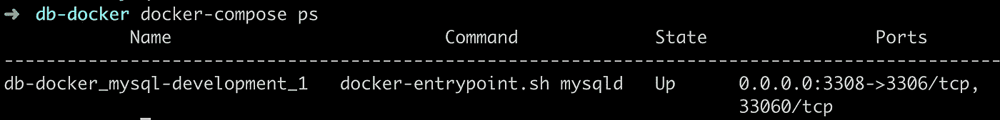
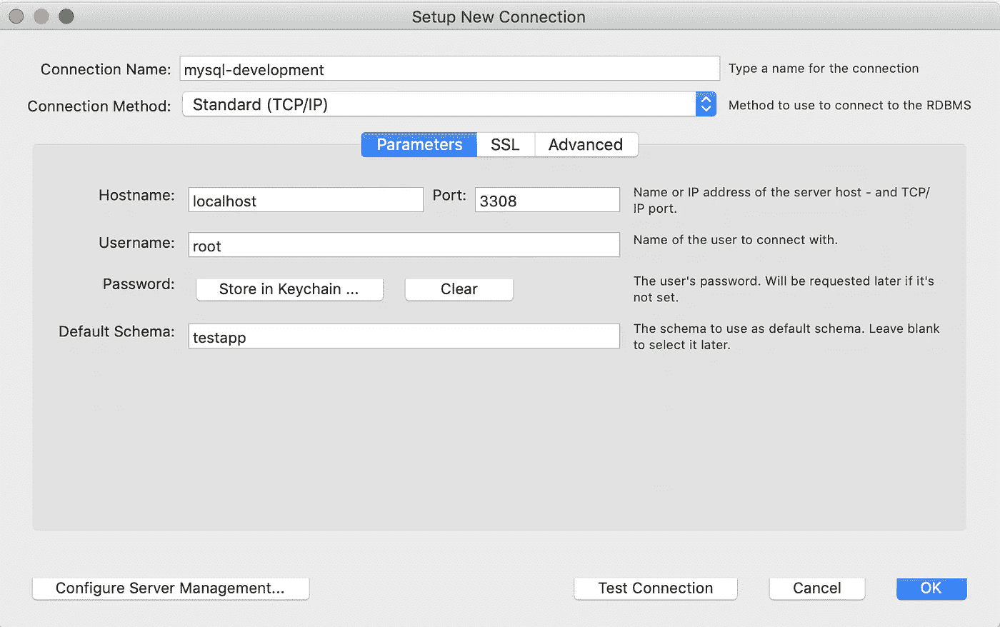
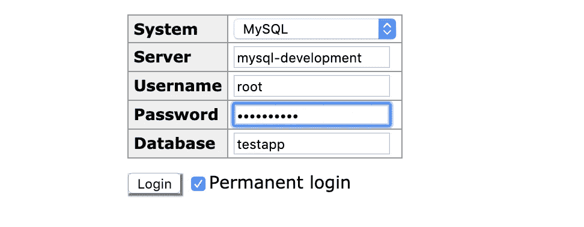

# 在 Docker 中设置 MySQL 数据库

> 原文：<https://betterprogramming.pub/setting-up-mysql-database-in-a-docker-d6c69a3e9afe>

## 学习为数据库设置和运行 Docker 容器


[Docker](https://www.docker.com/) 为部署和测试作为应用程序不可或缺的一部分的应用程序和数据库提供了许多优势，因此值得学习为数据库设置和运行 Docker 容器。

在本文中，我们将关注以下主题:

1.  为一个 [MySQL](https://www.mysql.com/) Docker 容器创建一个 Docker 合成 [YAML](https://yaml.org/) 文件。
2.  使用各种方法连接到运行在容器上的 MySQL 数据库。
3.  在 Docker 容器中创建和运行多个版本的 MySQL。

让我们一个一个地检查一下。

# **1。为 MySQL Docker 容器创建一个 Docker Compose YAML 文件**

让我们创建一个目录`db-docker`，然后在该目录中创建一个`docker-compose.yml`文件:

```
mkdir db-docker
cd db-docker
touch docker-compose.yml
```

基本上，在这里，我们将指定我们将要使用的服务，并设置与这些服务相关的环境变量。

在本文中，我们将多次修改这个文件。

在我们刚刚创建的`docker-compose.yml`文件中添加以下内容:

我们指定 MySQL 容器的名称为`mysql-development`，要使用的 Docker 图像为`mysql:8.0.17`。如果不指定标签为`8.0.17`，则取最新的标签。

接下来我们需要指定的是环境变量，即用户、密码和数据库。如果不指定用户，默认情况下会是`root`。

我们将使用`helloworld`作为密码，使用`testapp`作为数据库。

另一件重要的事情是端口映射。`3308:3306`意味着在端口`3306`的容器中运行的 MySQL 被映射到端口`3308`的主机的 localhost。您也可以使用不同的端口。

现在，创建了。yml 文件，我们需要在。yml 文件位于:

```
docker-compose up
```

这将提取 Docker 镜像(如果镜像在本地不可用，它将从 [Docker Hub](https://hub.docker.com/) 提取)然后运行容器。

我们可以通过以下方式检查状态:

```
docker-compose ps
```



这将显示容器的名称、命令和容器的状态，例如，显示容器正在运行。它还显示了端口映射。

下一步，我们将连接到这个 MySQL 容器并运行一些命令。

# **2。连接到运行在容器中的 MySQL 数据库**

我们将讨论在 Docker 容器中运行的 MySQL 上连接和运行 SQL 命令的两种方法。

第一种方法是使用类似 [MySQL Workbench](https://www.mysql.com/products/workbench/) 的工具(也可以使用 [DataGrip](https://www.jetbrains.com/datagrip/) )。

由于我们现在有一个 MySQL 容器在本地机器的端口`3308`上运行，我们可以使用以下配置参数进行连接:



由于端口映射，通过本地机器端口`3308`的连接是可能的。

如果我们想要连接到容器化的 MySQL，而不映射端口，即从运行在同一 Docker 网络上的另一个应用程序，我们必须使用像 [Adminer](https://www.adminer.org/) 这样的工具，这是我们的另一种方法。

Adminer 是一个基于 PHP 的 web 应用程序，用于访问数据库。

现在，我们将在我们的`docker-compose.yml`文件中添加另一个 Adminer 服务。但是，在我们在这里进行更改之前，我们需要停止运行容器，并使用以下命令删除它:

```
docker-compose down
```

让我们在`docker-compose.yml`文件中添加以下内容:

```
version: '3'

services:

  mysql-development:
    image: mysql:8.0.17
    environment:
      MYSQL_ROOT_PASSWORD: helloworld
      MYSQL_DATABASE: testapp
    ports:
      - "3308:3306"

  admin:    
    image: adminer    
    ports:      
      - "8080:8080"
```

现在，让我们再次启动 Docker 容器:

```
docker-compose up
```

在运行这个之后，Adminer 的映像将被提取，MySQL 和 Adminer 的容器将被启动。

我们可以使用`docker-compose ps`来检查这一点。

现在，我们可以转到我们的浏览器，进入`localhost:8080`进行管理。由于 Adminer 与 MySQL 运行在同一个 Docker 网络上，它可以通过端口`3306`(或者简单地说，通过容器的名称)访问 MySQL 容器。

注意:我们不能通过 Adminer 中的端口`3308`访问 MySQL 容器，因为这将试图访问 Docker Compose 网络的端口`3308`，而不是我们本地机器的`3308`端口。



我们还可以通过以下命令使用 MySQL 命令行界面:

```
docker-compose exec  mysql-development mysql -uroot -phelloworld testapp
```

# 3.在 Docker 容器中创建和运行多个版本的 MySQL

如果我们有一个使用其他 MySQL 版本的应用程序，我们也可以为它创建一个服务，并在同一个 Docker 网络中运行它。

例如，如果我们需要 MySQL 版本 5.7.27，我们需要对`docker-compose.yml`文件做如下修改，停止运行容器，然后重新开始。

```
version: '3'

services:

  mysql-development:
    image: mysql:8.0.17
    environment:
      MYSQL_ROOT_PASSWORD: helloworld
      MYSQL_DATABASE: testapp
    ports:
      - "3308:3306"

  admin:    
    image: adminer    
    ports:      
      - "8080:8080" mysql-old:
    image: mysql:5.7.27
    environment:
      MYSQL_ROOT_PASSWORD: helloworld
      MYSQL_DATABASE: coolapp
    ports:
      - "3309:3306"
```

如果你想进一步了解如何使用数据和配置卷，以及如何检查 mysql 容器的日志，请查看我的文章:[https://medium . com/@ ashutosh _ 34428/volumes-and-logs-in-MySQL-docker-61122 F8 c1d 84](https://medium.com/@ashutosh_34428/volumes-and-logs-in-mysql-docker-61122f8c1d84)

我们已经到了文章的结尾。我希望你已经学到了一些东西。感谢阅读！